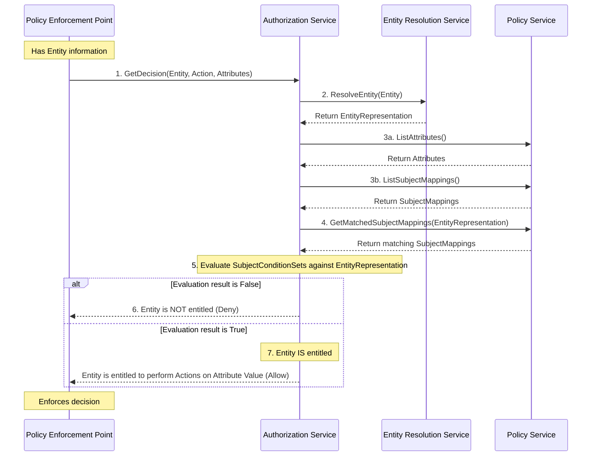

# Website

This website is built using [Docusaurus](https://docusaurus.io/), a modern static website generator.

### Installation

```
$ nvm use
$ npm ci
```

### Local Development

```
$ npm run start
```

This command starts a local development server and opens up a browser window. Most changes are reflected live without having to restart the server.

### Build

```
$ npm run build
```

This command generates static content into the `build` directory and can be served using any static contents hosting service.



Assume the following attributes exist under an `example.com` namespace:
    1. a _hierarchy_ definition `level` containing values:
        - `executive`
        - `manager`
        - `contributor`

To define policy that entitles the user of a PEP to the `read` action on the specific attribute value
`https://example.com/attr/level/value/manager`, a SubjectMapping should contain:
1. a SubjectConditionSet that resolves to `true` given the EntityRepresentation of that PEP user
2. the `read` action
3. the `https://example.com/attr/level/value/manager` attribute value

Inversely, the user will _not_ be entitled if the SubjectMapping:
1. maps to a different attribute value
2. contains custom actions or standard actions `create`, `update`, `delete` but _not_ `read`
3. contains a subject condition set that resolves to `false` when evaluated against the entity representation