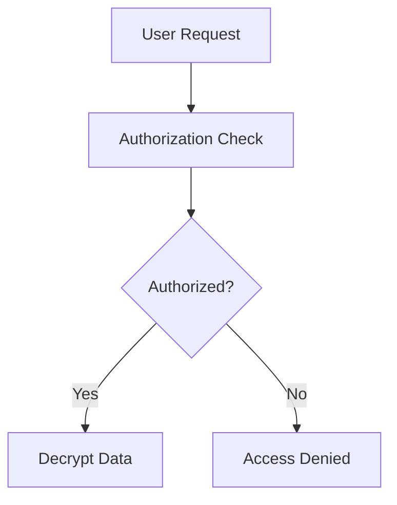

# OpenTDF Documentation Style Guide

> Guidelines for writing clear, consistent, and user-friendly documentation for OpenTDF.

## Table of Contents

- [Writing Principles](#writing-principles)
- [Voice and Tone](#voice-and-tone)
- [Content Types](#content-types)
- [Formatting Guidelines](#formatting-guidelines)
- [Technical Writing Standards](#technical-writing-standards)
- [Code Examples](#code-examples)
- [Visual Elements](#visual-elements)
- [Accessibility](#accessibility)

## Writing Principles

### 1. User-Centered Approach
- **Start with user needs**: What is the user trying to accomplish?
- **Provide context**: Explain why something matters before diving into how
- **Be action-oriented**: Use active voice and clear imperatives
- **Test your content**: Verify that instructions actually work

### 2. Clarity Over Cleverness
- **Write for scannable reading**: Use headers, bullet points, and short paragraphs
- **Choose simple words**: Use "help" instead of "facilitate", "use" instead of "utilize"
- **Be specific**: "Click the blue Save button" vs. "submit the form"
- **Define acronyms**: Always spell out acronyms on first use (e.g., "Trusted Data Format (TDF)")

### 3. Consistency
- **Follow established patterns**: If one tutorial uses numbered steps, all should
- **Use consistent terminology**: Don't alternate between "encrypt" and "protect"
- **Maintain formatting standards**: Headers, code blocks, and links should be uniform

## Voice and Tone

### Voice (What We Sound Like)
- **Expert but approachable**: We know what we're talking about, but we're here to help
- **Direct and practical**: We focus on what users need to do
- **Inclusive**: We assume various skill levels and backgrounds

### Tone (How We Adapt to Context)
- **Tutorials**: Encouraging and supportive ("Great job! Now let's...")
- **How-To Guides**: Direct and efficient ("To solve X, do Y")
- **Explanations**: Patient and thorough ("This concept is important because...")
- **Reference**: Factual and precise ("This parameter accepts string values")

### Language Guidelines
- **Use second person ("you")** for instructions
- **Use first person plural ("we")** when referring to OpenTDF team/community
- **Avoid jargon** without explanation
- **Use active voice**: "The platform encrypts data" not "Data is encrypted by the platform"

## Content Types

Our documentation follows four content categories. Each has specific characteristics:

### 🚀 Tutorials (Learning-Oriented)
**Purpose**: Teach concepts through guided practice
**Structure**:
- Clear learning objective
- Prerequisites listed upfront
- Numbered steps that build on each other
- Explanations of what's happening
- What the user should see/expect
- Next steps or related tutorials

**Example opening**:
```markdown
# Your First TDF File

In this tutorial, you'll create your first Trusted Data Format (TDF) file and learn how OpenTDF protects data with cryptographic policies.

**What you'll learn:**
- How to encrypt a file using TDF
- How access policies work
- How to decrypt and access protected data

**Prerequisites:**
- OpenTDF platform running locally
- Basic familiarity with command line
```

### 📖 How-To Guides (Problem-Oriented)
**Purpose**: Solve specific real-world problems
**Structure**:
- Problem statement (what this solves)
- Prerequisites (what you need)
- Step-by-step solution
- Troubleshooting common issues
- Related guides

**Example opening**:
```markdown
# Integrate OpenTDF with Existing Applications

This guide shows how to add data protection to an existing application without major architectural changes.

**Solves:** Adding TDF encryption to legacy systems
**Prerequisites:** 
- Existing application with file handling
- OpenTDF SDK for your language
```

### 💡 Explanations (Understanding-Oriented)
**Purpose**: Provide context and deepen understanding
**Structure**:
- What this concept is
- Why it matters
- How it fits into the bigger picture
- Examples and analogies
- Related concepts

**Example opening**:
```markdown
# Data-Centric Security

Data-centric security is a paradigm shift from traditional perimeter-based security models. Instead of protecting the network or application, data-centric security protects the data itself.

## Why Traditional Security Falls Short

In traditional models, once data crosses the security perimeter...
```

### 📚 Reference (Information-Oriented)
**Purpose**: Provide precise technical information
**Structure**:
- Overview of what's documented
- Organized by logical groups
- Comprehensive parameter/option lists
- Examples for each major item
- Cross-references to related items

**Example structure**:
```markdown
# Policy Service API Reference

## Authentication Endpoints

### POST /auth/login
Authenticates a user and returns an access token.

**Parameters:**
- `username` (string, required): User's login name
- `password` (string, required): User's password

**Response:** 200 OK
```json
{
  "token": "eyJhbGciOiJIUzI1NiIsInR5cCI6IkpXVCJ9...",
  "expires_in": 3600
}
```

## Formatting Guidelines

### Headers
```markdown
# Page Title (H1) - Only one per page
## Section Title (H2) - Main sections
### Subsection (H3) - Subsections within H2
#### Detail Section (H4) - Only when necessary
```

### Lists
**Use bullet points for unordered items:**
```markdown
- First item
- Second item
- Third item
```

**Use numbers for sequential steps:**
```markdown
1. First, do this
2. Then, do this
3. Finally, do this
```

### Emphasis
- **Bold** for UI elements, important terms: "Click the **Save** button"
- *Italics* for emphasis or first use of terms: "The *policy* defines access rules"
- `Code formatting` for inline code, filenames, commands: "Edit the `config.yaml` file"

### Links
```markdown
[Link text](URL) - External links
[Link text](../path/to/page) - Internal relative links
[Link text](/absolute/path) - Internal absolute links
```

### Callouts
Use for important information:

```markdown
> **Note:** This is general information that's helpful to know.

> **Warning:** This could cause problems if ignored.

> **Tip:** This is a helpful suggestion or best practice.
```

## Technical Writing Standards

### Code Examples

#### Inline Code
Use backticks for:
- Commands: `npm install`
- File names: `config.yaml`
- Parameter names: `username`
- Short code snippets: `const data = await encrypt(file)`

#### Code Blocks
Use fenced code blocks with language specification:

```bash
# Shell commands
npm run start
```

```javascript
// JavaScript examples
const client = new TDFClient({
  clientId: 'your-client-id',
  platformEndpoint: 'http://localhost:8080'
});
```

```yaml
# Configuration files
version: '3.8'
services:
  opentdf:
    image: opentdf/platform
```

#### Code Block Guidelines
- **Always specify the language** for syntax highlighting
- **Include necessary imports** and context
- **Use realistic examples** (not just "foo", "bar")
- **Show complete, working examples** when possible
- **Add comments** to explain non-obvious parts

### File Paths and Commands

**File paths:**
- Use forward slashes: `docs/tutorials/getting-started.md`
- Use relative paths from project root: `src/pages/index.tsx`
- Use backticks: `src/components/Homepage/hero.tsx`

**Commands:**
- Show the full command: `npm install @opentdf/client`
- Include relevant flags: `docker run -d --name opentdf opentdf/platform`
- Use $ for shell prompts sparingly: `$ npm run start`

### API Documentation

**Endpoints:**
```markdown
### POST /api/v1/encrypt

Encrypts data using the specified policy.

**Parameters:**
- `data` (string, required): The data to encrypt
- `policy` (object, required): Encryption policy
  - `attributes` (array): List of attribute values
  - `dissem` (array): List of authorized recipients

**Example Request:**
```json
{
  "data": "sensitive information",
  "policy": {
    "attributes": ["classification:secret"],
    "dissem": ["user1@example.com"]
  }
}
```

**Response:** 200 OK
```json
{
  "tdf": "eyJhbGciOiJSUzI1NiIsInR5cCI6IkpXVCJ9...",
  "policy": {
    "uuid": "550e8400-e29b-41d4-a716-446655440000"
  }
}
```
```

## Visual Elements

### Screenshots
- Use screenshots sparingly - they become outdated quickly
- When necessary, crop to show only relevant parts
- Add clear captions explaining what the screenshot shows
- Use consistent browser/OS when possible

### Diagrams
- Prefer simple text diagrams over complex images when possible
- Use mermaid diagrams for flowcharts:



### Tables
Keep tables simple and scannable:

| Parameter | Type | Required | Description |
|-----------|------|----------|-------------|
| `username` | string | Yes | User login name |
| `password` | string | Yes | User password |
| `remember` | boolean | No | Remember login (default: false) |

## Accessibility

### Writing for Accessibility
- **Use descriptive link text**: "Download the installation guide" not "click here"
- **Provide alt text** for images: ``
- **Use proper heading hierarchy** (don't skip from H1 to H3)
- **Write descriptive page titles** and headings

### Technical Accessibility
- **Ensure good color contrast** in any visual elements
- **Don't rely solely on color** to convey information
- **Use semantic markup** (proper heading levels, lists, etc.)

## Review Checklist

Before submitting documentation changes:

**Content:**
- [ ] Is the purpose clear from the title and first paragraph?
- [ ] Are prerequisites clearly stated?
- [ ] Do all steps work as written?
- [ ] Are code examples complete and tested?
- [ ] Is the content at the appropriate technical level?

**Style:**
- [ ] Is the tone appropriate for the content type?
- [ ] Are headers in logical hierarchy?
- [ ] Are lists properly formatted?
- [ ] Are links working and descriptive?
- [ ] Is terminology consistent with other docs?

**Technical:**
- [ ] Do code blocks specify languages?
- [ ] Are file paths correct?
- [ ] Are API examples accurate?
- [ ] Are there any broken internal links?

## Getting Help

- **Style questions**: Ask in GitHub discussions or documentation issues
- **Technical accuracy**: Tag subject matter experts in pull requests
- **Major changes**: Discuss in issues before implementing
- **Examples**: Look at existing documentation in the same category

Remember: Good documentation serves the user, not the writer. When in doubt, choose clarity and usefulness over perfection.