# Architecture

OpenTDF is built on a flexible, service-oriented architecture designed for robust and fine-grained access control. The platform consists of four core components that work together to protect data throughout its lifecycle. This architecture aligns with the well-established [National Institute of Standards and Technology (NIST)](https://www.nist.gov) model for [Attribute-Based Access Control (ABAC)](https://csrc.nist.gov/projects/attribute-based-access-control), ensuring a standards-based and interoperable approach.

## Core Platform Components

The four main services of the OpenTDF platform are the Policy Service, Authorization Service, Entity Resolution Service, and the Key Access Server.

```mermaid
graph TD
    CLIENT["🖥️ Client Application"]

    subgraph "OpenTDF Platform"
        KAS["🛡️ Key Access Server<br/><i>(Implements NIST PEP)</i>"]
        AUTHZ["🧠 Authorization Service<br/><i>(Implements NIST PDP)</i>"]
        ERS["ℹ️ Entity Resolution Service<br/><i>(Implements NIST PIP)</i>"]
        POLICY["🏢 Policy Service<br/><i>(Implements NIST PAP)</i>"]
    end

    subgraph "External Systems"
        IDP["🔐 Identity Provider"]
        ATTR_SOURCES["📚 Optional Attribute Sources<br/>(LDAP, SQL, etc.)"]
    end

    CLIENT -->|1. Authenticates| IDP
    CLIENT -->|2. Access Request| KAS
    
    KAS -->|3. Decision Request| AUTHZ
    
    AUTHZ -->|4. Get Policies| POLICY
    AUTHZ -->|5. Get Attributes| ERS
    
    ERS -->|6. Optionally Query| ATTR_SOURCES
    
    AUTHZ -->|7. Decision| KAS
    
    KAS -->|8. Grant/Deny Access| CLIENT

    classDef opentdfService fill:#e1f5fe,stroke:#01579b,stroke-width:2px
    classDef externalSystem fill:#f3e5f5,stroke:#4a148c,stroke-width:2px
    
    class POLICY,AUTHZ,ERS,KAS opentdfService
    class ATTR_SOURCES,IDP,CLIENT externalSystem

    click POLICY "components/policy/"
    click AUTHZ "components/authorization"
    click ERS "components/entity_resolution"
    click KAS "components/key_access"
```

### [Policy Service](components/policy/)

The Policy Service is where all access control policies are defined and managed. It provides the tools and APIs to create a rich set of policies that govern data access. This includes not only attributes and their values, but also the definitions of **actions, obligations, and key access mappings**.

In the context of the NIST ABAC model, the Policy Service functions as the [Policy Administration Point (PAP)](https://csrc.nist.gov/glossary/term/policy_administration_point).

### [Authorization Service](components/authorization)

The Authorization Service is the core decision-making engine of the platform. It is responsible for evaluating the rich policies from the Policy Service against a set of attributes to render an authorization decision.

In the context of the NIST ABAC model, it functions as the [Policy Decision Point (PDP)](https://csrc.nist.gov/glossary/term/policy_decision_point).

### [Entity Resolution Service (ERS)](components/entity_resolution)

The Entity Resolution Service is responsible for gathering the attributes about a subject needed for a decision. By default, it can derive attributes from claims in an authentication token. Optionally, it can be configured to connect to external attribute sources (LDAP, SQL) to "hydrate" the entity with more attributes.

In the context of the NIST ABAC model, the ERS functions as the [Policy Information Point (PIP)](https://csrc.nist.gov/glossary/term/policy_information_point).

### [Key Access Server (KAS)](components/key_access)

The Key Access Server (KAS) enforces access control decisions. Its role is more extensive than a typical enforcement point:

-   **Cryptographic Enforcement:** It enforces decisions by granting or withholding cryptographic keys for TDF decryption.
-   **Encryption Enablement:** It manages key exchanges and enables various TDF encryption modes.

In the context of the NIST ABAC model, the KAS functions as the [Policy Enforcement Point (PEP)](https://csrc.nist.gov/glossary/term/policy_enforcement_point).

Furthermore, the OpenTDF platform is designed for flexibility. Developers can **build and integrate their own custom PEPs**. These custom enforcement points can leverage the platform's robust Authorization ([PDP](https://csrc.nist.grov/glossary/term/policy_decision_point)) and Policy ([PAP](https://csrc.nist.gov/glossary/term/policy_administration_point)) services while implementing enforcement logic tailored to specific applications. These custom PEPs can also optionally interface with the KAS to take advantage of its powerful cryptographic capabilities.