# Architecture

## Overview

The OpenTDF platform is made up of 4 main components:

- **[Policy](components/policy/)** - Manages attribute-based access control (ABAC) policies, including namespaces, attributes, values, and their relationships
- **[Authorization](components/authorization)** - Handles entitlement decisions based on policy evaluation and entity context
- **[Key Access Server (KAS)](components/key_access)** - Manages cryptographic keys and provides secure key access for TDF encryption/decryption
- **[Entity Resolution Service](components/entity_resolution)** - Interfaces with Identity Providers (IdPs) to resolve entity information for authorization decisions

## High-Level Architecture

```mermaid
graph TD
    %% External Systems
    CLIENT["🖥️ Client Application"] 
    IDP["🔐 Identity Provider<br/>(Keycloak, Auth0, etc.)"] 
    
    %% OpenTDF Platform Components
    subgraph "OpenTDF Platform"
        POLICY["📋 Policy Service<br/>• Attribute Management<br/>• Subject Mappings<br/>• Resource Mappings<br/>• Key Access Grants"]
        
        AUTHZ["⚖️ Authorization Service<br/>• Entitlement Decisions<br/>• Policy Evaluation<br/>• ABAC Enforcement"]
        
        ERS["👥 Entity Resolution<br/>• JWT Token Parsing<br/>• Entity Chain Creation<br/>• IdP Integration"]
        
        KAS["🔑 Key Access Server<br/>• Key Management<br/>• TDF Encrypt/Decrypt<br/>• Access Control"]
    end
    
    %% TDF Operations
    TDF_ENC["📦 TDF Creation<br/>(Encrypt)"]
    TDF_DEC["📂 TDF Access<br/>(Decrypt)"]
    
    %% Flow connections
    CLIENT -->|"1. Authenticate"| IDP
    CLIENT -->|"2. Create TDF"| TDF_ENC
    CLIENT -->|"3. Access TDF"| TDF_DEC
    
    TDF_ENC -->|"Get Policy & Keys"| POLICY
    TDF_ENC -->|"Encrypt with Keys"| KAS
    
    TDF_DEC -->|"Rewrap Request<br/>+ Access Token"| KAS
    KAS -->|"Parse Token<br/>Extract Entities"| ERS
    ERS -->|"Query Entity Data"| IDP
    KAS -->|"Authorization Request<br/>+ Entity Chain"| AUTHZ
    AUTHZ -->|"Get Policies<br/>& Mappings"| POLICY
    AUTHZ -->|"Decision"| KAS
    KAS -->|"Unwrapped Key<br/>(if authorized)"| TDF_DEC
    
    %% Styling
    classDef platformService fill:#e1f5fe,stroke:#01579b,stroke-width:2px
    classDef externalSystem fill:#f3e5f5,stroke:#4a148c,stroke-width:2px
    classDef tdfOperation fill:#e8f5e8,stroke:#2e7d32,stroke-width:2px
    
    class POLICY,AUTHZ,ERS,KAS platformService
    class CLIENT,IDP externalSystem
    class TDF_ENC,TDF_DEC tdfOperation
```

## Component Interactions

The OpenTDF platform components work together to provide secure, policy-based access to encrypted data:

1. **Policy Service** defines the rules and attributes that govern access
2. **Entity Resolution Service** translates authentication tokens into entity representations
3. **Authorization Service** evaluates policies against entity context to make access decisions
4. **Key Access Server** enforces those decisions by providing or denying access to decryption keys

This architecture enables fine-grained, attribute-based access control while maintaining the security and integrity of encrypted data throughout its lifecycle.
