# Architecture

OpenTDF is built on a flexible, service-oriented architecture designed for robust and fine-grained access control. The platform consists of four core components that work together to protect data throughout its lifecycle. This architecture aligns with the well-established National Institute of Standards and Technology (NIST) model for Attribute-Based Access Control (ABAC), ensuring a standards-based and interoperable approach.

## Core Platform Components

The four main services of the OpenTDF platform are the Policy Service, Authorization Service, Entity Resolution Service, and the Key Access Server.

```mermaid
graph TD
    subgraph "OpenTDF Platform"
        direction LR
        
        subgraph "Policy & Decision"
            direction TB
            POLICY["🏢 Policy Service<br/><i>(Implements NIST PAP)</i>"]
            AUTHZ["🧠 Authorization Service<br/><i>(Implements NIST PDP)</i>"]
        end

        subgraph "Attribute & Enforcement"
            direction TB
            ERS["ℹ️ Entity Resolution Service<br/><i>(Implements NIST PIP)</i>"]
            KAS["🛡️ Key Access Server<br/><i>(Implements NIST PEP)</i>"]
        end
    end
    
    subgraph "External Systems"
        direction TB
        ATTR_SOURCES["📚 Optional Attribute Sources<br/>(LDAP, SQL, etc.)"]
        IDP["🔐 Identity Provider"]
    end

    CLIENT["🖥️ Client Application"]

    CLIENT -->|1. Authenticates| IDP
    CLIENT -->|2. Access Request| KAS
    
    KAS -->|3. Decision Request| AUTHZ
    AUTHZ -->|4. Get Attributes| ERS
    AUTHZ -->|5. Get Policies| POLICY
    ERS -->|6. Optionally Query Attributes| ATTR_SOURCES
    
    AUTHZ -->|7. Decision| KAS
    KAS -->|8. Grant/Deny Access| CLIENT

    classDef opentdfService fill:#e1f5fe,stroke:#01579b,stroke-width:2px
    classDef externalSystem fill:#f3e5f5,stroke:#4a148c,stroke-width:2px
    
    class POLICY,AUTHZ,ERS,KAS opentdfService
    class ATTR_SOURCES,IDP,CLIENT externalSystem
```

### Policy Service

The **Policy Service** is where all access control policies are defined and managed. It provides the tools and APIs to create a rich set of policies that govern data access. This includes not only attributes and their values, but also the definitions of **actions, obligations, and key access mappings**. This rich policy information allows for fine-grained access control that goes beyond a simple PERMIT/DENY decision.

In the context of the NIST ABAC model, the Policy Service functions as the **Policy Administration Point (PAP)**.

### Authorization Service

The **Authorization Service** is the core decision-making engine of the platform. It is responsible for evaluating the rich policies from the Policy Service against a set of attributes to render an authorization decision.

In the context of the NIST ABAC model, the Authorization Service functions as the **Policy Decision Point (PDP)**.

### Entity Resolution Service (ERS)

The **Entity Resolution Service** is responsible for gathering the attributes about a subject that are needed to make an access control decision. By default, the ERS can derive these attributes directly from the claims present in an authentication token (e.g., a JWT) after the subject has been authenticated by an Identity Provider. For more advanced use cases, the ERS can be **optionally configured** to connect to external attribute sources, like LDAP directories or SQL databases, to "hydrate" the entity with additional attributes.

In the context of the NIST ABAC model, the ERS functions as the **Policy Information Point (PIP)**.

### Key Access Server (KAS)

The **Key Access Server (KAS)** is responsible for enforcing access control decisions. Its role, however, is more extensive than that of a typical enforcement point:

-   **Cryptographic Enforcement:** Instead of just allowing or denying an action, the KAS enforces decisions by granting or withholding the cryptographic keys required to decrypt a TDF object. This provides a powerful, cryptographically-secure method of enforcement.
-   **Encryption Enablement:** The KAS is a crucial part of the data protection lifecycle. It manages key exchanges and enables the various modes of TDF encryption (e.g., NanoTDF).

In the context of the NIST ABAC model, the KAS functions as the **Policy Enforcement Point (PEP)**.

Furthermore, the OpenTDF platform is designed for flexibility. Developers can **build and integrate their own custom PEPs**. These custom enforcement points can leverage the platform's robust Authorization (PDP) and Policy (PAP) services while implementing enforcement logic tailored to specific applications. These custom PEPs can also optionally interface with the KAS to take advantage of its powerful cryptographic capabilities.