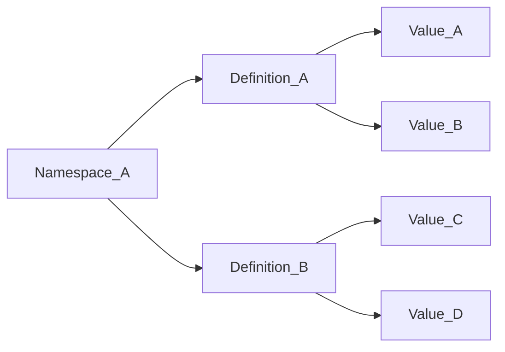
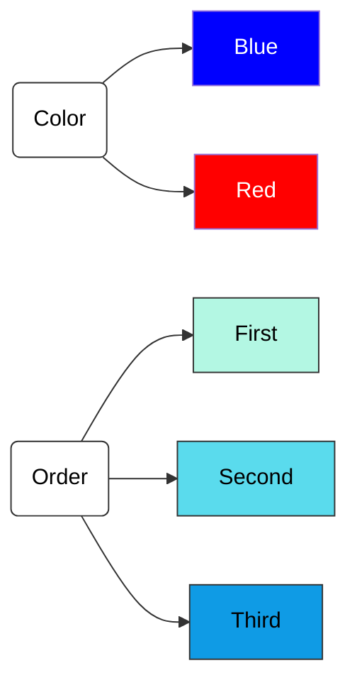
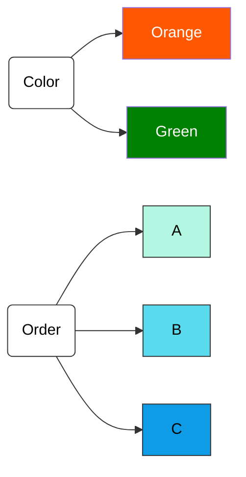

# Attributes

Attributes are the logical structure used to control access to TDF data. Entities (people, machines, users) are "entitled" to attributes. Resource data is encrypted within a TDF that contains attributes, binding ABAC policy at the cryptographic level.

## Composition

An attribute consists of three parts:

1. A Namespace
2. A Definition
3. A Value

Platform Policy Attributes can contain multiple Namespaces, each with multiple Definitions, and each Definition can have multiple Values.

## Namespaces

A Namespace is the parent container for a set of attributes. Consider the following example:

Alice wants to control access in a platform instance based on Attribute Values of the Definitions `color` and `order`. She creates attribute definitions for each and assigns values to them.

Bob agrees with this concept but wants to use different colors and drive order based on alphabetical indexes rather than word strings.

These attributes will now be used to drive access decisions based on policies in the platform.

## Attribute Rules

Attribute definitions have a rule that determines how the values of the attribute are evaluated. The following rules are available:

- **ALL_OF**: All of the values in the attribute must be present in the entity's entitlements.
- **ANY_OF**: Any of the values in the attribute must be present in the entity's entitlements.
- **HIERARCHY**: The values of the attribute are ordered, and the entity must have an entitlement that is greater than or equal to the value in the policy.

## Key Association

Keys can be associated with attributes and values. This allows for more granular access control. For example, you can require that an entity has a specific key in addition to the required attributes.

## Unsafe Actions

Certain actions on policy attributes are considered "unsafe" because they may inadvertently affect access control, potentially granting or removing access unintentionally. Deactivating a Namespace, for example, cascades to deactivate its Definitions and their Values. Similarly, deactivating a Definition deactivates its Values.

Unsafe actions on policy attributes include:

- **Namespaces**:
  - Updating the namespace name (e.g., `demo.com` to `example.org`).
  - Reactivation (does not cascade to reactivate attributes and their values).
  - Deletion (permanently removes the namespace and all associated attributes and values).
- **Attribute Definitions**:
  - Updating the attribute definition name.
  - Changing the order of attribute values.
  - Modifying the rule on a definition (e.g., from `hierarchy` to `anyOf`).
  - Reactivation (does not cascade to values or bubble up to reactivate the namespace).
  - Deletion (permanently removes the definition and its values).
- **Attribute Values**:
  - Updating the value.
  - Reactivation (does not bubble up to reactivate the definition or namespace).
  - Deletion (permanently removes the value without affecting the parent definition or namespace).

These mutations can retroactively change access to existing and new TDFs, making it crucial to handle them with caution.