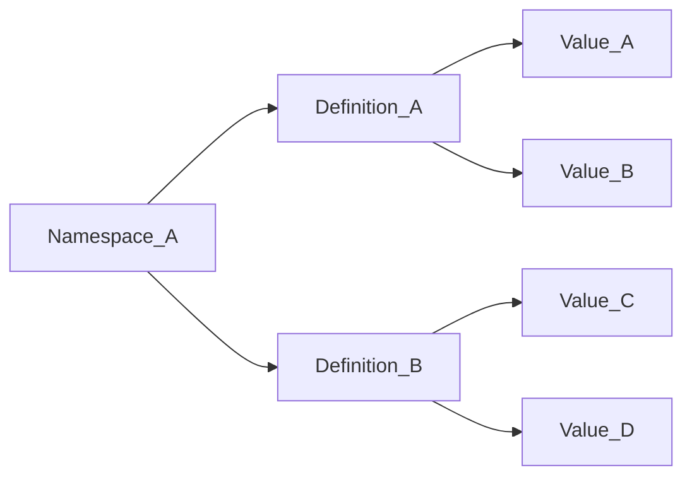
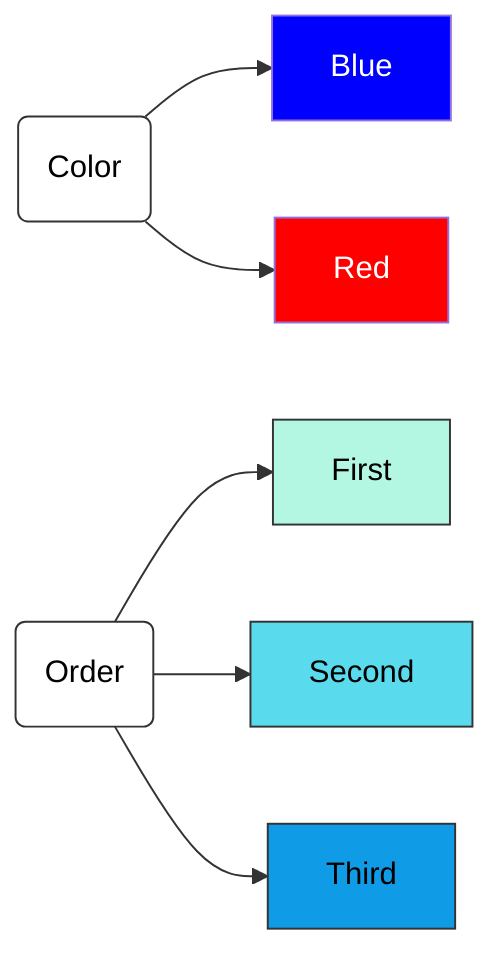
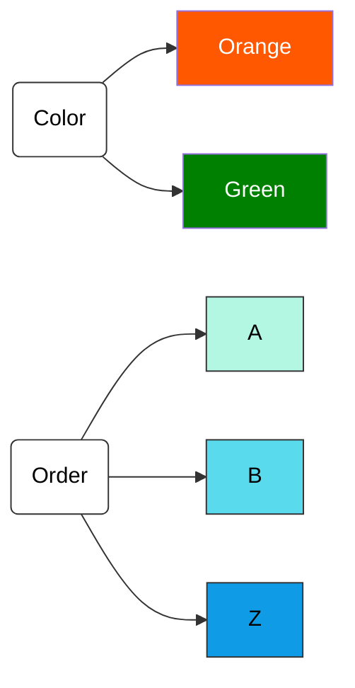

# Overview

Attributes are the logical structure to decision access over TDF data.

Entities (people, machines, users) are "entitled" to attributes.

Resource data is encrypted within a TDF that contains attributes, binding ABAC policy at the cryptographic level.

## Composition

An Attribute is composed of three pieces:

1. a Namespace
2. a Definition
3. a Value

Platform Policy Attributes can contain one or more Namespaces, each with one or more Definitions, each Definition with one or more Values.



## Namespaces

A Namespace is the parent to a set of attributes. Consider the following:

Alice wants to drive access in an Platform instance based on Attribute Values of Definitions `color` and `order`. To do so, she creates
attribute definitions for each and gives them values.



Bob is in full agreement with this conceptually, but wants to use different colors entirely, and drive the order based on alphabetical indexes
instead of word strings.



With a single namespace, Bob's and Alice's attributes conflict and could not share the same definition names. Their rules and values are entirely
distinct.

However, they can employ multiple namespaces (i.e. `alice.com` and `bob.org`) to drive ABAC access on their individual `color` and `order`
attribute definitions.

## Definitions

Attribute Definitions are groupings of Attribute Values based on a logical Rule.

There are three logical rules to give meaning to Attribute Values:

1. [`anyOf`](#rule-anyof)
2. [`allOf`](#rule-allof)
3. [`hierarchy`](#rule-hierarchy)

### Rule: anyOf

If an Attribute is defined with logical rule `anyOf`, an Entity who is mapped to _any_ of the associated Values of the Attribute will be Entitled to TDF'd Resource Data with said Values.

Example Scenario:

Alice defines an `anyOf` attribute with name `color` on namespace `demo.com`, which results in an [FQN](#fully-qualified-names) for that definition `https://demo.com/attr/color`.

Under that `anyOf` attribute `color`, she adds a value for every color of the rainbow: `red`, `orange`, `yellow`, `green`, `blue`, `indigo`, `violet`.

In a given PEP (Policy Enforcement Point), resource data is encrypted within a TDF tagged with attributes `red` and `yellow`.

At some future time, an Entity Bob attempts to decrypt that TDF. The platform KAS and Authorization Server find attribute values
`https://demo.com/attr/color/value/red` and `https://demo.com/attr/color/value/yellow` within it and the rule `anyOf` associated with Alice's `color` attribute.

If Bob is found to be entitled (via Subject Mappings) in any of the following scenarios, a key would be released with successful decryption:

1. Bob is entitled to `https://demo.com/attr/color/value/red` and nothing else
2. Bob is entitled to `https://demo.com/attr/color/value/yellow` and nothing else
3. Bob is entitled to `https://demo.com/attr/color/value/red` AND `https://demo.com/attr/color/value/yellow`
4. Bob is entitled to _every single value in the rainbow_ under the `color` attribute

As long as a single Attribute Value of the `anyOf` color attribute present in the TDF is found in Bob's Entitlements, he can expect to decrypt.

### Rule: allOf

If an Attribute is defined with logical rule `allOf`, an Entity must be mapped to `all` of the associated Values of the Attribute on a piece
of data to be Entitled to TDF'd Resource Data with even a single one of the Values on the data.

Example Scenario:

Bob defines an `allOf` attribute with name `superpowers` on namespace `demo.com`, which results in an [FQN](#fully-qualified-names) for that definition `https://demo.com/attr/superpowers`.

Under that `allOf` attribute `superpower`, he adds a value for some of the (oversimplified) capabilities of Superman: `super_strength`, `flight`, `heat_vision`.

In a given PEP (Policy Enforcement Point), two pieces of resource data are encrypted within TDFs. The first is tagged with attribute value `flight` and the second with attribute values `super_strength` and `heat_vision`.

At some future time, an Entity Clark Kent attempts to decrypt the TDFs. The platform KAS and Authorization Server find attribute values below
on the TDFs.

TDF1:

- `https://demo.com/attr/superpowers/value/flight`

TDF2:

- `https://demo.com/attr/superpowers/value/super_strength`
- `https://demo.com/attr/superpowers/value/heat_vision`

Each are under rule `allOf` associated with Bob's `superpowers` attribute.

These are the following entitlement scenarios:

1. Clark Kent is entitled to `https://demo.com/attr/superpowers/value/flight` alone --> only access to the first TDF
2. Clark Kent is entitled to `https://demo.com/attr/superpowers/value/flight` and `https://demo.com/attr/superpowers/value/super_strength`
   alone--> access to TDF1, but no access to the TDF2
3. Clark Kent is entitled to all three `https://demo.com/attr/superpowers/value/flight`, `https://demo.com/attr/superpowers/value/super_strength`
   and `https://demo.com/attr/superpowers/value/heat_vision` --> access to _both_ TDFs (and any other combination of values on the data since he's
   entitled to all three values on the attribute)

In an `allOf` scenario, TDF'd data with any of the Attribute Values requires an Entity to be entitled to every allOf Value present on the TDF
to be able to access. It's distinct from `anyOf` because entitlement to any of the Values under the anyOf Attribute on a piece of TDFd data will
give access, but `allOf` requires entitlement to every one on the data.

### Rule: hierarchy

If an Attribute is defined with logical rule `hierarchy`, an Entity must be mapped to the same level or a level above in hierarchy to the Attribute Value on TDF'd data.

Example Scenario:

Alice defines an `hierarchy` attribute with name `department_level` on namespace `demo.com`, which results in an [FQN](#fully-qualified-names) for that definition `https://demo.com/attr/department_level`.

Under that `hierarchy` attribute `department_level`, she adds a value for all of the organization levels in her department:

0. `vice_president`
1. `director`
2. `manager`
3. `contributor`
4. `intern`

In a given PEP (Policy Enforcement Point), resource data is encrypted within a TDF tagged with the attribute `manager`.

At some future time, an Entity Bob attempts to decrypt that TDF. The platform KAS and Authorization Server find the attribute value
`https://demo.com/attr/department_level/value/manager` within it and the rule `hierarchy` associated with Alice's `department_level` attribute.

If Bob is found to be entitled (via Subject Mappings) in any of the following scenarios, a key would be released with successful decryption:

1. Bob is entitled to `https://demo.com/attr/department_level/value/manager` (the same level)
2. Bob is entitled to `https://demo.com/attr/department_level/value/director` (a higher level than the data value `manager`)
3. Bob is entitled to `https://demo.com/attr/department_level/value/vice_president` (a higher level than the data value `manager`)

If Bob is found to be entitled to _only_ `contributor` or `intern`, or none at all, those are considered hierarchically lower levels than the value `manager` and a
key release for a request to decrypt would be denied.

## Values

Attribute Values are the atomic units that drive access control relation of Data -> Entities and vice versa.

Values are contextualized by Attribute Definitions within Namespaces, and only have logical meaning as part of a Definition.

Giving data multiple Attribute Values across the same or multiple Definitions/Namespaces will require all of the definition rules to be satisfied by an Entity's mapped Entitlements
to result in key release, decryption, and resulting access to TDF'd data.

## Fully Qualified Names

For interoperability across platform instances, Attributes are referenced by Fully Qualified Names (FQNs). The Fully Qualified Names for
Attribute Values are present in a TDF manifest.

An FQN is defined as `https://{ namespace }/attr/{ definition name }/value/{ value }`

Given the namespace `demo.com`, an attribute definition name `color` with values `blue` and `red`, and a second definition name `order`
with values `first`, `second`, and `third`, the following FQNs would fully qualify each.

```

Namespace 'demo.com' --> https://demo.com

Attribute Definition 'color' --> https://demo.com/attr/color
Attribute Value 'red' on 'color' --> https://demo.com/attr/color/value/red
Attribute Value 'blue' on 'color' --> https://demo.com/attr/color/value/blue

Attribute Definition 'order' --> https://demo.com/attr/order
Attribute Definition 'first' on 'order' --> https://demo.com/attr/order/value/first
Attribute Definition 'second' on 'order' --> https://demo.com/attr/order/value/second
Attribute Definition 'third' on 'order' --> https://demo.com/attr/order/value/third

```

## Life Cycle and Unsafe Actions

As Attribute components (Namespaces, Definitions, Values) within an Fully Qualified attribute are bound to TDF's, considerations must be made
for updates and deletions of attribute components.

For example, if an Attribute is created as `https://demo.com/attr/order/value/third` and TDFs are created with that value as an attribute,
the TDF will continue to contain that attribute even if the namespace, definition, or value are updated. This means an update or a deletion
to the Namespace, Definition name, or Value are all unsafe because they can break access to existing TDFs containing that attribute.

To counter this, Attribute Namespaces, Definitions, and Values are all "Deactivated" instead of Deleted as a safe behavior. This will ensure
they persist in the Policy database and prevent a scenario where attributes with different definitions or mappings are recreated in place
of the originals to grant access differently than intended. Deactivations are also cascading so that a deactivation of a Namespace puts
not only the Namespace to inactive state but also the Definitions, and deactivating a Definition deactivates its Values.

Unsafe actions will be enabled through a separate Policy service, but at this time the workaround if an administrator needs to unsafely update
or fully delete an Attribute Namespace, Definition Name, or Value is to manually update the database.
