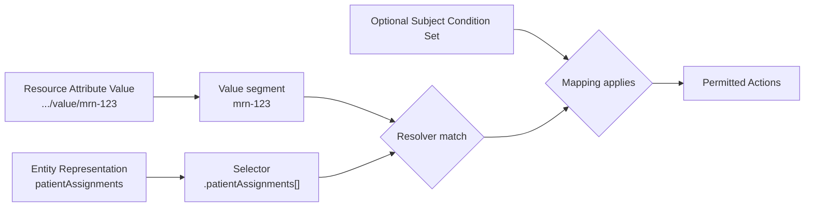

# Dynamic Value Mappings

Dynamic Value Mappings associate an [Attribute Definition](./attributes) with values from an [Entity Representation](../entity_resolution) and one or more [Actions](./actions). It is a good idea to use Dynamic Value Mappings when Attribute Values are sourced from an external system and change frequently or are vast in quantity but keep consistent entitlement conditions.

For example, a healthcare system may realistically store millions of patient assignments in its identity or directory service. A Dynamic Value Mapping can compare those assignments with the medical record number in a resource's Attribute Value. The platform can then determine the entity's entitlement without storing an Attribute Value and [Subject Mapping](./subject_mappings) for every medical record number.

## Decision Flow

At decision time, the platform extracts the value segment from the resource's Attribute Value FQN and compares it with the values returned by the mapping's entity selector.



The mapping applies when the resolver matches and its optional Subject Condition Set passes. It grants the configured Actions for the requested Attribute Value.

## Configuration

Dynamic Value Mapping evaluation is disabled by default. Enable it in the Authorization service configuration:

```yaml
services:
  authorization:
    allow_dynamic_value_mappings: true
```

When this setting is `false`, Dynamic Value Mappings do not contribute entitlements to authorization decisions.

## Composition

A Dynamic Value Mapping contains:

1. An Attribute Definition with an `ANY_OF` or `ALL_OF` rule
2. A value resolver containing an entity selector and comparison operator
3. One or more permitted Actions
4. An optional Subject Condition Set that limits which entities can use the mapping
5. An optional Namespace
6. Optional metadata

When a Namespace is specified, the Attribute Definition, Actions, and optional Subject Condition Set must use the same Namespace. When the mapping has no Namespace, its Actions and optional Subject Condition Set must also have no Namespace.

## Resolver

The value resolver selects one or more values from the flattened Entity Representation. Array selectors use the same syntax as Subject Mappings, such as `.patientAssignments[]`.

The resolver supports these operators:

| Operator | Behavior |
| --- | --- |
| `IN` | Matches when a selected entity value exactly equals the requested resource value segment. Matching is case-sensitive. |
| `IN_CONTAINS` | Matches when a selected entity value contains the requested resource value segment. Matching is case-sensitive. |

`NOT_IN` is unavailable because the resolver checks whether any selected entity value matches the requested value segment.

:::caution Substring Matching
`IN_CONTAINS` can match more values than intended. A resource value segment of `admin` matches selected values such as `superadmin` and `admin-readonly`. Use `IN` when the values must be equal.
:::

## Evaluation

Multiple Dynamic Value Mappings on the same Attribute Definition use OR behavior. A match from any mapping grants its configured Actions.

When a mapping includes a Subject Condition Set, every Subject Set in the condition set must pass and the value resolver must match. The Subject Condition Set provides a static gate, such as requiring a `clinician` role before evaluating patient assignments.

Resources can contain multiple values from one Attribute Definition. The platform evaluates each value through the Dynamic Value Mappings, then applies the Attribute Definition's normal `ANY_OF` or `ALL_OF` rule.

## Constraints

- Dynamic Value Mappings support Attribute Definitions with `ANY_OF` and `ALL_OF` rules. They do not support `HIERARCHY` rules.
- An Attribute Definition with a Dynamic Value Mapping cannot also have value-level Subject Mappings.
- Concrete Attribute Values can exist under the same Attribute Definition, but they cannot have Subject Mappings.
- Values under the Attribute Definition cannot be used as a Registered Resource's action Attribute Values.

These checks apply regardless of which related mapping is created first.

## Example

Suppose the Entity Representation contains these patient assignments:

```json
{
  "patientAssignments": ["mrn-123", "mrn-789"]
}
```

Create a Dynamic Value Mapping that permits `read` when an assignment matches the medical record number in the requested resource Attribute Value:

```shell
otdfctl policy dynamic-value-mappings create \
  --attribute https://hospital.example/attr/mrn \
  --selector '.patientAssignments[]' \
  --operator IN \
  --action read
```

The mapping produces these results:

| Resource Attribute Value | Value Segment | Result |
| --- | --- | --- |
| `https://hospital.example/attr/mrn/value/mrn-123` | `mrn-123` | The mapping grants `read` because `mrn-123` appears in `patientAssignments`. |
| `https://hospital.example/attr/mrn/value/mrn-456` | `mrn-456` | The mapping grants no entitlement because `mrn-456` does not appear in `patientAssignments`. |

The requested values do not need to be stored as concrete Attribute Values in Policy.

## Related Documentation

- [Attributes](./attributes)
- [Subject Mappings](./subject_mappings)
- [Entity Resolution](../entity_resolution)
- [Actions](./actions)
- [Dynamic Value Mapping CLI](/components/cli/policy/dynamic-value-mappings)
- [Dynamic Value Mapping API](/OpenAPI-clients/policy/dynamicvaluemapping)
