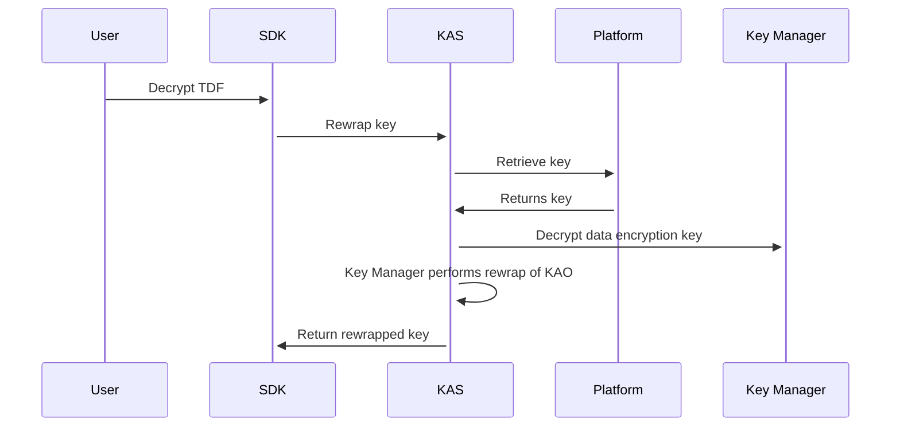
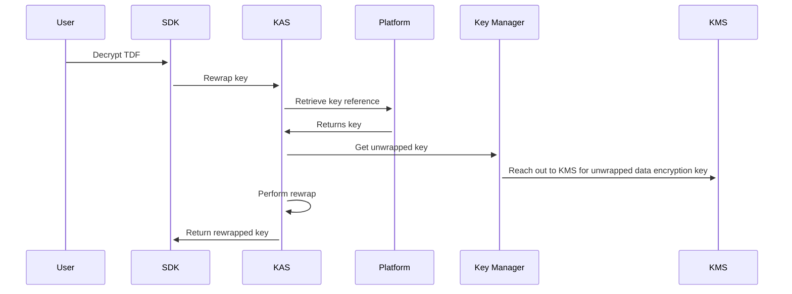

# Key Management

Key management is the new way for managing key encryption keys for the platform. Asymmetric keys or a reference to a key will now be stored either within the platform database directly, or stored externally using a Key Management Provider or a Hardware Security Module (abstracted as a Key Manager). Those keys will then be used for TDF creation and decryption.

## How does everything work?

:::note
The **key manager** is a part of the key access server, but is called out specifically because it is a new
concept for the platform. Read more about [managers](./key_managers.md).
:::

The graphic above is a representation of a basic flow of how KAS now would perform a rewrap (decrypt) operation.  KAS now needs to reach out to a third party to get the private key to rewrap the data encryption key that is sent in the rewrap request, which will then be unwrapped on the client and used to decrypt the payload of the TDF.

In the example above, the KAS (key access server) reaches out to the platform to get a key, but it's totally possible with the new architecture that the platform database could only store a reference to the key. What this means is that the private key could be stored externally, say in a KMS or HSM, outside of the platform's control.

The following is an example of how the code would work if you used a KMS, for all cryptographic operations:

The primary difference is that the **Key Manager** needs to reach out to the KMS to perform the rewrap operation. To connect KAS to a specific external key provider you would need to use a [provider configuration](./key_managers.md). To learn more about the following flow, read about [key managers](./key_managers.md)

## What is different with the new key architecture?

1. Previously, when starting the platform users would be expected to populate the [startup yaml file](https://github.com/opentdf/platform/blob/5221cf41079fc43a3966e17c6f3e0d3cf8a16730/opentdf-dev.yaml#L160-L171) with asymmetric keys that would be used by KAS for and decryption. Now keys, or their reference, should be stored/registered with the platform via the [kas-registry key endpoints](https://github.com/opentdf/platform/blob/main/service/policy/kasregistry/key_access_server_registry.proto#L678-L699).
2. Endpoints for easier management of keys through the kas-registry.
   1. Create/Read/Update
   2. Key Rotation
3. Grants are being deprecated for [key mappings](./key_mappings.md).
4. Admins can now set a [base key](./base_key.md) to be used as the default key when no key mappings/grants are found.
5. Asymmetric keys can now be stored outside of a Key Access Server, by registering a **key manager** at startup and creating a provider configuration that is tied to the key manager.
