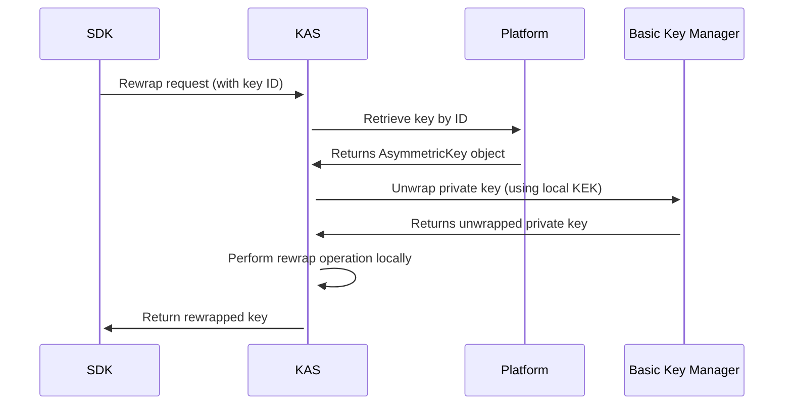
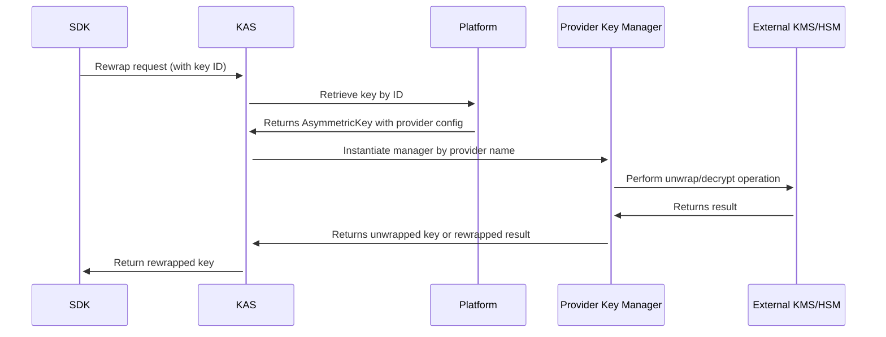
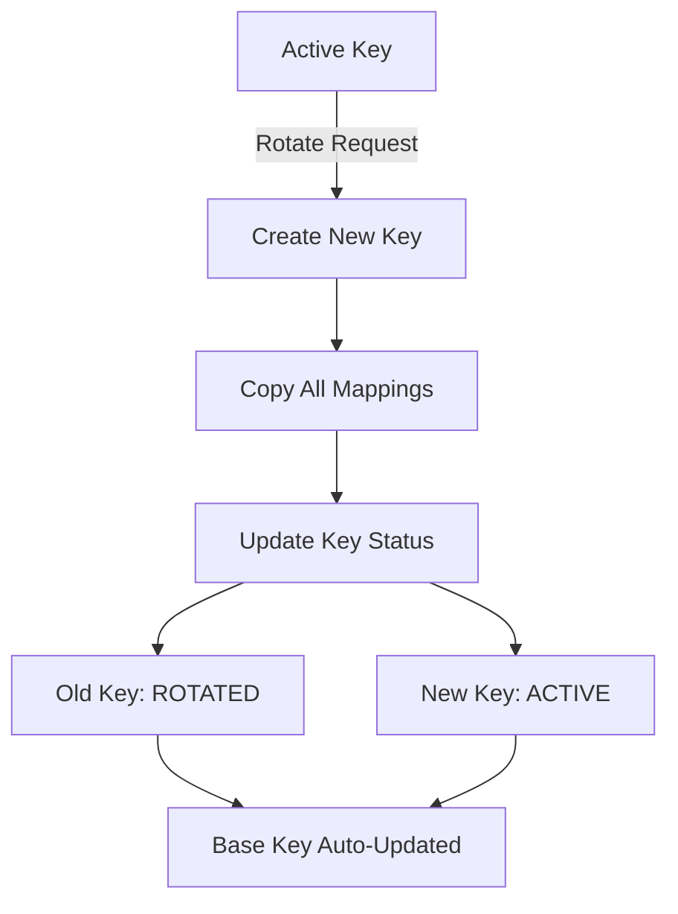

# Key Management

The OpenTDF platform's key management system provides flexible encryption key storage and management for TDF creation and decryption. Keys can be stored locally within the platform database or externally using Key Management Providers (KMPs) or Hardware Security Modules (HSMs) through configurable **Key Managers**.

## Architecture Overview

The key management system provides secure, flexible encryption key management through several key concepts:

### Key Algorithms

Supported algorithms (defined in `Algorithm` enum):

- **`ALGORITHM_RSA_2048`** - RSA 2048-bit keys
- **`ALGORITHM_RSA_4096`** - RSA 4096-bit keys  
- **`ALGORITHM_EC_P256`** - Elliptic Curve P-256 (secp256r1)
- **`ALGORITHM_EC_P384`** - Elliptic Curve P-384 (secp384r1)
- **`ALGORITHM_EC_P521`** - Elliptic Curve P-521 (secp521r1)

### Key Modes

Keys operate in different modes (defined in `KeyMode` enum):

- **`KEY_MODE_CONFIG_ROOT_KEY`** - Private key wrapped by local KEK from configuration
- **`KEY_MODE_PROVIDER_ROOT_KEY`** - Private key wrapped by external provider KEK
- **`KEY_MODE_REMOTE`** - All cryptographic operations performed by remote KMS/HSM
- **`KEY_MODE_PUBLIC_KEY_ONLY`** - Only public key available (for external KAS)

### Key Status

Keys have lifecycle states (defined in `KeyStatus` enum):

- **`KEY_STATUS_ACTIVE`** - Key is active and can be used for operations
- **`KEY_STATUS_ROTATED`** - Key has been rotated out but may still decrypt older TDFs

## How Key Management Works

### Local Key Management (CONFIG_ROOT_KEY)



### External Provider Management (PROVIDER_ROOT_KEY / REMOTE)



:::note
**Key Managers** are pluggable components within KAS that handle different key storage backends.
The **provider configuration** determines which key manager to use for each key.
:::

## Key Features and Capabilities

### ✅ **Secure Key Management**

- **Flexible storage options**: Keys can be managed locally in the platform database or through external providers (KMS/HSM)
- **Local storage**: Private keys encrypted with Key Encryption Keys (KEKs) and stored in platform database
- **External provider storage**: Keys managed by enterprise KMS or HSM with remote cryptographic operations
- **Complete lifecycle support**: Create, activate, rotate, and deactivate keys seamlessly
- **Strong cryptographic foundations**: Support for industry-standard algorithms and key types
- **Policy integration**: Keys are directly linked to your access control policies

### ✅ **Key Management Operations**

- **Create keys** with various algorithms and storage modes
- **Rotate keys** with automatic mapping preservation  
- **Set base/default keys** for fallback scenarios
- **Map keys** directly to policy objects (namespaces, attributes, values)
- **List and query** key mappings and associations

### ✅ **External Provider Integration**

- **Provider configurations** for KMS/HSM integration
- **Pluggable key managers** via shared library (.so) registration
- **Remote cryptographic operations** for enhanced security
- **Mixed mode support** - local and remote keys in same deployment

## Legacy vs New Architecture

:::important Legacy Migration
**Grants are deprecated** as of platform v0.7.0 and replaced by direct key mappings.

**Before (Grants):**

- Keys stored in KAS startup configuration
- Indirect association via KeyAccessServer grants
- Limited to cached/remote key modes
- Manual key rotation process

**Now (Key Mappings):**

- **Rich metadata support**: Keys maintain comprehensive information about their purpose and relationships
- **Direct policy integration**: Keys map directly to namespaces, attributes, and values  
- **Multiple storage options**: Support for local, provider-managed, and remote key storage
- **Seamless rotation**: Automated key rotation preserves all existing policy mappings
- **External provider support**: Integration with enterprise KMS and HSM systems
:::

## Key Rotation and Lifecycle

The platform supports automated key rotation with mapping preservation:



### Rotation Process

1. **Submit rotation request** with current active key and new key parameters
2. **New key created** with specified algorithm, mode, and provider configuration
3. **Mappings copied** from old key to new key automatically
4. **Status updated** - old key marked as `ROTATED`, new key marked as `ACTIVE`
5. **Base key updated** if the rotated key was the current base key

### CLI Example

```bash
# Rotate an active key
otdfctl policy kas-registry key rotate \
  --id "current-key-uuid" \
  --new-key-id "new-key-2024" \
  --algorithm "rsa:4096" \
  --key-mode "config-root-key" \
  --wrapping-key-id "root-kek" \
  --wrapping-key "base64-encoded-new-private-key"
```

The rotation response includes details about all affected mappings and resources.

## Migration Path

To migrate from the legacy grant-based system:

1. **Register your KAS** with the platform
2. **Create keys** using the new CreateKey API
3. **Create provider configurations** if using external systems
4. **Assign keys** to namespaces, attributes, or values
5. **Set a base key** for fallback scenarios
6. **Remove legacy** startup YAML key configurations
