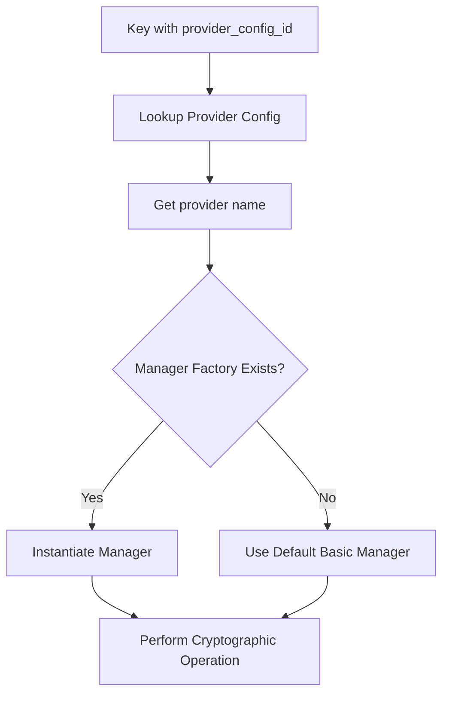
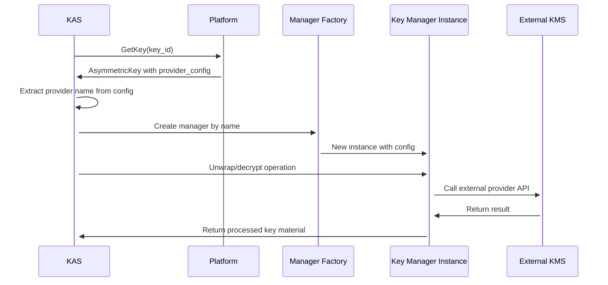

# Key Managers and Provider Configurations

Key Managers are pluggable components within KAS that handle different key storage backends. They enable OpenTDF to integrate with external Key Management Systems (KMS), Hardware Security Modules (HSMs), and other cryptographic providers while maintaining a consistent interface.

## Key Provider Configurations

**Provider Configurations** are the foundation of the key manager system. They define how KAS should connect to and interact with external key storage systems.

### KeyProviderConfig Structure

Provider configurations are stored in the `provider_config` database table with these fields:

```protobuf
message KeyProviderConfig {
  string id = 1;              // UUID of the configuration
  string name = 2;            // Unique provider name (e.g., "aws-kms-prod")
  bytes config_json = 3;      // JSON configuration specific to the provider
  common.Metadata metadata = 100;
}
```

The `config_json` field contains provider-specific configuration that varies by implementation.

### Manager Name Matching

The **`name`** field in the provider configuration must match a registered key manager factory. KAS uses this name to instantiate the correct manager implementation:



## How Key Managers Work

### Manager Instantiation Flow



### Default vs Custom Managers

**Default Manager (`opentdf.io/basic`):**

- Handles `KEY_MODE_CONFIG_ROOT_KEY` keys
- Uses local KEK (Key Encryption Key) from KAS configuration
- Private keys stored encrypted in the database
- No external dependencies

**Custom Managers:**

- Handle `KEY_MODE_PROVIDER_ROOT_KEY` and `KEY_MODE_REMOTE` keys
- Connect to external systems (AWS KMS, Azure Key Vault, etc.)
- Can perform remote cryptographic operations
- Loaded as shared libraries (.so files)

## Creating Provider Configurations

### Using the CLI

```bash
# Create a provider configuration for AWS KMS
otdfctl policy keymanagement provider-config create \
  --name "aws-kms-production" \
  --config-json '{
    "region": "us-east-1",
    "access_key_id": "AKIA...",
    "secret_access_key": "...",
    "kms_key_id": "arn:aws:kms:us-east-1:123456789012:key/12345678-1234-1234-1234-123456789012"
  }'

# List all provider configurations
otdfctl policy keymanagement provider-config list

# Get a specific configuration
otdfctl policy keymanagement provider-config get --name "aws-kms-production"
```

### Example Configuration JSON

**AWS KMS Provider:**

```json
{
  "region": "us-east-1",
  "access_key_id": "AKIA...",
  "secret_access_key": "...",
  "kms_key_id": "arn:aws:kms:us-east-1:123456789012:key/12345678-1234-1234-1234-123456789012",
  "endpoint": "https://kms.us-east-1.amazonaws.com"
}
```

**HashiCorp Vault Provider:**

```json
{
  "vault_addr": "https://vault.example.com:8200",
  "vault_token": "hvs.CAESIJlWh...",
  "mount_path": "transit",
  "key_name": "opentdf-dek-key"
}
```

**Azure Key Vault Provider:**

```json
{
  "vault_url": "https://myvault.vault.azure.net/",
  "tenant_id": "12345678-1234-1234-1234-123456789012",
  "client_id": "87654321-4321-4321-4321-210987654321",
  "client_secret": "...",
  "key_name": "opentdf-master-key"
}
```

## Registering Custom Key Managers

### 1. Implement the KeyManager Interface

```go
type KeyManager interface {
    // Unwrap decrypts a wrapped key using the manager's key material
    Unwrap(ctx context.Context, keyID string, wrappedKey []byte) ([]byte, error)
    
    // Wrap encrypts a key using the manager's key material
    Wrap(ctx context.Context, keyID string, plainKey []byte) ([]byte, error)
    
    // GetPublicKey returns the public key for the given key ID
    GetPublicKey(ctx context.Context, keyID string) ([]byte, error)
}
```

### 2. Create a Factory Function

```go
func NewAWSKMSManager(config []byte) (KeyManager, error) {
    var cfg AWSKMSConfig
    if err := json.Unmarshal(config, &cfg); err != nil {
        return nil, err
    }
    
    session := session.Must(session.NewSession(&aws.Config{
        Region: aws.String(cfg.Region),
        Credentials: credentials.NewStaticCredentials(
            cfg.AccessKeyID, cfg.SecretAccessKey, ""),
    }))
    
    return &AWSKMSManager{
        kms:    kms.New(session),
        keyID:  cfg.KMSKeyID,
    }, nil
}
```

### 3. Register with KAS at Startup

```go
// In your main() or init() function
server.WithKeyManagerFactory(
    "aws-kms",  // This name must match provider config names
    NewAWSKMSManager,
)
```

### 4. Build as Shared Library

```bash
# Build your manager as a shared library
go build -buildmode=plugin -o aws-kms-manager.so aws_kms_manager.go

# Load it when starting the platform
./platform --key-manager-plugin=./aws-kms-manager.so
```

## Migration from Legacy Configuration

:::important Migration Required
**Legacy server startup flags** for key manager registration are deprecated.

**Before:**

```bash
./kas --key-manager-factories="aws-kms=/path/to/factory.so"
```

**Now:**

1. Load the plugin at startup: `--key-manager-plugin=/path/to/factory.so`
2. Create provider configurations via API
3. Reference provider configs when creating keys
:::

## Configuration Management

### Best Practices

- **Unique Names**: Provider configuration names must be globally unique
- **Secure Storage**: Store sensitive configuration values in secure secret management
- **Immutable Configs**: Provider configurations cannot be deleted if keys reference them
- **Validation**: Test configurations before creating keys that depend on them

### Configuration Lifecycle

```bash
# Create configuration
otdfctl policy keymanagement provider-config create --name "prod-hsm" --config-json '{...}'

# Update configuration (if no keys depend on it)
otdfctl policy keymanagement provider-config update --id "config-uuid" --config-json '{...}'

# Delete is only allowed if no keys reference it
otdfctl policy keymanagement provider-config delete --id "config-uuid"
```

## Reference Links

- [KeyManager Interface](https://github.com/opentdf/platform/blob/main/service/trust/key_manager.go#L33)
- [Key Management Proto](https://github.com/opentdf/platform/blob/main/service/policy/keymanagement/key_management.proto)
- [Provider Configuration RPCs](https://github.com/opentdf/platform/blob/main/service/policy/keymanagement/key_management.proto#L76)
- [Server Options for Plugin Loading](https://github.com/opentdf/platform/blob/main/service/pkg/server/options.go)
