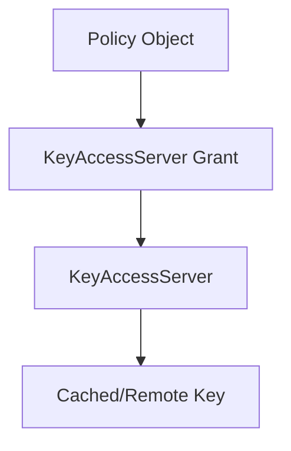
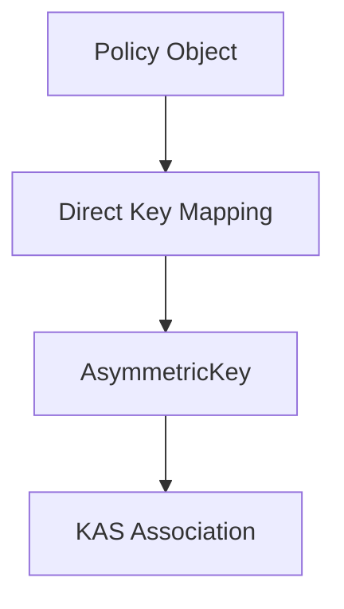

# Migration from Grants to Key Mappings

:::warning Grants Deprecated
**KAS Grants have been deprecated** as of OpenTDF platform v0.7.0 and **removed entirely** in v0.8.0+.

All existing grant-based configurations must be migrated to the new key mapping system.
:::

## Migration Timeline

- **v0.5.0**: Key mappings introduced alongside grants  
- **v0.6.0**: SDKs prefer key mappings over grants when both exist
- **v0.7.0**: Grant assignment APIs deprecated (read-only)
- **v0.8.0**: Grant APIs removed entirely

## Differences Between Systems

### Legacy Grants (Deprecated)



**Characteristics:**

- Indirect relationship through KeyAccessServer
- Limited to `cached` or `remote` key modes
- Manual key rotation required grant reassignment
- Keys embedded in KAS startup configuration

### New Key Mappings



**Characteristics:**

- Direct relationship to individual keys
- Support for all key modes (local, provider, remote)
- Automatic key rotation with mapping preservation
- Keys stored in database with rich metadata

## Migration Process

### 1. Audit Existing Grants

```bash
# List all existing grants (deprecated API)
otdfctl policy kas-registry grants list --output json > existing_grants.json

# Examine the grant structure
jq '.grants[] | {kas: .key_access_server, namespaces: .namespace_grants, attributes: .attribute_grants, values: .value_grants}' existing_grants.json
```

### 2. Extract Key Information

For each grant, identify:

- **KAS Details**: URI, name, public key information
- **Policy Objects**: Which namespaces/attributes/values are granted
- **Key Material**: Public key PEM, algorithm, key ID

### 3. Create Keys in New System

```bash
# For each unique key in your grants:

# 1. Register KAS (if not already registered)
KAS_ID=$(otdfctl policy kas-registry create \
  --uri "https://existing-kas.example.com" \
  --name "migrated-kas" \
  --output json | jq -r '.key_access_server.id')

# 2. Create the key in the new system
KEY_ID=$(otdfctl policy kas-registry key create \
  --kas-id "$KAS_ID" \
  --key-id "migrated-key-2024" \
  --algorithm "ALGORITHM_RSA_2048" \
  --key-mode "KEY_MODE_CONFIG_ROOT_KEY" \
  --public-key-pem "$(cat existing_public_key.pem)" \
  --wrapping-key-id "legacy-kek" \
  --wrapped-key "$(base64 < existing_wrapped_key.bin)" \
  --output json | jq -r '.kas_key.key.id')
```

### 4. Create Key Mappings

```bash
# For each policy object that was granted in the old system:

# Namespace mappings
otdfctl policy namespaces key assign \
  --namespace-id "$NAMESPACE_ID" \
  --key-id "$KEY_ID"

# Attribute mappings  
otdfctl policy attributes key assign \
  --attribute-id "$ATTRIBUTE_ID" \
  --key-id "$KEY_ID"

# Value mappings
otdfctl policy attributes value key assign \
  --value-id "$VALUE_ID" \
  --key-id "$KEY_ID"
```

### 5. Verify Migration

```bash
# Verify key mappings are working
otdfctl policy kas-registry key mappings list

# Test with SDK (create/decrypt a test TDF)
# Ensure the new mappings resolve correctly
```

### 6. Clean Up Legacy Configuration

```bash
# Remove deprecated grant configurations
# (This varies by deployment method)

# Update KAS startup YAML to remove embedded keys
# Update platform configuration to remove grant references
```

## Field Mapping Reference

| Legacy Grant Field | New Mapping Equivalent |
|-------------------|----------------------|
| `KeyAccessServer.id` | `AsymmetricKey.kas_id` |
| `KeyAccessServer.uri` | `KeyAccessServer.uri` (unchanged) |
| `PublicKey.cached` | `KeyMode.CONFIG_ROOT_KEY` |
| `PublicKey.remote` | `KeyMode.REMOTE` |
| `KasPublicKey.kid` | `AsymmetricKey.key_id` |
| `KasPublicKey.pem` | `PublicKeyCtx.pem` |
| `KasPublicKey.alg` | `Algorithm` enum |

## Deprecated API Mappings

| Deprecated RPC | New RPC |
|----------------|---------|
| ~~`AssignKeyAccessServerToNamespace`~~ | `AssignPublicKeyToNamespace` |
| ~~`AssignKeyAccessServerToAttribute`~~ | `AssignPublicKeyToAttribute` |
| ~~`AssignKeyAccessServerToValue`~~ | `AssignPublicKeyToValue` |
| ~~`RemoveKeyAccessServerFromNamespace`~~ | `RemovePublicKeyFromNamespace` |
| ~~`RemoveKeyAccessServerFromAttribute`~~ | `RemovePublicKeyFromAttribute` |
| ~~`RemoveKeyAccessServerFromValue`~~ | `RemovePublicKeyFromValue` |
| ~~`ListKeyAccessServerGrants`~~ | `ListKeyMappings` |

## Migration Script Template

```bash
#!/bin/bash
set -e

# Configuration
PLATFORM_URL="https://platform.example.com"
OUTPUT_DIR="./migration_data"

mkdir -p "$OUTPUT_DIR"

echo "🔍 Step 1: Auditing existing grants..."
otdfctl policy kas-registry grants list --output json > "$OUTPUT_DIR/grants.json"

echo "📝 Step 2: Analyzing grant structure..."
jq -r '.grants[] | 
  .namespace_grants[]? as $ns |
  .attribute_grants[]? as $attr |  
  .value_grants[]? as $val |
  .key_access_server | 
  "\(.id),\(.uri),\(.name),\($ns.id // ""),\($attr.id // ""),\($val.id // "")"' \
  "$OUTPUT_DIR/grants.json" > "$OUTPUT_DIR/migration_plan.csv"

echo "🔑 Step 3: Creating keys and mappings..."
# Process each unique KAS and create corresponding keys
# (Implement based on your specific grant structure)

while IFS=, read -r kas_id kas_uri kas_name ns_id attr_id val_id; do
  echo "Processing grant: KAS=$kas_name, NS=$ns_id, ATTR=$attr_id, VAL=$val_id"
  
  # Create key if not exists
  # Create mappings
  # Log progress
  
done < "$OUTPUT_DIR/migration_plan.csv"

echo "✅ Step 4: Verification..."
otdfctl policy kas-registry key mappings list

echo "🎉 Migration completed! Remember to:"
echo "  1. Test TDF operations with new mappings"  
echo "  2. Update client applications if needed"
echo "  3. Remove legacy grant configurations"
echo "  4. Archive migration data for rollback if needed"
```

## Rollback Considerations

:::caution Rollback Planning
Plan your rollback strategy before migrating:

1. **Backup**: Export current grant configurations
2. **Versioning**: Tag your platform version before upgrade
3. **Testing**: Validate mappings in staging environment
4. **Gradual**: Migrate in phases (namespace by namespace)

**Note**: Once upgraded to v0.8.0+, rollback requires platform version downgrade and configuration restoration.
:::

## Common Migration Issues

**Key Algorithm Mismatches:**

- Ensure algorithm enums match between old and new systems
- Verify ECC curves are correctly mapped

**Missing Key Material:**

- Extract private keys from KAS configuration files
- Ensure wrapping keys are available for local keys

**Policy Object IDs:**

- UUIDs must match exactly between grants and mappings
- Verify namespace/attribute/value IDs haven't changed

**Multiple KAS Instances:**

- Migrate one KAS at a time
- Ensure key IDs are unique across all KAS instances
