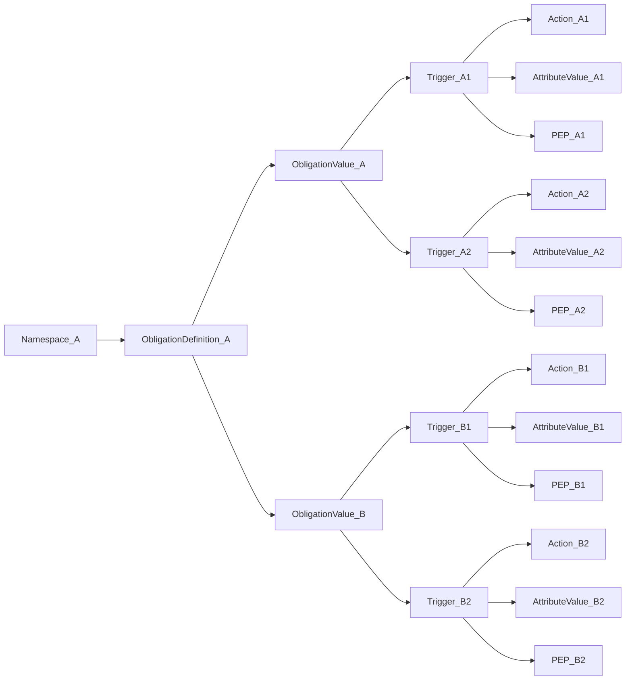

# Obligations

Obligations are policy constructs that enable Policy Decision Point(PDP) - to - Policy Enforcement Point (PEP) directives that accompany a decision. They express additional controls the PEP should enforce—such as requiring MFA, applying watermarking, encrypting content, or limiting access by time. In effect, the PDP is saying “permit, provided these controls are enforced.” The PDP cannot compel or verify enforcement; it relies on the PEP to honor the obligations. 
If the PEP cannot or will not enforce an obligation, it should decline to grant access.
## Composition

An obligation consists of:

1. A Namespace
2. A Definition
3. Values
4. Triggers

Platform Policy Obligations can contain multiple Namespaces, each with multiple Definitions, and each Definition can have multiple Values. Each Value can have multiple Triggers. Each trigger can have an Action, Attribute Value, and PEP identifier.

## Standard Obligations

Standard Obligations are enforced by the Access PDP (Policy Decision Point) when validating whether an Entity of a specified Category can perform an Action on a given Resource. These obligations must be satisfied for access to be granted.

A Standard Obligation includes:
- **Entity Category**: The type of entity (SUBJECT or ENVIRONMENT) that must satisfy this obligation
- **Action**: The specific action being performed (READ, STORE, CREATE, UPDATE, DELETE)
- **Resource Attribute Value**: The data attribute for which this obligation is scoped
- **Obligation Value**: The required obligation value that must be satisfied

### Examples of Standard Obligations:

#### Watermarking
Ensure document traceability:
- **Obligation**: `https://example.com/obl/drm/value/watermarking`
- **Applied to**: sensitive documents
- **Condition**: PEP must apply watermark

#### Prevent Download
Prevent download of plaintext content:
- **Obligation**: `https://example.com/obl/drm/value/no-download`
- **Applied to**: sensitive documents
- **Condition**: PEP must not allow download

## FQN (Fully Qualified Name) Convention

Obligations use a specific naming convention to distinguish them from attributes:

- **Obligation Definition**: `<namespace>/obl/<obligation_name>`
- **Obligation Value**: `<namespace>/obl/<obligation_name>/value/<obligation_value>`

For example:
- `https://example.com/obl/drm` (definition)
- `https://example.com/obl/drm/value/watermarking` (value)
