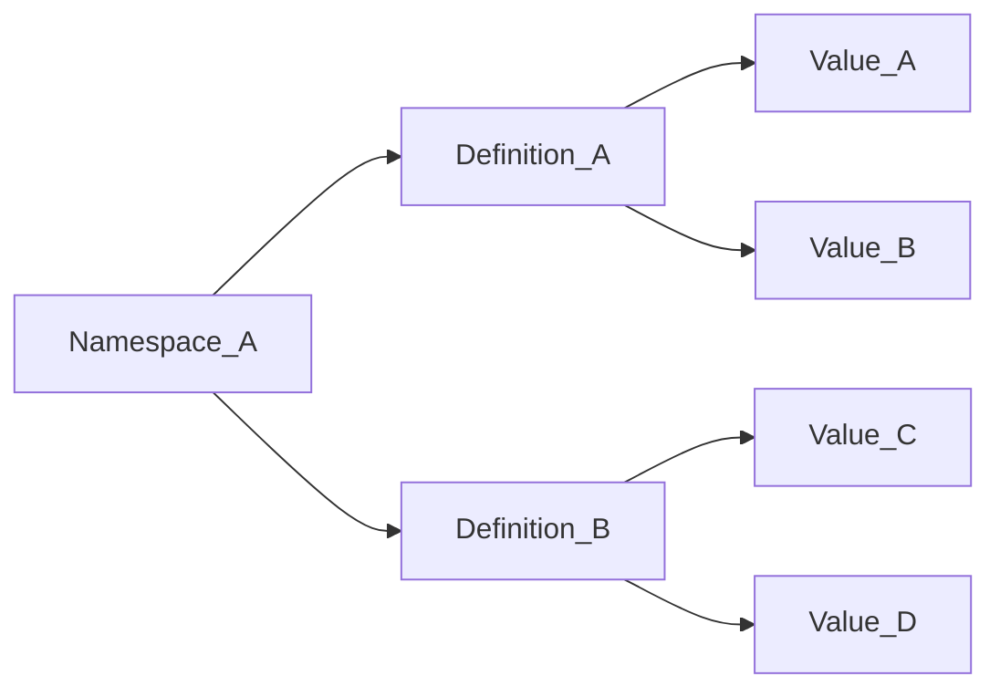

# Obligations

Obligations are policy constructs that enable conditional access enforcement at the Policy Enforcement Point (PEP) level. They define additional restrictions and requirements beyond basic attribute-based access control (ABAC), allowing security administrators to enforce conditions such as multi-factor authentication (MFA), watermarking, encryption, or time-based access controls.

## Composition

An obligation consists of three parts:

1. A Namespace
2. A Definition
3. A Value

Platform Policy Obligations can contain multiple Namespaces, each with multiple Definitions, and each Definition can have multiple Values.

## Obligation Types

There are two types of obligations supported by the platform:

### Standard Obligations

Standard Obligations are enforced by the Access PDP (Policy Decision Point) when validating whether an Entity of a specified Category can perform an Action on a given Resource. These obligations must be satisfied for access to be granted.

A Standard Obligation includes:
- **Entity Category**: The type of entity (SUBJECT or ENVIRONMENT) that must satisfy this obligation
- **Action**: The specific action being performed (READ, STORE, CREATE, UPDATE, DELETE)
- **Resource Attribute Value**: The data attribute for which this obligation is scoped
- **Obligation Value**: The required obligation value that must be satisfied

#### Examples of Standard Obligations:

**Watermarking Requirement**
- All HIPAA documents must be watermarked on read
- Entity Category: ENVIRONMENT (watermarking must be supported by the client)
- Action: READ
- Resource: `https://example.com/attr/classification/value/hipaa`
- Obligation Value: `https://example.com/obl/drm/value/watermarking`

**Age Verification for Content**
- Movies rated R should only be read by users 17+
- Entity Category: SUBJECT (a person must meet the obligation criteria)
- Action: READ
- Resource: `https://example.com/attr/rating/value/r`
- Obligation Value: `https://example.com/obl/age/value/17+`

### Handling Obligations [UNIMPLEMENTED]

Handling Obligations define conditions where an Entity can perform an action on a specified Resource because the Resource can be handled differently if the calling PEP enforces additional obligations. The Access PDP performs what is effectively a "Drop/Add" operation for authorization purposes.

A Handling Obligation includes:
- **Entity Category**: The type of entity that must satisfy this obligation
- **Action**: The specific action being performed
- **Resource Attribute Value**: The data attribute to be "dropped" for authorization
- **Obligation Value**: The required obligation value
- **Obligation Attribute Value**: The attribute value to be "added" for authorization

#### Example of Handling Obligations:

**Transmit as Confidential with Encryption**
Allow transmission of top secret data to networks entitled with confidential classification or above, with the additional obligation to encrypt the data using FIPS 140-2.

- Entity Category: ENVIRONMENT
- Action: STORE
- Resource Attribute Value: `https://example.com/attr/classification/value/topsecret` (Drop)
- Obligation Value: `https://example.com/obl/encryption/value/fips-140-2`
- Obligation Attribute Value: `https://example.com/attr/classification/value/confidential` (Add)

## FQN (Fully Qualified Name) Convention

Obligations use a specific naming convention to distinguish them from attributes:

- **Obligation Definition**: `<namespace>/obl/<obligation_name>`
- **Obligation Value**: `<namespace>/obl/<obligation_name>/value/<obligation_value>`

For example:
- `https://example.com/obl/drm` (definition)
- `https://example.com/obl/drm/value/watermarking` (value)

## Common Use Cases

### Multi-Factor Authentication (MFA)
Require additional authentication for sensitive data access:
- **Obligation**: `https://example.com/obl/auth/value/mfa`
- **Applied to**: TOP SECRET classified documents
- **Condition**: Subject entity must complete MFA before READ access

### Geographic Restrictions
- **Obligation**: `https://example.com/obl/location/value/usa`
- **Applied to**: Classified documents
- **Condition**: Environment entity must be within approved geographic boundaries

### Time-Based Access (Burn After Reading)
Implement expiration policies:
- **Obligation**: `https://example.com/obl/expiration/value/24hr`
- **Applied to**: Project-specific documents
- **Condition**: Access expires 24 hours after first READ action

### Document Watermarking
Ensure document traceability:
- **Obligation**: `https://example.com/obl/drm/value/watermarking`
- **Applied to**: Sensitive documents
- **Condition**: Environment must apply user identification watermark on READ