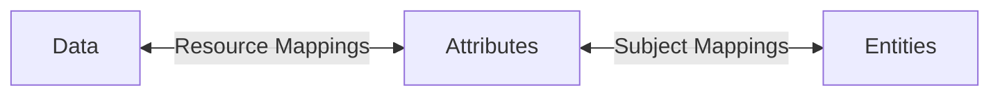

# Overview

Policy is the all-encompassing name for configuration of cryptographically-bound Attribute Based Access Control (ABAC) within the Platform.

TDF creation and decryption are driven by the Policy within a Platform instance and the TDF manifest. In other words, on a TDF decryption request, the platform services (KAS, Authorization) compare attributes on the TDF against the requester's entitlements to make a decision to release the key or not.

Components of Policy include:

- Attributes
  - Namespaces
  - Definitions
  - Values
- Subject Mappings
  - Subject Condition Sets
- Resource Mappings
- Key Access Grants (KAS Grants)
