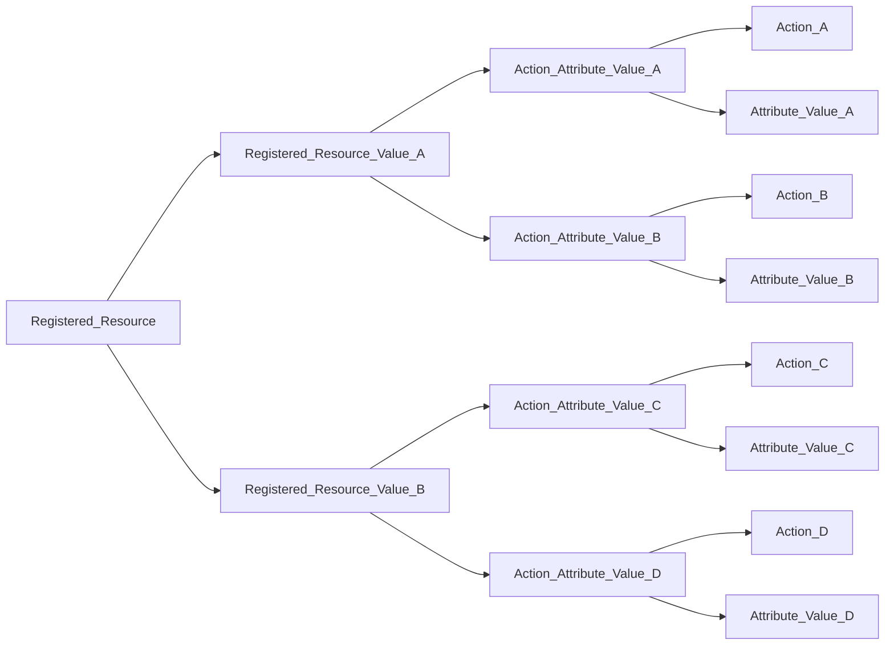

# Registered Resources

`Registered Resources` are "non-data" resources (i.e. not a TDF data object) that are registered with the platform policy and may serve as the "Entity" or "Resource" in a decision request.

## Composition

A Registered Resource consists of:

1. A `Registered Resource`
2. A `Registered Resource Value`
3. One or more `Action Attribute Values`

A Registered Resource has a unique name and may contain multiple, unique Registered Resource Values. 

A Registered Resource Value is used to represent a specific instance of the Registered Resource and can be referenced by a FQN (Fully Qualified Name) in the form of `https://reg_res/<registered_resource.name>/value/<registered_resource_value.value>`.

Registered Resource Values may contain multiple Action Attribute Values, which are unique mappings of an action to an attribute value. These mappings are used in Policy Decision Points for access control decisions.

# Examples

## As a Resource

Alice is a cloud security architect. She needs to control user access to S3 buckets in her cloud environment. She defines a Registered Resource called `s3_bucket` with values like `bucket1`, `bucket2`, and `bucket3`. For the Registered Resource Value `https://reg_res/s3_bucket/value/bucket1`, she might define Action Attribute Values for actions such as `read`, `create`, and `delete` on attribute values such as `https://demo.com/attr/classification/value/topsecret`, `https://demo.com/attr/classification/value/secret`, and `https://demo.com/attr/classification/value/unclassified` to enforce the desired access control.

In this case, Policy Decision Points would evaluate a user's attributes and subject mappings (acting as the entity) against the Action Attribute Values of the `https://reg_res/s3_bucket/value/bucket1` Registered Resource Value (acting as the resource).

## As an Entity

Bob is a network security administrator in a large organization. He needs to manage access to various network devices like routers and switches. He defines a Registered Resource called `network_device` with values like `router1`, `switch1`, and `firewall1`. For the Registered Resource Value `https://reg_res/network_device/value/router1`, he might define Action Attribute Values for actions such as `configure`, `monitor`, and `audit` on attribute values such as `https://demo.com/attr/role/value/admin`, `https://demo.com/attr/role/value/user`, and `https://demo.com/attr/role/value/auditor`.

In this case, Policy Decision Points would evaluate a user's attributes and subject mappings (acting as the entity) against the Action Attribute Values of the `https://reg_res/network_device/value/router1` Registered Resource Value (acting as the resource).
