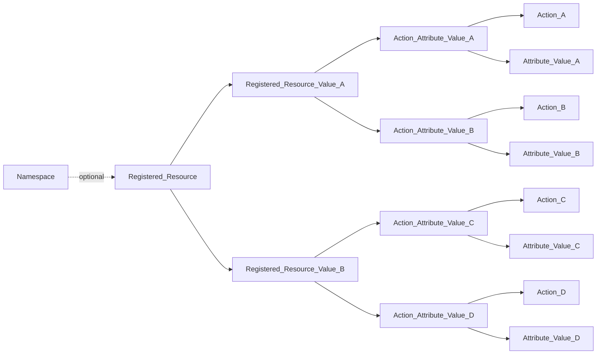

# Registered Resources

`Registered Resources` are "non-data" resources (i.e. not a TDF data object) that are registered with the platform policy and may serve as the "Entity" or "Resource" in a decision request.

## Composition

A Registered Resource consists of:

1. An optional `Namespace` (the same organizational container used by [attributes](./attributes))
2. A `Registered Resource`
3. A `Registered Resource Value`
4. One or more `Action Attribute Values`

A Registered Resource may optionally belong to a Namespace. It has a unique name and may contain multiple, unique Registered Resource Values.

A Registered Resource Value is used to represent a specific instance of the Registered Resource and can be referenced by a FQN (Fully Qualified Name).

When a Registered Resource is associated with a namespace, the FQN takes the form `https://<namespace>/reg_res/<registered_resource.name>/value/<registered_resource_value.value>`.

:::warning Deprecation
Non-namespaced Registered Resources are deprecated. Their FQNs use the form `https://reg_res/<registered_resource.name>/value/<registered_resource_value.value>`. A future version will require all Registered Resources to be associated with a namespace. Use the `otdfctl migrate registered-resources` command to migrate existing non-namespaced Registered Resources.
:::

:::tip
Registered Resource Value FQNs contain the `reg_res` path segment to distinguish them from attribute FQNs under the same namespace.
:::

Registered Resource Values may contain multiple Action Attribute Values, which are unique mappings of an action to an attribute value. These mappings are used in Policy Decision Points for access control decisions.


```mermaid
graph LR;

Namespace-.->|optional|Registered_Resource;

Registered_Resource-->Registered_Resource_Value_A;
Registered_Resource-->Registered_Resource_Value_B;

Registered_Resource_Value_A-->Action_Attribute_Value_A;
Registered_Resource_Value_A-->Action_Attribute_Value_B;

Action_Attribute_Value_A-->Action_A;
Action_Attribute_Value_A-->Attribute_Value_A;
Action_Attribute_Value_B-->Action_B;
Action_Attribute_Value_B-->Attribute_Value_B;

Registered_Resource_Value_B-->Action_Attribute_Value_C;
Registered_Resource_Value_B-->Action_Attribute_Value_D;
Action_Attribute_Value_C-->Action_C;
Action_Attribute_Value_C-->Attribute_Value_C;
Action_Attribute_Value_D-->Action_D;
Action_Attribute_Value_D-->Attribute_Value_D;

```

## Namespacing

Registered Resources can optionally be associated with a namespace by providing a `namespace_id` or `namespace_fqn` when creating the resource. Non-namespaced Registered Resources are deprecated and a future version will require all Registered Resources to have a namespace.

### Uniqueness

Namespaced Registered Resource names are unique within their namespace. Non-namespaced Registered Resource names are globally unique. The same name can exist as both a namespaced and a non-namespaced resource.

### Name Lookup

When getting a Registered Resource by name without specifying a namespace, and both a namespaced and non-namespaced resource share that name, the non-namespaced one is returned. To retrieve the namespaced one, provide the `namespace_id` or `namespace_fqn` in the request.

### Namespace Deletion Cascade

Deactivating a namespace (the default operation exposed via the SDK and CLI) soft-deletes the namespace but does not affect its child Registered Resources. However, an unsafe hard-delete of a namespace cascades to permanently delete all Registered Resources (and their values) within that namespace.

### `NamespacedPolicy` Enforcement

The platform supports a `NamespacedPolicy` server configuration flag. When enabled, all new Registered Resources are required to have a namespace. This flag will become the default in a future version.

# Examples

## As a Resource

Alice is a cloud security architect. She needs to control user access to S3 buckets in her cloud environment. She defines a Registered Resource called `s3_bucket` under the `demo.com` namespace, with values like `bucket1`, `bucket2`, and `bucket3`. For the Registered Resource Value `https://demo.com/reg_res/s3_bucket/value/bucket1`, she might define Action Attribute Values for actions such as `read`, `create`, and `delete` on attribute values such as `https://demo.com/attr/classification/value/topsecret`, `https://demo.com/attr/classification/value/secret`, and `https://demo.com/attr/classification/value/unclassified` to enforce the desired access control.

In this case, Policy Decision Points would evaluate a user's attributes and subject mappings (acting as the entity) against the Action Attribute Values of the `https://demo.com/reg_res/s3_bucket/value/bucket1` Registered Resource Value (acting as the resource).

## As an Entity

Bob is a network security administrator in a large organization. He needs to manage data communications across various networks that have different classification-based access controls. He defines a Registered Resource called `network` under the `demo.com` namespace, with values like `private` and `public`. For the Registered Resource Value `https://demo.com/reg_res/network/value/private`, he might define Action Attribute Values for actions such as `read` and `create` on attribute values such as `https://demo.com/attr/classification/value/topsecret` and `https://demo.com/attr/classification/value/secret`.

In this case, Policy Decision Points would evaluate the Action Attribute Values of the `https://demo.com/reg_res/network/value/private` Registered Resource Value (acting as the entity) against either the Action Attribute Values of the `https://demo.com/reg_res/network/value/public` Registered Resource Value or against a TDF's attributes (acting as the resource).

# Migrating Non-Namespaced Registered Resources

The `otdfctl migrate registered-resources` command migrates legacy non-namespaced Registered Resources to namespaced ones.

:::caution
Migration creates a new namespaced resource and recreates its values with their action-attribute-value mappings. The old non-namespaced resource is not deleted but is tagged with metadata. To delete migrated items, you will need to run a separate `prune`/`cleanup` command which can be found in the otdfctl docs. The migrated resource will have a new UUID. Back up your data before running with `--commit`.
:::

## Modes

### Dry Run (default)

Running without flags previews resources that need migration and their auto-detected namespaces. No changes are made.

```bash
otdfctl migrate registered-resources
```

### Batch

The `--commit` flag migrates all resources at once. The tool auto-detects namespaces from action attribute values where possible and prompts for a batch namespace for any resources where the namespace cannot be determined.

```bash
otdfctl migrate registered-resources --commit
```

### Interactive

The `--interactive --commit` flags walk through each resource one-by-one, allowing per-resource namespace selection with options to skip individual resources or abort the migration.

```bash
otdfctl migrate registered-resources --interactive --commit
```

## Namespace Auto-Detection

The migration tool inspects each resource's action attribute values to determine the target namespace:

- **Deterministic**: All action attribute values reference the same namespace — that namespace is used automatically.
- **Conflicting**: Action attribute values reference multiple namespaces — manual selection is required.
- **Undetermined**: Action attribute values exist but namespace data is unavailable — manual selection is required.
- **No AAVs**: The resource has no action attribute values — manual selection is required.
