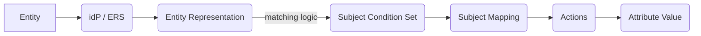
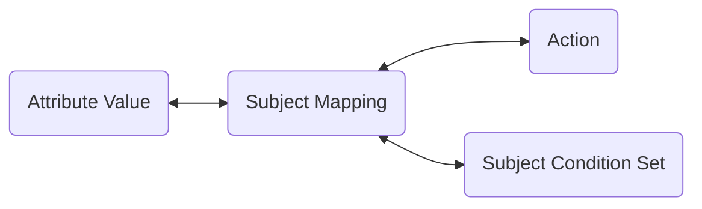

# Subject Mappings

:::tip New to Subject Mappings?
For a comprehensive tutorial with IdP integration examples, troubleshooting, and step-by-step guides, see the [Subject Mapping Comprehensive Guide](/guides/subject-mapping-guide).
:::

:::note Entity attributes come from the Entity Resolution Service (ERS)
Subject Mappings evaluate conditions against the **Entity Representation** produced by the Entity Resolution Service — not directly against IdP tokens. Depending on ERS configuration, entity attributes may come from:
- Access token claims (JWT)
- IdP user info (e.g., Keycloak, Okta)
- LDAP / Active Directory
- SQL databases

This means a Subject Condition Set matching `.emailAddress` will work regardless of whether that attribute comes from a JWT claim, an LDAP directory entry, or a SQL row — as long as ERS resolves it into the entity representation. Multi-source ERS support is available; see the [Entity Resolution](/components/entity_resolution) documentation.
:::

As data is bound to fully qualified Attribute Values when encrypted within a TDF, entities are associated with Attribute values through a mechanism called Subject Mappings.

Entities (subjects, users, machines, etc.) are represented by their identity as determined from an identity provider (IdP). After an entity has securely authenticated with the IdP, the client's token (OIDC/OAUTH2) will include claims or attributes that describe that identity. Subject Mappings define how to map these identity attributes to actions on attribute values defined in the OpenTDF platform Policy. For more details on how the platform integrates with the IdP and how entities are resolved, refer to the [Authorization documentation](../authorization).



## Composition

A Subject Mapping consists of:

1. A mapped [Attribute Value](./attributes#values)
2. A mapped Subject Condition Set
3. One or more policy [Actions](./actions)



## Actions on Attribute Value

Subject Mappings link entities to one or more Actions they are allowed to take on Attribute Values, known as entitlements. 

For more information, see the [Attribute Value](./attributes) and the [Actions](./actions.md) documentation.

## Subject Condition Set

A Subject Condition Set is a logical structure to resolve a representation of the entity (an Access Token, EntityResolutionService response) to a boolean true or false. It contains multiple Subject Sets, each with Condition Groups, and each Condition Group contains Conditions. Each Subject Mapping links to one Attribute Value, but a Subject Condition Set can be reused across multiple Subject Mappings and Attribute Values.

### Examples

#### Subject Mapping for Executives:

Consider a flow where users with the idP role `vice_president` should be allowed to `read` data tagged `https://example.org/attr/role_level/value/vice_president`. 

The Subject Mapping would contain:
1. Action: `read`
2. Attribute Value: `https://example.org/attr/role_level/value/vice_president`
3. A Subject Condition Set with this matching logic:

<!-- TODO: this should be JSON, not YAML -->
```yaml
subject_sets:
  - condition_groups:
      - boolean_operator: OR
        conditions:
          - subject_external_selector_value: '.role'
            operator: IN
            subject_external_values:
              - vice_president
```

If the entity representation contains a field `role: vice_president`, the Subject Condition Set resolves `true`, so the Subject Mapping applies.

The inverse also applies, where an entity representation containing `role: <anything else>`, or lacking the `role` field completely will resolve `false`, and the Subject Mapping would not apply (no entitlement).

#### Subject Mapping for Contributors:

Consider a flow where engineers with titles like `staff`, `senior`, `junior`, or `intern` should be able to `create` data tagged as `https://example.org/attr/department_level/value/contributor`.

The Subject Mapping would contain:
1. Action: `create`
2. Attribute Value: `https://example.org/attr/department_level/value/contributor`
3. A Subject Condition Set with this matching logic:

<!-- TODO: this should be JSON, not YAML -->
```yaml
subject_sets:
  - condition_groups:
      - boolean_operator: AND
        conditions:
          - subject_external_selector_value: '.title'
            operator: IN
            subject_external_values:
              - staff
              - senior
              - junior
              - intern
          - subject_external_selector_value: '.department'
            operator: IN
            subject_external_values:
              - engineering
```

In plain language: If an entity's access token from the IdP or Entity Resolution Service (ERS) includes a `title` field with a value `staff`, `senior`, `junior`, or `intern` AND a `department` field with value `engineering`, then the Subject Mapping will apply to them, granting entitlement for the contained Action `create` on the Attribute Value of `contributor`.

