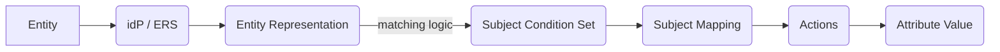
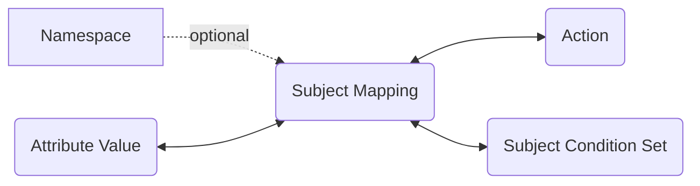

# Subject Mappings

:::tip New to Subject Mappings?
For a comprehensive tutorial with IdP integration examples, troubleshooting, and step-by-step guides, see the [Subject Mapping Guide](/guides/subject-mapping-guide).
:::

:::note What Subject Mappings evaluate against
Subject Mappings evaluate conditions against an **Entity Representation** produced by the [Entity Resolution Service (ERS)](/components/entity_resolution) — not directly against raw IdP tokens. Depending on which ERS mode is configured, this representation may include JWT claims from the token, enriched user data from the Keycloak Admin API, or data from external sources such as LDAP or SQL. The fields available to your selectors depend on [which mode is configured](/components/entity_resolution).
:::

As data is bound to fully qualified Attribute Values when encrypted within a TDF, entities are associated with Attribute values through a mechanism called Subject Mappings.

Entities (subjects, users, machines, etc.) are represented by their identity as determined from an identity provider (IdP). After an entity has securely authenticated with the IdP, the client's token (OIDC/OAUTH2) will include claims or attributes that describe that identity. Subject Mappings define how to map these identity attributes to actions on attribute values defined in the OpenTDF platform Policy. For more details on how the platform integrates with the IdP and how entities are resolved, refer to the [Authorization documentation](../authorization).


```mermaid
graph LR;
Entity-->a(idP / ERS);
a(idP / ERS)-->b(Entity Representation);
b-- matching logic -->c(Subject Condition Set);
c-->d(Subject Mapping);
d-->e(Actions);
e-->f(Attribute Value);
```

## Composition

A Subject Mapping consists of:

1. An optional [Namespace](./attributes#namespaces) (the same organizational container used by [attributes](./attributes) and [registered resources](./registered_resources))
2. A mapped [Attribute Value](./attributes#values)
3. A mapped Subject Condition Set
4. One or more policy [Actions](./actions)

:::warning Deprecation
Non-namespaced Subject Mappings are deprecated. A future version will require all Subject Mappings to be associated with a namespace. See [Namespacing](#namespacing) below.
:::


```mermaid
graph LR;
Namespace-.->|optional|B(Subject Mapping);
A(Attribute Value)<--> B(Subject Mapping);
B(Subject Mapping)<--> D(Action);
B(Subject Mapping)<--> C(Subject Condition Set);
```

## Actions on Attribute Value

Subject Mappings link entities to one or more Actions they are allowed to take on Attribute Values, known as entitlements. 

For more information, see the [Attribute Value](./attributes) and the [Actions](./actions.md) documentation.

## Subject Condition Set

A Subject Condition Set is a logical structure to resolve a representation of the entity (an Access Token, EntityResolutionService response) to a boolean true or false. It contains multiple Subject Sets, each with Condition Groups, and each Condition Group contains Conditions. Each Subject Mapping links to one Attribute Value, but a Subject Condition Set can be reused across multiple Subject Mappings and Attribute Values.

Subject Condition Sets can also optionally be associated with a namespace. See [Subject Condition Set Namespacing](#subject-condition-set-namespacing) below.

### Operators

#### Condition Operators

Each Condition uses an operator to compare the entity's claim (extracted by the selector) against the list of expected values.

| Operator | Description | Example |
|----------|-------------|---------|
| **IN** | Exact match: the entity's value must exactly match one of the listed values | `.role` IN `["admin", "editor"]` |
| **NOT_IN** | Exclusion: the entity's value must **not** match any of the listed values | `.department` NOT_IN `["sales"]` |
| **IN_CONTAINS** | Substring match: the entity's value must **contain** one of the listed substrings | `.email` IN_CONTAINS `["@example.com"]` |

#### Boolean Operators

Each Condition Group uses a boolean operator to combine its Conditions.

| Operator | Description |
|----------|-------------|
| **AND** | All conditions in the group must be true |
| **OR** | At least one condition in the group must be true |

:::info Evaluation Logic
Subject Condition Sets follow a hierarchical evaluation:
1. **Subject Sets**: All Subject Sets within a Condition Set must match (**AND** logic).
2. **Condition Groups**: All Condition Groups within a Subject Set must match (**AND** logic).
3. **Conditions**: Conditions within a group are combined using the group's specified **Boolean Operator** (**AND** or **OR**).
:::

### Examples

#### Subject Mapping for Executives (IN):

Consider a flow where users with the idP role `vice_president` should be allowed to `read` data tagged `https://example.org/attr/role_level/value/vice_president`. 

The Subject Mapping would contain:
1. Action: `read`
2. Attribute Value: `https://example.org/attr/role_level/value/vice_president`
3. A Subject Condition Set with this matching logic:

<!-- TODO: this should be JSON, not YAML -->
```yaml
subject_sets:
  - condition_groups:
      - boolean_operator: OR
        conditions:
          - subject_external_selector_value: '.role'
            operator: IN
            subject_external_values:
              - vice_president
```

If the entity representation contains a field `role: vice_president`, the Subject Condition Set resolves `true`, so the Subject Mapping applies.

The inverse also applies, where an entity representation containing `role: <anything else>`, or lacking the `role` field completely will resolve `false`, and the Subject Mapping would not apply (no entitlement).

#### Subject Mapping for Contributors:

Consider a flow where engineers with titles like `staff`, `senior`, `junior`, or `intern` should be able to `create` data tagged as `https://example.org/attr/department_level/value/contributor`.

The Subject Mapping would contain:
1. Action: `create`
2. Attribute Value: `https://example.org/attr/department_level/value/contributor`
3. A Subject Condition Set with this matching logic:

<!-- TODO: this should be JSON, not YAML -->
```yaml
subject_sets:
  - condition_groups:
      - boolean_operator: AND
        conditions:
          - subject_external_selector_value: '.title'
            operator: IN
            subject_external_values:
              - staff
              - senior
              - junior
              - intern
          - subject_external_selector_value: '.department'
            operator: IN
            subject_external_values:
              - engineering
```

In plain language: If an entity's access token from the IdP or Entity Resolution Service (ERS) includes a `title` field with a value `staff`, `senior`, `junior`, or `intern` AND a `department` field with value `engineering`, then the Subject Mapping will apply to them, granting entitlement for the contained Action `create` on the Attribute Value of `contributor`.

#### Subject Mapping for Non-Sales (NOT_IN):

Consider a flow where all departments **except** sales should be able to `read` data tagged `https://example.org/attr/access_level/value/internal`.

The Subject Mapping would contain:
1. Action: `read`
2. Attribute Value: `https://example.org/attr/access_level/value/internal`
3. A Subject Condition Set with this matching logic:

```yaml
subject_sets:
  - condition_groups:
      - boolean_operator: OR
        conditions:
          - subject_external_selector_value: '.department'
            operator: NOT_IN
            subject_external_values:
              - sales
```

If the entity representation contains `department: engineering` (or any value other than `sales`), the condition resolves `true` and the Subject Mapping applies. If `department: sales`, it resolves `false`.

#### Subject Mapping for Email Domain (IN_CONTAINS):

Consider a flow where any user with an `@acme.com` email address should be able to `read` data tagged `https://example.org/attr/org/value/acme`.

The Subject Mapping would contain:
1. Action: `read`
2. Attribute Value: `https://example.org/attr/org/value/acme`
3. A Subject Condition Set with this matching logic:

```yaml
subject_sets:
  - condition_groups:
      - boolean_operator: OR
        conditions:
          - subject_external_selector_value: '.email'
            operator: IN_CONTAINS
            subject_external_values:
              - '@acme.com'
```

Unlike `IN` which requires an exact match, `IN_CONTAINS` performs a substring match. If the entity representation contains `email: alice@acme.com`, the substring `@acme.com` is found within the value, so the condition resolves `true`. This is useful when matching against patterns within claim values rather than exact values.

## Namespacing

Subject Mappings can optionally be associated with a namespace by providing a `namespace_id` or `namespace_fqn` when creating the mapping. Non-namespaced Subject Mappings are deprecated and a future version will require all Subject Mappings to have a namespace.

### Namespace Deletion Cascade

Deactivating a namespace (the default operation exposed via the SDK and CLI) soft-deletes the namespace but does not affect its child Subject Mappings or Subject Condition Sets. However, an unsafe hard-delete of a namespace cascades to permanently delete all Subject Mappings and Subject Condition Sets within that namespace.

### `NamespacedPolicy` Enforcement

The platform supports a `NamespacedPolicy` server configuration flag. When enabled, all new Subject Mappings are required to have a namespace. This flag will become the default in a future version.

### Namespace Consistency

When a Subject Mapping is namespaced, all of its related objects must be in the same namespace:

- **Attribute Value**: The mapped attribute value's parent attribute definition must be in the same namespace as the Subject Mapping.
- **Actions**: All actions on the Subject Mapping must be in the same namespace.
- **Subject Condition Set**: The Subject Condition Set must be in the same namespace.

When a Subject Mapping is not namespaced (legacy behavior):
- Attribute values can be from any namespace.
- Actions and the Subject Condition Set must also be non-namespaced.

### Subject Condition Set Namespacing

Subject Condition Sets can also optionally be associated with a namespace by providing a `namespace_id` or `namespace_fqn` when creating the condition set. When `NamespacedPolicy` is enabled, all new Subject Condition Sets are required to have a namespace.

A Subject Condition Set's namespace must match the namespace of the Subject Mapping it is associated with.
