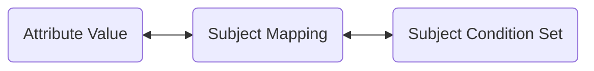
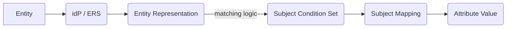

# Overview

As data is bound to fully qualified Attribute Values when encrypted within a TDF, Entities are associated with Attribute Values through a mechanism called Subject Mappings.

Entities (Subjects, Users, Machines, etc.) are defined by a representation (Entity Representation) of their identity from an identity provider (idP).
The OpenTDF Platform is not itself an idP, and it utilizes the OpenID Connect (OIDC) protocol as well as idP pluggability to rely upon an Entity store of truth outside the platform to represent Entity identities.

More details on how the plugin architecture of the Platform with varied idPs and how Entities are resolved can be found in the [Authorization documentation](../../authorization/overview).

## Composition

A Subject Mapping is composed of:

1. A mapped [Attribute Value](../attributes/overview/#values)
2. A mapped Subject Condition Set
3. A set of Actions

> **WARNING**: Actions are currently unstable



## Attribute Value

As Subject Mappings are the linking relation of Entities to Attribute Values to derive entitlements, they have no value without existing Attribute Values under Namespaced Definitions.

For more information, see the [Attribute Value](../attributes/overview#values) documentation.

## Subject Condition Set

A Subject Condition Set is a logical relation to match a represented Entity to Subject Mappings, and by result, to Attribute Values.

More precisely, a Subject Condition Set is a container for multiple Subject Sets, each containing Condition Groups, each containing Conditions. As each
Subject Mapping has only one Attribute Value, the Subject Condition Set is reusable across multiple Subject Mappings / Attribute Values and is an independent unit.

### Examples

For example, assume a platform adminstrator Alice has configured an attribute governing access control by the role level in her department. It's namespaced under `example.org`, defined with the name `department_level` with a `hierarchy` rule, then given the values:

0. `vice_president` (`https://example.org/attr/department_level/value/vice_president`)
1. `director` (`https://example.org/attr/department_level/value/director`)
2. `manager` (`https://example.org/attr/department_level/value/manager`)
3. `contributor` (`https://example.org/attr/department_level/value/contributor`)

Her identity provider is an independent system running separately from the platform, and she knows there is sensitive data going to be TDF'd that should
be accessible at each level, but that her idP stores user titles differently depending on the level and department.

If a VP is looked up in an idP "user info" endpoint, their representation will look like:

```json
{
  "role": "vice_president"
  // ... other info as well
}
```

The `manager` and `director` level information will also be found on the `.role` field and value. However, for `contributor` level individuals, there is quite a bit of role and title variation across departments.

In the Engineering department, the `contributor` Attribute Value should be associated with individuals who an idP represents as any of the below:

- `{"department":"engineering","title":"staff"}`
- `{"department":"engineering","title":"senior"}`
- `{"department":"engineering","title":"junior"}`
- `{"department":"engineering","title":"intern"}`

These Entity Attributes differ in several ways but ultimately should govern access through entitlement to the same Attribute Values. Subject Condition Sets are the mechanism to define these relations.

Alice sets up her Subject Condition Sets and Subject Mappings as follows:

#### Subject Mapping for VPs, Directors, Managers:

As they are all driven by the `.role` entity representation field and value from the identity provider, they all look more or less the same with the Attribute Value replaced in each.

```yaml
# This example is for the Subject Mapping (SM) pointing to
# `https://example.org/attr/department_level/value/vice_president`, but
# it would be created and look quite similar for 'director' or 'manager'.
subject_sets:
  - condition_groups:
      - boolean_operator: OR
        conditions:
          - subject_external_selector_value: '.role'
            operator: IN
            subject_external_values:
              - vice_president # or director or manager for those SMs
```

#### Subject Mapping for Contributors:

As stated above, quite a few titles within engineering should be mapped to the `contributor` level. As such, the Subject Condition Set below is
utilized for the Subject Mapping relating Entities in Engineering to the `https://example.org/attr/department_level/value/contributor`
Attribute Value.

```yaml
subject_sets:
  - condition_groups:
      # AND will require both conditions for a match, instead of OR as "any"
      - boolean_operator: AND
        conditions:
          - subject_external_selector_value: '.title'
            operator: IN
            subject_external_values:
              - staff
              - senior
              - junior
              - intern
          - subject_external_selector_value: '.department'
            operator: IN
            subject_external_values:
              - engineering
```

In plain English, if the Representation of the Entity from the idP and/or Entity Resolution Service (ERS) has a field `title` with a value inside the
list `staff, senior, junior, intern`, and the Entity Representation _also_ has a field `department` with the value `engineering`,
the Entity should be entitled with the Attribute Value in the Subject Mapping containing that Subject Condition Set.



## Actions

> **WARNING**: Actions are currently unstable
