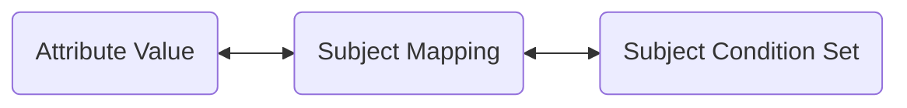
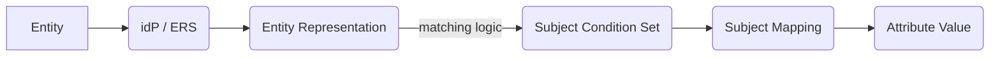

# Overview

As data is bound to fully qualified Attribute Values when encrypted within a TDF, entities are associated with Attribute values through a mechanism called Subject Mappings.

Entities (subjects, users, machines, etc.) are represented by their identity as determined from an identity provider (IdP). After an entity has securely authenticated with the IdP, tthe client's token (OIDC/OAUTH2) will include claims or attributes that describe that identity. Subject Mappings define how to map these identity attributes to the attribute values defined in the OpenTDF platform. For more details on how the platform integrates with the IdP and how entities are resolved, refer to the [Authorization documentation](../../authorization/overview).

## Composition

A Subject Mapping consists of:

1. A mapped [Attribute Value](../attributes/overview/#values)
2. A mapped Subject Condition Set



## Attribute Value

Subject Mappings link entities to Attribute Values, granting entitlements. They have no function without existing Attribute Values under Namespaced Definitions. For more information, see the [Attribute Value](../attributes/overview#values) documentation.

## Subject Condition Set

A Subject Condition Set is a logical structure that matches a represented entity to Subject Mappings and, by extension, to Attribute Values. It contains multiple Subject Sets, each with Condition Groups, and each Condition Group contains Conditions. Each Subject Mapping links to one Attribute Value, but a Subject Condition Set can be reused across multiple Subject Mappings and Attribute Values.

### Examples

#### Subject Mapping for Executives:

Consider a Subject Mapping where users with the role `vice_president` should be granted the Attribute Value `https://example.org/attr/role_level/value/vice_president`. A Subject Condition Set would look like this:

```yaml
subject_sets:
  - condition_groups:
      - boolean_operator: OR
        conditions:
          - subject_external_selector_value: '.role'
            operator: IN
            subject_external_values:
              - vice_president
```

#### Subject Mapping for Contributors:

For users in engineering with titles like `staff`, `senior`, `junior`, or `intern`, a Subject Condition Set can be defined to grant the Attribute Value `https://example.org/attr/department_level/value/contributor`:

```yaml
subject_sets:
  - condition_groups:
      - boolean_operator: AND
        conditions:
          - subject_external_selector_value: '.title'
            operator: IN
            subject_external_values:
              - staff
              - senior
              - junior
              - intern
          - subject_external_selector_value: '.department'
            operator: IN
            subject_external_values:
              - engineering
```

In plain language: If an entity's identity token from the IdP or Entity Resolution Service (ERS) includes a `title` field with values like `staff`, `senior`, `junior`, or `intern` and a `department` field with the value `engineering`, then that entity should be entitled with the corresponding Attribute Value of `contributor`.


