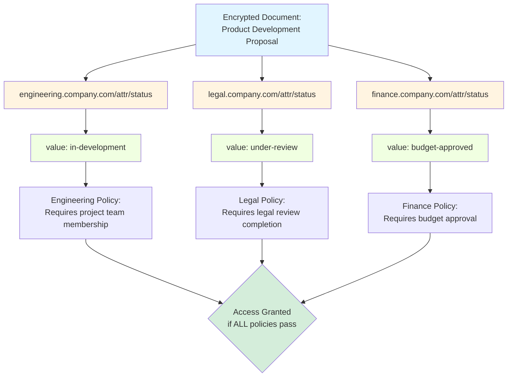
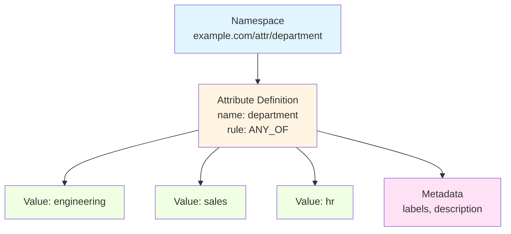
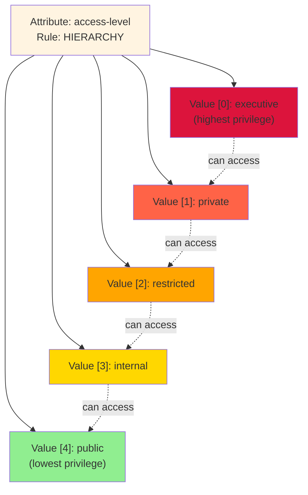

# Attributes & Namespaces

OpenTDF uses attributes and namespaces to classify data and express access requirements. Understanding these concepts is essential for designing effective ABAC policies.

## Namespaces

Namespaces partition the attribute space by authority or context, enabling multiple divisions or organizations to apply their own attribute schemes to the same data without conflicts.

**Why Namespaces Matter**: The same data can have attributes from multiple namespaces simultaneously, each representing a different stakeholder's perspective or governance requirements.

### Real-World Example: Multi-Division Status Tracking

A product development proposal might be encrypted with multiple "status" attributes from different divisions:
- `engineering.company.com/attr/status/value/in-development` - Engineering tracks technical development status
- `legal.company.com/attr/status/value/under-review` - Legal tracks compliance review status
- `finance.company.com/attr/status/value/budget-approved` - Finance tracks funding status

Without namespaces, you couldn't have three different "status" attributes—there would be a naming conflict. With namespaces, each division maintains its own independent "status" attribute with its own values and rules.



When someone requests access:
- Engineering's policy checks: "Is the technical work complete enough for access?"
- Legal's policy checks: "Has the necessary legal review happened?"
- Finance's policy checks: "Is the funding status appropriate for this access?"

Each division maintains authority over their own namespace without interfering with others.

### Namespace Format and Patterns

**Format**: `<authority>/<path>`

**Common Patterns**:
- `engineering.company.com/attr/status` - Engineering division's status tracking
- `legal.company.com/attr/status` - Legal division's status tracking (different rules, same attribute name)
- `finance.company.com/attr/status` - Finance division's status tracking
- `sales.company.com/attr/region` - Sales division's regional organization

**Key Properties**:
- **Independent Authority**: Each division controls their own namespace
- **No Naming Conflicts**: `engineering.company.com/attr/status` and `legal.company.com/attr/status` are completely separate attributes
- **Multi-Stakeholder Governance**: Data can satisfy multiple policies from different divisions simultaneously
- **Parallel Workflows**: Different divisions can track the same data through their own processes independently

**Naming Conventions**: Namespaces can follow hierarchical naming patterns for organizational clarity, though each namespace is independent:
- `example.com/attr/location/country`
- `example.com/attr/location/region`
- `example.com/attr/location/city`

These path-like names help humans understand relationships, but there's no parent-child functionality in the system—each namespace operates independently.

---

## Attributes

Attributes are properties defined within namespaces. Each attribute has:

- **Name**: Identifier (e.g., `department`, `access-level`)
- **Rule**: How values are evaluated (ANY_OF, ALL_OF, HIERARCHY)
- **Values**: Enumerated possible values
- **Metadata**: Description, tags, etc.

### Attribute Structure



### Creating Attributes

Use the CLI to create attributes within a namespace:

```bash
# Create attribute with rule
otdfctl policy attributes create \
  --namespace <namespace-id> \
  --name department \
  --rule ANY_OF

# Add values to the attribute
otdfctl policy attributes values create \
  --attribute <attribute-id> \
  --value engineering
```

---

## Attribute Rules

Attribute definitions include a **rule** that determines how the attribute's values are evaluated during authorization. The rule controls the entitlement logic: how a subject's attributes are matched against the attributes on encrypted TDF data to determine access.

### ANY_OF

**Logic**: An entity who is mapped to **any** of the associated values of the attribute on TDF'd resource data will be entitled to take the actions in the mapping.

**Use Case**: When a subject needs only one of several possible attribute values to access data.

**Example**:
```
Attribute Definition:
- Name: team
- Rule: ANY_OF
- Values: [red-team, blue-team, green-team]

TDF Encrypted With: [team=blue-team]

Authorization Results:
✓ Subject with team=blue-team → Access GRANTED
✓ Subject with team=red-team AND team=blue-team → Access GRANTED
✗ Subject with team=red-team → Access DENIED
✗ Subject with no team attribute → Access DENIED
```

**When to Use**:
- Access based on membership in one of multiple groups
- "Either/or" access requirements
- Attribute represents independent, non-hierarchical categories

### ALL_OF

**Logic**: An entity must be mapped to **all** of the associated values of the attribute on TDF'd resource data to be entitled to take the actions in the mapping.

**Use Case**: When data requires multiple attribute values simultaneously for access (intersection of requirements).

**Example**:
```
Attribute Definition:
- Name: certification
- Rule: ALL_OF
- Values: [safety-trained, equipment-certified, background-checked]

TDF Encrypted With: [certification=safety-trained, certification=equipment-certified]

Authorization Results:
✓ Subject with [safety-trained, equipment-certified] → Access GRANTED
✓ Subject with [safety-trained, equipment-certified, background-checked] → Access GRANTED
✗ Subject with [safety-trained] only → Access DENIED
✗ Subject with [equipment-certified] only → Access DENIED
✗ Subject with [background-checked] only → Access DENIED
```

**When to Use**:
- Access requires multiple qualifications simultaneously
- "And" logic for compound requirements
- Data needs approval from multiple domains
- Cross-functional access control

### HIERARCHY

**Logic**: An entity must be mapped to the **same level value or a level above** in hierarchy compared to a given value on TDF'd resource data.

**Key Concepts**:
- Hierarchical values are ordered by index, with **index 0 being the highest** level and the last index being the lowest
- **Actions propagate down through the hierarchy**: A subject with a higher-level value can access data encrypted with any lower-level value
- Think of it like a membership tier: higher tiers grant access to all lower tier benefits

**Use Case**: When attributes represent hierarchical levels, organizational tiers, or graduated access.

**Example**:
```
Attribute Definition:
- Name: access-level
- Rule: HIERARCHY
- Values (ordered by index):
  - [0] platinum    (highest)
  - [1] gold
  - [2] silver
  - [3] bronze
  - [4] standard    (lowest)

TDF Encrypted With: [access-level=silver]  (index 2)

Authorization Results:
✓ Subject with access-level=platinum (index 0) → Access GRANTED (0 < 2)
✓ Subject with access-level=gold (index 1) → Access GRANTED (1 < 2)
✓ Subject with access-level=silver (index 2) → Access GRANTED (2 = 2)
✗ Subject with access-level=bronze (index 3) → Access DENIED (3 > 2)
✗ Subject with access-level=standard (index 4) → Access DENIED (4 > 2)
```

**Action Propagation**:
If you grant a `read` action at `access-level=platinum` (highest level), that permission propagates down to all lower levels. A user with `platinum` access can read:
- platinum content
- gold content
- silver content
- bronze content
- standard content

**When to Use**:
- Membership or subscription tiers
- Organizational hierarchy (executive → manager → employee)
- Content access levels (premium → pro → basic)
- Geographic scope (global → regional → local)
- Support tiers (priority → standard → community)

**Important**: The order of values in the attribute definition matters! Reordering values changes the hierarchy and can inadvertently grant or revoke access.

### Choosing the Right Rule

| Scenario | Recommended Rule | Reason |
|----------|------------------|--------|
| User belongs to one of several teams | ANY_OF | Only one team membership needed |
| Document requires both legal AND finance approval | ALL_OF | Must have both attributes |
| Subscription tiers (premium, standard, basic) | HIERARCHY | Higher tier = access to lower tier content |
| Geographic regions (independent) | ANY_OF | Regions don't have inherent ordering |
| Job levels (manager → employee → intern) | HIERARCHY | Natural hierarchical progression |
| Multiple independent projects | ANY_OF | Project memberships are separate |

### Related Documentation

For practical examples of creating attributes with rules:
- [CLI Reference: Creating Attributes](/explanation/platform-architecture/components/cli/policy/attributes/create) - Command-line examples
- [Tutorial: Your First TDF](/tutorials/your-first-tdf/) - Hands-on attribute creation walkthrough
- [Attributes Deep Dive](/explanation/platform-architecture/components/policy/attributes) - Technical architecture details

---

## Attribute Values

Each attribute has a set of defined values. Values have:

- **Value**: The actual value string
- **Index Position** (for HIERARCHY): Order in the list determines privilege level (index 0 = highest)
- **Metadata**: Display name, color, description

### Hierarchy Example



### Creating Hierarchical Attributes

The order you add values determines their hierarchy:

```bash
# Create attribute with HIERARCHY rule
otdfctl policy attributes create \
  --namespace <namespace-id> \
  --name access-level \
  --rule HIERARCHY

# Add values in order: first = highest privilege
otdfctl policy attributes values create --attribute <attr-id> --value executive
otdfctl policy attributes values create --attribute <attr-id> --value private
otdfctl policy attributes values create --attribute <attr-id> --value restricted
otdfctl policy attributes values create --attribute <attr-id> --value internal
otdfctl policy attributes values create --attribute <attr-id> --value public
```

A subject with `access-level=private` (index 1) can access data encrypted with `restricted` (index 2), `internal` (index 3), or `public` (index 4).

---

## Next Steps

- **[Subject & Resource Mappings](./subject-and-resource-mappings)**: Learn how to map subjects to these attributes
- **[Policy Workflows](./policy-workflows)**: See how attributes work in complete authorization flows
- **[ABAC Overview](./overview)**: Return to ABAC fundamentals
