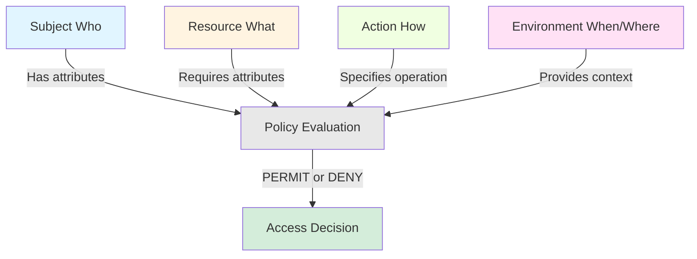
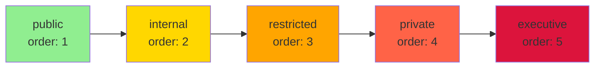
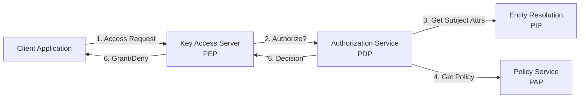

# Attribute-Based Access Control (ABAC) in OpenTDF

## What is ABAC?

Attribute-Based Access Control (ABAC) is a flexible authorization model that makes access decisions based on attributes of subjects (users), resources (data), actions, and environmental context. Unlike simpler models like Role-Based Access Control (RBAC), ABAC enables fine-grained, dynamic policies that can express complex authorization requirements.

### Core Principles

**Attributes are Key-Value Pairs**: Access decisions are based on attributes like `department=engineering`, `subscription=premium`, or `location=US`.

**Policy-Based Decisions**: Policies define which combinations of attributes grant access to which resources.

**Dynamic Evaluation**: Access is evaluated at request time based on current attribute values, enabling real-time enforcement of changing policies.

**Fine-Grained Control**: Policies can express nuanced requirements like "users with subscription tier 'premium' AND department 'sales' can access this document."

### Why ABAC for Data-Centric Security?

Traditional access control models protect resources at the perimeter (firewalls, API gateways). Once data leaves the perimeter, protection is lost. ABAC in OpenTDF binds policies directly to data through cryptographic enforcement, ensuring:

- **Persistent Protection**: Policies travel with encrypted data
- **Anywhere Enforcement**: Data remains protected regardless of location
- **Dynamic Policies**: Access rules can change without re-encrypting data
- **Zero Trust Architecture**: Never trust, always verify at access time

### Comparison with Other Models

| Model | Decision Based On | Granularity | Flexibility |
|-------|------------------|-------------|-------------|
| **DAC** (Discretionary) | Resource owner grants | Per-resource | Low |
| **MAC** (Mandatory) | Security labels | Per-classification | Low |
| **RBAC** (Role-Based) | User roles | Per-role | Medium |
| **ABAC** (Attribute-Based) | Multiple attributes | Per-attribute combination | High |
| **PBAC** (Policy-Based) | Centralized policies | Per-policy | High |

OpenTDF combines ABAC with PBAC principles: attribute-based decisions enforced through centralized policies.

### NIST ABAC Model Alignment

OpenTDF aligns with the [NIST SP 800-162](https://csrc.nist.gov/publications/detail/sp/800-162/final) ABAC model, implementing all core components:

- **Policy Enforcement Point (PEP)**: Key Access Server
- **Policy Decision Point (PDP)**: Authorization Service
- **Policy Administration Point (PAP)**: Policy Service
- **Policy Information Point (PIP)**: Entity Resolution Service

---

## ABAC Components in OpenTDF

OpenTDF's ABAC model has four primary components that interact to make access decisions:



### Subjects (Who)

Subjects represent entities requesting access to data—typically users, but also services, applications, or devices.

#### Subject Identity

Subjects are identified through authentication tokens (JWT, OIDC, SAML) containing identity claims:

```json
{
  "sub": "user@example.com",
  "email": "user@example.com",
  "name": "Alice Smith",
  "groups": ["engineering", "managers"]
}
```

#### Subject Attributes

Subjects have attributes describing their properties and context:

- **Identity attributes**: `email`, `username`, `employee_id`
- **Organizational attributes**: `department`, `role`, `title`, `cost_center`
- **Subscription attributes**: `tier`, `plan_type`, `feature_access`
- **Contextual attributes**: `ip_address`, `device_type`, `authentication_method`

#### Subject Mappings

Subject Mappings link external identity claims to OpenTDF attributes. They define which subjects possess which attributes.

Example mapping: "Users in the 'engineering' group get the `department=engineering` attribute."

For detailed information on subject mappings, see [Subject & Resource Mappings](./subject-and-resource-mappings).

#### Condition Sets

Condition Sets allow complex boolean logic for subject mappings:

- **ALL_OF**: Subject must match all conditions
- **ANY_OF**: Subject must match at least one condition
- **NOT**: Subject must not match condition

---

### Resources (What)

Resources are the data objects being protected—files, database records, API responses, etc.

#### Resource Attributes

When data is encrypted with OpenTDF, it is tagged with attribute values that express access requirements:

```
Data Encrypted With: [
  "example.com/attr/department/value/engineering",
  "example.com/attr/sensitivity/value/restricted"
]
```

These attributes define "who can access this data."

#### Content Access Schemes

Organizations can define hierarchical content access schemes:



With hierarchy rules, a user with `access-level=private` (order 4) can also access `restricted` (order 3), `internal` (order 2), and `public` (order 1) content.

For detailed information on attributes and hierarchies, see [Attributes & Namespaces](./attributes-and-namespaces).

---

### Actions (How)

Actions represent what the subject wants to do with the resource. In OpenTDF, the primary actions are:

- **DECRYPT**: Unwrap the data encryption key to access plaintext
- **ENCRYPT**: Create a new TDF with specific attributes
- **REWRAP**: Request key access for an encrypted TDF

Action-based policies can enable scenarios like "users can encrypt with 'restricted' but only decrypt 'internal' or lower."

---

### Environment (When/Where)

Environmental attributes capture the context of an access request:

- **Time**: `request_time`, `day_of_week`, `business_hours`
- **Location**: `ip_address`, `country`, `region`
- **Device**: `device_type`, `os_version`, `security_posture`
- **Network**: `network_zone`, `vpn_status`

Policies can incorporate environmental conditions: "Access granted only during business hours from corporate network."

---

## How OpenTDF Services Implement ABAC

OpenTDF's architecture distributes ABAC functions across specialized services:



### Policy Service (PAP - Policy Administration Point)

The Policy Service is the single source of truth for:

- **Attribute Definitions**: Namespaces, attributes, and values
- **Attribute Rules**: Hierarchies and ordering
- **Subject Mappings**: Which subjects get which attributes
- **Resource Mappings**: Applying attributes to resources

Administrators use the Policy Service to define the ABAC model.

### Entity Resolution Service (PIP - Policy Information Point)

The Entity Resolution Service resolves subject attributes at access time:

1. Receives subject identity (from JWT/OIDC token)
2. Queries external systems (LDAP, SCIM, databases)
3. Applies subject mappings and condition sets
4. Returns attribute list for the subject

Example: Given `user@example.com`, returns `[department=engineering, access-level=restricted]`.

### Authorization Service (PDP - Policy Decision Point)

The Authorization Service makes access decisions:

1. Receives authorization request (subject + resource attributes + action)
2. Resolves subject attributes via Entity Resolution
3. Evaluates policies (attribute matching, hierarchies, conditions)
4. Returns decision: PERMIT or DENY

The Authorization Service implements the core ABAC evaluation logic.

### Key Access Server (PEP - Policy Enforcement Point)

The Key Access Server enforces authorization decisions:

1. Receives key access requests from clients trying to decrypt TDFs
2. Extracts resource attributes from the TDF
3. Calls Authorization Service for decision
4. If PERMIT: rewraps and returns the key
5. If DENY: refuses key access

The KAS ensures only authorized subjects can decrypt protected data.

---

## Next Steps

Now that you understand ABAC fundamentals and OpenTDF's architecture, explore the policy primitives that bring ABAC to life:

- **[Attributes & Namespaces](./attributes-and-namespaces)**: Learn how to classify data with attributes, use namespaces for multi-stakeholder governance, and configure attribute rules (ANY_OF, ALL_OF, HIERARCHY)
- **[Subject & Resource Mappings](./subject-and-resource-mappings)**: Understand how to map external identities to attributes and automate resource classification
- **[Obligations](./obligations)**: Discover usage controls beyond simple access decisions
- **[Policy Workflows & Best Practices](./policy-workflows)**: See how all the primitives work together with practical examples and design guidance

## Learn More

- **[Platform Architecture](../platform-architecture/index.md)**: How OpenTDF services work together
- **[Trusted Data Format](../trusted-data-format/index.md)**: How policies are cryptographically bound to data
- **[Policy Service API Reference](../../reference/OpenAPI-clients/policy/policy)**: Detailed API documentation
- **[How-To: Implementing a PEP](../../how-to/integration-patterns/implementing-a-pep.mdx)**: Build your own policy enforcement point
- **[Tutorial: Your First TDF](../../tutorials/your-first-tdf/index.mdx)**: Hands-on ABAC policy creation
