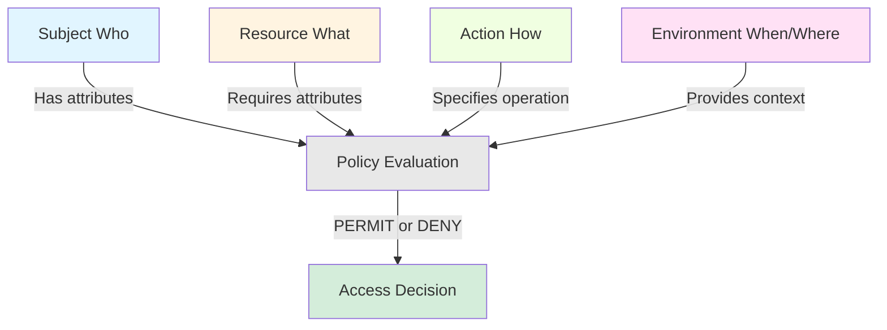
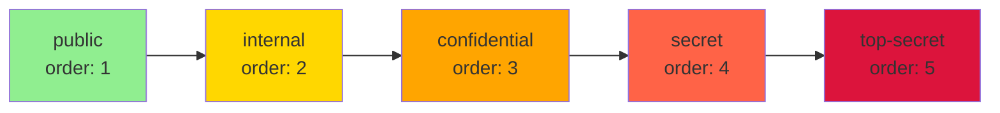
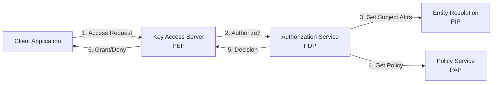
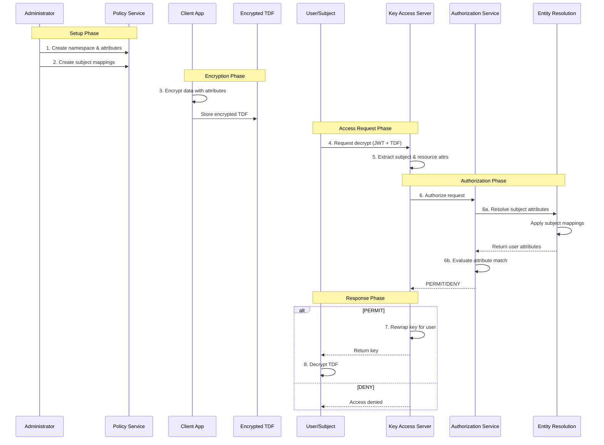

# Attribute-Based Access Control (ABAC) in OpenTDF

## What is ABAC?

Attribute-Based Access Control (ABAC) is a flexible authorization model that makes access decisions based on attributes of subjects (users), resources (data), actions, and environmental context. Unlike simpler models like Role-Based Access Control (RBAC), ABAC enables fine-grained, dynamic policies that can express complex authorization requirements.

### Core Principles

**Attributes are Key-Value Pairs**: Access decisions are based on attributes like `department=engineering`, `clearance=secret`, or `location=US`.

**Policy-Based Decisions**: Policies define which combinations of attributes grant access to which resources.

**Dynamic Evaluation**: Access is evaluated at request time based on current attribute values, enabling real-time enforcement of changing policies.

**Fine-Grained Control**: Policies can express nuanced requirements like "users with clearance level 'top-secret' AND department 'intelligence' can access this document."

### Why ABAC for Data-Centric Security?

Traditional access control models protect resources at the perimeter (firewalls, API gateways). Once data leaves the perimeter, protection is lost. ABAC in OpenTDF binds policies directly to data through cryptographic enforcement, ensuring:

- **Persistent Protection**: Policies travel with encrypted data
- **Anywhere Enforcement**: Data remains protected regardless of location
- **Dynamic Policies**: Access rules can change without re-encrypting data
- **Zero Trust Architecture**: Never trust, always verify at access time

### Comparison with Other Models

| Model | Decision Based On | Granularity | Flexibility |
|-------|------------------|-------------|-------------|
| **DAC** (Discretionary) | Resource owner grants | Per-resource | Low |
| **MAC** (Mandatory) | Security labels | Per-classification | Low |
| **RBAC** (Role-Based) | User roles | Per-role | Medium |
| **ABAC** (Attribute-Based) | Multiple attributes | Per-attribute combination | High |
| **PBAC** (Policy-Based) | Centralized policies | Per-policy | High |

OpenTDF combines ABAC with PBAC principles: attribute-based decisions enforced through centralized policies.

### NIST ABAC Model Alignment

OpenTDF aligns with the [NIST SP 800-162](https://csrc.nist.gov/publications/detail/sp/800-162/final) ABAC model, implementing all core components:

- **Policy Enforcement Point (PEP)**: Key Access Server
- **Policy Decision Point (PDP)**: Authorization Service
- **Policy Administration Point (PAP)**: Policy Service
- **Policy Information Point (PIP)**: Entity Resolution Service

---

## ABAC Components in OpenTDF

OpenTDF's ABAC model has four primary components that interact to make access decisions:



### Subjects (Who)

Subjects represent entities requesting access to data—typically users, but also services, applications, or devices.

#### Subject Identity

Subjects are identified through authentication tokens (JWT, OIDC, SAML) containing identity claims:

```json
{
  "sub": "user@example.com",
  "email": "user@example.com",
  "name": "Alice Smith",
  "groups": ["engineering", "managers"]
}
```

#### Subject Attributes

Subjects have attributes describing their properties and context:

- **Identity attributes**: `email`, `username`, `employee_id`
- **Organizational attributes**: `department`, `role`, `title`, `cost_center`
- **Security attributes**: `clearance_level`, `need_to_know`, `citizenship`
- **Contextual attributes**: `ip_address`, `device_type`, `authentication_method`

#### Subject Mappings

Subject Mappings link external identity claims to OpenTDF attributes. They define which subjects possess which attributes.

Example mapping: "Users in the 'engineering' group get the `department=engineering` attribute."

#### Condition Sets

Condition Sets allow complex boolean logic for subject mappings:

- **ALL_OF**: Subject must match all conditions
- **ANY_OF**: Subject must match at least one condition
- **NOT**: Subject must not match condition

---

### Resources (What)

Resources are the data objects being protected—files, database records, API responses, etc.

#### Resource Attributes

When data is encrypted with OpenTDF, it is tagged with attribute values that express access requirements:

```
Data Encrypted With: [
  "example.com/attr/department/value/engineering",
  "example.com/attr/classification/value/confidential"
]
```

These attributes define "who can access this data."

#### Classification Schemes

Organizations can define hierarchical classification schemes:



With hierarchy rules, a user with `clearance=secret` (order 4) can also access `confidential` (order 3), `internal` (order 2), and `public` (order 1) data.

---

### Actions (How)

Actions represent what the subject wants to do with the resource. In OpenTDF, the primary actions are:

- **DECRYPT**: Unwrap the data encryption key to access plaintext
- **ENCRYPT**: Create a new TDF with specific attributes
- **REWRAP**: Request key access for an encrypted TDF

Action-based policies can enable scenarios like "users can encrypt with 'confidential' but only decrypt 'internal' or lower."

---

### Environment (When/Where)

Environmental attributes capture the context of an access request:

- **Time**: `request_time`, `day_of_week`, `business_hours`
- **Location**: `ip_address`, `country`, `region`
- **Device**: `device_type`, `os_version`, `security_posture`
- **Network**: `network_zone`, `vpn_status`

Policies can incorporate environmental conditions: "Access granted only during business hours from corporate network."

---

## How OpenTDF Services Implement ABAC

OpenTDF's architecture distributes ABAC functions across specialized services:



### Policy Service (PAP - Policy Administration Point)

The Policy Service is the single source of truth for:

- **Attribute Definitions**: Namespaces, attributes, and values
- **Attribute Rules**: Hierarchies and ordering
- **Subject Mappings**: Which subjects get which attributes
- **Resource Mappings**: Applying attributes to resources

Administrators use the Policy Service to define the ABAC model.

### Entity Resolution Service (PIP - Policy Information Point)

The Entity Resolution Service resolves subject attributes at access time:

1. Receives subject identity (from JWT/OIDC token)
2. Queries external systems (LDAP, SCIM, databases)
3. Applies subject mappings and condition sets
4. Returns attribute list for the subject

Example: Given `user@example.com`, returns `[department=engineering, clearance=confidential]`.

### Authorization Service (PDP - Policy Decision Point)

The Authorization Service makes access decisions:

1. Receives authorization request (subject + resource attributes + action)
2. Resolves subject attributes via Entity Resolution
3. Evaluates policies (attribute matching, hierarchies, conditions)
4. Returns decision: PERMIT or DENY

The Authorization Service implements the core ABAC evaluation logic.

### Key Access Server (PEP - Policy Enforcement Point)

The Key Access Server enforces authorization decisions:

1. Receives key access requests from clients trying to decrypt TDFs
2. Extracts resource attributes from the TDF
3. Calls Authorization Service for decision
4. If PERMIT: rewraps and returns the key
5. If DENY: refuses key access

The KAS ensures only authorized subjects can decrypt protected data.

---

## Policy Structure Deep Dive

OpenTDF policies are composed of several interrelated primitives that work together to implement ABAC.

### Namespaces

Namespaces organize attributes by domain or authority. They prevent naming conflicts and establish ownership.

**Format**: `<authority>/<path>`

**Examples**:
- `example.com/attr/department`
- `gov.mil/attr/clearance`
- `healthcare.org/attr/patient-consent`

Namespaces support hierarchies, allowing sub-namespaces:
- `example.com/attr/location/country`
- `example.com/attr/location/region`
- `example.com/attr/location/city`

### Attributes

Attributes are properties defined within namespaces. Each attribute has:

- **Name**: Identifier (e.g., `department`, `clearance`)
- **Rule**: How values are evaluated (ANY_OF, ALL_OF, HIERARCHY)
- **Values**: Enumerated possible values
- **Metadata**: Description, tags, etc.

**Attribute Definition Example**:

```json
{
  "namespace": "example.com/attr/department",
  "name": "department",
  "rule": "ANY_OF",
  "values": [
    {"value": "engineering"},
    {"value": "sales"},
    {"value": "hr"}
  ]
}
```

#### Attribute Rules

**ANY_OF**: Subject must have at least one matching value.

- Data encrypted with `[department=engineering]`
- Subject with `department=engineering` → Access granted
- Subject with `department=sales` → Access denied

**ALL_OF**: Subject must have all required values.

- Data encrypted with `[project=alpha, project=beta]`
- Subject with `[project=alpha, project=beta]` → Access granted
- Subject with `[project=alpha]` → Access denied

**HIERARCHY**: Values are ordered; higher values grant access to lower.

- Data encrypted with `[clearance=confidential]`
- Subject with `clearance=secret` → Access granted (secret > confidential)
- Subject with `clearance=public` → Access denied (public < confidential)

### Attribute Values

Each attribute has a set of defined values. Values have:

- **Value**: The actual value string
- **Order** (for HIERARCHY): Numeric order (higher = more privileged)
- **Metadata**: Display name, color, description

**Hierarchy Example**:

```json
{
  "namespace": "example.com/attr/clearance",
  "name": "clearance",
  "rule": "HIERARCHY",
  "values": [
    {"value": "public", "order": 1},
    {"value": "internal", "order": 2},
    {"value": "confidential", "order": 3},
    {"value": "secret", "order": 4},
    {"value": "top-secret", "order": 5}
  ]
}
```

A subject with `clearance=secret` (order 4) can access data encrypted with `confidential` (order 3), `internal` (order 2), or `public` (order 1).

### Subject Mappings

Subject Mappings assign attributes to subjects based on their identity claims.

**Structure**:

- **Attribute Value**: Which attribute value to assign
- **Subject Condition Set**: Boolean logic defining which subjects match

**Example**:

Assign `department=engineering` to users whose JWT contains `"groups": ["engineering"]`.

```json
{
  "attributeValue": "example.com/attr/department/value/engineering",
  "subjectConditionSet": {
    "conditionGroups": [
      {
        "booleanOperator": "OR",
        "conditions": [
          {
            "subjectSets": [
              {"conditionOperator": "IN", "subjectClaim": "groups", "subjectValues": ["engineering"]}
            ]
          }
        ]
      }
    ]
  }
}
```

#### Subject Condition Sets

Subject Condition Sets use boolean operators to combine conditions:

- **Condition Groups**: Arrays of conditions combined with AND or OR
- **Conditions**: Individual matching rules
- **Subject Sets**: Match claims in the identity token

**Operators**:

- `IN`: Claim value is in the specified list
- `NOT_IN`: Claim value is not in the list
- `EQUALS`: Claim value exactly matches
- `NOT_EQUALS`: Claim value does not match

**Complex Example**:

Assign `clearance=secret` to users who:
- Are in the `intelligence` group, AND
- Have `citizenship=US`, AND
- Have `background_check=complete`

```json
{
  "conditionGroups": [
    {
      "booleanOperator": "AND",
      "conditions": [
        {"subjectSets": [{"conditionOperator": "IN", "subjectClaim": "groups", "subjectValues": ["intelligence"]}]},
        {"subjectSets": [{"conditionOperator": "EQUALS", "subjectClaim": "citizenship", "subjectValues": ["US"]}]},
        {"subjectSets": [{"conditionOperator": "EQUALS", "subjectClaim": "background_check", "subjectValues": ["complete"]}]}
      ]
    }
  ]
}
```

### Key Access Grants

Key Access Grants (currently under development) will enable fine-grained control over which subjects can grant access and under what conditions.

Future functionality:
- Delegate decryption rights
- Grant temporary access
- Conditional grants based on attributes

### Resource Mappings

Resource Mappings (currently under development) will automate applying attributes to resources based on resource properties.

Future functionality:
- Automatically tag files based on path, metadata, or content
- Sync resource attributes with external classification systems
- Dynamic attribute assignment based on resource context

---

## Policy Primitives Interoperation

Here's a step-by-step walkthrough of how ABAC policy primitives work together in OpenTDF:



### 1. Administrator Defines Attributes

Administrator creates a namespace and defines attributes:

```bash
# Create namespace
otdfctl policy attributes namespaces create \
  --name example.com/attr/department

# Define attribute with values
otdfctl policy attributes create \
  --namespace example.com/attr/department \
  --name department \
  --rule ANY_OF \
  --values engineering,sales,hr
```

### 2. Administrator Creates Subject Mappings

Administrator maps external identity groups to attributes:

```bash
# Map "engineering" group to department=engineering attribute
otdfctl policy subject-mappings create \
  --attribute-value example.com/attr/department/value/engineering \
  --subject-condition '{"groups": ["engineering"]}'
```

### 3. Client Encrypts Data with Attributes

Application encrypts sensitive data and tags it with attribute requirements:

```python
# Encrypt data requiring department=engineering
tdf = TDF.create(
    data="Confidential engineering document",
    attributes=["example.com/attr/department/value/engineering"]
)
```

The TDF now cryptographically binds the policy to the data.

### 4. Subject Requests Access

User attempts to decrypt the TDF:

```python
# User authenticates and requests decrypt
client.decrypt(tdf)
```

Client presents authentication token (JWT):

```json
{
  "sub": "alice@example.com",
  "email": "alice@example.com",
  "groups": ["engineering", "managers"]
}
```

### 5. Key Access Server Receives Request

KAS receives the decrypt request and extracts:

- **Subject**: Identity claims from JWT
- **Resource Attributes**: `[department=engineering]` from the TDF
- **Action**: `DECRYPT`

### 6. Authorization Service Evaluates Policy

KAS calls Authorization Service, which:

1. **Resolves Subject Attributes**:
   - Calls Entity Resolution Service with subject identity
   - Entity Resolution applies subject mappings
   - Returns: `[department=engineering]` (Alice is in "engineering" group)

2. **Evaluates Attribute Match**:
   - Data requires: `[department=engineering]`
   - Subject has: `[department=engineering]`
   - Attribute rule: `ANY_OF`
   - **Result**: MATCH

3. **Returns Decision**: `PERMIT`

### 7. KAS Grants or Denies Access

- If `PERMIT`: KAS rewraps the data encryption key with the subject's public key and returns it
- If `DENY`: KAS refuses to provide the key; data remains encrypted

### 8. Client Decrypts Data

If granted, client receives the key and decrypts the TDF content.

---

## Policy Design Best Practices

### Granularity Considerations

**Too Coarse**: Large, monolithic attributes (e.g., `access=allowed`) provide little control.

**Too Fine**: Excessive attributes (e.g., per-document attributes) create management overhead.

**Balanced**: Use namespaces and hierarchies to organize attributes logically. Examples:
- Department-level: `department=engineering`
- Project-level: `project=alpha`
- Classification-level: `clearance=confidential`

### Performance Implications

- **Minimize External Lookups**: Cache entity resolution results where possible
- **Optimize Attribute Count**: Encrypting with 50+ attributes may impact performance
- **Use Hierarchies**: Hierarchy rules reduce the number of attributes needed

### Security Best Practices

- **Least Privilege**: Grant minimum necessary attributes
- **Regular Audits**: Review subject mappings and attribute assignments
- **Separation of Duties**: Different admins for policy definition vs. subject assignment
- **Test Policies**: Validate policies in staging before production

### Testing Strategies

1. **Unit Test Policies**: Test individual attribute rules
2. **Integration Test Mappings**: Verify subject mappings resolve correctly
3. **End-to-End Test Scenarios**: Simulate realistic access patterns
4. **Negative Testing**: Ensure unauthorized subjects are denied
5. **Performance Testing**: Load test authorization service under realistic traffic

---

## Examples

### Example 1: Simple Policy (Single Namespace, Flat Attributes)

**Scenario**: Small company wants to protect documents by department.

**Namespace**:
- `company.com/attr/department`

**Attributes**:
- `department` with values: `engineering`, `sales`, `hr`
- Rule: `ANY_OF`

**Subject Mapping**:
- JWT contains `"department": "engineering"`
- Map to `department=engineering`

**Usage**:
- Encrypt document: `attributes=["company.com/attr/department/value/engineering"]`
- User with `department=engineering` can decrypt
- Users from `sales` or `hr` cannot decrypt

---

### Example 2: Intermediate Policy (Multiple Namespaces, Hierarchies)

**Scenario**: Government agency with classification levels and need-to-know projects.

**Namespaces**:
- `gov.agency/attr/clearance`
- `gov.agency/attr/project`

**Attributes**:

1. `clearance` (HIERARCHY):
   - `public` (order: 1)
   - `internal` (order: 2)
   - `confidential` (order: 3)
   - `secret` (order: 4)

2. `project` (ANY_OF):
   - `alpha`, `beta`, `gamma`

**Subject Mapping**:
- Background check results in `clearance=secret`
- Project assignment adds `project=alpha`

**Usage**:
- Encrypt document: `attributes=["gov.agency/attr/clearance/value/confidential", "gov.agency/attr/project/value/alpha"]`
- User must have `clearance >= confidential` AND `project=alpha`

---

### Example 3: Complex Policy (Condition Sets, Resource Mappings)

**Scenario**: Healthcare provider with patient consent, provider credentials, and emergency access.

**Namespaces**:
- `healthcare.org/attr/consent`
- `healthcare.org/attr/credential`
- `healthcare.org/attr/emergency`

**Attributes**:

1. `consent` (ALL_OF):
   - `patient-12345-consent` (per-patient consent values)

2. `credential` (ANY_OF):
   - `physician`, `nurse`, `pharmacist`

3. `emergency` (ANY_OF):
   - `emergency-override`

**Subject Mapping with Condition Sets**:

- Physicians with active license → `credential=physician`
- Emergency situations → `emergency=emergency-override`

**Complex Subject Condition**:

Grant `emergency-override` to physicians who:
- Have `role=physician`, AND
- Are on-call (`on_call=true`), AND
- Request is during off-hours

**Usage**:
- Encrypt patient record: `attributes=["healthcare.org/attr/consent/value/patient-12345-consent", "healthcare.org/attr/credential/value/physician"]`
- Physician with patient consent can access
- OR emergency override can access regardless of consent

---

## Hands-On Tutorial

Ready to try ABAC policies yourself? The [Your First TDF Tutorial](../../tutorials/your-first-tdf/index.mdx) walks you through:

1. Setting up OpenTDF services
2. Creating your first namespace and attributes
3. Defining subject mappings
4. Encrypting data with attributes
5. Testing access control with different users

---

## Learn More

- **[Platform Architecture](../platform-architecture/index.md)**: How OpenTDF services work together
- **[Trusted Data Format](../trusted-data-format/index.md)**: How policies are cryptographically bound to data
- **[Policy Service API Reference](../../reference/OpenAPI-clients/policy/policy)**: Detailed API documentation
- **[How-To: Implementing a PEP](../../how-to/integration-patterns/implementing-a-pep.mdx)**: Build your own policy enforcement point
- **[Tutorial: Your First TDF](../../tutorials/your-first-tdf/index.mdx)**: Hands-on ABAC policy creation
