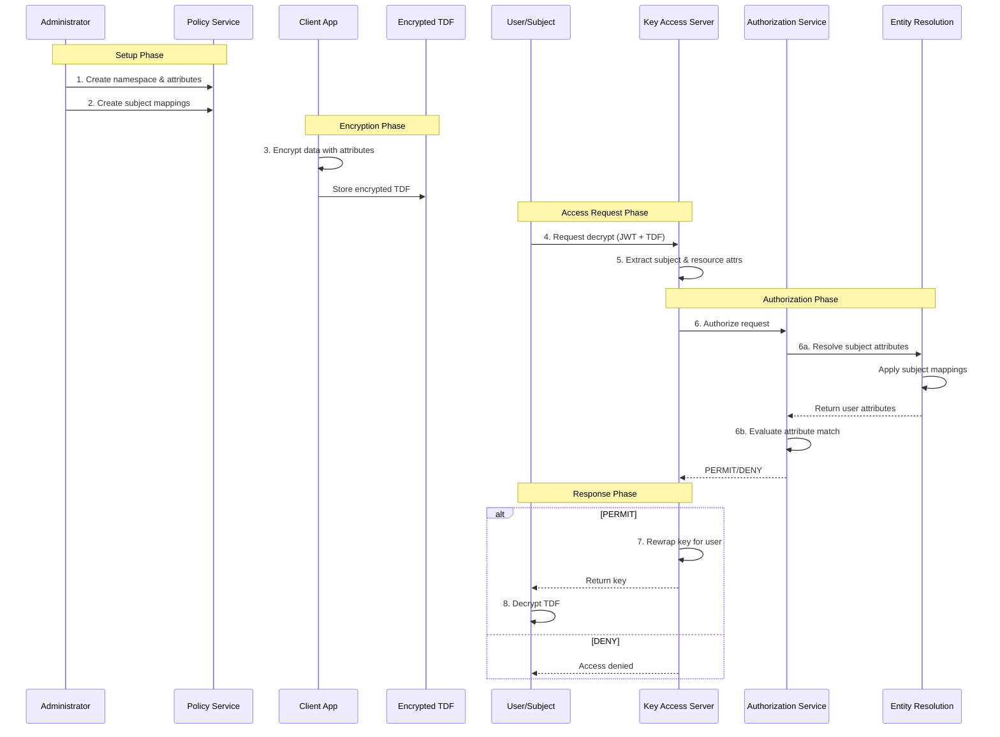

# Policy Workflows & Best Practices

This guide demonstrates how ABAC policy primitives work together in OpenTDF, with practical examples and design guidance.

## Policy Primitives Interoperation

Here's a step-by-step walkthrough of how ABAC policy primitives work together in OpenTDF:



### 1. Administrator Defines Attributes

Administrator creates a namespace and defines attributes:

```bash
# Create namespace
otdfctl policy attributes namespaces create \
  --name example.com/attr/department

# Define attribute with values
otdfctl policy attributes create \
  --namespace example.com/attr/department \
  --name department \
  --rule ANY_OF \
  --values engineering,sales,hr
```

### 2. Administrator Creates Subject Mappings

Administrator maps external identity groups to attributes:

```bash
# Map "engineering" group to department=engineering attribute
otdfctl policy subject-mappings create \
  --attribute-value example.com/attr/department/value/engineering \
  --subject-condition '{"groups": ["engineering"]}'
```

### 3. Client Encrypts Data with Attributes

Application encrypts sensitive data and tags it with attribute requirements:

```python
# Encrypt data requiring department=engineering
tdf = TDF.create(
    data="Confidential engineering document",
    attributes=["example.com/attr/department/value/engineering"]
)
```

The TDF now cryptographically binds the policy to the data.

### 4. Subject Requests Access

User attempts to decrypt the TDF:

```python
# User authenticates and requests decrypt
client.decrypt(tdf)
```

Client presents authentication token (JWT):

```json
{
  "sub": "alice@example.com",
  "email": "alice@example.com",
  "groups": ["engineering", "managers"]
}
```

### 5. Key Access Server Receives Request

KAS receives the decrypt request and extracts:

- **Subject**: Identity claims from JWT
- **Resource Attributes**: `[department=engineering]` from the TDF
- **Action**: `DECRYPT`

### 6. Authorization Service Evaluates Policy

KAS calls Authorization Service, which:

1. **Resolves Subject Attributes**:
   - Calls Entity Resolution Service with subject identity
   - Entity Resolution applies subject mappings
   - Returns: `[department=engineering]` (Alice is in "engineering" group)

2. **Evaluates Attribute Match**:
   - Data requires: `[department=engineering]`
   - Subject has: `[department=engineering]`
   - Attribute rule: `ANY_OF`
   - **Result**: MATCH

3. **Returns Decision**: `PERMIT`

### 7. KAS Grants or Denies Access

- If `PERMIT`: KAS rewraps the data encryption key with the subject's public key and returns it
- If `DENY`: KAS refuses to provide the key; data remains encrypted

### 8. Client Decrypts Data

If granted, client receives the key and decrypts the TDF content.

---

## Policy Design Best Practices

### Granularity Considerations

**Too Coarse**: Large, monolithic attributes (e.g., `access=allowed`) provide little control.

**Too Fine**: Excessive attributes (e.g., per-document attributes) create management overhead.

**Balanced**: Use namespaces and hierarchies to organize attributes logically. Examples:
- Department-level: `department=engineering`
- Project-level: `project=alpha`
- Access-level: `access-level=restricted`

### Performance Implications

- **Minimize External Lookups**: Cache entity resolution results where possible
- **Optimize Attribute Count**: Encrypting with 50+ attributes may impact performance
- **Use Hierarchies**: Hierarchy rules reduce the number of attributes needed

### Security Best Practices

- **Least Privilege**: Grant minimum necessary attributes
- **Regular Audits**: Review subject mappings and attribute assignments
- **Separation of Duties**: Different admins for policy definition vs. subject assignment
- **Test Policies**: Validate policies in staging before production

### Testing Strategies

1. **Unit Test Policies**: Test individual attribute rules
2. **Integration Test Mappings**: Verify subject mappings resolve correctly
3. **End-to-End Test Scenarios**: Simulate realistic access patterns
4. **Negative Testing**: Ensure unauthorized subjects are denied
5. **Performance Testing**: Load test authorization service under realistic traffic

---

## Examples

### Example 1: Simple Policy (Single Namespace, Flat Attributes)

**Scenario**: Small company wants to protect documents by department.

**Namespace**:
- `company.com/attr/department`

**Attributes**:
- `department` with values: `engineering`, `sales`, `hr`
- Rule: `ANY_OF`

**Subject Mapping**:
- JWT contains `"department": "engineering"`
- Map to `department=engineering`

**Usage**:
- Encrypt document: `attributes=["company.com/attr/department/value/engineering"]`
- User with `department=engineering` can decrypt
- Users from `sales` or `hr` cannot decrypt

---

### Example 2: Intermediate Policy (Multiple Namespaces, Hierarchies)

**Scenario**: Multi-division company with content access levels and project-based access.

**Namespaces**:
- `company.com/attr/access-level`
- `company.com/attr/project`

**Attributes**:

1. `access-level` (HIERARCHY):
   - `public` (order: 1)
   - `internal` (order: 2)
   - `restricted` (order: 3)
   - `private` (order: 4)

2. `project` (ANY_OF):
   - `alpha`, `beta`, `gamma`

**Subject Mapping**:
- Role assignment results in `access-level=private`
- Project assignment adds `project=alpha`

**Usage**:
- Encrypt document: `attributes=["company.com/attr/access-level/value/restricted", "company.com/attr/project/value/alpha"]`
- User must have `access-level >= restricted` AND `project=alpha`

---

### Example 3: Complex Policy (Condition Sets, Resource Mappings)

**Scenario**: Healthcare provider with patient consent, provider credentials, and emergency access.

**Namespaces**:
- `healthcare.org/attr/consent`
- `healthcare.org/attr/credential`
- `healthcare.org/attr/emergency`

**Attributes**:

1. `consent` (ALL_OF):
   - `patient-12345-consent` (per-patient consent values)

2. `credential` (ANY_OF):
   - `physician`, `nurse`, `pharmacist`

3. `emergency` (ANY_OF):
   - `emergency-override`

**Subject Mapping with Condition Sets**:

- Physicians with active license → `credential=physician`
- Emergency situations → `emergency=emergency-override`

**Complex Subject Condition**:

Grant `emergency-override` to physicians who:
- Have `role=physician`, AND
- Are on-call (`on_call=true`), AND
- Request is during off-hours

**Usage**:
- Encrypt patient record: `attributes=["healthcare.org/attr/consent/value/patient-12345-consent", "healthcare.org/attr/credential/value/physician"]`
- Physician with patient consent can access
- OR emergency override can access regardless of consent

---

## Design Patterns

### Pattern 1: Hierarchical Access Levels

**Use Case**: Organization with graduated clearance levels

**Implementation**:
- Single namespace: `org.com/attr/clearance`
- Attribute with HIERARCHY rule: `executive > private > restricted > internal > public`
- Subject mappings based on role/position

**Benefits**: Simple to understand, reduces attribute sprawl, natural privilege propagation

### Pattern 2: Multi-Attribute Intersection

**Use Case**: Access requires multiple independent qualifications

**Implementation**:
- Multiple namespaces for different domains (department, project, location)
- ANY_OF rules within each attribute
- Data encrypted with one value from each attribute

**Benefits**: Fine-grained control, flexible policy composition, aligns with organizational structure

### Pattern 3: Dynamic Environmental Controls

**Use Case**: Access restrictions based on context (time, location, device)

**Implementation**:
- Environmental attributes in subject mappings (ip_address, request_time)
- Condition sets with dynamic claim evaluation
- Real-time attribute resolution

**Benefits**: Context-aware security, supports zero-trust principles, adapts to threat landscape

---

## Troubleshooting Common Issues

### Issue: Access Denied When Expected

**Check**:
1. Verify subject mappings resolve correctly for the user
2. Confirm attribute values match exactly (case-sensitive)
3. Ensure attribute rule type (ANY_OF, ALL_OF, HIERARCHY) is correct
4. Check for missing attributes in either subject or resource

### Issue: Too Many Attributes on Data

**Solution**:
- Use hierarchy rules to consolidate levels
- Group related attributes under namespaces
- Consider whether all attributes are necessary

### Issue: Subject Mapping Not Matching

**Check**:
1. Verify JWT claims match condition set expectations
2. Check boolean operators (AND vs OR)
3. Ensure claim names are correct (case-sensitive)
4. Test with actual tokens from your IdP

---

## Hands-On Tutorial

Ready to try ABAC policies yourself? The [Your First TDF Tutorial](../../tutorials/your-first-tdf/index.mdx) walks you through:

1. Setting up OpenTDF services
2. Creating your first namespace and attributes
3. Defining subject mappings
4. Encrypting data with attributes
5. Testing access control with different users

---

## Learn More

### Fundamentals
- **[ABAC Overview](./overview)**: Core ABAC concepts and OpenTDF architecture
- **[Attributes & Namespaces](./attributes-and-namespaces)**: Data classification with attributes
- **[Subject & Resource Mappings](./subject-and-resource-mappings)**: Identity-to-attribute mapping

### Architecture
- **[Platform Architecture](../platform-architecture/index.md)**: How OpenTDF services work together
- **[Trusted Data Format](../trusted-data-format/index.md)**: How policies are cryptographically bound to data
- **[Authorization Service](../platform-architecture/components/authorization.md)**: Policy Decision Point implementation

### Operations
- **[Policy Service API Reference](../../reference/OpenAPI-clients/policy/policy)**: Detailed API documentation
- **[How-To: Implementing a PEP](../../how-to/integration-patterns/implementing-a-pep.mdx)**: Build your own policy enforcement point
- **[CLI Reference](../platform-architecture/components/cli/policy/)**: Command-line policy management
