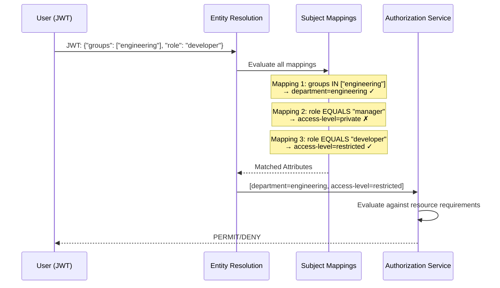

# Subject & Resource Mappings

Mappings bridge the gap between external identity systems and OpenTDF's attribute model. Subject Mappings assign attributes to users based on their identity claims, while Resource Mappings automate attribute assignment to data.

## Subject Mappings

Subject Mappings assign attributes to subjects based on their identity claims.

**Structure**:

- **Attribute Value**: Which attribute value to assign
- **Subject Condition Set**: Boolean logic defining which subjects match

### Basic Example

Assign `department=engineering` to users whose JWT contains `"groups": ["engineering"]`.

```json
{
  "attributeValue": "example.com/attr/department/value/engineering",
  "subjectConditionSet": {
    "conditionGroups": [
      {
        "booleanOperator": "OR",
        "conditions": [
          {
            "subjectSets": [
              {"conditionOperator": "IN", "subjectClaim": "groups", "subjectValues": ["engineering"]}
            ]
          }
        ]
      }
    ]
  }
}
```

---

## Subject Condition Sets

Subject Condition Sets use boolean operators to combine conditions:

- **Condition Groups**: Arrays of conditions combined with AND or OR
- **Conditions**: Individual matching rules
- **Subject Sets**: Match claims in the identity token

### Operators

- `IN`: Claim value is in the specified list
- `NOT_IN`: Claim value is not in the list
- `EQUALS`: Claim value exactly matches
- `NOT_EQUALS`: Claim value does not match

### Complex Example

Assign `access-level=executive` to users who:
- Are in the `executives` group, AND
- Have `employment_status=full-time`, AND
- Have `onboarding_complete=true`

```json
{
  "conditionGroups": [
    {
      "booleanOperator": "AND",
      "conditions": [
        {"subjectSets": [{"conditionOperator": "IN", "subjectClaim": "groups", "subjectValues": ["executives"]}]},
        {"subjectSets": [{"conditionOperator": "EQUALS", "subjectClaim": "employment_status", "subjectValues": ["full-time"]}]},
        {"subjectSets": [{"conditionOperator": "EQUALS", "subjectClaim": "onboarding_complete", "subjectValues": ["true"]}]}
      ]
    }
  ]
}
```

### Design Considerations

**Keep Mappings Simple**: Complex condition logic can be difficult to debug and maintain.

**Use External Systems**: When possible, manage group memberships in your identity provider rather than encoding complex logic in condition sets.

**Test Thoroughly**: Verify that subject mappings resolve correctly for different user scenarios before deploying to production.

---

## Key Access Grants

Key Access Grants (currently under development) will enable fine-grained control over which subjects can grant access and under what conditions.

**Future functionality**:
- Delegate decryption rights
- Grant temporary access
- Conditional grants based on attributes

**Conceptual Model**: Key Access Grants will extend the authorization model by allowing subjects with appropriate permissions to delegate access rights to other subjects, even if those subjects don't natively satisfy the policy requirements.

**Use Cases**:
- Emergency access: Security team grants temporary access to incident responders
- Delegation: Manager delegates document access to team member for specific task
- Time-limited grants: Grant access that expires after specified duration

---

## Resource Mappings

Resource Mappings (currently under development) will automate applying attributes to resources based on resource properties.

**Future functionality**:
- Automatically tag files based on path, metadata, or content
- Sync resource attributes with external classification systems
- Dynamic attribute assignment based on resource context

**Conceptual Model**: Resource Mappings will enable policy-driven classification where attributes are automatically assigned to data based on rules, rather than requiring manual attribute selection at encryption time.

**Use Cases**:
- Path-based classification: Files in `/confidential/` directory automatically get `access-level=private`
- Metadata-based classification: Documents with `classification=secret` metadata automatically mapped to corresponding OpenTDF attributes
- Content-based classification: Data Loss Prevention (DLP) engine scans content and assigns attributes based on detected sensitive information

---

## How Subject Mappings Work in Practice

When a subject requests access to encrypted data, the Entity Resolution Service:

1. **Receives Identity**: Extracts claims from the subject's JWT/OIDC token
2. **Evaluates Mappings**: Checks each subject mapping to see if the subject matches
3. **Assigns Attributes**: Collects all attribute values where condition sets match
4. **Returns Attribute List**: Provides the Authorization Service with the subject's effective attributes

**Example Flow**:



---

## Best Practices

### Start Simple

Begin with straightforward mappings (single condition, single attribute) before introducing complex boolean logic.

### Align with Identity Provider

Map OpenTDF attributes to existing groups and roles in your IdP rather than creating parallel structures.

### Document Mappings

Maintain clear documentation of which identity claims map to which attributes and why.

### Regular Audits

Periodically review subject mappings to ensure they still align with organizational structure and security requirements.

### Test with Real Tokens

Use actual JWT/OIDC tokens from your identity provider to verify mappings resolve correctly.

---

## Related Documentation

- **[Attributes & Namespaces](./attributes-and-namespaces)**: Understanding attribute definitions that mappings reference
- **[Policy Workflows](./policy-workflows)**: See subject mappings in action within complete authorization flows
- **[Entity Resolution Service](/explanation/platform-architecture/components/entity_resolution)**: Technical details on how entity resolution works
- **[Subject Mappings API](/explanation/platform-architecture/components/policy/subject_mappings)**: Implementation and API details

---

## Next Steps

- **[Obligations](./obligations)**: Learn about usage controls beyond access decisions
- **[Policy Workflows](./policy-workflows)**: See complete examples of ABAC in action
- **[ABAC Overview](./overview)**: Return to ABAC fundamentals
