# What is Data-Centric Security?

**Data-centric security** represents a fundamental shift in how we protect information. Instead of focusing on securing networks, devices, or applications, data-centric security protects the data itself. This means that access controls, policies, and protections are directly attached to data objects, traveling with them wherever they go.

## The Traditional Problem

In traditional **perimeter-based security**, organizations build walls around their networks and systems:

```mermaid
graph LR
    subgraph "Corporate Network"
        DB[(Database)]
        APP[Application]
        FILES[File Server]
    end
    
    FIREWALL[🔥 Firewall]
    INTERNET[🌐 Internet]
    USER[👤 User]
    
    INTERNET --> FIREWALL
    FIREWALL --> DB
    FIREWALL --> APP
    FIREWALL --> FILES
    USER --> FIREWALL
```

**Problems with this approach:**

- **Data leaves the perimeter**: Once data is shared, copied, or moved, control is lost
- **Insider threats**: Users inside the perimeter have broad access
- **Breach consequences**: If perimeter is breached, all internal data is at risk
- **Remote work challenges**: Extending perimeter to remote users is complex
- **Third-party sharing**: No control once data reaches partners or vendors

## The Data-Centric Solution

Data-centric security inverts this model by making **data self-protecting**:

```mermaid
graph TD
    DATA[🔒 Protected Data]
    POLICY[📋 Access Policy]
    USER1[👤 Alice]
    USER2[👤 Bob]
    USER3[👤 Charlie]
    
    DATA -.-> POLICY
    POLICY --> USER1
    POLICY --> USER2
    POLICY -.-> USER3
    
    classDef granted fill:#90EE90
    classDef denied fill:#FFB6C1
    classDef data fill:#87CEEB
    
    class USER1,USER2 granted
    class USER3 denied
    class DATA data
```

**Benefits of this approach:**

- **Policy travels with data**: Controls remain effective regardless of location
- **Fine-grained access**: Decisions based on user, context, and data sensitivity
- **Zero-trust ready**: No assumptions about network security or user location
- **Audit trail**: Complete visibility into who accessed what, when, and where
- **Revocable access**: Policies can be updated or revoked in real-time

## How OpenTDF Implements Data-Centric Security

OpenTDF uses the **Trusted Data Format (TDF)** to implement data-centric security:

1. **Cryptographic Binding**: Access policies are cryptographically bound to encrypted data
2. **Attribute-Based Control**: Fine-grained access decisions using user and data attributes
3. **Key Management**: Centralized key services enforce policy decisions
4. **Standards-Based**: Built on the proven NIST ABAC (Attribute-Based Access Control) model

## Real-World Example

Consider a confidential financial report:

**Traditional Security:**

- File stored on secure file server
- Access controlled by network permissions
- If shared via email → no control
- If copied to USB → no control  
- If partner accesses → no control

**Data-Centric Security with OpenTDF:**

- File encrypted as TDF with policy: "Only Finance team members can access"
- Policy travels with the file everywhere
- Authorization checked every time someone tries to open it
- Access can be revoked or modified at any time
- Complete audit trail of all access attempts

## Zero-Trust Integration

Data-centric security is a cornerstone of **zero-trust architecture**:

- **Never trust, always verify**: Every data access request is authenticated and authorized
- **Assume breach**: Data remains protected even if systems are compromised  
- **Least privilege**: Users get minimal access needed for their role
- **Context-aware**: Access decisions consider location, time, device, and behavior

## Next Steps

- Learn about the [Trusted Data Format](/explanation/trusted-data-format) that makes this possible
- Understand [how OpenTDF fits into Zero-Trust architecture](/explanation/data-centric-security/zero-trust-architecture)
- See the [benefits compared to traditional approaches](/explanation/data-centric-security/traditional-vs-data-centric)
- Explore [real-world use cases](/explanation/data-centric-security/use-cases)
