# Traditional vs. Data-Centric Security

Understanding the fundamental differences between traditional perimeter-based security and data-centric security is crucial for appreciating why OpenTDF represents such a significant advancement in data protection.

## Traditional Perimeter-Based Security

Traditional security models are built around the concept of **trusted networks** and **secure perimeters**:

### Core Assumptions

- **Network perimeter is secure**: Firewalls and network controls protect internal resources
- **Inside is trusted**: Users and systems inside the network are generally trusted
- **Outside is untrusted**: External networks and users require special access procedures
- **Static access**: Permissions granted based on location and role, remain until revoked

### Traditional Security Stack

```mermaid
graph TD
    subgraph "Traditional Security Model"
        FIREWALL[🔥 Network Firewall]
        VPN[🔗 VPN Gateway]
        IDS[👁️ Intrusion Detection]
        AUTH[🔐 Network Authentication]
        
        subgraph "Secure Perimeter"
            DB[(🗃️ Database)]
            FILES[📁 File Servers]
            APPS[💻 Applications]
        end
        
        FIREWALL --> AUTH
        VPN --> AUTH
        IDS --> AUTH
        AUTH --> DB
        AUTH --> FILES
        AUTH --> APPS
    end
    
    EXTERNAL[🌐 External User] --> VPN
    INTERNAL[👤 Internal User] --> AUTH
```

### Limitations of Traditional Approaches

#### **1. Perimeter Erosion**

Modern work patterns have fundamentally broken the perimeter model:

| **Traditional Assumption** | **Modern Reality** |
|---------------------------|-------------------|
| Users work from office | Remote and hybrid work |
| Corporate-owned devices | BYOD (Bring Your Own Device) |
| Data stays on-premises | Cloud and SaaS applications |
| Closed networks | Internet-connected everything |
| Static infrastructure | Containerized, ephemeral services |

#### **2. Data Mobility Problems**

When data moves beyond the secure perimeter:

- **Email attachments**: No control once sent
- **Cloud storage**: Relies on third-party security
- **Partner sharing**: Access controls don't transfer
- **Mobile devices**: May not meet corporate security standards
- **Offline access**: No way to revoke access to downloaded files

#### **3. Insider Threat Blindness**

Traditional models provide little protection against:

- **Privileged users** with excessive access
- **Compromised credentials** used from inside the network
- **Data exfiltration** by legitimate users
- **Accidental exposure** through oversharing

## Data-Centric Security Model

Data-centric security inverts the traditional model by making **data self-protecting**:

### Core Principles

- **Data is inherently protected**: Security travels with the data
- **Zero trust**: No assumptions about network, location, or user
- **Context-aware access**: Decisions based on real-time attributes
- **Dynamic control**: Policies can be updated without touching data

### Data-Centric Security Stack

```mermaid
graph TD
    subgraph "Data-Centric Security Model"
        TDF[🔒 Protected Data &lpar;TDF&rpar;]
        POLICY[📋 Cryptographic Policies]
        
        subgraph "OpenTDF Platform"
            KAS[🔑 Key Access Service]
            AUTHZ[⚖️ Authorization Service]
            ATTR[🏷️ Attribute Authority]
        end
        
        TDF -.-> POLICY
        POLICY --> KAS
        KAS --> AUTHZ
        AUTHZ --> ATTR
    end
    
    ANYWHERE[🌍 Access from Anywhere] --> TDF
    ANYTIME[⏰ Access at Any Time] --> TDF
    ANYDEVICE[📱 Any Device] --> TDF
```

## Side-by-Side Comparison

### **Data Protection**

| **Aspect** | **Traditional** | **Data-Centric** |
|------------|----------------|------------------|
| **Protection Location** | Network perimeter | Bound to data object |
| **Data Mobility** | Loses protection when shared | Protection travels with data |
| **Access Control** | Network-based permissions | Cryptographic policy enforcement |
| **Key Management** | Centralized, often static | Distributed, dynamic key access |
| **Policy Updates** | Requires system changes | Real-time policy modifications |

### **Access Patterns**

| **Scenario** | **Traditional Approach** | **Data-Centric Approach** |
|--------------|------------------------|--------------------------|
| **Remote Access** | VPN required, full network access | Direct data access with per-object authorization |
| **Partner Sharing** | Dedicated portals or VPN accounts | Share protected files directly |
| **Mobile Devices** | MDM required, device enrollment | App-based access, device-agnostic |
| **Cloud Migration** | Extend perimeter to cloud | Data protection independent of infrastructure |
| **Offline Access** | Cached credentials, limited control | Cryptographic validation, full audit trail |

### **Security Outcomes**

| **Security Goal** | **Traditional** | **Data-Centric** |
|------------------|----------------|------------------|
| **Prevent Unauthorized Access** | Network controls | Cryptographic enforcement |
| **Audit Data Access** | Network logs, often incomplete | Complete data access audit trail |
| **Revoke Access** | Change network permissions | Immediate policy updates |
| **Handle Compromised Systems** | Isolate compromised network segments | Individual data objects remain protected |
| **Compliance** | Infrastructure-focused audits | Data-centric compliance evidence |

## Real-World Comparison: Confidential Document

Let's trace how a confidential financial report would be handled in each model:

### **Traditional Security Scenario**

1. **Creation**: Document saved on secure file server
2. **Access Control**: Windows/LDAP permissions based on AD groups
3. **Sharing Internal**: Users access via network share or email
4. **Sharing External**: Upload to secure portal or send via encrypted email
5. **Problems**:
   - Email copy has no access controls
   - Downloaded file can be freely shared
   - No audit trail once file leaves network
   - Cannot revoke access to existing copies

### **Data-Centric Security Scenario**

1. **Creation**: Document encrypted as TDF with policy "Finance team, business hours only"
2. **Access Control**: Every open requires authorization check
3. **Sharing Internal**: Share TDF file directly - policy travels with it
4. **Sharing External**: Partner receives TDF file, authorization still required
5. **Benefits**:
   - All copies maintain protection
   - Complete audit trail regardless of location
   - Can revoke access in real-time
   - Policy can be updated without re-encrypting

## Migration Strategies

### **Hybrid Approach**

Most organizations transition gradually:

1. **Start with high-value data**: Protect most sensitive documents first
2. **Layer on existing security**: OpenTDF complements existing controls
3. **Pilot with specific use cases**: External sharing, remote access scenarios
4. **Expand coverage**: Gradually increase percentage of protected data

### **Integration Points**

Data-centric security integrates with traditional infrastructure:

- **Identity providers**: Leverage existing LDAP, Active Directory, SAML
- **Key management**: Can utilize existing HSMs and key vaults
- **Audit systems**: Feed data access logs to existing SIEM platforms
- **Applications**: SDK integration with minimal application changes

## When to Choose Each Approach

### **Traditional Security Still Appropriate For:**

- **Network infrastructure** protection
- **System administration** access
- **Development environments** with low-sensitivity data
- **Legacy applications** that cannot be modified

### **Data-Centric Security Essential For:**

- **Sensitive data sharing** with external parties
- **Remote and mobile access** scenarios
- **Cloud and multi-cloud** deployments
- **Regulatory compliance** requirements (GDPR, HIPAA, etc.)
- **Zero-trust architecture** implementations

## The Future: Data-Centric by Default

The industry trend is clear: data-centric security is becoming the default for sensitive information:

- **Regulatory drivers**: Privacy laws require data protection, not just network security
- **Business needs**: Digital transformation demands secure data sharing
- **Threat landscape**: Advanced persistent threats bypass network controls
- **Technology enablement**: Modern compute power makes cryptographic protection practical

## Next Steps

- Explore [specific use cases](use-cases) where data-centric security provides clear advantages
- Learn about [Zero-Trust architecture integration](zero-trust-architecture) with OpenTDF
- Understand the [platform architecture](/explanation/platform-architecture) that makes this possible
- Try the [hands-on tutorial](/tutorials/your-first-tdf) to see data-centric security in action
