# Real-World Use Cases for Data-Centric Security

Data-centric security with OpenTDF addresses challenges across industries and use cases where traditional perimeter-based security falls short. This page explores specific scenarios where OpenTDF provides clear advantages.

## Financial Services

### **Regulatory Compliance and Data Sharing**

**Challenge**: Financial institutions must share sensitive customer data with regulators, auditors, and third-party service providers while maintaining strict compliance with regulations like SOX, PCI-DSS, and GDPR.

**Traditional Approach Problems**:
- Secure portals are cumbersome and limit data utility
- Email encryption only protects data in transit
- No control over data once it reaches external parties
- Difficulty proving compliance with data handling requirements

**OpenTDF Solution**:


```mermaid
graph LR
    BANK[🏦 Bank] --> TDF[🔒 TDF Protected Data]
    TDF --> REGULATOR[📋 Regulators]
    TDF --> AUDITOR[🔍 Auditors]
    TDF --> VENDOR[🏢 Service Providers]
    
    subgraph "Policy Controls"
        ACCESS[Access: Business hours only]
        AUDIT[Audit: All access logged]
        REVOKE[Revocable: Instant policy updates]
    end
    
    ACCESS -.-> TDF
    AUDIT -.-> TDF
    REVOKE -.-> TDF
```

**Implementation**:
- Customer data encrypted as TDF with policies like "Auditor access during audit period only"
- Real-time revocation when audit completes
- Complete audit trail for compliance reporting
- External parties receive protected data, not raw files

**Outcomes**:
- 95% reduction in time to share data securely
- 100% audit trail coverage for regulatory compliance
- Eliminated data exposure from uncontrolled sharing

### **Cross-Border Data Transfer**

**Challenge**: Global banks need to transfer customer data across jurisdictions while complying with data residency and privacy laws.

**OpenTDF Solution**:
- TDF policies enforce jurisdiction-specific access rules
- Data can be physically stored in compliant locations
- Access automatically denied if user location violates data residency requirements
- Policy updates handle changing regulatory landscape

## Healthcare

### **Patient Data Sharing for Research**

**Challenge**: Healthcare organizations want to participate in medical research while protecting patient privacy and maintaining HIPAA compliance.

**Traditional Approach Problems**:
- Data anonymization is complex and potentially reversible
- Research partners require different levels of access
- No way to audit how shared data is actually used
- Difficulty revoking access if research terms change

**OpenTDF Implementation**:
```yaml
# Example TDF Policy for Medical Research
policy:
  attributes:
    - "data_type:patient_records"
    - "study:cardiology_trial_2024"
    - "sensitivity:phi"
  rules:
    - grant_if:
        - user_role: "approved_researcher"
        - location: "research_institution"
        - purpose: "cardiology_study"
        - time_limit: "2024-12-31"
    - obligations:
        - watermark: "Research Use Only - [USER_ID]"
        - audit_frequency: "every_access"
```

**Outcomes**:
- Researchers get access to necessary data without full patient records
- Hospital maintains control even after data sharing
- Complete audit trail for HIPAA compliance
- Ability to revoke access if research ethics change

### **Telemedicine and Remote Care**

**Challenge**: COVID-19 accelerated telemedicine adoption, but sharing patient data with remote providers creates privacy and security risks.

**OpenTDF Solution**:
- Patient records protected as TDF files
- Temporary access for consulting physicians
- Location and device-based access controls
- Automatic expiration after consultation period

## Government and Defense

### **Classified Information Sharing**

**Challenge**: Intelligence agencies and defense contractors need to share classified information across organizations and security domains.

**Traditional Approach Problems**:
- Separate networks for each classification level
- Physical media transfer for cross-domain sharing
- Limited collaboration due to infrastructure constraints
- Manual processes for declassification and sanitization

**OpenTDF Implementation**:
- Classification levels enforced through TDF policies
- Cross-domain sharing without separate networks
- Dynamic declassification through policy updates
- Multi-level security through attribute-based policies

**Example Policy Structure**:
```yaml
policy:
  attributes:
    - "classification:secret"
    - "compartment:special_access_program"
    - "nationality:us_only"
  rules:
    - grant_if:
        - clearance_level: ">=secret"
        - need_to_know: "special_access_program"
        - citizenship: "us_citizen"
        - location: "approved_facility"
```

### **Diplomatic Communications**

**Challenge**: Diplomatic missions need secure communication that works across different IT infrastructures and potential adversarial environments.

**OpenTDF Solution**:
- Diplomatic cables protected with TDF
- Access policies based on diplomatic rank and posting
- Communication security independent of local IT infrastructure
- Emergency revocation capabilities for crisis situations

## Manufacturing and Supply Chain

### **Intellectual Property Protection**

**Challenge**: Manufacturing companies sharing design files and specifications with suppliers, partners, and offshore manufacturers while protecting intellectual property.

**Traditional Problems**:
- CAD files and specifications shared via email or portals
- No control once files reach partner organizations
- Industrial espionage and IP theft risks
- Difficulty managing complex supply chain access needs

**OpenTDF Solution**:


```mermaid
graph TD
    OEM[🏭 OEM Manufacturer] --> TDF[🔒 Protected CAD Files]
    
    TDF --> SUPPLIER1[🔧 Supplier A: Engines only]
    TDF --> SUPPLIER2[⚙️ Supplier B: Components only]  
    TDF --> PARTNER[🤝 Joint Venture: Full access]
    TDF --> OFFSHORE[🌏 Offshore: Limited time access]
    
    subgraph "Dynamic Policies"
        PROJECT[Project-based access]
        EXPIRY[Time-limited access]
        LOCATION[Geographic restrictions]
        AUDIT[Manufacturing audit trail]
    end
    
    PROJECT -.-> TDF
    EXPIRY -.-> TDF
    LOCATION -.-> TDF
    AUDIT -.-> TDF
```

**Implementation Example**:
- CAD files protected with supplier-specific policies
- "Engine supplier" can only access engine-related drawings
- Access automatically expires when contract ends
- Geographic restrictions prevent access from certain countries
- Complete audit trail of who accessed what designs

**Results**:
- 80% reduction in IP theft incidents
- Faster supplier onboarding with secure access
- Improved collaboration without security compromises

### **IoT and Sensor Data Protection**

**Challenge**: Manufacturing IoT devices generate sensitive operational data that needs protection across supply chain and operational environments.

**OpenTDF Solution (using NanoTDF)**:
- Sensor data encrypted at source with lightweight NanoTDF
- Production data protected even in multi-tenant cloud environments
- Real-time policy updates for changing operational needs
- Minimal overhead suitable for resource-constrained devices

## Legal and Professional Services

### **Attorney-Client Privilege Protection**

**Challenge**: Law firms need to share privileged communications and documents with clients, co-counsel, and expert witnesses while maintaining attorney-client privilege.

**Traditional Problems**:
- Email encryption only protects transmission
- Shared documents lose protection once downloaded
- Difficulty managing access across multiple law firms
- Risk of inadvertent privilege waiver through oversharing

**OpenTDF Solution**:
- Legal documents protected with TDF policies enforcing privilege rules
- Access limited to authorized attorneys and clients
- Automatic redaction capabilities based on user privileges
- Complete audit trail to demonstrate privilege protection

**Example Policy**:
```yaml
policy:
  attributes:
    - "privilege:attorney_client"
    - "case:merger_2024"
    - "sensitivity:highly_confidential"
  rules:
    - grant_if:
        - role: "case_attorney"
        - bar_admission: "active"
        - conflict_check: "cleared"
    - obligations:
        - watermark: "ATTORNEY-CLIENT PRIVILEGED"
        - no_forwarding: true
        - audit_all_access: true
```

### **Cross-Border Legal Discovery**

**Challenge**: International litigation requires sharing discovery documents across jurisdictions with different data protection laws.

**OpenTDF Solution**:
- Discovery documents protected with jurisdiction-aware policies
- Automatic compliance with local data protection requirements
- Selective disclosure based on relevance and privilege claims
- Court-ordered access controls enforced cryptographically

## Technology and SaaS

### **Customer Data in Multi-Tenant SaaS**

**Challenge**: SaaS providers need to protect customer data in multi-tenant environments while enabling necessary operational access.

**OpenTDF Solution**:
- Customer data protected with tenant-specific TDF policies
- Support staff access limited by customer approval and audit requirements
- Data protection independent of underlying cloud infrastructure
- Customer retains control even over data in vendor systems

### **DevOps and CI/CD Pipeline Security**

**Challenge**: Protecting sensitive configuration, secrets, and code as they move through development, testing, and production pipelines.

**OpenTDF Implementation**:
- Configuration files and secrets protected as TDF
- Environment-specific access policies (dev, staging, prod)
- Automatic rotation and revocation capabilities
- Audit trail for compliance and security monitoring

## Key Success Patterns

Across all these use cases, successful OpenTDF implementations share common characteristics:

### **1. Start with High-Value, High-Risk Data**
- Identify data that would cause significant harm if compromised
- Focus on scenarios where traditional security has clear gaps
- Demonstrate value with concrete business outcomes

### **2. Integrate with Existing Workflows**
- Minimize disruption to established business processes
- Leverage existing identity and attribute systems
- Provide familiar user experiences through SDK integration

### **3. Plan for Policy Lifecycle Management**
- Establish clear governance for policy creation and updates
- Implement approval workflows for sensitive policy changes
- Regular reviews and audits of policy effectiveness

### **4. Measure and Monitor**
- Track data access patterns and policy effectiveness
- Monitor for unauthorized access attempts
- Measure business impact: time savings, risk reduction, compliance costs

## Implementation Considerations

### **Technical Requirements**
- Identity and attribute sources (LDAP, SAML, etc.)
- Key management infrastructure
- Application integration points
- Audit and monitoring systems

### **Organizational Requirements**
- Policy governance processes
- User training and change management
- Legal and compliance review procedures
- Incident response plan updates

## Next Steps

- Learn about the [technical architecture](/explanation/platform-architecture) that enables these use cases
- Understand [Zero-Trust integration](zero-trust-architecture) for comprehensive security
- Compare [traditional vs. data-centric](traditional-vs-data-centric) approaches in detail
- Try implementing data protection for your use case in our [hands-on tutorial](/tutorials/your-first-tdf)