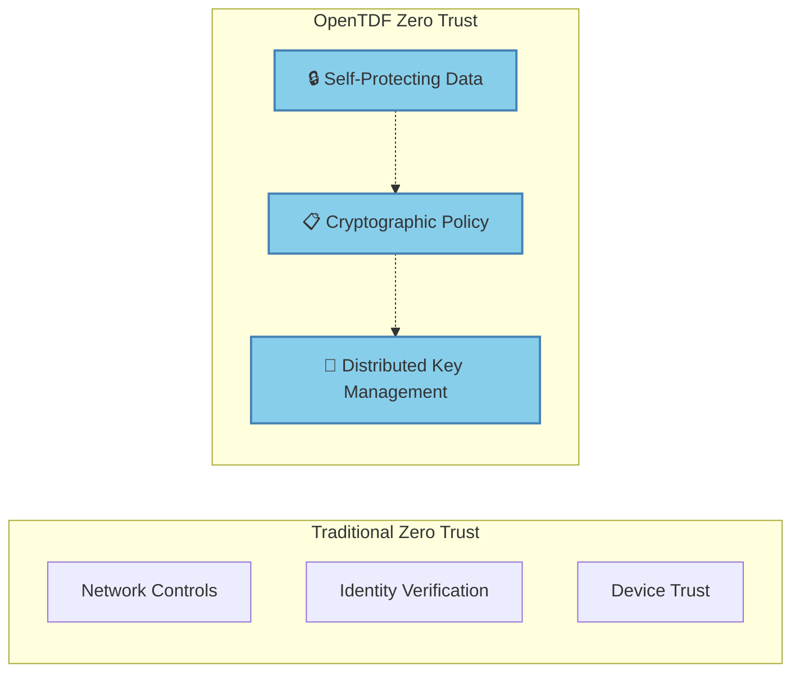
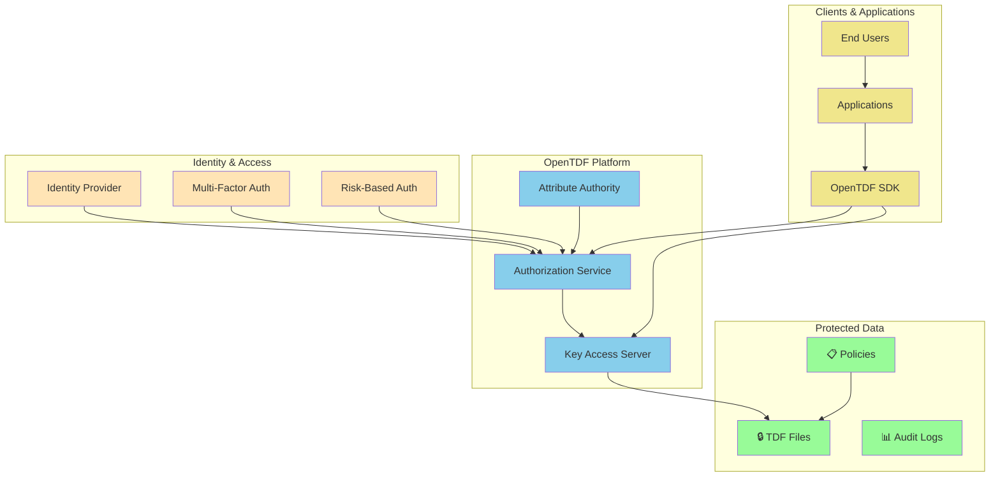

# Zero-Trust Architecture and OpenTDF

Zero Trust represents a fundamental shift from traditional "trust but verify" security models to "never trust, always verify." OpenTDF is specifically designed to implement the data protection pillars of Zero Trust architecture, ensuring that data remains secure regardless of where it travels or who attempts to access it.

## Zero Trust Principles

Zero Trust architecture is built on several core principles:

### 1. **Never Trust, Always Verify**
Every access request must be authenticated, authorized, and encrypted, regardless of:
- User location (inside or outside the network)
- Device being used
- Previous access history
- Network security posture

### 2. **Assume Breach**
Operate under the assumption that:
- The network perimeter is already compromised
- Insider threats exist
- Any system could be breached at any time
- Traditional network controls are insufficient

### 3. **Least Privilege Access**
Grant users and applications:
- Minimum access necessary to perform their job
- Time-limited access when possible
- Context-aware permissions based on risk assessment
- Continuous monitoring and validation

## How OpenTDF Enables Zero Trust

OpenTDF implements Zero Trust specifically for data protection through several mechanisms:

### **Cryptographic Policy Binding**

Traditional security relies on network controls that can be bypassed. OpenTDF cryptographically binds access policies to data objects:



### **Continuous Authorization**

Unlike traditional access controls that grant broad permissions, OpenTDF enforces authorization on every data access:

- **Real-time policy evaluation** for each access attempt
- **Dynamic attribute checking** based on current context
- **Immediate policy updates** without re-encrypting data
- **Granular permissions** down to individual data objects

### **Context-Aware Access Control**

OpenTDF policies can incorporate Zero Trust contextual factors:

```yaml
# Example TDF Policy with Zero Trust Attributes
policy:
  attributes:
    - "classification:confidential"
    - "project:alpha"
  rules:
    - grant_if:
        - user_role: "project_member" 
        - device_compliance: "managed"
        - location: "approved_countries"
        - time: "business_hours"
    - deny_if:
        - risk_score: ">75"
        - device_jailbroken: true
```

### **Zero Trust Data Mobility**

Traditional Zero Trust often assumes data stays within controlled environments. OpenTDF extends Zero Trust protection to data wherever it goes:

- **External sharing**: Partners and vendors receive protected data, not raw files
- **Cloud migration**: Data protection independent of infrastructure
- **Mobile access**: Consistent security across all devices and locations
- **Offline scenarios**: Protection even when disconnected from central systems

## Zero Trust + OpenTDF Architecture

A complete Zero Trust implementation with OpenTDF typically includes:



## Real-World Zero Trust Scenarios

### **Remote Work Security**

**Challenge**: Employees access sensitive data from unmanaged devices and networks.

**OpenTDF Solution**:
- Data protected with TDF regardless of access location
- Policies enforce device compliance requirements
- VPN not required - data is inherently protected
- Real-time policy updates for changing threat landscape

### **Third-Party Collaboration**

**Challenge**: Sharing sensitive data with partners while maintaining control.

**OpenTDF Solution**:
- Partners receive TDF files, not raw data
- Access automatically expires after project completion
- Audit trail shows exactly how partners used the data
- Revocation possible even after data has been shared

### **Cloud Migration**

**Challenge**: Maintaining security posture when moving to cloud providers.

**OpenTDF Solution**:
- Data protection independent of cloud provider security
- Encryption keys managed separately from data storage
- Consistent policy enforcement across multi-cloud environments
- No vendor lock-in for security controls

## Benefits of OpenTDF in Zero Trust

1. **Data-Centric Protection**: Security travels with data, not just systems
2. **Reduced Attack Surface**: Encrypted data useless without proper authorization
3. **Simplified Compliance**: Built-in audit trails and policy enforcement
4. **Operational Flexibility**: Share data safely without complex infrastructure
5. **Future-Proof Security**: Standards-based approach adaptable to new threats

## Implementation Considerations

When implementing OpenTDF as part of Zero Trust strategy:

### **Start with High-Value Data**
- Identify most sensitive data assets
- Implement TDF protection for critical documents first
- Expand coverage based on risk assessment

### **Integrate with Existing Identity Systems**
- Leverage current identity providers and attribute sources
- Align TDF policies with existing role-based access controls
- Ensure consistent user experience across systems

### **Plan for Policy Management**
- Establish clear governance for TDF policy creation
- Define approval workflows for policy changes
- Implement regular policy reviews and updates

## Next Steps

- Learn about [traditional vs. data-centric security approaches](traditional-vs-data-centric)
- Explore [real-world use cases](use-cases) for OpenTDF in Zero Trust environments
- Understand the [platform architecture](/explanation/platform-architecture) that enables these capabilities
- Try implementing Zero Trust data protection in our [tutorial](/tutorials/your-first-tdf)