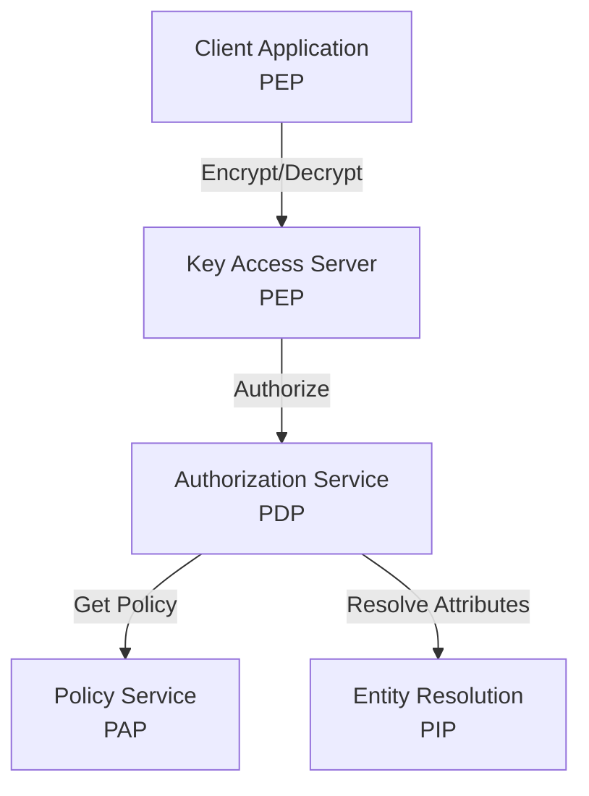
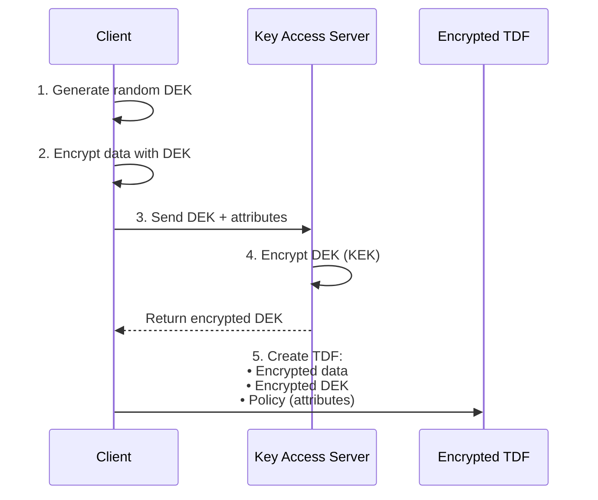
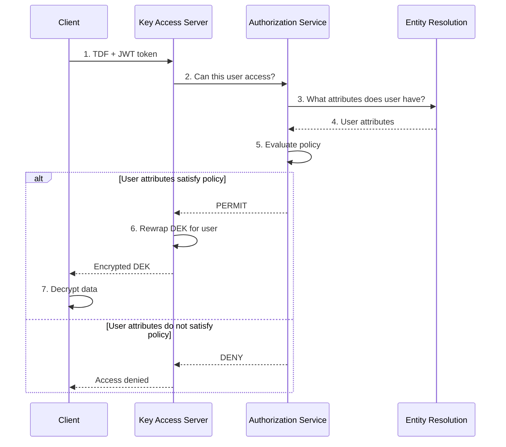

import Cards from "@site/src/components/Cards";

# Understanding OpenTDF

## What is OpenTDF?

OpenTDF is an **open-source platform** for implementing **data-centric security** using **zero-trust principles**. It enables organizations to cryptographically bind access control policies directly to data, ensuring persistent protection regardless of where data travels or is stored.

### Project Mission and Vision

**Mission**: Make data-centric security accessible to every organization through open-source tools and standards.

**Vision**: A world where sensitive data protects itself—traveling securely across organizations, clouds, and borders while maintaining fine-grained access control.

### Core Value Proposition

- **Protect data, not just perimeters**: Policies travel with encrypted data
- **Enforce anywhere**: Authorization decisions made at access time, not just at network boundaries
- **Fine-grained control**: Attribute-based policies enable nuanced access rules
- **Standards-based**: Built on Trusted Data Format (TDF) specifications
- **Open source**: Apache 2.0 licensed, community-driven development

### Who Should Use OpenTDF?

OpenTDF is designed for:

- **Enterprise developers** building data protection into applications
- **Government agencies** sharing classified or sensitive information
- **Healthcare organizations** protecting patient data across partners
- **Financial institutions** securing customer data and transactions
- **SaaS providers** offering data protection to customers
- **Any organization** needing persistent, fine-grained data access control

---

## The Trusted Data Format (TDF)

At the heart of OpenTDF is the **Trusted Data Format**—a specification for cryptographically binding access policies to encrypted data.

### What is TDF?

TDF is a container format that wraps encrypted data with:

- **Encrypted payload**: The actual data, encrypted with a symmetric key
- **Policy**: Access control rules defined as attribute requirements
- **Key Access Objects (KAOs)**: Encrypted keys and metadata for policy enforcement
- **Manifest**: Structure describing the TDF contents

### Why Data-Centric Security Matters

Traditional security models protect the perimeter (firewalls, VPNs, access controls at the gate). Once data crosses the perimeter, protection is often lost.

**Data-centric security** protects the data itself:

- **Encrypt once, enforce everywhere**: Data stays encrypted until authorized access
- **Persistent protection**: Policies remain bound to data through its lifecycle
- **Dynamic policies**: Change access rules without re-encrypting data
- **Granular control**: Different policies for different data elements

### Key Capabilities

**1. Attribute-Based Access Control (ABAC)**

Define policies using attributes (user properties, data classifications, environmental context):

```
Grant access IF:
  User has "department=engineering" AND
  User has "clearance=confidential" AND
  Access time is "business_hours"
```

**2. Split Key Architecture**

Separate data encryption from policy enforcement:

- **Data Encryption Key (DEK)**: Encrypts the actual data
- **Key Encryption Key (KEK)**: Provided by Key Access Server only if policy permits
- Authorization decision controls key release, not the encrypted data

**3. Cryptographic Policy Binding**

Policies are cryptographically bound to data—tamper-evident and tamper-resistant.

---

## Foundational Services

OpenTDF implements the NIST ABAC model through four core microservices that work together to enforce policies.



### Policy Service (PAP - Policy Administration Point)

**Purpose**: Manage attribute definitions, namespaces, values, and subject mappings.

**Responsibilities**:
- Define attribute namespaces and hierarchies
- Create attributes with rules (ANY_OF, ALL_OF, HIERARCHY)
- Map subjects to attributes via condition sets
- Provide policy query API

**Learn More**: [Policy Service API Reference](../reference/OpenAPI-clients/policy/policy/)

---

### Authorization Service (PDP - Policy Decision Point)

**Purpose**: Make access decisions by evaluating policies against subject attributes.

**Responsibilities**:
- Receive authorization requests (subject + resource + action)
- Resolve subject attributes via Entity Resolution
- Evaluate policies (match subject attributes to resource requirements)
- Return PERMIT or DENY decision

**Learn More**: [Authorization Service API Reference](../reference/OpenAPI-clients/authorization/v2/authorization-v-2/)

---

### Entity Resolution Service (PIP - Policy Information Point)

**Purpose**: Resolve subject attributes from external identity and directory services.

**Responsibilities**:
- Query LDAP, SCIM, databases, or APIs for user attributes
- Apply subject mappings and condition sets
- Cache resolution results for performance
- Return attribute list for authorization evaluation

**Learn More**: [Entity Service Integration Guide](../how-to/integration-patterns/entity-service-integration.mdx)

---

### Key Access Server (PEP - Policy Enforcement Point)

**Purpose**: Enforce authorization decisions by controlling access to encryption keys.

**Responsibilities**:
- Receive key access requests from clients decrypting TDFs
- Call Authorization Service for access decision
- If authorized: rewrap and release data encryption key
- If denied: refuse key access
- Log all access attempts for audit

**Learn More**: [Key Access Server API Reference](../reference/OpenAPI-clients/kas/kas/)

---

### How They Work Together

**Encryption Flow**:



**Decryption Flow**:



---

## Sample Implementations

OpenTDF provides multiple ways to integrate data protection:

### Language SDKs

Official SDKs for multiple languages:

| Language | Repository | Status |
|----------|------------|--------|
| **Java** | [opentdf/java-sdk](https://github.com/opentdf/java-sdk) | ✅ Stable |
| **Go** | [opentdf/platform/sdk](https://github.com/opentdf/platform/tree/main/sdk) | ✅ Stable |
| **Python** | [opentdf/client-python](https://github.com/opentdf/client-python) | ✅ Stable |
| **JavaScript/TypeScript** | [opentdf/client-web](https://github.com/opentdf/client-web) | ✅ Stable |

**Use SDKs to**:
- Encrypt and decrypt data with policies
- Manage policies (create attributes, subject mappings)
- Make authorization decisions
- Integrate OpenTDF into applications

---

### CLI Tools

**otdfctl**: Command-line tool for managing OpenTDF

```bash
# Create namespace
otdfctl policy attributes namespaces create --name example.com/attr/department

# Create attribute
otdfctl policy attributes create \
  --namespace example.com/attr/department \
  --name department \
  --rule ANY_OF \
  --values engineering,sales,hr

# Encrypt file
otdfctl encrypt --file sensitive.txt --attributes example.com/attr/department/value/engineering

# Decrypt file
otdfctl decrypt --file sensitive.txt.tdf
```

**Learn More**: [otdfctl Documentation](/explanation/platform-architecture/components/cli/)

---

### Reference Implementations

Explore example applications:

- **[Java Examples](https://github.com/opentdf/java-sdk/tree/main/examples)**: Complete Java application samples
- **[Web Demo](https://github.com/opentdf/web-demo)**: Interactive browser-based demo
- **[Code Samples](../reference/code-samples/)**: Language-specific examples

---

### Community Examples

Community-contributed integrations and examples:

- Plugin for popular frameworks
- Integration with cloud services
- Custom PEP implementations

**Contribute**: Share your OpenTDF integration in the [community forum](https://github.com/opentdf/community)!

---

This section explains the fundamental concepts that make OpenTDF unique and powerful for protecting sensitive data throughout its lifecycle.

## Core Concepts

<Cards
  height={280}
  columns={2}
  items={[
    {
      name: "Data-Centric Security",
      description: "Learn how OpenTDF shifts security from perimeter-based to data-focused protection, where policies travel with the data wherever it goes.",
      url: "/explanation/data-centric-security",
    },
    {
      name: "Trusted Data Format (TDF)",
      description: "Understand how TDF cryptographically binds access control policies to data objects, creating self-protecting data.",
      url: "/explanation/trusted-data-format",
    },
    {
      name: "Attribute-Based Access Control (ABAC)",
      description: "Explore how ABAC enables fine-grained, flexible access control using attributes, policies, and entitlements.",
      url: "/explanation/abac-and-policy",
    },
    {
      name: "Platform Architecture",
      description: "Discover how OpenTDF's four core services work together to implement the NIST ABAC model for data protection.",
      url: "/explanation/platform-architecture",
    },
    {
      name: "TDF History and Standards",
      description: "Learn about the evolution of TDF formats: BASE-TDF, IC-TDF, ZTDF, and how OpenTDF fits into the ecosystem.",
      url: "/explanation/trusted-data-format/history-and-standards",
    },
    {
      name: "Integration Patterns",
      description: "Discover how to integrate OpenTDF with your applications, identity providers, and directory services.",
      url: "/how-to/integration-patterns",
    },
  ]}
/>

## Why OpenTDF Matters

In traditional security models, once data leaves a secure perimeter, control is often lost. OpenTDF changes this by:

- **Binding policy to data**: Access controls are cryptographically attached to data objects
- **Enabling zero-trust data**: Data remains protected regardless of where it travels
- **Providing granular control**: Fine-tuned access decisions based on context and attributes
- **Maintaining compliance**: Comprehensive audit trails and policy enforcement

## Next Steps

### For New Users

1. **Quick Start**: [Your First TDF Tutorial](../tutorials/your-first-tdf/) - Get hands-on in 30 minutes
2. **Deep Dive**: [ABAC and Policy](../explanation/abac-and-policy/) - Understand the policy model
3. **TDF Details**: [Trusted Data Format](../explanation/trusted-data-format/) - Learn about TDF structure and cryptography
4. **Architecture**: [Platform Architecture](../explanation/platform-architecture/) - See how services work together

### For Developers

1. **Implement a PEP**: [PEP Implementation Guide](../how-to/integration-patterns/implementing-a-pep.mdx)
2. **Browse Code**: [Code Samples](../reference/code-samples/) - Working examples in multiple languages
3. **Choose Your Path**: [Learning Paths](../learning-paths) - Guided journey by role

### For Architects

1. **Design Policies**: [ABAC and Policy](../explanation/abac-and-policy/) - Policy design best practices
2. **Standards Landscape**: [TDF History and Standards](../explanation/trusted-data-format/history-and-standards) - Choose the right format
3. **Integration Patterns**: [Integration Patterns](../how-to/integration-patterns/) - Common scenarios and architectures

### For Operators

1. **Deploy**: [Your First TDF Tutorial](../tutorials/your-first-tdf/) - Docker Compose setup
2. **Configure**: [Service Configuration References](../reference/OpenAPI-clients/) - Production settings
3. **Integrate**: [Identity Provider Integration](../how-to/integration-patterns/identity-provider-integration.mdx) - Connect your IdP

---

## Learn More

- **[Learning Paths](../learning-paths)**: Curated paths by role (Developer, Architect, Operator)
- **[Documentation Hub](../documentation)**: Browse all documentation
- **[Community Forum](https://github.com/opentdf/community)**: Ask questions and share experiences