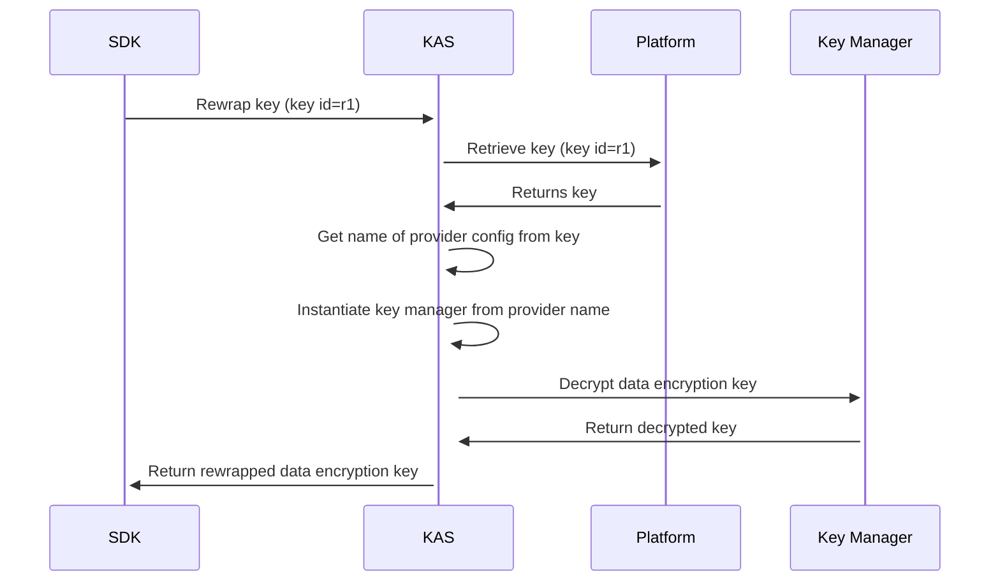

# Key Managers

With the new key architecture OpenTDF has added the flexibility for an organization to store keys outside of a key access server or the platform. For example, if you want to use OpenTDF and your encryption keys are stored within AWS KMS, this is now totally possible through **key managers**.

## What is a key manager?

A key manager is essentially a client that is used for either performing cryptographic operations or orchestrating the necessary procedures for retrieving the decrypted data encryption key, which can be used for decrypting the TDF. An example of a key manager can be found in the [basic manager](https://github.com/opentdf/platform/blob/main/service/internal/security/basic_manager.go). The basic manager is the default manager, which expects the private key to be stored within the platform and the symmetric key that wraps the private key to be stored within KAS.

## How do I register a key manager?

If you have written your own key manager, you can register it with KAS by providing its factory method with a [server option](https://github.com/opentdf/platform/blob/main/service/pkg/server/options.go#L131) (.so), during server startup. By providing a way to instantiate an object of your key manager type we will then use it when necessary. You will also need to configure KAS to use the new key manager. This is done through provider configuration file (.cfg).

### Provider configurations

Provider configurations are a way of entangling a key to a specific manager. The [key management proto](https://github.com/opentdf/platform/blob/main/service/policy/keymanagement/key_management.proto#L76) provides specifics on what RPCs are available as well as what is expected within each call. One of the most important parts of the provider configuration is the **name** field. The **name** field is what KAS will look for when trying to instantiate a specific manager. If no manager with that name is found, KAS will attempt to use the default manager.

The basic flow is as follows:
:::note
In the below example, r1 is just an example key id.
Key managers are a part of KAS, and not external services
although they can reach out to external services to perform
needed operations.
:::

When registering your provider configuration and your key manager the name must match. For example, the [basic manager name](https://github.com/opentdf/platform/blob/main/service/internal/security/basic_manager.go#L23) is **opentdf.io/basic**. For example, if you create a manager with name **opentdf.io/aws**, you would need to create a provider configuration with the same name and tie it to a key when creating the key. In addition, when registering the manager you need to pass in the same name as what the provider configuration expects.

:::important
If private keys are meant to be stored within the platform database,
there should be no provider configuration added to the key. Since
an empty provider configuration is assumed to be tied to the
default manager.
:::

:::important
Provider configuration names must be unique.
You cannot delete provider configurations that are tied to keys.
:::

## Helpful links

- [key manager interface](https://github.com/opentdf/platform/blob/main/service/trust/key_manager.go#L33).
- [NamedKeyManagerFactory](https://github.com/opentdf/platform/blob/main/service/trust/key_manager.go#L62)
- [KeyManagerFactory](https://github.com/opentdf/platform/blob/main/service/trust/delegating_key_service.go#L21)
