# Cryptographic Binding in TDF

Cryptographic binding is the core innovation that makes TDF files self-protecting. Unlike traditional approaches where access controls exist separately from data, TDF cryptographically links policies directly to encrypted data, ensuring that security travels wherever the data goes.

## What is Cryptographic Binding?

Cryptographic binding means that access policies are mathematically tied to encrypted data through cryptographic mechanisms. The policy cannot be separated from the data without breaking the encryption, and the data cannot be decrypted without satisfying the policy requirements.

```mermaid
graph TD
    subgraph "Traditional Approach"
        DATA1[📄 Plaintext Data]
        POLICY1[📋 Separate Policy]
        STORAGE1[💾 File System ACLs]
        
        DATA1 -.-> STORAGE1
        POLICY1 -.-> STORAGE1
    end
    
    subgraph "TDF Cryptographic Binding"
        DATA2[🔒 Encrypted Payload]
        POLICY2[📋 Embedded Policy]
        MANIFEST[📜 Signed Manifest]
        
        POLICY2 --> MANIFEST
        DATA2 --> MANIFEST
        MANIFEST -.-> TDF[🔐 TDF Container]
    end
    
    classDef traditional fill:#FFE4B5,stroke:#DEB887
    classDef tdf fill:#87CEEB,stroke:#4682B4,stroke-width:2px
    
    class DATA1,POLICY1,STORAGE1 traditional
    class DATA2,POLICY2,MANIFEST,TDF tdf
```



## How Cryptographic Binding Works

### 1. **Policy Integration During Encryption**

When a TDF file is created, the access policy becomes an integral part of the encryption process:


### 2. **Key Splitting and Policy Enforcement**

TDF uses a split-key approach where the data encryption key (DEK) is protected by both cryptographic wrapping and policy enforcement:

```yaml
# TDF Manifest Structure (simplified)
manifest:
  encryptionInformation:
    type: "split"
    keyAccess:
      - type: "wrapped"
        url: "https://kas.example.com"
        protocol: "kas"
        wrappedKey: "encrypted_dek_material"
  policy:
    uuid: "policy-12345"
    body:
      dataAttributes:
        - "https://example.com/attr/classification/secret"
      dissem:
        - "user@example.com"
```

The wrapped key can only be unwrapped by the Key Access Server (KAS) after policy validation.

### 3. **Cryptographic Verification Chain**

Every TDF access involves multiple cryptographic verifications:

```mermaid
graph TD
    USER[👤 User Request] --> TDF[🔐 TDF File]
    TDF --> VERIFY1{Verify TDF Integrity}
    VERIFY1 --> POLICY[📋 Extract Policy]
    POLICY --> KAS[🔑 Key Access Server]
    KAS --> VERIFY2{Verify User Claims}
    VERIFY2 --> AUTHZ[⚖️ Authorization Decision]
    AUTHZ --> VERIFY3{Policy Satisfied?}
    VERIFY3 -->|Yes| UNWRAP[🔓 Unwrap DEK]
    VERIFY3 -->|No| DENY[❌ Access Denied]
    UNWRAP --> DECRYPT[🔍 Decrypt Data]
    
    classDef verify fill:#FFE4B5,stroke:#DAA520
    classDef success fill:#98FB98,stroke:#228B22
    classDef failure fill:#FFB6C1,stroke:#DC143C
    
    class VERIFY1,VERIFY2,VERIFY3 verify
    class UNWRAP,DECRYPT success
    class DENY failure
```



## Types of Cryptographic Binding

### **Strong Binding (Default)**
- Policy embedded directly in TDF manifest
- Signed manifest ensures integrity
- Cannot modify policy without invalidating TDF
- Suitable for most security-sensitive use cases

### **Remote Policy Binding**
- Policy UUID embedded in TDF, actual policy stored remotely
- Allows for policy updates without re-encryption
- Requires secure policy server infrastructure
- Used for dynamic policy scenarios

### **Hybrid Binding**
- Core policy embedded, with references to external policy extensions
- Balances security with flexibility
- Common for complex organizational policies

## Security Properties

### **Integrity Protection**

TDF manifest is cryptographically signed, ensuring:
- **Policy tampering detection**: Any modification to embedded policies is detected
- **Manifest authenticity**: Verification that TDF came from authorized source
- **Version control**: Prevents downgrade attacks on policy versions

```json
{
  "manifest": {
    "payload": {
      "type": "reference",
      "url": "payload.bin",
      "protocol": "zip",
      "isEncrypted": true
    },
    "encryptionInformation": {...},
    "policy": {...}
  },
  "signature": {
    "algorithm": "HS256",
    "keyAccess": {...},
    "sig": "cryptographic_signature_here"
  }
}
```

### **Replay Attack Prevention**

Each TDF contains unique cryptographic material:
- **Unique DEKs**: Each TDF encrypted with unique data encryption key
- **Nonce values**: Prevent cryptographic replay attacks
- **Temporal binding**: Policies can include time-based restrictions

### **Forward Security**

Key management designed for forward security:
- **Key rotation**: Regular rotation of key encryption keys (KEKs)
- **Revocation support**: Ability to invalidate specific TDF access
- **Perfect forward secrecy**: Compromise of long-term keys doesn't affect past sessions

## Implementation Details

### **Key Wrapping Process**

1. **Generate DEK**: Create unique symmetric key for data encryption
2. **Encrypt data**: Use DEK to encrypt actual payload
3. **Wrap DEK**: Encrypt DEK with KAS public key
4. **Policy association**: Link wrapped DEK to specific policy requirements
5. **Manifest creation**: Embed all information in signed manifest

### **Policy Evaluation Integration**

The cryptographic binding ensures policy evaluation is mandatory:

```python
# Pseudocode for TDF decryption
def decrypt_tdf(tdf_file, user_context):
    manifest = extract_and_verify_manifest(tdf_file)
    
    # Cryptographic binding ensures this step cannot be bypassed
    policy = manifest.policy
    key_access_info = manifest.encryption_info.key_access
    
    # Policy evaluation required for key unwrapping
    decision = evaluate_policy(policy, user_context)
    if not decision.permit:
        raise AccessDeniedException(decision.reason)
    
    # Only after policy satisfaction can key be unwrapped
    dek = request_key_unwrap(key_access_info, user_context, decision)
    
    # Finally decrypt data
    return decrypt_payload(tdf_file.payload, dek)
```

## Advanced Binding Techniques

### **Multi-Authority Binding**

For high-security scenarios, TDF can require approval from multiple authorities:

```yaml
keyAccess:
  - type: "wrapped"
    url: "https://kas1.example.com"  # Authority 1
    policy: "classification_policy"
  - type: "wrapped" 
    url: "https://kas2.example.com"  # Authority 2
    policy: "need_to_know_policy"
    
# Requires BOTH authorities to approve access
splitPolicy: "all_required"
```

### **Hierarchical Policy Binding**

Policies can reference parent policies for organizational hierarchies:

```yaml
policy:
  uuid: "project_alpha_secret"
  inherits: 
    - "organizational_base_policy"
    - "project_alpha_policy" 
  overrides:
    - attribute: "classification"
      value: "secret"
```

### **Conditional Cryptographic Binding**

Policies can specify different cryptographic requirements based on context:

```yaml
encryptionPolicy:
  default:
    algorithm: "AES-256-GCM"
    keySize: 256
  highSecurity:
    when: 
      - classification: "top_secret"
    algorithm: "AES-256-GCM"  
    keySize: 256
    additionalProtection: "HSM_required"
```

## Benefits Over Traditional Approaches

### **Tamper Evidence**
- Any modification to policy or binding detected through signature verification
- Cryptographic proof of policy violations
- Immutable audit trail of access decisions

### **Zero Trust Data**
- No reliance on network perimeter security
- Data protection independent of storage location
- Works equally well in untrusted environments

### **Scalable Policy Enforcement**
- No need for complex access control infrastructure at every storage location
- Policy decisions centralized but enforcement distributed
- Consistent policy application across heterogeneous environments

## Limitations and Considerations

### **Key Management Complexity**
- Requires robust key management infrastructure
- Key escrow and recovery procedures needed
- Operational complexity higher than simple encryption

### **Performance Considerations**
- Additional cryptographic operations during access
- Network calls to policy decision points
- Caching strategies needed for acceptable performance

### **Policy Update Challenges**
- Strong binding means policy changes may require re-encryption
- Remote policy binding trades security for flexibility
- Version control and migration strategies essential

## Next Steps

- Understand the differences between [TDF and NanoTDF formats](tdf-vs-nanotdf)
- Learn about the complete [TDF lifecycle](tdf-lifecycle) from creation to consumption
- Explore [platform architecture](/explanation/platform-architecture) supporting cryptographic binding
- Try creating cryptographically bound TDF files in our [hands-on tutorial](/tutorials/your-first-tdf)