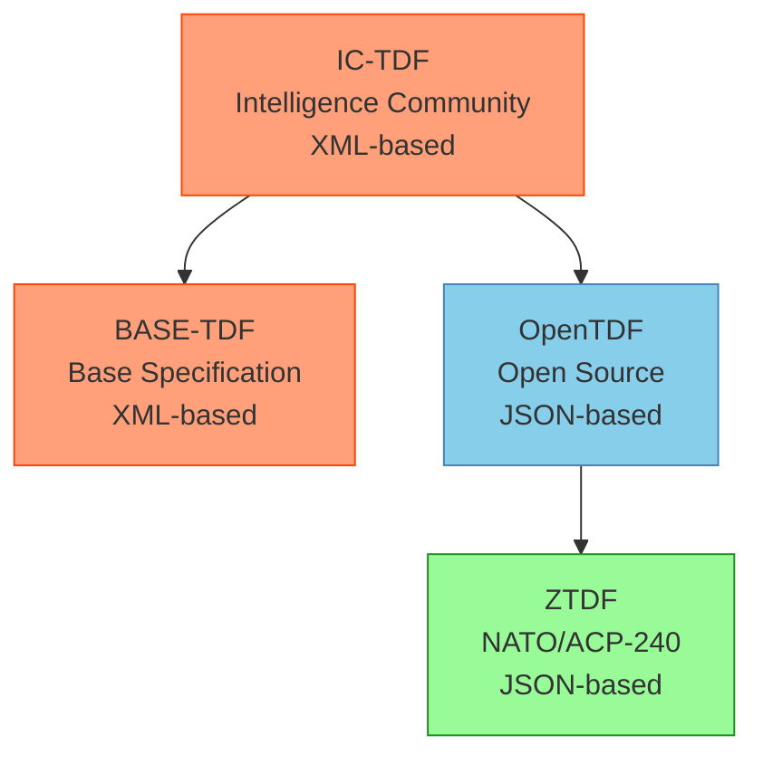
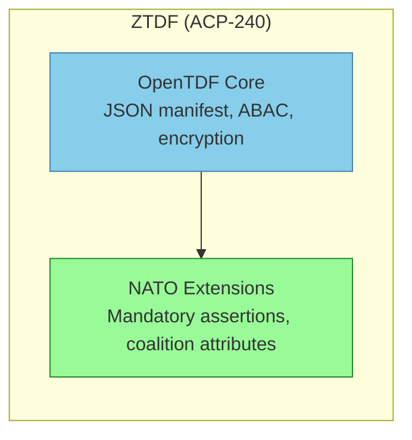
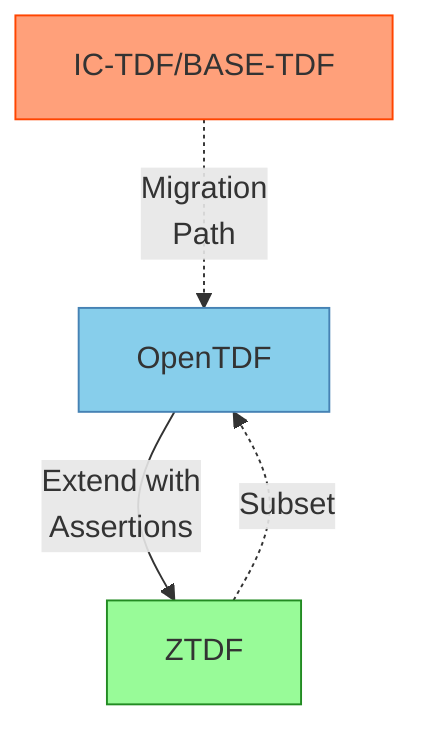
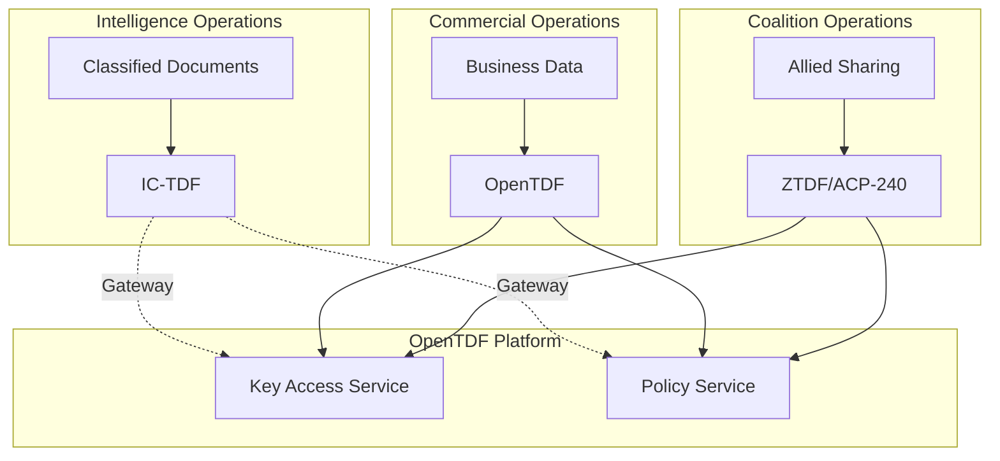

# TDF Format Variants and Standards

OpenTDF is part of a broader ecosystem of Trusted Data Format specifications developed by different organizations for various security contexts. Understanding how these formats relate helps organizations choose the right format and ensure interoperability across different security domains.

## The TDF Family Tree

## Format Overview

| **Format** | **Organization** | **Encoding** | **Primary Use Case** | **Status** |
|------------|------------------|--------------|---------------------|------------|
| **IC-TDF** | US Intelligence Community | XML | Classified information sharing | Legacy/Active |
| **BASE-TDF** | US Intelligence Community | XML | Base specification for IC-TDF | Active |
| **OpenTDF** | Open Source Community | JSON | Modern data-centric security | Active |
| **ZTDF** | NATO (ACP-240) | JSON | Coalition/Allied information sharing | Active |

## IC-TDF: Intelligence Community Trusted Data Format

### Overview

IC-TDF is the **original Trusted Data Format specification** developed by the U.S. Intelligence Community (IC). It established the foundational concepts of binding access control policies cryptographically to encrypted data.

### Key Characteristics

- **XML-based manifest structure**: Uses XML encoding for policy and metadata
- **IC-specific attributes**: Designed for intelligence community classification and dissemination controls
- **Mature standard**: Battle-tested in classified environments since its introduction
- **Federated key management**: Supports multi-agency key access controls

### Typical Use Cases

- Classified document protection across IC agencies
- Intelligence sharing between allied intelligence services
- Compartmented information handling (SCI, SAP, etc.)
- Cross-domain solution (CDS) implementations

### Relationship to OpenTDF

OpenTDF **modernizes the core concepts** established by IC-TDF:

- Replaces XML with **JSON** for better web technology integration
- Maintains cryptographic binding principles
- Preserves ABAC (Attribute-Based Access Control) model
- Adds support for modern cloud-native architectures

Organizations migrating from IC-TDF to OpenTDF benefit from:
- Easier integration with modern applications
- Better tooling and developer experience
- Maintained security principles and trust model
- Potential interoperability bridges (contact support@opentdf.io for details)

## BASE-TDF: Base Specification

### Overview

**BASE-TDF** (Trusted Data Format - Base) provides detailed implementation guidance for using XML to encode TDF data within the Intelligence Community. It serves as the foundational specification that IC-TDF implementations build upon.

### Key Characteristics

- **XML Data Encoding Specification**: Defines precise XML schemas and encoding rules
- **Reference implementation guidance**: Provides detailed technical requirements
- **Standards compliance**: Aligns with IC data standards and security requirements
- **No proprietary technology**: Freely available specification with no patent restrictions

### Maintained By

The Office of the Director of National Intelligence (ODNI) maintains BASE-TDF as part of the IC Technical Specifications.

### Relationship to OpenTDF

BASE-TDF and OpenTDF serve similar roles in different communities:

| **Aspect** | **BASE-TDF** | **OpenTDF** |
|------------|--------------|-------------|
| **Community** | Intelligence Community | Open Source / Commercial |
| **Encoding** | XML | JSON |
| **Governance** | ODNI | OpenTDF Community |
| **Access** | IC Technical Specifications | Public GitHub repository |
| **Focus** | IC compliance requirements | Modern interoperability |

## ZTDF: Zero Trust Data Format (ACP-240)

### Overview

**ZTDF** (Zero Trust Data Format) is a NATO-standardized format defined by **Allied Communication Publication (ACP) 240**. It builds directly upon the OpenTDF specification while adding specific requirements for NATO and Five Eyes (FVEY) coalition information sharing.

### Key Characteristics

- **Based on OpenTDF**: Uses JSON-based OpenTDF as its foundation
- **Mandatory cryptographic assertions**: Requires additional cryptographic bindings for NATO use cases
- **Coalition focus**: Designed for secure sharing across allied nations
- **Zero Trust principles**: Aligns with NATO's Zero Trust architecture requirements
- **Standardized by CCEB**: Developed under Combined Communications-Electronics Board sponsorship

### ACP-240 Requirements

ACP-240 extends OpenTDF by mandating:

1. **Enhanced cryptographic assertions**: Additional binding requirements for policy integrity
2. **NATO attribute schema**: Standardized attribute definitions for coalition use
3. **Interoperability requirements**: Specific implementation requirements for allied systems
4. **Audit and logging standards**: Enhanced audit trail requirements for coalition environments

### Adoption Status

- **Adopted by NATO**: Official NATO standard for data-centric security
- **U.S. Joint Chiefs of Staff**: Being adopted for coalition operations
- **Allied nations**: Active deployment across Five Eyes and NATO partners
- **Validated in operations**: Proven in exercises like Operation HIGHMAST

### Relationship to OpenTDF

ZTDF is a **superset of OpenTDF**:

**Key implications**:
- **Forward compatible**: OpenTDF implementations can be extended to support ZTDF
- **Subset compatibility**: Not all OpenTDF files are ZTDF-compliant (missing mandatory assertions)
- **Implementation pathway**: Organizations can start with OpenTDF and add ZTDF requirements as needed

## Format Selection Guide

### Choose IC-TDF / BASE-TDF When:

- Working within the U.S. Intelligence Community
- Handling classified information requiring IC-specific controls
- Integrating with existing IC-TDF infrastructure
- Subject to IC compliance requirements (ICD 503, etc.)

### Choose OpenTDF When:

- Building modern, cloud-native applications
- Need open source, community-driven standard
- Want flexibility without military/IC-specific requirements
- Require broad ecosystem of SDKs and tools
- Commercial or open source project requirements

### Choose ZTDF (ACP-240) When:

- Sharing information across NATO allies
- Five Eyes coalition collaboration requirements
- Subject to ACP-240 compliance mandates
- Participating in coalition operations
- Need NATO-validated data security standard

## Interoperability Considerations

### Cross-Format Compatibility

### Migration Strategies

#### IC-TDF → OpenTDF
- **Policy translation**: Convert XML policies to JSON ABAC format
- **Attribute mapping**: Map IC attributes to OpenTDF attribute schema
- **Re-encryption**: Payload must be re-encrypted in new format
- **Validation**: Ensure policy equivalence after migration

**Considerations**: Contact support@opentdf.io for interoperability guidance with legacy IC-TDF formats.

#### OpenTDF → ZTDF
- **Assertion addition**: Add mandatory NATO cryptographic assertions
- **Attribute alignment**: Ensure attributes conform to ACP-240 schema
- **Validation**: Verify compliance with ZTDF specification
- **Testing**: Validate with ZTDF-compliant implementations

**Implementation**: OpenTDF provides a foundation; ZTDF compliance requires additional implementation work to meet ACP-240 requirements.

### Hybrid Deployments

Many organizations operate in multiple security domains:

## Standards Bodies and Governance

| **Format** | **Governing Body** | **Specification Access** |
|------------|-------------------|-------------------------|
| **IC-TDF** | ODNI / IC CIO | [DNI Technical Specifications](https://www.dni.gov/index.php/who-we-are/organizations/ic-cio/ic-technical-specifications/trusted-data-format) |
| **BASE-TDF** | ODNI / IC CIO | [DNI Technical Specifications](https://www.dni.gov/index.php/who-we-are/organizations/ic-cio/ic-technical-specifications/trusted-data-format-base) |
| **OpenTDF** | OpenTDF Community | [GitHub Repository](https://github.com/opentdf/spec) |
| **ZTDF (ACP-240)** | NATO / CCEB | Contact NATO or national defense channels |

## Implementation Support

### OpenTDF Ecosystem

OpenTDF provides comprehensive implementation support:

- **Open specification**: Publicly available on GitHub
- **Reference implementations**: Platform and SDKs (Java, JavaScript, Go)
- **Community support**: Active open source community
- **Commercial support**: Available from ecosystem partners

### ZTDF / ACP-240 Implementation

Organizations implementing ZTDF/ACP-240 should:

1. **Start with OpenTDF**: Use OpenTDF as the foundation
2. **Understand ACP-240 requirements**: Review NATO specification for mandatory assertions
3. **Add ZTDF extensions**: Implement required cryptographic assertions
4. **Validate compliance**: Test against ZTDF validation tools
5. **Engage with coalition**: Coordinate with allied partners for interoperability

### IC-TDF Interoperability

Organizations needing IC-TDF interoperability:

- **Contact OpenTDF**: Email support@opentdf.io for guidance
- **Gateway solutions**: Explore format translation gateways
- **Attribute mapping**: Work with IC to map attribute schemas
- **Security review**: Ensure cross-domain security requirements are met

## Future Evolution

The TDF format family continues to evolve:

### Convergence Trends
- **JSON adoption**: Movement toward JSON-based formats (OpenTDF, ZTDF)
- **Modern cryptography**: Support for post-quantum cryptographic algorithms
- **Cloud-native features**: Enhanced support for cloud and edge environments
- **Streaming optimizations**: Improved formats for real-time data (NanoTDF)

### Emerging Standards
- **Post-quantum TDF**: Quantum-resistant cryptographic bindings
- **Confidential computing integration**: TEE and SGX support
- **AI/ML data protection**: Specialized features for ML model and training data protection

## Next Steps

- Learn about [OpenTDF's core concepts](index.md)
- Understand [TDF vs NanoTDF](tdf-vs-nanotdf.md) format differences
- Explore the [TDF lifecycle](tdf-lifecycle.md)
- Review the [OpenTDF specification](/reference/trusted-data-format/specifications/)
- Try [your first TDF](/tutorials/your-first-tdf) implementation

## Sources

- [DNI: Trusted Data Format](https://www.dni.gov/index.php/who-we-are/organizations/ic-cio/ic-technical-specifications/trusted-data-format)
- [DNI: Trusted Data Format - Base](https://www.dni.gov/index.php/who-we-are/organizations/ic-cio/ic-technical-specifications/trusted-data-format-base)
- [OpenTDF Specification](https://github.com/opentdf/spec)
- [Wikipedia: Trusted Data Format](https://en.wikipedia.org/wiki/Trusted_Data_Format)

For questions about format interoperability or ZTDF/ACP-240 compliance, contact [support@opentdf.io](mailto:support@opentdf.io).
