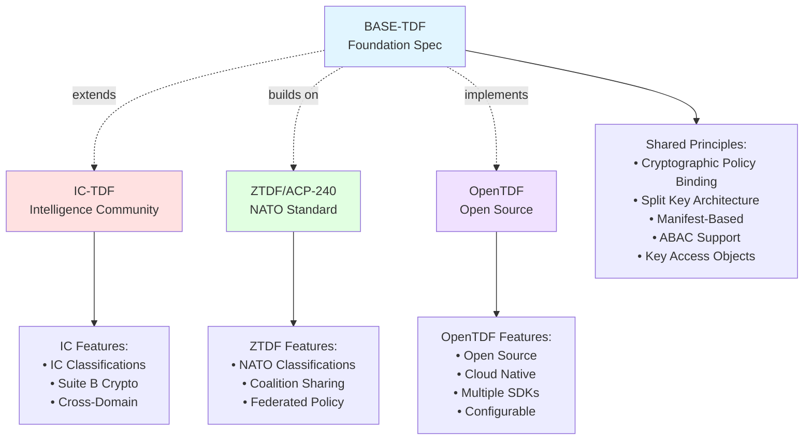

# TDF History and Standards Landscape

## Overview

The Trusted Data Format (TDF) is a family of specifications for protecting sensitive data through cryptographic binding of access policies to encrypted content. This page explores the evolution of TDF, the relationship between different TDF standards, and how OpenTDF fits into the broader ecosystem.

---

## Timeline of TDF Evolution

### Early Origins (2010s)

The concept of cryptographically binding policies to data emerged from the need for data-centric security—protecting data itself rather than just the perimeters around it. Traditional security models failed when data moved beyond organizational boundaries (cloud, partners, mobile devices).

Key insights driving TDF development:

- **Persistent Protection**: Encryption alone isn't enough; policies must travel with data
- **Dynamic Enforcement**: Access policies should be updatable without re-encrypting data
- **Zero Trust**: Data should be protected regardless of network location
- **Fine-Grained Control**: Policies should support attribute-based access control (ABAC)

### BASE-TDF: The Foundation

BASE-TDF (Baseline TDF) established the core specification for trusted data formats:

- **Policy Binding**: Cryptographically bind policies to encrypted data objects
- **Key Access Objects (KAOs)**: Embed key access policies within the encrypted container
- **Split Key Architecture**: Separate data encryption keys from policy enforcement
- **Manifest Structure**: Standardize TDF container format

BASE-TDF provided a vendor-neutral specification enabling interoperability across implementations.

### IC-TDF: Intelligence Community Variant

The U.S. Intelligence Community adapted TDF for classified information protection:

- **Enhanced Security Controls**: Additional cryptographic requirements
- **Classification Markings**: Support for security classification levels
- **Cross-Domain Solutions**: Enable secure information sharing across security domains
- **Audit and Compliance**: Enhanced logging and audit capabilities

IC-TDF extended BASE-TDF with government-specific requirements while maintaining core compatibility.

### ZTDF/ACP-240: Zero Trust Data Format

ZTDF (also known as ACP-240) represents NATO's standardization effort for data-centric security:

- **NATO Interoperability**: Enable secure data sharing across NATO members
- **Zero Trust Architecture**: Align with modern zero trust security principles
- **Standardization**: Formal NATO specification process
- **Coalition Operations**: Support multi-national information sharing

ZTDF builds on lessons learned from BASE-TDF and IC-TDF, with focus on international interoperability.

### OpenTDF: Open Source Implementation

OpenTDF is an open-source implementation of TDF principles:

- **Open Source**: Apache 2.0 licensed, community-driven
- **Modern Architecture**: Cloud-native, microservices-based
- **Extensible**: Plugin architecture for custom integrations
- **Standards-Based**: Implements core TDF specifications
- **Developer-Friendly**: SDKs for multiple languages, comprehensive APIs

OpenTDF aims to make data-centric security accessible to any organization.

---

## TDF Format Family

### Format Comparison

| Aspect | BASE-TDF | IC-TDF | ZTDF/ACP-240 | OpenTDF |
|--------|----------|---------|--------------|---------|
| **Scope** | Commercial, general use | U.S. Intelligence Community | NATO coalition | Open source implementation |
| **Governance** | Industry consortium | IC standards body | NATO | Open source community |
| **Classification Support** | Basic | Advanced (IC markings) | NATO classifications | Configurable |
| **Cryptography** | Standard algorithms | IC-approved algorithms | NATO-approved algorithms | Configurable |
| **Interoperability** | Baseline spec | Extends BASE-TDF | Extends BASE-TDF | Compatible with BASE-TDF |
| **Licensing** | Specification license | Government | NATO | Apache 2.0 |
| **Use Cases** | Enterprise data protection | Classified info sharing | Coalition operations | General data protection |
| **Maturity** | Established | Mature | Emerging | Active development |

### Format Capabilities Comparison

#### BASE-TDF Features

- ✅ Policy binding to encrypted data
- ✅ Key Access Objects (KAOs)
- ✅ Split key encryption
- ✅ Manifest structure
- ✅ ABAC support
- ❌ Advanced classification markings
- ❌ Cross-domain solutions
- ❌ Government-specific controls

#### IC-TDF Additional Features

- ✅ All BASE-TDF features
- ✅ IC classification markings
- ✅ Cross-domain guard integration
- ✅ Enhanced audit logging
- ✅ Sanitization controls
- ✅ IC-approved crypto algorithms
- ❌ NATO interoperability (not primary focus)

#### ZTDF/ACP-240 Additional Features

- ✅ BASE-TDF compatibility
- ✅ NATO classification scheme
- ✅ Multi-national interoperability
- ✅ Zero trust architecture alignment
- ✅ Coalition data sharing
- ✅ Federated policy management
- ⚠️ Emerging standard (under development)

#### OpenTDF Features

- ✅ BASE-TDF compatible
- ✅ Open source (Apache 2.0)
- ✅ Cloud-native architecture
- ✅ RESTful APIs
- ✅ Multiple SDK languages
- ✅ Plugin architecture
- ✅ Modern ABAC engine
- ✅ Configurable cryptography
- ⚠️ IC-TDF/ZTDF features can be configured but not built-in

---

## Relationship Between Formats

### Shared Principles

All TDF formats share foundational principles:

1. **Cryptographic Policy Binding**: Policies are cryptographically bound to data
2. **Split Key Architecture**: Separate encryption keys from policy enforcement
3. **Manifest-Based**: Structured container format with embedded metadata
4. **ABAC Support**: Attribute-based access control for fine-grained policies
5. **Key Access Objects**: Encapsulate key access policies within TDF

### Where They Diverge

#### Cryptographic Requirements

- **BASE-TDF**: Flexible algorithm selection
- **IC-TDF**: Mandates IC-approved algorithms (Suite B, Commercial National Security Algorithm Suite)
- **ZTDF**: Specifies NATO-approved cryptography
- **OpenTDF**: Configurable, supports modern algorithms (AES-256-GCM, etc.)

#### Classification and Marking

- **BASE-TDF**: Generic attribute-based policies
- **IC-TDF**: Supports IC classification markings, portion marking, banner lines
- **ZTDF**: NATO classification scheme (COSMIC, FOCAL, etc.)
- **OpenTDF**: Flexible attribute namespaces (can represent any classification scheme)

#### Policy Administration

- **BASE-TDF**: Specification doesn't dictate policy service implementation
- **IC-TDF**: Integrates with IC policy infrastructure
- **ZTDF**: Supports federated policy across NATO members
- **OpenTDF**: Centralized policy service with extensible architecture

#### Audit and Compliance

- **BASE-TDF**: Basic audit requirements
- **IC-TDF**: Enhanced audit trail for IC compliance
- **ZTDF**: NATO compliance and audit requirements
- **OpenTDF**: Configurable audit logging and event streaming

### Interoperability Considerations

#### BASE-TDF as Common Ground

BASE-TDF serves as the lowest common denominator for interoperability:

- **OpenTDF can decrypt BASE-TDF**: If encryption algorithms are supported
- **IC-TDF is a superset**: IC-TDF includes BASE-TDF structures
- **ZTDF builds on BASE-TDF**: Core structures remain compatible

#### Cross-Format Challenges

1. **Cryptographic Algorithms**: Different formats may mandate different algorithms
2. **Policy Semantics**: Attribute namespaces and policy rules may differ
3. **Metadata Extensions**: Format-specific extensions may not be understood by other implementations
4. **Key Management**: KAS implementations may have different capabilities

#### OpenTDF Interoperability Strategy

OpenTDF aims for broad interoperability:

- **BASE-TDF Compatibility**: OpenTDF can create and consume BASE-TDF-compliant objects
- **Configurable Crypto**: Support IC-approved and NATO-approved algorithms through configuration
- **Extensible Attributes**: Namespace system supports any attribute scheme (IC, NATO, custom)
- **Plugin Architecture**: Custom plugins can handle format-specific requirements

---

## When to Use Which Format

### Use BASE-TDF When...

- Building commercial data protection solutions
- Need vendor neutrality and broad ecosystem support
- Interoperability across multiple implementations is required
- No specific government requirements

**Example Use Cases**:
- Enterprise data loss prevention
- Cloud data protection
- Partner/vendor data sharing
- Healthcare information exchange

---

### Use IC-TDF When...

- Working with U.S. classified information
- Must comply with IC security policies
- Integrating with IC infrastructure (cross-domain solutions, guards)
- Require IC-approved cryptography

**Example Use Cases**:
- Classified intelligence sharing
- Defense programs handling classified data
- Cross-domain data transfer
- IC cloud environments

---

### Use ZTDF/ACP-240 When...

- NATO coalition operations
- Multi-national information sharing
- Must comply with NATO security standards
- Interoperability across NATO member nations

**Example Use Cases**:
- NATO military operations
- Coalition intelligence sharing
- NATO partner collaboration
- Allied defense programs

---

### Use OpenTDF When...

- Need open-source solution with community support
- Want full control over implementation
- Require modern, cloud-native architecture
- Building custom data protection solutions
- Need flexibility and extensibility

**Example Use Cases**:
- Startups building data protection products
- Enterprises wanting self-hosted solutions
- Development teams needing flexible SDKs
- Organizations requiring custom integrations
- SaaS platforms protecting customer data

---

## Standards Bodies & Governance

### BASE-TDF Governance

- **Maintainers**: Industry consortium (historically Virtru, other vendors)
- **Process**: Vendor collaboration, public specification
- **Contributions**: Typically through member organizations
- **Licensing**: Specification available under permissive license

### IC-TDF Governance

- **Maintainers**: U.S. Intelligence Community (IC ITE, NSA, others)
- **Process**: Government standards process
- **Contributions**: Limited to IC participants
- **Licensing**: Government specification (public domain or government license)

### ZTDF/ACP-240 Governance

- **Maintainers**: NATO Standardization Office (NSO)
- **Process**: NATO Allied Communications Publication (ACP) process
- **Contributions**: NATO member nations and partners
- **Licensing**: NATO publication (restricted or public depending on classification)

### OpenTDF Governance

- **Maintainers**: OpenTDF open source community
- **Process**: Open source contribution model (GitHub, RFC process)
- **Contributions**: Open to anyone (CLA required)
- **Licensing**: Apache 2.0 (code), Creative Commons (documentation)

---

## Roadmap and Future Work

### OpenTDF Future Directions

**Near-Term**:
- Enhanced ABAC features (resource mappings, delegation)
- Performance optimizations (key caching, batch operations)
- Additional SDK languages (Rust, C#)
- Improved observability (metrics, tracing)

**Medium-Term**:
- Federation support (multi-tenant, cross-organization)
- Advanced cryptography (post-quantum algorithms, homomorphic encryption)
- Format extensions (streaming TDF, large object support)
- Standards certification (FIPS, Common Criteria)

**Long-Term**:
- Full IC-TDF compatibility mode
- ZTDF/ACP-240 implementation
- Decentralized policy management (blockchain-based)
- AI/ML-driven policy recommendations

### Industry Trends

- **Zero Trust Adoption**: Growing recognition that data must protect itself
- **Quantum-Safe Crypto**: Preparing for post-quantum cryptography
- **Privacy Regulations**: GDPR, CCPA driving data-centric security demand
- **Cloud-Native**: Shift toward microservices and cloud architectures
- **Open Source**: Preference for transparent, community-driven security solutions

---

## Further Reading

### Specifications

- [OpenTDF Specification](../../reference/trusted-data-format/specifications/): Detailed TDF format specification
- [Cryptographic Binding](../trusted-data-format/cryptographic-binding/): How policies are cryptographically enforced

### Architecture

- [Platform Architecture](../platform-architecture/index.md): How OpenTDF services work together
- [ABAC and Policy](../abac-and-policy/index.md): Attribute-based access control in OpenTDF

### Tutorials

- [Your First TDF](../../tutorials/your-first-tdf/index.mdx): Hands-on introduction to creating TDFs

### Community

- [OpenTDF GitHub](https://github.com/opentdf): Source code and issue tracking
- [Community Forum](https://github.com/opentdf/community): Discussions and questions
- [Contributing Guide](https://github.com/opentdf/opentdf/blob/main/CONTRIBUTING.md): How to contribute to OpenTDF

---

## Summary

The TDF family of standards represents a powerful approach to data-centric security:

- **BASE-TDF**: Foundation for commercial data protection
- **IC-TDF**: Government-grade security for classified information
- **ZTDF/ACP-240**: International coalition information sharing
- **OpenTDF**: Open source implementation for everyone

All formats share core principles (cryptographic policy binding, split key architecture, ABAC support) while diverging on specifics (crypto requirements, classification schemes, governance).

OpenTDF provides an open, flexible implementation compatible with BASE-TDF, with the capability to support IC-TDF and ZTDF requirements through configuration and plugins.

Whether you're protecting corporate data, classified intelligence, or coalition information, there's a TDF format suited to your needs.
