# What is the Trusted Data Format (TDF)?

The **Trusted Data Format (TDF)** is the core innovation that makes data-centric security possible. TDF is a standardized container format that cryptographically binds access control policies directly to encrypted data, creating **self-protecting data objects**.

## The Core Concept

Traditional file encryption separates the encrypted data from access controls. TDF changes this by creating a single package that contains:

1. **Encrypted payload** - The actual data, encrypted with strong cryptography
2. **Policy object** - Access control rules defining who can decrypt the data  
3. **Key access information** - References to keys and key servers
4. **Metadata** - Additional information about the data and its protection

```mermaid
graph TD
    subgraph "TDF File"
        PAYLOAD[🔒 Encrypted Data]
        POLICY[📋 Access Policy]
        KEYINFO[🔑 Key Access Info]
        METADATA[ℹ️ Metadata]
    end
    
    POLICY -.-> PAYLOAD
    KEYINFO -.-> PAYLOAD
    METADATA -.-> PAYLOAD
    
    classDef tdf fill:#87CEEB,stroke:#4682B4,stroke-width:2px
    class PAYLOAD,POLICY,KEYINFO,METADATA tdf
```

## How TDF Works

When someone tries to access a TDF file, here's what happens:

## Key Benefits of TDF

### 1. **Policy Travels with Data**
Unlike traditional access controls that exist separately from data, TDF embeds the policy directly in the file. The policy goes wherever the data goes - shared folders, email attachments, cloud storage, partner networks.

### 2. **Fine-Grained Access Control**
TDF policies use **Attribute-Based Access Control (ABAC)** to make nuanced decisions based on:
- User attributes (role, clearance, department)
- Environmental context (location, time, device)
- Data classifications (sensitivity, project, compliance requirements)

### 3. **Real-Time Policy Updates**
Even after a TDF is created and shared, policies can be updated in real-time:
- Revoke access immediately if needed
- Add new authorized users
- Change access conditions (e.g., restrict to business hours)
- Add obligations (e.g., watermarking requirements)

### 4. **Complete Audit Trail**
Every access attempt is logged, providing:
- Who tried to access what data
- When and from where
- Whether access was granted or denied
- What actions were performed

## TDF vs. NanoTDF

OpenTDF supports two format variants:

| Feature | **TDF (Full Format)** | **NanoTDF (Compact)** |
|---------|----------------------|------------------------|
| **Size Overhead** | ~1KB | ~50 bytes |
| **Best For** | Files, documents | IoT, streaming, embedded |
| **Policy Features** | Full ABAC policies | Simple attribute checks |
| **Key Management** | Full key splitting | Simplified key handling |
| **Use Cases** | Document protection, file sharing | Sensor data, real-time streams |

## Real-World Example

Consider a medical research document:

**Without TDF (Traditional):**
- File encrypted with password or certificate
- Access rules stored separately in system permissions
- If shared outside system → no access control
- No audit trail for external access

**With TDF:**
- File packaged as TDF with policy: "Only researchers with IRB approval can access"
- Policy includes obligations: "Must watermark with user ID"
- File can be safely shared with external partners
- All access attempts logged regardless of location
- Access can be revoked instantly if needed

## Standards and Interoperability

TDF is built on open standards:
- **JSON-based manifest** for policy definition
- **Standard encryption algorithms** (AES, RSA, ECC)
- **NIST ABAC model** for access control
- **Open specification** for vendor interoperability

This ensures that TDF files can be processed by different implementations and integrated into existing security infrastructure.

## Next Steps

- Learn about [cryptographic binding](/explanation/trusted-data-format/cryptographic-binding) in detail
- Understand the [TDF vs NanoTDF comparison](/explanation/trusted-data-format/tdf-vs-nanotdf)
- See the complete [TDF lifecycle](/explanation/trusted-data-format/tdf-lifecycle) from creation to consumption
- Try creating your first TDF in our [tutorial](/tutorials/your-first-tdf)