# TDF Lifecycle: From Creation to Consumption

Understanding the complete lifecycle of a Trusted Data Format (TDF) file helps you implement effective data-centric security. This document traces a TDF from initial creation through consumption, policy updates, and eventual expiration, highlighting the key interactions with OpenTDF platform services.

## Lifecycle Overview

```mermaid
graph TD
    subgraph "1. Creation Phase"
        CREATE[📝 Create TDF]
        POLICY[📋 Define Policy]
        ENCRYPT[🔒 Encrypt Data]
    end
    
    subgraph "2. Distribution Phase"
        SHARE[📤 Share TDF]
        STORE[💾 Store/Transit]
        RECEIVE[📥 Recipients Receive]
    end
    
    subgraph "3. Access Phase"
        REQUEST[🔓 Access Request]
        VALIDATE[✅ Validate Policy]
        DECRYPT[🔍 Decrypt & Access]
    end
    
    subgraph "4. Management Phase"
        UPDATE[🔄 Update Policies]
        AUDIT[📊 Audit Access]
        REVOKE[❌ Revoke Access]
    end
    
    subgraph "5. Expiration Phase"
        EXPIRE[⏰ Policy Expiry]
        CLEANUP[🗑️ Key Cleanup]
        ARCHIVE[📦 Archive Logs]
    end
    
    CREATE --> SHARE
    SHARE --> REQUEST
    REQUEST --> UPDATE
    UPDATE --> EXPIRE
    EXPIRE --> CREATE
    
    classDef creation fill:#87CEEB
    classDef distribution fill:#98FB98
    classDef access fill:#FFE4B5
    classDef management fill:#F0E68C
    classDef expiration fill:#FFB6C1
    
    class CREATE,POLICY,ENCRYPT creation
    class SHARE,STORE,RECEIVE distribution
    class REQUEST,VALIDATE,DECRYPT access
    class UPDATE,AUDIT,REVOKE management
    class EXPIRE,CLEANUP,ARCHIVE expiration
```



## Phase 1: Creation

### **Step 1: Data Preparation**

The lifecycle begins when an application or user wants to protect data:


### **Step 2: Policy Definition**

Policies can be defined inline or reference existing templates:

```javascript
// Example: Creating TDF with inline policy
const policy = {
  dataAttributes: [
    "https://company.com/attr/classification/confidential",
    "https://company.com/attr/department/legal"
  ],
  dissem: [
    "lawyer1@firm.com",
    "lawyer2@firm.com"
  ],
  conditions: [
    {
      operator: "dateRange", 
      binding: "$.currentTime",
      value: ["2024-01-01", "2024-12-31"]
    }
  ]
};
```

### **Step 3: Encryption Process**

The SDK orchestrates the encryption with platform services:


### **Creation Artifacts**

At the end of creation phase:

```
TDF File Contents:
┌─────────────────────────────┐
│ manifest.json               │
│ ├─ policy: {...}           │
│ ├─ keyAccess: [{...}]      │
│ └─ payload: "payload.bin"  │
├─────────────────────────────┤
│ payload.bin (encrypted)     │
└─────────────────────────────┘

Platform Records:
- Policy Service: Policy definition and UUID
- Key Access Service: Wrapped key material
- Audit Service: TDF creation event
```

## Phase 2: Distribution

### **Secure Sharing**

TDF files can be shared through any channel because protection is inherent:


### **Distribution Properties**

- **Channel Agnostic**: Works over email, cloud storage, APIs, etc.
- **No Special Infrastructure**: Recipients don't need secure channels
- **Integrity Preserved**: Cryptographic signatures detect tampering
- **Policy Travels**: Access controls remain with data everywhere

## Phase 3: Access and Consumption

### **Access Request Flow**

When a user attempts to open a TDF file:


### **Context-Aware Access**

Access decisions consider multiple factors:

```yaml
# Example access context evaluation
access_context:
  user:
    identity: "john.doe@company.com"
    roles: ["legal_counsel", "project_alpha"]
    clearance: "confidential"
    department: "legal"
  
  environment:
    time: "2024-06-15T14:30:00Z"
    location: "US"
    device: "managed_laptop"
    ip_address: "10.0.1.45"
    network: "corporate_vpn"
  
  request:
    action: "read"
    purpose: "legal_review"
    client: "company_document_viewer"
    
policy_evaluation:
  - check: "user.roles contains 'legal_counsel'" → ✅ PASS
  - check: "current_time within business_hours" → ✅ PASS  
  - check: "location in ['US', 'UK']" → ✅ PASS
  - check: "device.managed == true" → ✅ PASS
  
result: PERMIT with obligations ["watermark", "audit_all_actions"]
```

### **Obligation Enforcement**

Policies can specify obligations that must be enforced during access:

- **Watermarking**: Add user identification to displayed content
- **Audit Logging**: Record all user actions with the data
- **Usage Restrictions**: Prevent printing, screenshots, or copying
- **Time Limits**: Automatically close access after specified duration

## Phase 4: Policy Management

### **Dynamic Policy Updates**

One of TDF's key advantages is the ability to update policies without re-encrypting data:


### **Common Policy Updates**

#### **Adding New Users**
```json
{
  "operation": "add_dissem",
  "policy_uuid": "legal-doc-123",
  "new_users": ["newlawyer@firm.com"],
  "effective_immediately": true
}
```

#### **Time-Based Restrictions**
```json
{
  "operation": "update_conditions", 
  "policy_uuid": "project-data-456",
  "conditions": [
    {
      "operator": "dateRange",
      "binding": "$.currentTime", 
      "value": ["2024-01-01", "2024-06-30"]  // Shortened access window
    }
  ]
}
```

#### **Emergency Revocation**
```json
{
  "operation": "revoke_access",
  "policy_uuid": "confidential-report-789",
  "reason": "security_incident",
  "effective_immediately": true
}
```

### **Policy Versioning**

Policies are versioned to maintain audit trails:

```
Policy Evolution:
v1.0: Initial policy - Legal team access only
v1.1: Added external counsel to dissemination list
v1.2: Restricted access to business hours only  
v1.3: Extended expiration date
v2.0: Added geographic restrictions
v2.1: Emergency revocation - all access suspended
```

## Phase 5: Audit and Monitoring

### **Comprehensive Audit Trail**

Every interaction with TDF data is logged:

```mermaid
graph TD
    subgraph "Audit Events"
        CREATE_EVENT[📝 TDF Creation]
        ACCESS_EVENT[🔓 Access Attempts]
        POLICY_EVENT[📋 Policy Changes]
        KEY_EVENT[🔑 Key Operations]
    end
    
    subgraph "Event Details"
        WHO[👤 Who: User identity]
        WHAT[📄 What: Resource/action]
        WHEN[⏰ When: Timestamp]
        WHERE[🌍 Where: Location/device]
        WHY[❓ Why: Decision rationale]
    end
    
    CREATE_EVENT --> WHO
    ACCESS_EVENT --> WHO
    POLICY_EVENT --> WHO
    KEY_EVENT --> WHO
    
    WHO --> WHAT
    WHAT --> WHEN
    WHEN --> WHERE
    WHERE --> WHY
    
    classDef audit fill:#FFE4B5
    classDef detail fill:#98FB98
    
    class CREATE_EVENT,ACCESS_EVENT,POLICY_EVENT,KEY_EVENT audit
    class WHO,WHAT,WHEN,WHERE,WHY detail
```



### **Audit Event Examples**

```json
// TDF Access Event
{
  "event_type": "tdf_access_request",
  "timestamp": "2024-06-15T14:30:22Z",
  "tdf_uuid": "legal-contract-123",
  "user": {
    "identity": "john.doe@firm.com",
    "attributes": ["role:lawyer", "clearance:confidential"]
  },
  "context": {
    "location": "US",
    "device": "managed_laptop_456", 
    "ip_address": "10.0.1.45"
  },
  "decision": {
    "result": "permit",
    "policy_version": "v2.1",
    "obligations": ["watermark", "audit_actions"]
  }
}

// Policy Change Event  
{
  "event_type": "policy_update",
  "timestamp": "2024-06-15T09:15:30Z", 
  "policy_uuid": "legal-contract-123",
  "admin": "admin@firm.com",
  "changes": {
    "added_users": ["newlawyer@firm.com"],
    "removed_conditions": ["geographic_restriction"]
  },
  "reason": "Project team expansion"
}
```

## Phase 6: Expiration and Cleanup

### **Natural Expiration**

TDF access can expire based on policy conditions:


### **Administrative Cleanup**

After policy expiration, administrators can clean up resources:

```
Cleanup Process:
1. Identify expired policies
2. Archive audit logs
3. Backup key material for compliance
4. Remove active key access capabilities
5. Update policy status to "archived"
```

### **Long-Term Retention**

Even after expiration, some data may be retained:

- **Audit logs**: For compliance and forensic purposes
- **Policy definitions**: Historical record of access controls
- **Key escrow**: For legal discovery or data recovery
- **Usage analytics**: For policy effectiveness analysis

## Lifecycle Best Practices

### **Creation Best Practices**

1. **Policy Templates**: Use standardized policy templates for consistency
2. **Least Privilege**: Start with minimal access, expand as needed
3. **Clear Expiration**: Always set appropriate expiration dates
4. **Meaningful Names**: Use descriptive policy and TDF identifiers

### **Distribution Best Practices**

1. **Channel Selection**: Choose appropriate sharing mechanisms
2. **Recipient Preparation**: Ensure recipients have necessary client software
3. **Clear Instructions**: Provide guidance on accessing protected data
4. **Backup Channels**: Have alternative distribution methods ready

### **Management Best Practices**

1. **Regular Reviews**: Periodically review and update policies
2. **Automated Expiration**: Use time-based expiration for temporary access
3. **Emergency Procedures**: Have processes for immediate revocation
4. **Change Documentation**: Document all policy changes with rationale

### **Monitoring Best Practices**

1. **Real-time Alerts**: Monitor for unusual access patterns
2. **Regular Reporting**: Generate access and policy reports
3. **Compliance Tracking**: Ensure audit logs meet regulatory requirements
4. **Performance Monitoring**: Track TDF access performance and user experience

## Next Steps

- Learn about [cryptographic binding](cryptographic-binding) that enables this lifecycle
- Compare [TDF vs NanoTDF](tdf-vs-nanotdf) lifecycle differences
- Understand the [platform architecture](/explanation/platform-architecture) supporting the TDF lifecycle
- Try managing the complete lifecycle in our [hands-on tutorial](/tutorials/your-first-tdf)