# TDF vs. NanoTDF: Choosing the Right Format

OpenTDF supports two format variants: the full Trusted Data Format (TDF) and Nano Trusted Data Format (NanoTDF). Each is optimized for different use cases, with tradeoffs between features, security granularity, and overhead. Understanding these differences helps you choose the right format for your specific requirements.

## Format Overview

```mermaid
graph TB
    subgraph "TDF (Full Format)"
        TDF_MANIFEST[📜 Rich JSON Manifest]
        TDF_POLICY[📋 Full ABAC Policies]
        TDF_KEYS[🔑 Multiple Key Access Methods]
        TDF_PAYLOAD[📦 Encrypted Payload]
        
        TDF_MANIFEST --> TDF_POLICY
        TDF_MANIFEST --> TDF_KEYS
        TDF_MANIFEST --> TDF_PAYLOAD
    end
    
    subgraph "NanoTDF (Compact)"
        NANO_HEADER[📝 Binary Header &lpar;~50 bytes&rpar;]
        NANO_POLICY[🏷️ Simple Attribute Tags]
        NANO_KEY[🔐 Single Key Access]
        NANO_PAYLOAD[📁 Encrypted Data]
        
        NANO_HEADER --> NANO_POLICY
        NANO_HEADER --> NANO_KEY
        NANO_HEADER --> NANO_PAYLOAD
    end
    
    classDef tdf fill:#87CEEB,stroke:#4682B4
    classDef nano fill:#98FB98,stroke:#228B22
    
    class TDF_MANIFEST,TDF_POLICY,TDF_KEYS,TDF_PAYLOAD tdf
    class NANO_HEADER,NANO_POLICY,NANO_KEY,NANO_PAYLOAD nano
```



## Side-by-Side Comparison

| **Aspect** | **TDF (Full Format)** | **NanoTDF (Compact)** |
|------------|----------------------|------------------------|
| **Header Overhead** | ~1KB+ (JSON manifest) | ~50 bytes (binary header) |
| **Policy Complexity** | Full ABAC with complex rules | Simple attribute-based checks |
| **Key Management** | Multiple KAS, key splitting | Single KAS, simplified keys |
| **Payload Size Impact** | Negligible for files >10KB | Significant for small payloads |
| **Feature Set** | Complete feature set | Essential features only |
| **Processing Speed** | Slower (JSON parsing) | Faster (binary operations) |
| **Ideal Use Cases** | Documents, files, rich policies | IoT data, streams, simple policies |

## Detailed Comparison

### Size and Overhead

#### TDF Format
```
[TDF File Structure]
┌─────────────────────────────┐
│ ZIP Container               │
├─────────────────────────────┤
│ manifest.json (~800-2000B)  │ ← JSON manifest
├─────────────────────────────┤
│ payload.bin (variable)      │ ← Encrypted data
└─────────────────────────────┘
```

**Overhead characteristics**:
- **Fixed cost**: ~1KB regardless of payload size
- **Negligible impact**: For files > 10KB (overhead < 10%)
- **JSON flexibility**: Human-readable, extensible structure
- **Multiple files**: Can contain multiple encrypted objects

#### **NanoTDF Format**
```
[NanoTDF Structure]
┌──────────────────┐
│ Header (18B)     │ ← Fixed header
├──────────────────┤
│ KAS Info (~20B)  │ ← Key access information
├──────────────────┤
│ Policy (~10B)    │ ← Compact policy representation
├──────────────────┤
│ Payload (var)    │ ← Encrypted data
└──────────────────┘
```

**Overhead characteristics**:
- **Fixed cost**: ~50 bytes total overhead
- **Significant impact**: For payloads < 1KB (overhead can be 5-50%)
- **Binary efficiency**: Optimized for minimal size
- **Single object**: One encrypted payload per NanoTDF

### **Policy Capabilities**

#### **TDF Full Policies**

Rich policy expression with complex logic:

```json
{
  "policy": {
    "uuid": "complex-policy-123",
    "body": {
      "dataAttributes": [
        "https://example.com/attr/classification/secret",
        "https://example.com/attr/project/alpha"
      ],
      "dissem": [
        "user1@company.com",
        "user2@company.com"
      ],
      "rules": [
        {
          "effect": "permit",
          "condition": {
            "and": [
              {"equals": ["$.user.department", "engineering"]},
              {"dateRange": ["$.current.time", "2024-01-01", "2024-12-31"]},
              {"in": ["$.user.location", ["US", "CA", "UK"]]}
            ]
          }
        }
      ]
    }
  }
}
```

**TDF Policy Features**:
- **Complex conditions**: Boolean logic, date ranges, string matching
- **Multiple attributes**: Combine many data and user attributes
- **Obligations**: Watermarking, audit requirements, etc.
- **Dynamic references**: External policy stores, attribute authorities
- **Rich dissemination**: Complex sharing rules and workflows

#### **NanoTDF Simple Policies**

Compact attribute-based policies:

```
Header Structure (binary):
┌─────────┬─────────┬─────────┬─────────┐
│ Version │ KAS URL │ Policy  │ Binding │
│ (3B)    │ (var)   │ (var)   │ (var)   │
└─────────┴─────────┴─────────┴─────────┘

Policy Section:
- Attribute list: [attr1, attr2, attr3]
- Simple logic: "user must have ALL attributes"
- No complex conditions or obligations
```

**NanoTDF Policy Features**:
- **Attribute lists**: Simple "user must have these attributes"
- **Basic logic**: AND/OR operations only
- **No conditions**: Cannot express complex temporal or contextual rules
- **Fixed dissemination**: Predefined sharing patterns
- **Performance optimized**: Fast evaluation for real-time scenarios

### **Key Management**

#### **TDF Key Management**
```yaml
# TDF supports multiple key access methods
encryptionInformation:
  keyAccess:
    - type: "wrapped"
      url: "https://kas1.company.com"
      wrappedKey: "encrypted_key_material_1"
      policy: "primary_policy"
    - type: "remote" 
      url: "https://kas2.partner.com"
      keyId: "shared_key_reference"
      policy: "partner_policy"
    - type: "split"
      threshold: 2
      shares:
        - url: "https://kas3.backup.com"
        - url: "https://kas4.backup.com"
```

**TDF Key Features**:
- **Multiple KAS servers**: Redundancy and multi-authority scenarios
- **Key splitting**: Require multiple parties for access (threshold schemes)
- **Hierarchical keys**: Key derivation and rotation strategies
- **Mixed methods**: Different key access methods per policy requirement

#### **NanoTDF Key Management**
```
Single KAS approach:
┌─────────────────────────────────────┐
│ KAS URL: https://kas.company.com    │
│ Wrapped Key: [encrypted_dek]        │
│ Policy Reference: [simple_policy]   │
└─────────────────────────────────────┘
```

**NanoTDF Key Features**:
- **Single KAS**: One key access server per NanoTDF
- **Wrapped keys**: Simple key wrapping, no splitting
- **Fast unwrapping**: Optimized for high-throughput scenarios
- **Minimal metadata**: Reduced key management overhead

## Use Case Guidelines

### **Choose TDF (Full Format) When:**

#### **Document and File Protection**
- **Office documents**: Word, Excel, PDF files
- **Large files**: Where 1KB overhead is negligible
- **Rich sharing**: Complex dissemination workflows
- **Compliance**: Detailed audit and policy requirements

**Example**: Legal contracts shared with multiple law firms, each with different access levels and time restrictions.

#### **Complex Policy Requirements**
- **Multi-attribute decisions**: Combine user role, location, time, project, etc.
- **Dynamic policies**: Policies that change without re-encryption
- **Obligations**: Watermarking, audit logging, usage restrictions
- **Multi-authority**: Require approval from multiple policy authorities

**Example**: Classified intelligence documents requiring approval from multiple agencies based on clearance level, need-to-know, and operational context.

#### **Enterprise Integration**
- **Rich identity systems**: LDAP, Active Directory with many attributes
- **Complex workflows**: Approval processes, escalation procedures
- **Audit requirements**: Detailed compliance and regulatory reporting
- **Multi-tenant**: Different policy sets per customer or division

### **Choose NanoTDF When:**

#### **IoT and Sensor Data**
- **Small payloads**: Sensor readings, telemetry data
- **High frequency**: Thousands of messages per second
- **Resource constraints**: Limited CPU, memory, bandwidth
- **Simple policies**: Basic attribute checking sufficient

**Example**: Industrial sensors sending encrypted temperature readings where only maintenance personnel should have access.

#### **Real-Time Streaming**
- **Low latency**: Minimal processing overhead required
- **High throughput**: Process thousands of objects per second
- **Simple decisions**: Fast policy evaluation critical
- **Embedded systems**: Constrained computing environments

**Example**: Financial trading systems encrypting market data feeds with role-based access controls.

#### **Mobile and Edge Computing**
- **Bandwidth constraints**: Minimize data transfer overhead
- **Battery life**: Reduce computational overhead
- **Simple policies**: Basic user/role-based access
- **Offline scenarios**: Simplified policy evaluation when disconnected

**Example**: Field service applications protecting customer data on mobile devices with limited connectivity.

## Migration and Interoperability

### **Format Selection Strategy**

1. **Assess overhead tolerance**:
   - Payload size distribution
   - Network bandwidth constraints
   - Storage cost considerations

2. **Evaluate policy complexity**:
   - Current access control requirements
   - Future policy evolution needs
   - Compliance and audit requirements

3. **Consider performance requirements**:
   - Throughput and latency needs
   - Processing power constraints
   - Real-time vs. batch processing

### **Hybrid Deployments**

Many organizations use both formats:


### **Format Conversion**

Converting between formats requires re-encryption:

**TDF → NanoTDF**:
- Simplify policy to attribute-only checks
- Convert to single KAS if using multiple
- Re-encrypt payload with NanoTDF format
- Verify policy equivalence

**NanoTDF → TDF**:
- Expand simple policies to full ABAC format
- Add rich policy context if needed
- Re-encrypt with full TDF structure
- Enhance with additional metadata

## Implementation Considerations

### **SDK Support**
- **Full TDF**: Supported in all OpenTDF SDKs
- **NanoTDF**: Available in performance-optimized SDKs
- **Auto-selection**: Some SDKs choose format based on payload size

### **Performance Testing**
Always benchmark with your specific:
- **Payload sizes**: Test with representative data
- **Policy complexity**: Measure evaluation times
- **Network conditions**: Consider latency and bandwidth
- **Processing power**: Test on target hardware

### **Future Evolution**
- **NanoTDF v2**: Enhanced features while maintaining compact size
- **Hybrid formats**: Best of both approaches
- **Auto-optimization**: Dynamic format selection based on context

## Next Steps

- Learn about the complete [TDF lifecycle](tdf-lifecycle) covering both formats
- Understand [cryptographic binding](cryptographic-binding) mechanisms in each format
- Explore the [platform architecture](/explanation/platform-architecture) supporting both formats
- Try both formats in our [hands-on tutorial](/tutorials/your-first-tdf) to see the differences