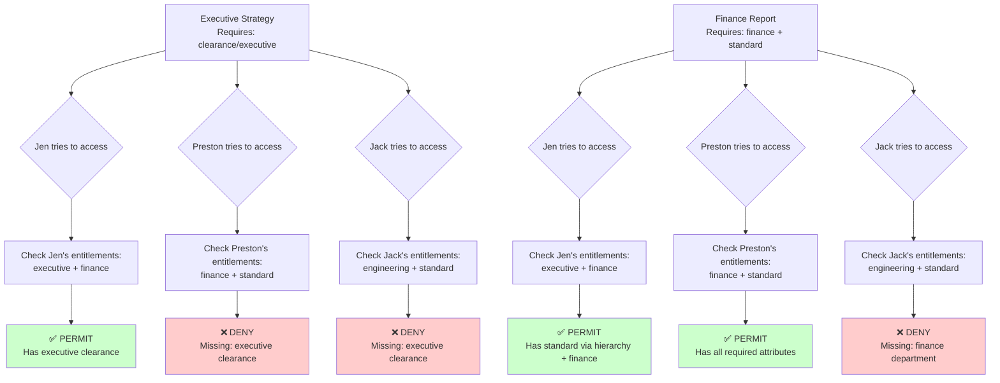
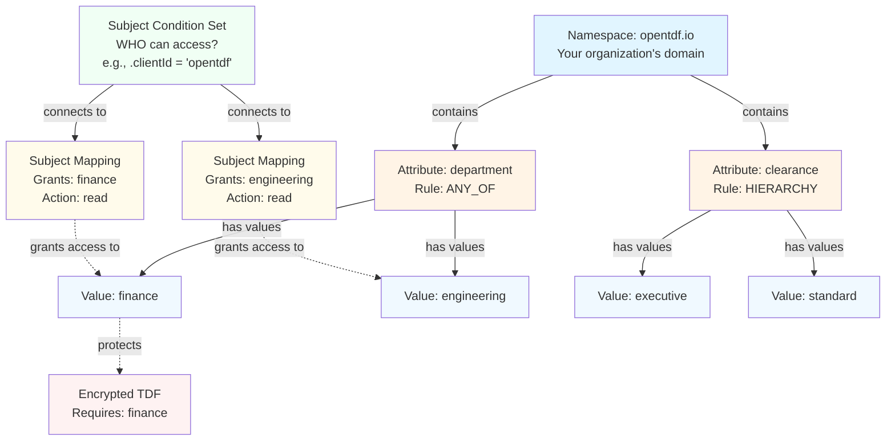

import dockerComposeContent from '!!raw-loader!./docker-compose.yaml';
import CodeBlock from '@theme/CodeBlock';

<style>
{`
.download-button {
  display: inline-block;
  padding: 8px 16px;
  background-color: #0066cc;
  color: white;
  text-decoration: none;
  border-radius: 4px;
  margin-bottom: 16px;
  transition: all 0.2s ease;
}

.download-button:hover {
  background-color: #0052a3;
  box-shadow: 0 4px 8px rgba(0, 0, 0, 0.2);
  color: white;
}

`}
</style>

# Getting Started

This guide will walk you through **encrypting and decrypting data** using OpenTDF tools. You'll learn how to secure sensitive information through encryption and control access using **attribute-based access controls (ABAC)**. You'll set up a sandbox [OpenTDF platform](/architecture) locally to demonstrate these core concepts.

:::note Time Commitment
This quickstart is designed to take **10 minutes** for basic encryption/decryption, or **30 minutes** if you complete the full ABAC scenario.
:::

## The Scenario

OpenTDF's access control works through two fundamental concepts:

- **Entitlements**: Answer "*What can this entity access?*" - The attribute values a user is entitled to based on their identity (role, department, clearance level, etc.)
- **Decisions**: Answer "*Can this entity access this specific resource?*" - A permit/deny decision made by comparing user entitlements against the attributes protecting a resource

Let's see this in action with a real-world example:

**The Story**: Jen Moneybanks (CFO) creates a highly sensitive financial strategy document. Preston Price (accountant) and Jack Vascript (engineer) both try to access it, but the platform checks their entitlements, compares them to the document's attributes, and makes a decision: access denied.

Later, Jen creates a derivative version for the finance team. When Preston tries to access it, the platform checks his entitlements again - this time he has the right attributes, so the decision is: access granted. Jack still can't access it because his entitlements don't match.



<details>
<summary>Text description of access control flow diagram</summary>

**Executive Strategy Document** (requires clearance/executive):
- **Jen** (has executive + finance entitlements) → **PERMIT** - Has executive clearance
- **Preston** (has finance + standard entitlements) → **DENY** - Missing executive clearance
- **Jack** (has engineering + standard entitlements) → **DENY** - Missing executive clearance

**Finance Report Document** (requires finance + standard):
- **Jen** (has executive + finance entitlements) → **PERMIT** - Has standard via hierarchy + finance
- **Preston** (has finance + standard entitlements) → **PERMIT** - Has all required attributes
- **Jack** (has engineering + standard entitlements) → **DENY** - Missing finance department

</details>

**The Implementation**: You'll set up attributes and entitlements, then watch OpenTDF make authorization decisions:

- **Attributes** (how we classify data):
  - `department`: `finance`, `engineering`
  - `clearance`: `executive`, `standard`

- **Entitlements** (what each person has access to):
  - **Jen**: `clearance/executive` (which includes `clearance/standard` via hierarchy) + `department/finance`
  - **Preston**: `department/finance` + `clearance/standard`
  - **Jack**: `department/engineering` + `clearance/standard`

- **Resources** (protected documents):
  - Executive strategy → requires `clearance/executive`
  - Finance report → requires `department/finance` + `clearance/standard`

When someone tries to decrypt a document, OpenTDF compares their entitlements against the document's attributes and returns a decision: permit or deny.


## Getting the Platform Running

The OpenTDF Platform is the core service that enforces attribute-based access control for encrypted data. It handles:
- Defining and managing attributes (like department, clearance level)
- Enforcing access policies when data is encrypted or decrypted
- Managing cryptographic keys through the Key Access Server (KAS)
- Validating user entitlements before granting access to data

### Pre-requisites

- macOS, Linux, or Windows (WSL2)
- [Colima](https://github.com/abiosoft/colima) (recommended), [Docker Desktop](https://docs.docker.com/desktop/), or Docker Engine installed and running
- 4GB+ RAM available
- 10GB+ free disk space
- Command line/terminal access
- Sudo/administrator access

### Installation

You'll run a local instance using Docker. This includes the [Platform](https://github.com/opentdf/platform/tree/main), [Keycloak](https://www.keycloak.org/) (for user authentication), and [PostgreSQL](https://www.postgresql.org/) (for storing attributes and policies).

:::warning
Not for production use.
:::

#### Step 1: Check Prerequisites

Before installing, verify your system is ready by running the pre-flight check script:

```shell
curl -fsSL https://opentdf.io/quickstart/check.sh | bash
```

Or download and run locally:
```shell
curl -fsSL https://opentdf.io/quickstart/check.sh -o check.sh
chmod +x check.sh
./check.sh
```

<details>
<summary>Expected output</summary>

```console
🔍 OpenTDF Pre-flight Check

Checking operating system...
✓ macOS detected

Checking container runtime...
✓ Docker found and running

Checking docker-compose...
✓ docker compose plugin found (Docker Compose version v2.29.1-desktop.1)

Checking required tools...
✓ curl found

Checking system resources...
✓ Memory: 16GB available

Checking disk space...
✓ Disk space: 50GB available

Checking port availability...
✓ Port 8443 is available
✓ Port 9443 is available
✓ Port 2019 is available
✓ Port 5432 is available

Checking permissions...
✓ sudo access available (will prompt for password)
✓ /etc/hosts is writable

━━━━━━━━━━━━━━━━━━━━━━━━━━━━━━━━━━━━━━━━
✓ All checks passed!

Ready to install OpenTDF:
  curl -fsSL https://opentdf.io/install.sh | bash
━━━━━━━━━━━━━━━━━━━━━━━━━━━━━━━━━━━━━━━━
```

</details>

The script checks:
- Docker is installed and running
- Docker Compose is available
- Required ports are available (8443, 9443, 2019, 5432)
- Sufficient disk space (10GB+) and RAM (4GB+)
- curl is installed
- sudo access for /etc/hosts modification

:::tip Port Conflicts
Port 9443 commonly conflicts with Rancher and Kubernetes dashboards. If you encounter port conflicts, see [troubleshooting](/getting-started/managing-platform#address-already-in-use-error) to resolve them before proceeding.
:::

#### Step 2: Install OpenTDF

Run the automated installer:

```shell
curl -fsSL https://opentdf.io/quickstart/install.sh | bash
```

Or download and run locally:
```shell
curl -fsSL https://opentdf.io/quickstart/install.sh -o install.sh
chmod +x install.sh
./install.sh
```

<details>
<summary>Expected output</summary>

```console
━━━━━━━━━━━━━━━━━━━━━━━━━━━━━━━━━━━━━━━━
   OpenTDF Quick Start Installer
   For evaluation and development only
━━━━━━━━━━━━━━━━━━━━━━━━━━━━━━━━━━━━━━━━

→ Detected OS: darwin (arm64)

→ Installing otdfctl CLI...
  Downloading otdfctl v0.28.0...
✓ otdfctl v0.28.0 installed to /Users/username/.opentdf/bin/otdfctl

→ Checking Docker...
✓ Docker is running
✓ Using: docker compose

→ Configuring /etc/hosts...
This requires sudo access.
Password: [you'll be prompted for your password]
✓ Hosts entries added

→ Setting up OpenTDF platform...
→ Downloading docker-compose configuration...
✓ Platform configuration ready

→ Starting OpenTDF services...
   This may take 2-3 minutes on first run...

→ Waiting for services to become healthy...
✓ Services are starting up

→ Waiting for platform to be fully ready...
✓ Services started

→ Configuring SSL certificates...
  Waiting for Caddy to generate certificates...
  Importing Caddy root CA to macOS keychain...
Password: [you'll be prompted for your password again]
✓ Caddy root CA imported to System keychain
  Note: You may need to restart your browser

:::note Certificate Import May Fail Silently
If the certificate import fails during installation, you'll need to import it manually in the next step. Symptoms include browser "Not Secure" warnings and needing `-k` flags with curl commands.
:::

→ Running connectivity test...
✓ Platform is responding

━━━━━━━━━━━━━━━━━━━━━━━━━━━━━━━━━━━━━━━━
✓ OpenTDF installation complete!
━━━━━━━━━━━━━━━━━━━━━━━━━━━━━━━━━━━━━━━━

📍 Installation directory: /Users/username/.opentdf

🚀 Getting started:

  1. Add otdfctl to your PATH:
     export PATH="/Users/username/.opentdf/bin:$PATH"

  2. Or create a symlink:
     sudo ln -sf /Users/username/.opentdf/bin/otdfctl /usr/local/bin/otdfctl

  3. Test the installation:
     /Users/username/.opentdf/bin/otdfctl --version

  4. Create an otdfctl profile:
     /Users/username/.opentdf/bin/otdfctl profile create platform-otdf-local https://platform.opentdf.local:8443

🌐 Access points:
   Platform: https://platform.opentdf.local:8443
   Keycloak: https://keycloak.opentdf.local:9443

📚 Next steps:
   Quickstart Guide: https://opentdf.io/quickstart
   Documentation: https://opentdf.io/introduction

🛠️  Management commands:
   Stop:    cd /Users/username/.opentdf/platform && docker compose down
   Start:   cd /Users/username/.opentdf/platform && docker compose up -d
   Logs:    cd /Users/username/.opentdf/platform && docker compose logs -f
   Status:  cd /Users/username/.opentdf/platform && docker compose ps

⚠️  Note: This setup is for evaluation only.
   For production deployment guidance, visit: https://opentdf.io

━━━━━━━━━━━━━━━━━━━━━━━━━━━━━━━━━━━━━━━━
```

</details>

The installer will:
- Download and install the [otdfctl CLI](https://github.com/opentdf/otdfctl)
- Verify Docker is running
- Add entries to /etc/hosts (requires sudo)
- Download and start all services (Platform, Keycloak, PostgreSQL, Caddy)
- Import SSL certificates (requires sudo)
- Take 3-5 minutes on first run

You'll be prompted for your password twice: once for /etc/hosts and once for SSL certificate import.

**Add otdfctl to your PATH** (optional but recommended):

For bash:
```shell
echo 'export PATH="$HOME/.opentdf/bin:$PATH"' >> ~/.bashrc && source ~/.bashrc
```

For zsh:
```shell
echo 'export PATH="$HOME/.opentdf/bin:$PATH"' >> ~/.zshrc && source ~/.zshrc
```

Or create a symlink:
```shell
sudo ln -sf ~/.opentdf/bin/otdfctl /usr/local/bin/otdfctl
```

**Verify installation:**
```shell
otdfctl --version
curl -k https://platform.opentdf.local:8443/healthz
```

Expected: version output and `{"status":"SERVING"}` from the healthz check.

#### Step 3: Create Profile & Authenticate

Create a profile to store your connection details, then authenticate:

```shell
# Create profile (--tls-no-verify skips certificate validation for local development)
otdfctl profile create --tls-no-verify platform-otdf-local https://platform.opentdf.local:8443

# Authenticate with test credentials
otdfctl auth client-credentials opentdf secret
```

Expected output:
> ```console
> SUCCESS   Profile platform-otdf-local created
> Client credentials set for profile [platform-otdf-local]
> ```

**What is a profile?** A profile stores your platform URL and credentials so you don't need to type them with every command. When you have only one profile, it's automatically your default.

Your credentials are saved in the profile and persist across commands—no need to re-authenticate unless you change profiles.

#### Step 4: Trust SSL Certificate (Optional)

The `--tls-no-verify` flag skips certificate validation, which is fine for CLI quickstart testing. However, if you're using browsers or SDKs, you may see certificate warnings.

**Trust the certificate if you see:**
- Browser "Not Secure" warnings
- curl commands requiring `-k` flag
- SDK certificate validation errors

**Solution:** See [TLS Certificate Verification](/getting-started/managing-platform#tls-certificate-verification) for instructions on trusting the Caddy root CA certificate on your OS.

:::tip Managing the Platform
Need to start, stop, or restart the platform later? See the [Managing the Platform](/getting-started/managing-platform) guide.
:::

## Encrypt and Decrypt with the CLI

Let's start with a simple encryption example using some plain text:

```shell
echo 'my first encrypted tdf' | otdfctl encrypt -o example.tdf
```

This creates an encrypted file called `example.tdf`.

### Verify the File is Encrypted

Before decrypting, let's verify that the file is actually encrypted by viewing its contents:

```shell
cat example.tdf
```

Expected output (encrypted binary data):
> ```console
> PK?|^4 0.payload
>                  o??1.?%A#a?.?d??`g?????V[
> X??BUYPAG=(????De#??P.?
>                        #33PK?|^40.manifest.json{"encryptionInformation":{"type":"split","policy":"eyJ1dWlk...
> ```

As you can see, the file contains encrypted binary data and JSON metadata - not readable plain text. This confirms the encryption worked.

### Decrypt the File

Now decrypt it to retrieve the original content:

```shell
otdfctl decrypt example.tdf
```

Expected output:
> ```console
> my first encrypted tdf
> ```

### Encrypt an Existing File

The same process works with files. Let's create a text file, encrypt it, and decrypt it:

Create a text file:
```shell
echo "my first encrypted tdf file" > example.txt
```

Verify you can read the plain text file:
```shell
cat example.txt
```

Expected output:
> ```console
> my first encrypted tdf file
> ```

Now encrypt the file:
```shell
otdfctl encrypt example.txt -o example.txt.tdf
```

This creates `example.txt.tdf`.

Try to read the encrypted file:
```shell
cat example.txt.tdf
```

Expected output (encrypted binary data):
> ```console
> PK?|^4 0.payload
>                  o??1.?%A#a?.?d??`g?????V[...
> ```

The file is now encrypted and unreadable. Decrypt it back to plain text:
```shell
otdfctl decrypt example.txt.tdf
```

Expected output:
> ```console
> my first encrypted tdf file
> ```

---

:::tip Checkpoint: Basic Encryption Working
**You've successfully encrypted and decrypted data!** This is a good stopping point if you just want to verify the platform works.

To learn how to implement attribute-based access control, continue below to work through the full scenario with Jen, Preston, and Jack.
:::

---

## Create A Namespace

A `namespace` is how you organize your `attributes` within the platform. Think of it as your organization's domain - for our scenario, this will be the company where Jen, Preston, and Jack work.

Let's check if there are any existing namespaces:

```shell
otdfctl policy attributes namespaces list
```

<details>
<summary>Expected output</summary>

```console
SUCCESS   Found namespaces: 4
┌────────────────────────────────────────┬──────────────┬────────┬────────┬────────────────────────┬────────────────────────┐
│Id                                      │Name          │Active  │Grants  │Created At              │Updated At              │
├────────────────────────────────────────┼──────────────┼────────┼────────┼────────────────────────┼────────────────────────┤
│0d94e00a-7bd3-4482-afe3-f1e4b03c1353    │example.org   │true    │[]      │Fri Jan 30 18:55:26 UTC…│Fri Jan 30 18:55:26 UTC…│
│87ba60e1-da12-4889-95fd-267968bf0896    │scenario.com  │true    │[]      │Fri Jan 30 18:55:26 UTC…│Fri Jan 30 18:55:26 UTC…│
│8f1d8839-2851-4bf4-8bf4-5243dbfe517d    │example.com   │true    │[]      │Fri Jan 30 18:55:26 UTC…│Fri Jan 30 18:55:26 UTC…│
│d69cf14d-744b-48cf-aab4-43756e97a8e5    │example.net   │true    │[]      │Fri Jan 30 18:55:26 UTC…│Fri Jan 30 18:55:26 UTC…│
└────────────────────────────────────────┴──────────────┴────────┴────────┴────────────────────────┴────────────────────────┘
```

</details>

These are example namespaces that come pre-configured with the platform. You'll create your own namespace for this tutorial.

### Create a new namespace

Create a namespace representing our company domain:

```shell
otdfctl policy attributes namespaces create --name opentdf.io
```

Expected output:
> ```console
> SUCCESS   Created namespaces: 7650f02a-be00-4faa-a1d1-37cded5e23dc
> ┌────────────┬──────────────────────────────────────┐
> │Property    │Value                                 │
> ├────────────┼──────────────────────────────────────┤
> │Name        │opentdf.io                            │
> │Id          │7650f02a-be00-4faa-a1d1-37cded5e23dc  │
> │Created At  │Fri Jan 30 19:02:00 UTC 2026          │
> │Updated At  │Fri Jan 30 19:02:00 UTC 2026          │
> └────────────┴──────────────────────────────────────┘
> NOTE   Use 'namespaces get --id=7650f02a-be00-4faa-a1d1-37cded5e23dc --json' to see all properties
> ```

### List the namespaces

With that namespace created, you should now see it along with the pre-configured example namespaces:

```shell
otdfctl policy attributes namespaces list
```

<details>
<summary>Expected output</summary>

```console
SUCCESS   Found namespaces: 5
┌────────────────────────────────────────┬──────────────┬────────┬────────┬────────────────────────┬────────────────────────┐
│Id                                      │Name          │Active  │Grants  │Created At              │Updated At              │
├────────────────────────────────────────┼──────────────┼────────┼────────┼────────────────────────┼────────────────────────┤
│0d94e00a-7bd3-4482-afe3-f1e4b03c1353    │example.org   │true    │[]      │Fri Jan 30 18:55:26 UTC…│Fri Jan 30 18:55:26 UTC…│
│7650f02a-be00-4faa-a1d1-37cded5e23dc    │opentdf.io    │true    │[]      │Fri Jan 30 19:02:00 UTC…│Fri Jan 30 19:02:00 UTC…│
│87ba60e1-da12-4889-95fd-267968bf0896    │scenario.com  │true    │[]      │Fri Jan 30 18:55:26 UTC…│Fri Jan 30 18:55:26 UTC…│
│8f1d8839-2851-4bf4-8bf4-5243dbfe517d    │example.com   │true    │[]      │Fri Jan 30 18:55:26 UTC…│Fri Jan 30 18:55:26 UTC…│
│d69cf14d-744b-48cf-aab4-43756e97a8e5    │example.net   │true    │[]      │Fri Jan 30 18:55:26 UTC…│Fri Jan 30 18:55:26 UTC…│
└────────────────────────────────────────┴──────────────┴────────┴────────┴────────────────────────┴────────────────────────┘
```

</details>

Let's export the namespace id for later use.

```shell
export NAMESPACE_ID=<id>
```

We will be exporting a number of variables for later use. No console output is expected, but you can verify that it saved correctly by typing:
```shell
echo $NAMESPACE_ID
```

Expected output:
> ```console
> 7650f02a-be00-4faa-a1d1-37cded5e23dc
> ```

### Get the details of the namespace

```shell
otdfctl policy attributes namespaces get --id=$NAMESPACE_ID
```

> ```console
> SUCCESS   Found namespaces: 7650f02a-be00-4faa-a1d1-37cded5e23dc
> ┌────────────┬──────────────────────────────────────┐
> │Property    │Value                                 │
> ├────────────┼──────────────────────────────────────┤
> │Id          │7650f02a-be00-4faa-a1d1-37cded5e23dc  │
> │Name        │opentdf.io                            │
> │Created At  │Fri Jan 30 19:02:00 UTC 2026          │
> │Updated At  │Fri Jan 30 19:02:00 UTC 2026          │
> └────────────┴──────────────────────────────────────┘
> NOTE   Use 'namespaces get --id=7650f02a-be00-4faa-a1d1-37cded5e23dc --json' to see all properties
> ```

## Create Attributes

An `attribute` defines how to classify data and forms the basis for authorization **decisions**. When someone tries to access a resource, the platform compares their **entitlements** (the attribute values they possess) against the **resource attributes** (the values required by the resource).

For our scenario, we need two types of attributes:

1. **Department** - Which department can access the data (finance, engineering)
2. **Clearance** - What clearance level is required (executive, standard)

Each attribute has:

1. **A definition** - Describes how entitlements and resource attributes are compared during a decision:
   - **ANY_OF**: Entity needs at least one value (OR operation) - perfect for departments
   - **ALL_OF**: Entity needs all values (AND operation) - useful for combined requirements
   - **HIERARCHY**: Ordered list where higher values grant lower access - perfect for clearance levels

2. **A list of values** - The specific options that can be granted as entitlements or required on resources (e.g., finance, engineering, executive, standard)

:::tip
You can create values when creating the definition: `--value finance --value engineering`
:::

### How ABAC Components Work Together

Before creating attributes, let's visualize how all the pieces of attribute-based access control fit together:



**Key Relationships:**

1. **Namespace** - Your organization's domain (e.g., `opentdf.io`)
2. **Attributes** - Categories for classifying data (e.g., `department`, `clearance`)
3. **Values** - Specific options within each attribute (e.g., `finance`, `engineering`)
4. **Subject Condition Set** - Defines WHO can access by matching JWT token claims (e.g., `.clientId = "opentdf"`)
5. **Subject Mapping** - Grants entitlements by connecting WHO (subject condition set) to WHAT (attribute values) with ACTIONS (e.g., `read`)
6. **TDF** - Encrypted data that requires specific attribute values to decrypt

When a user tries to decrypt a TDF:
- Their JWT token is evaluated against **Subject Condition Sets**
- Matching sets grant them **entitlements** via **Subject Mappings**
- The platform checks if their entitlements satisfy the TDF's required **attribute values**
- If authorized, they can decrypt the data

### Create Department Attribute

First, create an attribute for departments. We use `ANY_OF` since a person typically belongs to one department:

```shell
otdfctl policy attributes create --name department -s $NAMESPACE_ID -r ANY_OF
```

> ```console
> SUCCESS   Created attributes: bd02d7ab-564d-4b6c-95c4-3d4a8a259000
> ┌────────────┬──────────────────────────────┐
> │Property    │Value                         │
> ├────────────┼──────────────────────────────┤
> │Name        │department                    │
> │Rule        │ANY_OF                        │
> │Values      │[]                            │
> │Namespace   │opentdf.io                    │
> │Created At  │Mon Jun 24 11:09:39 UTC 2024  │
> │Updated At  │Mon Jun 24 11:09:39 UTC 2024  │
> └────────────┴──────────────────────────────┘
> NOTE   Use 'attributes get --id=bd02d7ab-564d-4b6c-95c4-3d4a8a259000 --json' to see all properties
> ```

Save the department attribute ID:

```shell
export DEPT_ATTRIBUTE_ID=<id>
```

### Add Department Values

Add values for finance and engineering:

```shell
# Add finance value
otdfctl policy attributes values create -a $DEPT_ATTRIBUTE_ID --value finance
export FINANCE_VALUE_ID=<id-from-output>

# Add engineering value
otdfctl policy attributes values create -a $DEPT_ATTRIBUTE_ID --value engineering
export ENGINEERING_VALUE_ID=<id-from-output>
```

:::tip Pro Tip
You can create attributes with values in one command: `otdfctl policy attributes create --name department -s $NAMESPACE_ID -r ANY_OF --value finance --value engineering`
:::

### Create Clearance Attribute

Now create a clearance attribute using `HIERARCHY` rule.

:::tip Understanding HIERARCHY Rule
With HIERARCHY, the **order you create values** determines their privilege level:
- **First value created = highest privilege** (can access all lower levels)
- **Later values = lower privileges** (cannot access higher levels)

For example, if you create "executive" first and "standard" second:
- Users with "executive" clearance can access both "executive" and "standard" content
- Users with "standard" clearance can only access "standard" content

The order matters! Always create values from highest to lowest privilege.
:::

In the next few steps you will add an executive clearance value and a standard clearance value to the hierarchy.

```shell
otdfctl policy attributes create --name clearance -s $NAMESPACE_ID -r HIERARCHY
export CLEARANCE_ATTRIBUTE_ID=<id-from-output>
```

### Add Clearance Values

Add clearance levels in order from highest to lowest privilege. Create "executive" first (highest clearance), then "standard" (lower clearance):

```shell
# Add executive value (highest privilege)
otdfctl policy attributes values create -a $CLEARANCE_ATTRIBUTE_ID --value executive
export EXECUTIVE_VALUE_ID=<id-from-output>

# Add standard value (lower privilege)
otdfctl policy attributes values create -a $CLEARANCE_ATTRIBUTE_ID --value standard
export STANDARD_VALUE_ID=<id-from-output>
```

Because we're using a HIERARCHY rule, someone with executive clearance automatically has standard clearance too. The hierarchy flows from highest (executive) to lowest (standard).

## Create Subject Mappings

A `subject mapping` connects identities to attributes, **granting them entitlements**. This is the "What can this entity access?" part of our authorization system.

**Entitlements** are the attribute values an identity possesses. When an identity tries to decrypt a document, the platform will check their entitlements and make an authorization **decision** by comparing them to the document's required attributes.

An identity can be a user (human individual), service account, application, device, or any authenticated entity making requests.

For our scenario, you'll grant these entitlements:
- **Jen** gets `clearance/executive` (which also grants `clearance/standard` due to hierarchy)
- **Preston** gets `department/finance` and `clearance/standard`
- **Jack** gets `department/engineering` and `clearance/standard`

:::note Production Usage
In this tutorial, Jen, Preston, and Jack are personas you'll use to learn how entitlements work. You're simulating all three by using the same `opentdf` client credentials.

In production, each identity would have:
- **Distinct credentials** - Separate user accounts, service accounts, or application identities
- **Unique subject condition sets** - Matched by email, username, group membership, or custom claims from your identity provider (like Keycloak, Okta, Azure AD)
- **Individual entitlements** - Each identity granted only the attribute values they should have access to

For example, you might create subject condition sets that match `email == "jen@company.com"`, `groups contains "finance-team"`, or `clientId == "reporting-service"`.
:::

First, we need a `subject condition set` - this defines WHO qualifies for the entitlement based on their identity properties (like client ID, email, or group membership).

### Create Subject Condition Sets

For this tutorial, you'll simulate the three personas by creating condition sets that match the default client credentials. Here's what a subject condition set looks like:

```json title="subject_condition_set.json"
[
  {
    "condition_groups": [
      {
        "conditions": [
          {
            "subject_external_selector_value": ".clientId",
            "operator": 1,
            "subject_external_values": [
              "opentdf"
            ]
          }
        ],
        "boolean_operator": 1
      }
    ]
  }
]
```

**Understanding the parameters:**
- `subject_external_selector_value`: The identity claim to match against from your IdP (e.g., `.clientId`, `.email`, `.groups`, `.role`, `.department`; see [Subject Mappings](/components/policy/subject_mappings) for examples)
- `operator`: Comparison operator (`0` = unspecified, `1` = IN/equals, `2` = NOT_IN/excludes, `3` = IN_CONTAINS/substring match; see [API reference](/OpenAPI-clients/policy/subjectmapping/policy-subjectmapping-subject-mapping-service-create-subject-condition-set) for details)
- `subject_external_values`: The value(s) to match against the selected claim (here, `"opentdf"` matches our demo client ID)
- `boolean_operator`: How to combine multiple conditions (`0` = unspecified, `1` = AND, `2` = OR; see [API reference](/OpenAPI-clients/policy/subjectmapping/policy-subjectmapping-subject-mapping-service-create-subject-condition-set) for details)

In a real deployment, you'd match identities by email, group membership, or other properties from your identity provider (like Keycloak). For example, `.email` for email addresses, `.groups` for group membership, or custom claims from your IdP.

Download the <a target="_blank" href="/quickstart/subject_condition_set.json" download="subject_condition_set.json">subject_condition_set.json example file</a> or create your own, then run:

```shell
otdfctl policy subject-condition-sets create -j <path to file>/subject_condition_set.json
```

> ```console
> SUCCESS   Created subject-condition-sets: 74bf521f-5a79-48fe-acb8-b4b63ee7950b
> ┌──────────────┬───────────────────────────────────────────────────────────────────────────────────────────────────────────────────────────────────────────────────────────────────┐
> │Property      │Value                                                                                                                                                              │
> ├──────────────┼───────────────────────────────────────────────────────────────────────────────────────────────────────────────────────────────────────────────────────────────────┤
> │Id            │74bf521f-5a79-48fe-acb8-b4b63ee7950b                                                                                                                               │
> │SubjectSets   │[{"condition_groups":[{"conditions":[{"subject_external_selector_value":".clientId","operator":1,"subject_external_values":["opentdf"]}],"boolean_operator":1}]}]  │
> │Created At    │Mon Jun 24 11:33:28 UTC 2024                                                                                                                                       │
> │Updated At    │Mon Jun 24 11:33:28 UTC 2024                                                                                                                                       │
> └──────────────┴───────────────────────────────────────────────────────────────────────────────────────────────────────────────────────────────────────────────────────────────────┘
> NOTE   Use 'subject-condition-sets get --id=74bf521f-5a79-48fe-acb8-b4b63ee7950b --json' to see all properties
> ```

Save the condition set ID - you'll use this to represent all three users in the demo:

```shell
export SUBJECT_CONDITION_SET_ID=<id>
```

## Encrypt Jen's Executive Document

Before granting any permissions, let's create Jen's executive strategy document and see what happens when someone without proper clearance tries to access it.

### Create the Executive Strategy Document

Jen creates her highly sensitive executive strategy document. This requires executive clearance:

```shell
echo 'Executive Financial Strategy 2026: Confidential merger plans and Board-level decisions' | otdfctl encrypt -o executive-strategy.tdf --attr https://opentdf.io/attr/clearance/value/executive
```

This creates an encrypted file called `executive-strategy.tdf`.

### Try to Decrypt Without Permission (Will Fail)

Right now, you haven't granted any entitlements. Try to decrypt this executive document and see the authorization **decision**:

```shell
otdfctl decrypt executive-strategy.tdf
```

You'll see an error like this:

> ```console
> Error: rpc error: code = PermissionDenied desc = Access denied: insufficient permissions
> ```

This is an authorization **decision** in action! Here's what happened:
1. You requested access to a resource requiring `clearance/executive`
2. The platform checked your **entitlements** (what you can access)
3. You have no entitlements yet
4. The platform made a **decision**: DENY

### Grant Jen Executive Clearance

Now grant an **entitlement** to represent Jen's access level. This changes what attribute values you're entitled to:

:::tip About the `read` Action
The `--action read` flag specifies what the entity can _do_ with this attribute value. The `read` action is one of the standard actions used for TDF decryption. Other standard actions include `create`, `update`, and `delete`. You can also define custom actions for your specific use cases.

Learn more about actions in the [Actions documentation](/components/policy/actions).
:::

```shell
otdfctl policy subject-mappings create --action read --attribute-value-id $EXECUTIVE_VALUE_ID --subject-condition-set-id $SUBJECT_CONDITION_SET_ID
```

> ```console
> SUCCESS   Created subject-mappings: 751054f8-14da-44c0-9341-5dab36b8256d
> ┌─────────────────────────┬────────────────────────────────────────────────────────────────────────────────────────────────────────────────────────────────────────────────────────┐
> │Property                 │Value                                                                                                                                                   │
> ├─────────────────────────┼────────────────────────────────────────────────────────────────────────────────────────────────────────────────────────────────────────────────────────┤
> │Id                       │751054f8-14da-44c0-9341-5dab36b8256d                                                                                                                    │
> │Subject AttrVal: Id      │654f0877-2c0b-4a62-a9c3-87ed42bf77ac                                                                                                                    │
> │Actions                  │[{"Value":{"Standard":1}}]                                                                                                                              │
> │Subject Condition Set: I…│74bf521f-5a79-48fe-acb8-b4b63ee7950b                                                                                                                    │
> │Subject Condition Set    │[{"condition_groups":[{"conditions":[{"subject_external_selector_value":".clientId","operator":1,"subject_external_values":["opentdf"]}],"boolean_opera…│
> │Attribute Value Id       │654f0877-2c0b-4a62-a9c3-87ed42bf77ac                                                                                                                    │
> │Created At               │Mon Jun 24 11:35:13 UTC 2024                                                                                                                            │
> │Updated At               │Mon Jun 24 11:35:13 UTC 2024                                                                                                                            │
> └─────────────────────────┴────────────────────────────────────────────────────────────────────────────────────────────────────────────────────────────────────────────────────────┘
> NOTE   Use 'subject-mappings get --id=751054f8-14da-44c0-9341-5dab36b8256d --json' to see all properties
> ```

Because we're using HIERARCHY for clearance, this executive clearance automatically grants standard clearance too. This means Jen can access both executive-level documents and standard documents.

### Decrypt Now That We Have Permission

Now that you've been granted an **entitlement** for executive clearance, try decrypting the executive document again:

```shell
otdfctl decrypt executive-strategy.tdf
```

> ```console
> # Output
> Executive Financial Strategy 2026: Confidential merger plans and Board-level decisions
> ```

Success! The authorization **decision** is now PERMIT. Here's what changed:
1. You requested access to a resource requiring `clearance/executive`
2. The platform checked your **entitlements** - you now have `clearance/executive`
3. Your entitlements match the resource's required attributes
4. The platform made a **decision**: PERMIT

The same file that was locked before is now accessible because your entitlements changed.

## Create the Derivative Finance Report

Now Jen creates a derivative version for the finance team. This one requires finance department access but only standard clearance:

```shell
echo 'Finance Department Report 2026: Budget allocations and quarterly targets (no executive details)' | otdfctl encrypt -o finance-report.tdf --attr https://opentdf.io/attr/department/value/finance --attr https://opentdf.io/attr/clearance/value/standard
```

This creates an encrypted file called `finance-report.tdf`.

Notice this document has TWO attributes - it requires BOTH finance department membership AND standard clearance.

### Grant Finance Department Access

To simulate Preston's access, grant yourself an additional **entitlement** for the finance department:

```shell
otdfctl policy subject-mappings create --action read --attribute-value-id $FINANCE_VALUE_ID --subject-condition-set-id $SUBJECT_CONDITION_SET_ID
```

Expected output:
> ```console
> SUCCESS   Created subject-mappings: <id>
> ┌─────────────────────────┬────────────────────────────────────────────────────────────────────────────────────────────────────────────────────────────────────────────────────────┐
> │Property                 │Value                                                                                                                                                   │
> ├─────────────────────────┼────────────────────────────────────────────────────────────────────────────────────────────────────────────────────────────────────────────────────────┤
> │Id                       │<id>                                                                                                                                                    │
> │Subject AttrVal: Id      │<finance-value-id>                                                                                                                                      │
> │Actions                  │[{"Value":{"Standard":1}}]                                                                                                                              │
> │Subject Condition Set: I…│<subject-condition-set-id>                                                                                                                              │
> │Attribute Value Id       │<finance-value-id>                                                                                                                                      │
> │Created At               │Mon Jun 24 11:35:13 UTC 2024                                                                                                                            │
> │Updated At               │Mon Jun 24 11:35:13 UTC 2024                                                                                                                            │
> └─────────────────────────┴────────────────────────────────────────────────────────────────────────────────────────────────────────────────────────────────────────────────────────┘
> ```

### Decrypt the Finance Report

Now you can access the derivative document (since you have executive clearance which includes standard, plus you just added finance department):

```shell
otdfctl decrypt finance-report.tdf
```

> ```console
> # Output
> Finance Department Report 2026: Budget allocations and quarterly targets (no executive details)
> ```

Success! Both Jen and Preston can now access this finance-specific document.

### What About Jack?

Jack (engineering department) cannot access either document. Let's look at the **decisions** that would be made:

1. **Executive strategy decision**:
   - Resource requires: `clearance/executive`
   - Jack's entitlements: `clearance/standard`, `department/engineering`
   - Decision: DENY (missing executive clearance)

2. **Finance report decision**:
   - Resource requires: `department/finance` AND `clearance/standard`
   - Jack's entitlements: `clearance/standard`, `department/engineering`
   - Decision: DENY (has clearance but wrong department)

This demonstrates how authorization **decisions** work - the platform compares **entitlements** (what Jack has) against resource attributes (what's required) and returns PERMIT or DENY.

## Takeaways and Next Steps

You've successfully implemented Jen, Preston, and Jack's scenario! Here's what you learned:

### Key Concepts

1. **Entitlements**: The attribute values a user possesses, defined by subject mappings. Answers "What can this entity access?"
2. **Decisions**: Permit/deny determinations made by comparing user entitlements against resource attributes. Answers "Can this entity access this specific resource?"
3. **Namespaces**: Organize attributes for your organization
4. **Attributes**: Classify data and define comparison rules (department, clearance level, classification, etc.)
5. **Attribute Rules**:
   - `ANY_OF`: Need at least one value (departments)
   - `HIERARCHY`: Higher values include lower ones (clearance levels)
   - `ALL_OF`: Need all values (not used in this example)
6. **Subject Mappings**: Grant users entitlements by connecting them to attribute values
7. **Multiple Attributes**: Can be combined on a single document for fine-grained authorization decisions

### Real-World Applications

In production, you would:
- Create unique users in Keycloak for Jen, Preston, and Jack
- Use subject condition sets that match by email, group membership, or custom claims
- Integrate with your existing identity provider
- Set up roles and groups in your IdP that map to attributes

### What's Next?

- Explore [SDK integration](/sdks) to encrypt/decrypt in your applications
- Learn about [Key Access Servers (KAS)](/components/key_access) for policy enforcement
- Understand [policy management](/components/policy) for access control
- Build [attribute hierarchies](/components/authorization) for complex organizational structures

## Need Help?

**Having issues?** See the [Managing the Platform](/getting-started/managing-platform) guide for:
- 🔧 Troubleshooting common installation and setup issues
- 📚 Quick reference for platform management commands
- ⚡ Platform management tips and best practices

For SDK-specific errors when writing code, see [SDK Troubleshooting](/sdks/troubleshooting).

## Next Steps

Now that you've completed the quickstart and understand how OpenTDF works with the CLI, you're ready to integrate OpenTDF into your applications using our SDKs.

**Continue your journey:**

📚 **[SDK Quickstart Guide](/sdks/quickstart)** - Learn how to encrypt and decrypt data in your Go, Java, or JavaScript applications

The SDK Quickstart will show you how to:
- Set up the OpenTDF SDK in your preferred language
- Encrypt data with attribute-based access control
- Create and manage access policies programmatically
- Decrypt TDFs in your applications

**Other helpful resources:**
- [SDK Troubleshooting](/sdks/troubleshooting) - Solutions to common SDK issues
- [Architecture Overview](/architecture) - Deep dive into how OpenTDF works
- [Managing the Platform](/getting-started/managing-platform) - Platform management commands
