import dockerComposeContent from '!!raw-loader!./docker-compose.yaml';
import CodeBlock from '@theme/CodeBlock';

<style>
{`
.download-button {
  display: inline-block;
  padding: 8px 16px;
  background-color: #0066cc;
  color: white;
  text-decoration: none;
  border-radius: 4px;
  margin-bottom: 16px;
  transition: all 0.2s ease;
}

.download-button:hover {
  background-color: #0052a3;
  box-shadow: 0 4px 8px rgba(0, 0, 0, 0.2);
  color: white;
}

`}
</style>

# Getting Started

This guide will walk you through **encrypting and decrypting data** using OpenTDF tools. You'll learn how to secure sensitive information through encryption and control access using **attribute-based access controls (ABAC)**. We'll set up a sandbox [OpenTDF platform](/architecture) locally to demonstrate these core concepts.

:::note Time Commitment
This quickstart is designed to take **10 minutes** for basic encryption/decryption, or **30 minutes** if you complete the full ABAC scenario.
:::

## The Scenario

OpenTDF's access control works through two fundamental concepts:

- **Entitlements**: Answer "*What can this entity access?*" - The attribute values a user is entitled to based on their identity (role, department, clearance level, etc.)
- **Decisions**: Answer "*Can this entity access this specific resource?*" - A permit/deny decision made by comparing user entitlements against the attributes protecting a resource

Let's see this in action with a real-world example:

**The Story**: Jen Moneybanks (CFO) creates a highly sensitive financial strategy document. Preston Price (accountant) and Jack Vascript (engineer) both try to access it, but the platform checks their entitlements, compares them to the document's attributes, and makes a decision: access denied.

Later, Jen creates a derivative version for the finance team. When Preston tries to access it, the platform checks his entitlements again - this time he has the right attributes, so the decision is: access granted. Jack still can't access it because his entitlements don't match.

```mermaid
flowchart TD
    A[Executive Strategy<br/>Requires: clearance/executive] --> A1{Jen tries to access}
    A --> B{Preston tries to access}
    A --> C{Jack tries to access}

    A1 --> A2[Check Jen's entitlements:<br/>executive + finance]
    A2 --> A3[✅ PERMIT<br/>Has executive clearance]

    B --> B1[Check Preston's entitlements:<br/>finance + standard]
    B1 --> B2[❌ DENY<br/>Missing: executive clearance]

    C --> C1[Check Jack's entitlements:<br/>engineering + standard]
    C1 --> C2[❌ DENY<br/>Missing: executive clearance]

    D[Finance Report<br/>Requires: finance + standard] --> D1{Jen tries to access}
    D --> E{Preston tries to access}
    D --> F{Jack tries to access}

    D1 --> D2[Check Jen's entitlements:<br/>executive + finance]
    D2 --> D3[✅ PERMIT<br/>Has standard via hierarchy + finance]

    E --> E1[Check Preston's entitlements:<br/>finance + standard]
    E1 --> E2[✅ PERMIT<br/>Has all required attributes]

    F --> F1[Check Jack's entitlements:<br/>engineering + standard]
    F1 --> F2[❌ DENY<br/>Missing: finance department]

    style A3 fill:#ccffcc
    style B2 fill:#ffcccc
    style C2 fill:#ffcccc
    style D3 fill:#ccffcc
    style E2 fill:#ccffcc
    style F2 fill:#ffcccc
```



**The Implementation**: We'll set up attributes and entitlements, then watch OpenTDF make authorization decisions:

- **Attributes** (how we classify data):
  - `department`: `finance`, `engineering`
  - `clearance`: `executive`, `standard`

- **Entitlements** (what each person has access to):
  - **Jen**: `clearance/executive` (which includes `clearance/standard` via hierarchy) + `department/finance`
  - **Preston**: `department/finance` + `clearance/standard`
  - **Jack**: `department/engineering` + `clearance/standard`

- **Resources** (protected documents):
  - Executive strategy → requires `clearance/executive`
  - Finance report → requires `department/finance` + `clearance/standard`

When someone tries to decrypt a document, OpenTDF compares their entitlements against the document's attributes and returns a decision: permit or deny.


## Getting the Platform Running

The OpenTDF Platform is the core service that enforces attribute-based access control for encrypted data. It handles:
- Defining and managing attributes (like department, clearance level)
- Enforcing access policies when data is encrypted or decrypted
- Managing cryptographic keys through the Key Access Server (KAS)
- Validating user entitlements before granting access to data

### Pre-requisites

- macOS, Linux, or Windows (WSL2)
- [Docker Desktop](https://docs.docker.com/desktop/) or Docker Engine installed and running
- 4GB+ RAM available
- 10GB+ free disk space
- Command line/terminal access
- Sudo/administrator access

### Installation

We'll run a local instance using Docker. This includes the [Platform](https://github.com/opentdf/platform/tree/main), [Keycloak](https://www.keycloak.org/) (for user authentication), and [PostgreSQL](https://www.postgresql.org/) (for storing attributes and policies).

:::warning
Not for production use.
:::

#### Step 1: Run Pre-flight Check (Optional)

Verify your system meets the requirements:

```shell
curl -fsSL https://opentdf.io/quickstart/check.sh | bash
```

Or download and run locally:
```shell
curl -fsSL https://docs.opentdf.io/quickstart/check.sh -o check.sh
chmod +x check.sh
./check.sh
```

<details>
<summary>Expected output</summary>

```console
🔍 OpenTDF Pre-flight Check

Checking operating system...
✓ macOS detected

Checking container runtime...
✓ Docker found and running

Checking docker-compose...
✓ docker compose plugin found (Docker Compose version v2.x.x-desktop.x)

Checking required tools...
✓ curl found

Checking system resources...
✓ Memory: 16GB available

Checking disk space...
✓ Disk space: 100GB available

Checking port availability...
✓ Port 8080 is available
✓ Port 8443 is available
✓ Port 9443 is available

Checking permissions...
✓ sudo access available (will prompt for password)
✓ /etc/hosts is writable

━━━━━━━━━━━━━━━━━━━━━━━━━━━━━━━━━━━━━━━━
✓ All checks passed!

Ready to install OpenTDF:
  curl -fsSL https://opentdf.io/install.sh | bash
━━━━━━━━━━━━━━━━━━━━━━━━━━━━━━━━━━━━━━━━
```

</details>

#### Step 2: Install OpenTDF

Run the automated installer:

```shell
curl -fsSL https://opentdf.io/quickstart/install.sh | bash
```

Or download and run locally:
```shell
curl -fsSL https://docs.opentdf.io/quickstart/install.sh -o install.sh
chmod +x install.sh
./install.sh
```

<details>
<summary>Expected output</summary>

```console
━━━━━━━━━━━━━━━━━━━━━━━━━━━━━━━━━━━━━━━━
   OpenTDF Quick Start Installer
   For evaluation and development only
━━━━━━━━━━━━━━━━━━━━━━━━━━━━━━━━━━━━━━━━

→ Detected OS: darwin (arm64)

→ Installing otdfctl CLI...
  Downloading otdfctl v0.28.0...
✓ otdfctl v0.28.0 installed to /Users/username/.opentdf/bin/otdfctl

→ Checking Docker...
✓ Docker is running
✓ Using: docker compose

→ Configuring /etc/hosts...
This requires sudo access.
Password: [you'll be prompted for your password]
✓ Hosts entries added

→ Setting up OpenTDF platform...
→ Downloading docker-compose configuration...
✓ Platform configuration ready

→ Starting OpenTDF services...
   This may take 2-3 minutes on first run...

→ Waiting for services to become healthy...
✓ Services are starting up

→ Waiting for platform to be fully ready...
✓ Services started

→ Configuring SSL certificates...
  Waiting for Caddy to generate certificates...
  Importing Caddy root CA to macOS keychain...
Password: [you'll be prompted for your password again]
✓ Caddy root CA imported to System keychain
  Note: You may need to restart your browser

→ Running connectivity test...
✓ Platform is responding

━━━━━━━━━━━━━━━━━━━━━━━━━━━━━━━━━━━━━━━━
✓ OpenTDF installation complete!
━━━━━━━━━━━━━━━━━━━━━━━━━━━━━━━━━━━━━━━━

📍 Installation directory: /Users/username/.opentdf

🚀 Getting started:

  1. Add otdfctl to your PATH:
     export PATH="/Users/username/.opentdf/bin:$PATH"

  2. Or create a symlink:
     sudo ln -sf /Users/username/.opentdf/bin/otdfctl /usr/local/bin/otdfctl

  3. Test the installation:
     /Users/username/.opentdf/bin/otdfctl --version

  4. Create an otdfctl profile:
     /Users/username/.opentdf/bin/otdfctl profile create platform-otdf-local https://platform.opentdf.local:8443

🌐 Access points:
   Platform: https://platform.opentdf.local:8443
   Keycloak: https://keycloak.opentdf.local:9443

📚 Next steps:
   Quickstart Guide: https://opentdf.io/quickstart
   Documentation: https://opentdf.io/introduction

🛠️  Management commands:
   Stop:    cd /Users/username/.opentdf/platform && docker compose down
   Start:   cd /Users/username/.opentdf/platform && docker compose up -d
   Logs:    cd /Users/username/.opentdf/platform && docker compose logs -f
   Status:  cd /Users/username/.opentdf/platform && docker compose ps

⚠️  Note: This setup is for evaluation only.
   For production deployment guidance, visit: https://opentdf.io

━━━━━━━━━━━━━━━━━━━━━━━━━━━━━━━━━━━━━━━━
```

</details>

What this does:
- Downloads and installs the [otdfctl CLI](https://github.com/opentdf/otdfctl)
- Verifies Docker is running
- Adds entries to /etc/hosts (requires sudo)
- Downloads and starts all services (Platform, Keycloak, PostgreSQL, Caddy)
- Imports SSL certificates (requires sudo)
- Takes 3-5 minutes on first run

You'll be prompted for your password twice:
1. To add entries to /etc/hosts
2. To import the SSL certificate

#### Step 3: Add otdfctl to Your PATH (Optional)

Choose one option:

Option A: Add to shell profile (recommended)
```shell
echo 'export PATH="$HOME/.opentdf/bin:$PATH"' >> ~/.bashrc
source ~/.bashrc
```

Or for zsh:
```shell
echo 'export PATH="$HOME/.opentdf/bin:$PATH"' >> ~/.zshrc
source ~/.zshrc
```

Option B: Create system-wide symlink
```shell
sudo ln -sf ~/.opentdf/bin/otdfctl /usr/local/bin/otdfctl
```

Option C: Use full path (no setup needed)
```shell
~/.opentdf/bin/otdfctl --version
```

Expected output:
> ```console
> otdfctl version 0.x.x (2026-XX-XXT00:00:00Z) <commit-hash>
> ```

#### Step 4: Verify Installation

```shell
otdfctl --version
```

Expected output:
> ```console
> otdfctl version 0.x.x (2026-XX-XXT00:00:00Z) <commit-hash>
> ```

You can verify that the platform and keycloak are running at the following locations:
- https://platform.opentdf.local:8443/healthz
- https://keycloak.opentdf.local:9443/

When you visit the platform healthz endpoint, you should see:

Expected output:
```json
{"status":"SERVING"}
```

When you visit the Keycloak URL, seeing "Resource not found" is expected and indicates Keycloak is running correctly.

#### Step 5: Create an otdfctl Profile

A profile stores your platform connection details and authentication credentials, making commands shorter and easier to use.

Without a profile, you'd need to type the full platform URL with every command. With a profile, you simply reference it by name using `--profile platform-otdf-local`. This also allows you to manage multiple environments (like local, staging, and production) by switching between different profiles.

```shell
otdfctl profile create platform-otdf-local https://platform.opentdf.local:8443
```

Expected output:
> ```console
> SUCCESS   Profile platform-otdf-local created
> ```

**About Default Profiles:**

When you have only one profile (like most users following this guide), it automatically becomes your default profile. This means you can omit the `--profile platform-otdf-local` flag from all commands.

If you have multiple profiles, you can set which one is the default:

```shell
otdfctl profile set-default platform-otdf-local
```

Expected output:
> ```console
> Set profile platform-otdf-local as default
> ```

For the rest of this guide, commands use the default profile. If you have multiple profiles, you can specify which one to use by adding `--profile <profile-name>` to any command.

:::tip Managing the Platform
Need to start, stop, or restart the platform later? See the [Managing the Platform](/getting-started/managing-platform) guide for platform management commands.
:::

## Authenticate

Login using the pre-configured test credentials:

```shell
otdfctl auth client-credentials opentdf secret
```

Expected output:
> ```console
> Client credentials set for profile [platform-otdf-local]
> ```

Credentials:
- Client ID: opentdf
- Client Secret: secret

These are test credentials provisioned automatically during installation.

**Authentication Persistence**: Your credentials are saved in the profile and will be used automatically for all future commands. You won't need to re-authenticate unless you explicitly clear the credentials or change profiles.

## Encrypt and Decrypt with the CLI

Let's start with a simple encryption example using some plain text:

```shell
echo 'my first encrypted tdf' | otdfctl encrypt -o example.tdf
```

This creates an encrypted file called `example.tdf`.

### Verify the File is Encrypted

Before decrypting, let's verify that the file is actually encrypted by viewing its contents:

```shell
cat example.tdf
```

Expected output (encrypted binary data):
> ```console
> PK?|^4 0.payload
>                  o??1.?%A#a?.?d??`g?????V[
> X??BUYPAG=(????De#??P.?
>                        #33PK?|^40.manifest.json{"encryptionInformation":{"type":"split","policy":"eyJ1dWlk...
> ```

As you can see, the file contains encrypted binary data and JSON metadata - not readable plain text. This confirms the encryption worked.

### Decrypt the File

Now decrypt it to retrieve the original content:

```shell
otdfctl decrypt example.tdf
```

Expected output:
> ```console
> my first encrypted tdf
> ```

### Encrypt an Existing File

The same process works with files. Let's create a text file, encrypt it, and decrypt it:

Create a text file:
```shell
echo "my first encrypted tdf file" > example.txt
```

Verify you can read the plain text file:
```shell
cat example.txt
```

Expected output:
> ```console
> my first encrypted tdf file
> ```

Now encrypt the file:
```shell
otdfctl encrypt example.txt -o example.txt.tdf
```

This creates `example.txt.tdf`.

Try to read the encrypted file:
```shell
cat example.txt.tdf
```

Expected output (encrypted binary data):
> ```console
> PK?|^4 0.payload
>                  o??1.?%A#a?.?d??`g?????V[...
> ```

The file is now encrypted and unreadable. Decrypt it back to plain text:
```shell
otdfctl decrypt example.txt.tdf
```

Expected output:
> ```console
> my first encrypted tdf file
> ```

That's it! You're encrypting and decrypting data. But encryption alone isn't very useful without access controls, so let's get into the details of our scenario.

## Create A Namespace

A `namespace` is how you organize your `attributes` within the platform. Think of it as your organization's domain - for our scenario, this will be the company where Jen, Preston, and Jack work.

Let's check if there are any existing namespaces:

```shell
otdfctl policy attributes namespaces list
```

<details>
<summary>Expected output</summary>

```console
SUCCESS   Found namespaces: 4
┌────────────────────────────────────────┬──────────────┬────────┬────────┬────────────────────────┬────────────────────────┐
│Id                                      │Name          │Active  │Grants  │Created At              │Updated At              │
├────────────────────────────────────────┼──────────────┼────────┼────────┼────────────────────────┼────────────────────────┤
│0d94e00a-7bd3-4482-afe3-f1e4b03c1353    │example.org   │true    │[]      │Fri Jan 30 18:55:26 UTC…│Fri Jan 30 18:55:26 UTC…│
│87ba60e1-da12-4889-95fd-267968bf0896    │scenario.com  │true    │[]      │Fri Jan 30 18:55:26 UTC…│Fri Jan 30 18:55:26 UTC…│
│8f1d8839-2851-4bf4-8bf4-5243dbfe517d    │example.com   │true    │[]      │Fri Jan 30 18:55:26 UTC…│Fri Jan 30 18:55:26 UTC…│
│d69cf14d-744b-48cf-aab4-43756e97a8e5    │example.net   │true    │[]      │Fri Jan 30 18:55:26 UTC…│Fri Jan 30 18:55:26 UTC…│
└────────────────────────────────────────┴──────────────┴────────┴────────┴────────────────────────┴────────────────────────┘
```

</details>

These are example namespaces that come pre-configured with the platform. We'll create our own namespace for this tutorial.

### Create a new namespace

We'll create a namespace representing our company domain:

```shell
otdfctl policy attributes namespaces create --name opentdf.io
```

Expected output:
> ```console
> SUCCESS   Created namespaces: 7650f02a-be00-4faa-a1d1-37cded5e23dc
> ┌────────────┬──────────────────────────────────────┐
> │Property    │Value                                 │
> ├────────────┼──────────────────────────────────────┤
> │Name        │opentdf.io                            │
> │Id          │7650f02a-be00-4faa-a1d1-37cded5e23dc  │
> │Created At  │Fri Jan 30 19:02:00 UTC 2026          │
> │Updated At  │Fri Jan 30 19:02:00 UTC 2026          │
> └────────────┴──────────────────────────────────────┘
> NOTE   Use 'namespaces get --id=7650f02a-be00-4faa-a1d1-37cded5e23dc --json' to see all properties
> ```

### List the namespaces

With that namespace created, you should now see it along with the pre-configured example namespaces:

```shell
otdfctl policy attributes namespaces list
```

<details>
<summary>Expected output</summary>

```console
SUCCESS   Found namespaces: 5
┌────────────────────────────────────────┬──────────────┬────────┬────────┬────────────────────────┬────────────────────────┐
│Id                                      │Name          │Active  │Grants  │Created At              │Updated At              │
├────────────────────────────────────────┼──────────────┼────────┼────────┼────────────────────────┼────────────────────────┤
│0d94e00a-7bd3-4482-afe3-f1e4b03c1353    │example.org   │true    │[]      │Fri Jan 30 18:55:26 UTC…│Fri Jan 30 18:55:26 UTC…│
│7650f02a-be00-4faa-a1d1-37cded5e23dc    │opentdf.io    │true    │[]      │Fri Jan 30 19:02:00 UTC…│Fri Jan 30 19:02:00 UTC…│
│87ba60e1-da12-4889-95fd-267968bf0896    │scenario.com  │true    │[]      │Fri Jan 30 18:55:26 UTC…│Fri Jan 30 18:55:26 UTC…│
│8f1d8839-2851-4bf4-8bf4-5243dbfe517d    │example.com   │true    │[]      │Fri Jan 30 18:55:26 UTC…│Fri Jan 30 18:55:26 UTC…│
│d69cf14d-744b-48cf-aab4-43756e97a8e5    │example.net   │true    │[]      │Fri Jan 30 18:55:26 UTC…│Fri Jan 30 18:55:26 UTC…│
└────────────────────────────────────────┴──────────────┴────────┴────────┴────────────────────────┴────────────────────────┘
```

</details>

Let's export the namespace id for later use.

```shell
export NAMESPACE_ID=<id>
```

We will be exporting a number of variables for later use. No console output is expected, but you can verify that it saved correctly by typing:
```shell
echo $NAMESPACE_ID
```

Expected output:
> ```console
> 7650f02a-be00-4faa-a1d1-37cded5e23dc
> ```

### Get the details of the namespace

```shell
otdfctl policy attributes namespaces get --id=$NAMESPACE_ID
```

> ```console
> SUCCESS   Found namespaces: 7650f02a-be00-4faa-a1d1-37cded5e23dc
> ┌────────────┬──────────────────────────────────────┐
> │Property    │Value                                 │
> ├────────────┼──────────────────────────────────────┤
> │Id          │7650f02a-be00-4faa-a1d1-37cded5e23dc  │
> │Name        │opentdf.io                            │
> │Created At  │Fri Jan 30 19:02:00 UTC 2026          │
> │Updated At  │Fri Jan 30 19:02:00 UTC 2026          │
> └────────────┴──────────────────────────────────────┘
> NOTE   Use 'namespaces get --id=7650f02a-be00-4faa-a1d1-37cded5e23dc --json' to see all properties
> ```

## Create Attributes

An `attribute` defines how to classify data and forms the basis for authorization **decisions**. When someone tries to access a resource, the platform compares their **entitlements** (the attribute values they possess) against the **resource attributes** (the values required by the resource).

For our scenario, we need two types of attributes:

1. **Department** - Which department can access the data (finance, engineering)
2. **Clearance** - What clearance level is required (executive, standard)

Each attribute has:

1. **A definition** - Describes how entitlements and resource attributes are compared during a decision:
   - **ANY_OF**: Entity needs at least one value (OR operation) - perfect for departments
   - **ALL_OF**: Entity needs all values (AND operation) - useful for combined requirements
   - **HIERARCHY**: Ordered list where higher values grant lower access - perfect for clearance levels

2. **A list of values** - The specific options that can be granted as entitlements or required on resources (e.g., finance, engineering, executive, standard)

:::tip
You can create values when creating the definition: `--value finance --value engineering`
:::

### Create Department Attribute

First, let's create an attribute for departments. We'll use `ANY_OF` since a person typically belongs to one department:

```shell
otdfctl policy attributes create --name department -s $NAMESPACE_ID -r ANY_OF
```

> ```console
> SUCCESS   Created attributes: bd02d7ab-564d-4b6c-95c4-3d4a8a259000
> ┌────────────┬──────────────────────────────┐
> │Property    │Value                         │
> ├────────────┼──────────────────────────────┤
> │Name        │department                    │
> │Rule        │ANY_OF                        │
> │Values      │[]                            │
> │Namespace   │opentdf.io                    │
> │Created At  │Mon Jun 24 11:09:39 UTC 2024  │
> │Updated At  │Mon Jun 24 11:09:39 UTC 2024  │
> └────────────┴──────────────────────────────┘
> NOTE   Use 'attributes get --id=bd02d7ab-564d-4b6c-95c4-3d4a8a259000 --json' to see all properties
> ```

Save the department attribute ID:

```shell
export DEPT_ATTRIBUTE_ID=<id>
```

### Add Department Values

Now add the specific departments. Preston works in finance, and Jack works in engineering:

```shell
otdfctl policy attributes values create -a $DEPT_ATTRIBUTE_ID --value finance
```

> ```console
> SUCCESS   Created values: 0fe7e8d0-a3ff-485f-ac24-a54d85904712
> ┌────────────┬──────────────────────────────────────────────────────┐
> │Property    │Value                                                 │
> ├────────────┼──────────────────────────────────────────────────────┤
> │Id          │0fe7e8d0-a3ff-485f-ac24-a54d85904712                  │
> │FQN         │https://opentdf.io/attr/department/value/finance      │
> │Value       │finance                                               │
> │Created At  │Mon Jun 24 11:11:15 UTC 2024                          │
> │Updated At  │Mon Jun 24 11:11:15 UTC 2024                          │
> └────────────┴──────────────────────────────────────────────────────┘
> NOTE   Use 'values get --id=0fe7e8d0-a3ff-485f-ac24-a54d85904712 --json' to see all properties
> ```

Save the finance value ID:

```shell
export FINANCE_VALUE_ID=<id>
```

```shell
otdfctl policy attributes values create -a $DEPT_ATTRIBUTE_ID --value engineering
```

> ```console
> SUCCESS   Created values: dbfcbe15-7392-4e35-9e1d-3d06918472be
> ┌────────────┬─────────────────────────────────────────────────────────┐
> │Property    │Value                                                    │
> ├────────────┼─────────────────────────────────────────────────────────┤
> │Id          │dbfcbe15-7392-4e35-9e1d-3d06918472be                     │
> │FQN         │https://opentdf.io/attr/department/value/engineering     │
> │Value       │engineering                                              │
> │Created At  │Mon Jun 24 11:12:45 UTC 2024                             │
> │Updated At  │Mon Jun 24 11:12:45 UTC 2024                             │
> └────────────┴─────────────────────────────────────────────────────────┘
> NOTE   Use 'values get --id=dbfcbe15-7392-4e35-9e1d-3d06918472be --json' to see all properties
> ```

Save the engineering value ID:

```shell
export ENGINEERING_VALUE_ID=<id>
```

### Review Your Department Attributes

Now that you've created the department attribute with its values, let's verify it:

```shell
otdfctl policy attributes get --id=$DEPT_ATTRIBUTE_ID
```

> ```console
> SUCCESS   Found attributes: bd02d7ab-564d-4b6c-95c4-3d4a8a259000
> ┌────────────┬──────────────────────────────────────┐
> │Property    │Value                                 │
> ├────────────┼──────────────────────────────────────┤
> │Id          │bd02d7ab-564d-4b6c-95c4-3d4a8a259000  │
> │Name        │department                            │
> │Rule        │ANY_OF                                │
> │Values      │[finance, engineering]                │
> │Namespace   │opentdf.io                            │
> │Created At  │Mon Jun 24 11:09:39 UTC 2024          │
> │Updated At  │Mon Jun 24 11:14:22 UTC 2024          │
> └────────────┴──────────────────────────────────────┘
> NOTE   Use 'attributes get --id=bd02d7ab-564d-4b6c-95c4-3d4a8a259000 --json' to see all properties
> ```

### Create Clearance Attribute

Now create a clearance attribute using `HIERARCHY` rule. In the next few steps you will add an executive clearance value and a standard clearance value to the hierarchy. The order that you add the values to the hierarchy matters - the order defines the hierarchy.

```shell
otdfctl policy attributes create --name clearance -s $NAMESPACE_ID -r HIERARCHY
```

> ```console
> SUCCESS   Created attributes: af23c7bd-987d-4c6b-85f4-2a8d4a127abc
> ┌────────────┬──────────────────────────────┐
> │Property    │Value                         │
> ├────────────┼──────────────────────────────┤
> │Name        │clearance                     │
> │Rule        │HIERARCHY                     │
> │Values      │[]                            │
> │Namespace   │opentdf.io                    │
> │Created At  │Mon Jun 24 11:09:39 UTC 2024  │
> │Updated At  │Mon Jun 24 11:09:39 UTC 2024  │
> └────────────┴──────────────────────────────┘
> NOTE   Use 'attributes get --id=af23c7bd-987d-4c6b-85f4-2a8d4a127abc --json' to see all properties
> ```

Save the clearance attribute ID:

```shell
export CLEARANCE_ATTRIBUTE_ID=<id>
```

### Add Clearance Values

Add clearance levels. Order matters for HIERARCHY - list them from highest to lowest:

```shell
otdfctl policy attributes values create -a $CLEARANCE_ATTRIBUTE_ID --value executive
```

> ```console
> SUCCESS   Created values: 654f0877-2c0b-4a62-a9c3-87ed42bf77ac
> ┌────────────┬──────────────────────────────────────────────────────┐
> │Property    │Value                                                 │
> ├────────────┼──────────────────────────────────────────────────────┤
> │Id          │654f0877-2c0b-4a62-a9c3-87ed42bf77ac                  │
> │FQN         │https://opentdf.io/attr/clearance/value/executive     │
> │Value       │executive                                             │
> │Created At  │Mon Jun 24 11:14:22 UTC 2024                          │
> │Updated At  │Mon Jun 24 11:14:22 UTC 2024                          │
> └────────────┴──────────────────────────────────────────────────────┘
> NOTE   Use 'values get --id=654f0877-2c0b-4a62-a9c3-87ed42bf77ac --json' to see all properties
> ```

Save the executive clearance value ID:

```shell
export EXECUTIVE_VALUE_ID=<id>
```

```shell
otdfctl policy attributes values create -a $CLEARANCE_ATTRIBUTE_ID --value standard
```

> ```console
> SUCCESS   Created values: 789a1234-3c0b-4a62-b8d4-98fe53cf88bd
> ┌────────────┬─────────────────────────────────────────────────────┐
> │Property    │Value                                                │
> ├────────────┼─────────────────────────────────────────────────────┤
> │Id          │789a1234-3c0b-4a62-b8d4-98fe53cf88bd                 │
> │FQN         │https://opentdf.io/attr/clearance/value/standard     │
> │Value       │standard                                             │
> │Created At  │Mon Jun 24 11:14:22 UTC 2024                         │
> │Updated At  │Mon Jun 24 11:14:22 UTC 2024                         │
> └────────────┴─────────────────────────────────────────────────────┘
> NOTE   Use 'values get --id=789a1234-3c0b-4a62-b8d4-98fe53cf88bd --json' to see all properties
> ```

Save the standard clearance value ID:

```shell
export STANDARD_VALUE_ID=<id>
```

### Review Your Clearance Attributes

Now that you've created the clearance hierarchy attribute with its values, let's verify it:

```shell
otdfctl policy attributes get --id=$CLEARANCE_ATTRIBUTE_ID
```

> ```console
> SUCCESS   Found attributes: af23c7bd-987d-4c6b-85f4-2a8d4a127abc
> ┌────────────┬──────────────────────────────────────┐
> │Property    │Value                                 │
> ├────────────┼──────────────────────────────────────┤
> │Id          │af23c7bd-987d-4c6b-85f4-2a8d4a127abc  │
> │Name        │clearance                             │
> │Rule        │HIERARCHY                             │
> │Values      │[executive, standard]                 │
> │Namespace   │opentdf.io                            │
> │Created At  │Mon Jun 24 11:09:39 UTC 2024          │
> │Updated At  │Mon Jun 24 11:14:22 UTC 2024          │
> └────────────┴──────────────────────────────────────┘
> NOTE   Use 'attributes get --id=af23c7bd-987d-4c6b-85f4-2a8d4a127abc --json' to see all properties
> ```

Notice that executive is listed before standard in the Values array. This order is important - because we're using a HIERARCHY rule, someone with executive clearance automatically has standard clearance too. The hierarchy flows from highest (executive) to lowest (standard).

## Create Subject Mappings

A `subject mapping` connects identities to attributes, **granting them entitlements**. This is the "What can this entity access?" part of our authorization system.

**Entitlements** are the attribute values an identity possesses. When an identity tries to decrypt a document, the platform will check their entitlements and make an authorization **decision** by comparing them to the document's required attributes.

An identity can be a user (human individual), service account, application, device, or any authenticated entity making requests.

For our scenario, we'll grant these entitlements:
- **Jen** gets `clearance/executive` (which also grants `clearance/standard` due to hierarchy)
- **Preston** gets `department/finance` and `clearance/standard`
- **Jack** gets `department/engineering` and `clearance/standard`

:::note Production Usage
In this tutorial, Jen, Preston, and Jack are personas we're using to learn how entitlements work. We're simulating all three by using the same `opentdf` client credentials.

In production, each identity would have:
- **Distinct credentials** - Separate user accounts, service accounts, or application identities
- **Unique subject condition sets** - Matched by email, username, group membership, or custom claims from your identity provider (like Keycloak, Okta, Azure AD)
- **Individual entitlements** - Each identity granted only the attribute values they should have access to

For example, you might create subject condition sets that match `email == "jen@company.com"`, `groups contains "finance-team"`, or `clientId == "reporting-service"`.
:::

First, we need a `subject condition set` - this defines WHO qualifies for the entitlement based on their identity properties (like client ID, email, or group membership).

### Create Subject Condition Sets

For this tutorial, we'll simulate our three personas by creating condition sets that match the default client credentials. Here's what a subject condition set looks like:

```json title="subject_condition_set.json"
[
  {
    "condition_groups": [
      {
        "conditions": [
          {
            "subject_external_selector_value": ".clientId",
            "operator": 1,
            "subject_external_values": [
              "opentdf"
            ]
          }
        ],
        "boolean_operator": 1
      }
    ]
  }
]
```

**Understanding the parameters:**
- `subject_external_selector_value`: The identity claim to match against from your IdP (e.g., `.clientId`, `.email`, `.groups`, `.role`, `.department`; see [Subject Mappings](/components/policy/subject_mappings) for examples)
- `operator`: Comparison operator (`0` = unspecified, `1` = IN/equals, `2` = NOT_IN/excludes, `3` = IN_CONTAINS/substring match; see [API reference](/OpenAPI-clients/policy/subjectmapping/policy-subjectmapping-subject-mapping-service-create-subject-condition-set) for details)
- `subject_external_values`: The value(s) to match against the selected claim (here, `"opentdf"` matches our demo client ID)
- `boolean_operator`: How to combine multiple conditions (`0` = unspecified, `1` = AND, `2` = OR; see [API reference](/OpenAPI-clients/policy/subjectmapping/policy-subjectmapping-subject-mapping-service-create-subject-condition-set) for details)

In a real deployment, you'd match identities by email, group membership, or other properties from your identity provider (like Keycloak). For example, `.email` for email addresses, `.groups` for group membership, or custom claims from your IdP.

Download the <a target="_blank" href="/quickstart/subject_condition_set.json" download="subject_condition_set.json">example file</a> or create your own, then run:

```shell
otdfctl policy subject-condition-sets create -j <path to file>/subject_condition_set.json
```

> ```console
> SUCCESS   Created subject-condition-sets: 74bf521f-5a79-48fe-acb8-b4b63ee7950b
> ┌──────────────┬───────────────────────────────────────────────────────────────────────────────────────────────────────────────────────────────────────────────────────────────────┐
> │Property      │Value                                                                                                                                                              │
> ├──────────────┼───────────────────────────────────────────────────────────────────────────────────────────────────────────────────────────────────────────────────────────────────┤
> │Id            │74bf521f-5a79-48fe-acb8-b4b63ee7950b                                                                                                                               │
> │SubjectSets   │[{"condition_groups":[{"conditions":[{"subject_external_selector_value":".clientId","operator":1,"subject_external_values":["opentdf"]}],"boolean_operator":1}]}]  │
> │Created At    │Mon Jun 24 11:33:28 UTC 2024                                                                                                                                       │
> │Updated At    │Mon Jun 24 11:33:28 UTC 2024                                                                                                                                       │
> └──────────────┴───────────────────────────────────────────────────────────────────────────────────────────────────────────────────────────────────────────────────────────────────┘
> NOTE   Use 'subject-condition-sets get --id=74bf521f-5a79-48fe-acb8-b4b63ee7950b --json' to see all properties
> ```

Save the condition set ID - we'll use this to represent all three users in our demo:

```shell
export SUBJECT_CONDITION_SET_ID=<id>
```

## Encrypt Jen's Executive Document

Before granting any permissions, let's create Jen's executive strategy document and see what happens when someone without proper clearance tries to access it.

### Create the Executive Strategy Document

Jen creates her highly sensitive executive strategy document. This requires executive clearance:

```shell
echo 'Executive Financial Strategy 2026: Confidential merger plans and Board-level decisions' | otdfctl encrypt -o executive-strategy.tdf --attr https://opentdf.io/attr/clearance/value/executive
```

This creates an encrypted file called `executive-strategy.tdf`.

### Try to Decrypt Without Permission (Will Fail)

Right now, we haven't granted ourselves any entitlements. Let's try to decrypt this executive document and see the authorization **decision**:

```shell
otdfctl decrypt executive-strategy.tdf
```

You'll see an error like this:

> ```console
> Error: rpc error: code = PermissionDenied desc = Access denied: insufficient permissions
> ```

This is an authorization **decision** in action! Here's what happened:
1. You requested access to a resource requiring `clearance/executive`
2. The platform checked your **entitlements** (what you can access)
3. You have no entitlements yet
4. The platform made a **decision**: DENY

### Grant Jen Executive Clearance

Now let's grant an **entitlement** to represent Jen's access level. This changes what attribute values we're entitled to:

```shell
otdfctl policy subject-mappings create --action read --attribute-value-id $EXECUTIVE_VALUE_ID --subject-condition-set-id $SUBJECT_CONDITION_SET_ID
```

> ```console
> SUCCESS   Created subject-mappings: 751054f8-14da-44c0-9341-5dab36b8256d
> ┌─────────────────────────┬────────────────────────────────────────────────────────────────────────────────────────────────────────────────────────────────────────────────────────┐
> │Property                 │Value                                                                                                                                                   │
> ├─────────────────────────┼────────────────────────────────────────────────────────────────────────────────────────────────────────────────────────────────────────────────────────┤
> │Id                       │751054f8-14da-44c0-9341-5dab36b8256d                                                                                                                    │
> │Subject AttrVal: Id      │654f0877-2c0b-4a62-a9c3-87ed42bf77ac                                                                                                                    │
> │Actions                  │[{"Value":{"Standard":1}}]                                                                                                                              │
> │Subject Condition Set: I…│74bf521f-5a79-48fe-acb8-b4b63ee7950b                                                                                                                    │
> │Subject Condition Set    │[{"condition_groups":[{"conditions":[{"subject_external_selector_value":".clientId","operator":1,"subject_external_values":["opentdf"]}],"boolean_opera…│
> │Attribute Value Id       │654f0877-2c0b-4a62-a9c3-87ed42bf77ac                                                                                                                    │
> │Created At               │Mon Jun 24 11:35:13 UTC 2024                                                                                                                            │
> │Updated At               │Mon Jun 24 11:35:13 UTC 2024                                                                                                                            │
> └─────────────────────────┴────────────────────────────────────────────────────────────────────────────────────────────────────────────────────────────────────────────────────────┘
> NOTE   Use 'subject-mappings get --id=751054f8-14da-44c0-9341-5dab36b8256d --json' to see all properties
> ```

Because we're using HIERARCHY for clearance, this executive clearance automatically grants standard clearance too. This means Jen can access both executive-level documents and standard documents.

### Decrypt Now That We Have Permission

Now that we've been granted an **entitlement** for executive clearance, try decrypting the executive document again:

```shell
otdfctl decrypt executive-strategy.tdf
```

> ```console
> # Output
> Executive Financial Strategy 2026: Confidential merger plans and Board-level decisions
> ```

Success! The authorization **decision** is now PERMIT. Here's what changed:
1. You requested access to a resource requiring `clearance/executive`
2. The platform checked your **entitlements** - you now have `clearance/executive`
3. Your entitlements match the resource's required attributes
4. The platform made a **decision**: PERMIT

The same file that was locked before is now accessible because your entitlements changed.

## Create the Derivative Finance Report

Now Jen creates a derivative version for the finance team. This one requires finance department access but only standard clearance:

```shell
echo 'Finance Department Report 2026: Budget allocations and quarterly targets (no executive details)' | otdfctl encrypt -o finance-report.tdf --attr https://opentdf.io/attr/department/value/finance --attr https://opentdf.io/attr/clearance/value/standard
```

This creates an encrypted file called `finance-report.tdf`.

Notice this document has TWO attributes - it requires BOTH finance department membership AND standard clearance.

### Grant Finance Department Access

To simulate Preston's access, let's grant ourselves an additional **entitlement** for the finance department:

```shell
otdfctl policy subject-mappings create --action read --attribute-value-id $FINANCE_VALUE_ID --subject-condition-set-id $SUBJECT_CONDITION_SET_ID
```

Expected output:
> ```console
> SUCCESS   Created subject-mappings: <id>
> ┌─────────────────────────┬────────────────────────────────────────────────────────────────────────────────────────────────────────────────────────────────────────────────────────┐
> │Property                 │Value                                                                                                                                                   │
> ├─────────────────────────┼────────────────────────────────────────────────────────────────────────────────────────────────────────────────────────────────────────────────────────┤
> │Id                       │<id>                                                                                                                                                    │
> │Subject AttrVal: Id      │<finance-value-id>                                                                                                                                      │
> │Actions                  │[{"Value":{"Standard":1}}]                                                                                                                              │
> │Subject Condition Set: I…│<subject-condition-set-id>                                                                                                                              │
> │Attribute Value Id       │<finance-value-id>                                                                                                                                      │
> │Created At               │Mon Jun 24 11:35:13 UTC 2024                                                                                                                            │
> │Updated At               │Mon Jun 24 11:35:13 UTC 2024                                                                                                                            │
> └─────────────────────────┴────────────────────────────────────────────────────────────────────────────────────────────────────────────────────────────────────────────────────────┘
> ```

### Decrypt the Finance Report

Now we can access the derivative document (since we have executive clearance which includes standard, plus we just added finance department):

```shell
otdfctl decrypt finance-report.tdf
```

> ```console
> # Output
> Finance Department Report 2026: Budget allocations and quarterly targets (no executive details)
> ```

Success! Both Jen and Preston can now access this finance-specific document.

### What About Jack?

Jack (engineering department) cannot access either document. Let's look at the **decisions** that would be made:

1. **Executive strategy decision**:
   - Resource requires: `clearance/executive`
   - Jack's entitlements: `clearance/standard`, `department/engineering`
   - Decision: DENY (missing executive clearance)

2. **Finance report decision**:
   - Resource requires: `department/finance` AND `clearance/standard`
   - Jack's entitlements: `clearance/standard`, `department/engineering`
   - Decision: DENY (has clearance but wrong department)

This demonstrates how authorization **decisions** work - the platform compares **entitlements** (what Jack has) against resource attributes (what's required) and returns PERMIT or DENY.

## Takeaways and Next Steps

You've successfully implemented Jen, Preston, and Jack's scenario! Here's what you learned:

### Key Concepts

1. **Entitlements**: The attribute values a user possesses, defined by subject mappings. Answers "What can this entity access?"
2. **Decisions**: Permit/deny determinations made by comparing user entitlements against resource attributes. Answers "Can this entity access this specific resource?"
3. **Namespaces**: Organize attributes for your organization
4. **Attributes**: Classify data and define comparison rules (department, clearance level, classification, etc.)
5. **Attribute Rules**:
   - `ANY_OF`: Need at least one value (departments)
   - `HIERARCHY`: Higher values include lower ones (clearance levels)
   - `ALL_OF`: Need all values (not used in this example)
6. **Subject Mappings**: Grant users entitlements by connecting them to attribute values
7. **Multiple Attributes**: Can be combined on a single document for fine-grained authorization decisions

### Real-World Applications

In production, you would:
- Create unique users in Keycloak for Jen, Preston, and Jack
- Use subject condition sets that match by email, group membership, or custom claims
- Integrate with your existing identity provider
- Set up roles and groups in your IdP that map to attributes

### What's Next?

- Explore [SDK integration](/category/sdk) to encrypt/decrypt in your applications
- Learn about [Key Access Servers (KAS)](/components/key_access) for policy enforcement
- Understand [policy management](/components/policy) for access control
- Build [attribute hierarchies](/components/authorization) for complex organizational structures
