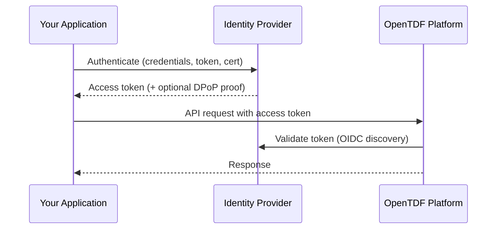
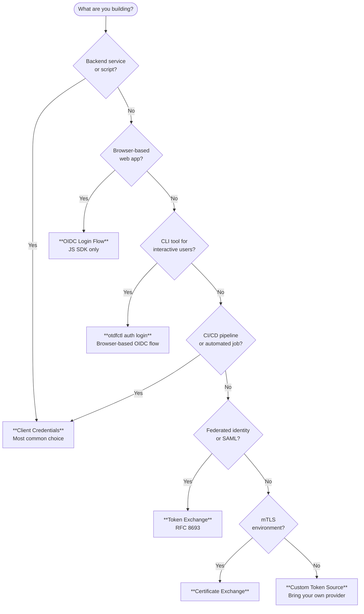

# Authentication Decision Guide

:::info What you'll learn
How to choose the right authentication method for your OpenTDF integration, based on your environment and use case.
:::

## How Authentication Works in OpenTDF

The OpenTDF platform is a **resource server** — it does not manage user identities or issue tokens. Instead, you bring your own OIDC-compatible identity provider (IdP), such as [Keycloak](https://www.keycloak.org/) (the reference implementation), and configure the platform to trust it.

The authentication flow looks like this:



Your choice of authentication method determines **how your application obtains tokens from the IdP**. The platform validates tokens against a trusted issuer, but a valid token alone is not sufficient — the token must also carry the correct audience (`aud`), required claims, and scopes for the request to succeed.

## Choose Your Authentication Method

Use this flowchart to find the right method for your situation:



## Scenario Matrix

| Scenario | Recommended Method | Notes |
|----------|-------------------|-------|
| Backend service / microservice | [Client Credentials](/sdks/authentication#client-credentials) | Most straightforward. SDK auto-refreshes tokens on expiry. |
| Web application (browser) | [OIDC Login Flow](/sdks/authentication#refresh-token) | JS SDK only. Your app completes an OIDC login to get an access token and optional refresh token. Never expose client secrets in browser code. |
| CLI tool (interactive user) | `otdfctl auth login` | Opens a browser for OIDC login. See [CLI auth docs](/components/cli/auth/login). |
| CI/CD pipeline / automated job | [Client Credentials](/sdks/authentication#client-credentials) | Use a dedicated service account. Rotate secrets regularly. |
| Federated identity / SAML | [Token Exchange](/sdks/authentication#token-exchange) | Exchange an existing token for one the platform accepts. |
| mTLS environment | [Certificate Exchange](/sdks/authentication#certificate-exchange-mtls) | Uses client certificates for transport-level auth. |
| Custom IdP integration | [Custom Token Source](/sdks/authentication#custom-token-source) | Implement the token provider interface in your SDK. |

## Getting Started

### Client Credentials (Backend Services)

The simplest path. Register a client in your IdP, then pass the client ID and secret to the SDK. The SDK handles token acquisition and refresh automatically.

**What you need:** A client ID and client secret from your IdP.

See [SDK code examples](/sdks/authentication#client-credentials) for Go, Java, and JavaScript.

### OIDC Login Flow (Browser Apps)

For browser-based applications, your app completes an [OIDC Authorization Code flow](https://openid.net/specs/openid-connect-core-1_0.html#CodeFlowAuth) to obtain an access token and (optionally) a refresh token from the IdP. The IdP returns both tokens after a successful `/token` call with a valid authorization code — though the refresh token is only issued if the IdP is configured to provide one. You then pass the refresh token to the JS SDK, which uses it to maintain a valid access token.

**What you need:** An access token and optional refresh token from a completed OIDC login flow.

See [SDK code examples](/sdks/authentication#refresh-token) (JavaScript only).

### Token Exchange (Federated Identity)

When your application already has a token from another identity system (SAML, external JWT), use token exchange to swap it for a token the platform trusts.

**What you need:** A valid JWT or SAML assertion from the source identity system.

See [SDK code examples](/sdks/authentication#token-exchange) for Go, Java, and JavaScript.

### Certificate Exchange (mTLS)

In environments that require mutual TLS, the SDK can use client certificates to authenticate with the IdP.

**What you need:** A client certificate and private key, plus the CA certificate chain.

See [SDK code examples](/sdks/authentication#certificate-exchange-mtls) for Go and Java.

### CLI Authentication

For interactive CLI usage, `otdfctl` handles authentication for you:

```bash
# Interactive login (opens browser)
otdfctl auth login --endpoint http://localhost:8080

# Non-interactive (for scripts)
otdfctl auth client-credentials --client-id my-client --client-secret my-secret

# Print your current access token (useful for debugging)
otdfctl auth print-access-token
```

See the [CLI auth command reference](/components/cli/auth/login) for all options.

## Development vs Production

### Local Development

The OpenTDF [quickstart](/quickstart) runs Keycloak with pre-configured defaults:

| Setting | Default value |
|---------|--------------|
| Platform endpoint | `http://localhost:8080` |
| OIDC origin | `http://localhost:8888/auth/realms/opentdf` |
| Client ID | `opentdf` |
| Client secret | `secret` |
| TLS | Disabled (plaintext) |
| DPoP | Enabled |

:::warning
These defaults are for development only. Do not use them in production.
:::

### Production Checklist

:::note
OpenTDF does not prescribe a specific deployment strategy. This checklist covers authentication-related concerns — your infrastructure, scaling, and orchestration choices are up to you.
:::

- [ ] **Enable TLS** — All connections to the platform and IdP must use HTTPS
- [ ] **Use strong client secrets** — Generate long, random secrets and store them securely (vault, environment variables — never in code)
- [ ] **Rotate secrets regularly** — Automate secret rotation where possible
- [ ] **Restrict scopes** — Request only the scopes your application needs
- [ ] **Enable DPoP** — Sender-constrained tokens protect against token theft (see [DPoP docs](/sdks/authentication#dpop-sender-constrained-tokens))
- [ ] **Set appropriate token lifetimes** — Short-lived access tokens with refresh tokens where applicable
- [ ] **Use a production-grade IdP** — Configure Keycloak (or your chosen IdP) for high availability, backups, and monitoring
- [ ] **Configure CORS** — Your application's origin must be registered as an allowed origin in both the IdP and the OpenTDF platform

## Common Pitfalls

### "I'm getting 401 Unauthorized"

- **Check your IdP URL.** The platform discovers the IdP via its well-known OIDC endpoint. Verify the `oidcOrigin` (JS), token endpoint (Go), or platform endpoint (Java) is correct.
- **Verify the client exists.** Ensure the client ID is registered in your IdP and the secret matches.
- **Check token audience.** The platform rejects tokens whose `aud` claim doesn't match the expected audience. Decode your token (e.g., at [jwt.io](https://jwt.io)) and verify the `aud` field matches what's configured in your platform's YAML config under the auth section.
- **Check CORS.** For browser-based apps, your application's origin must be allowed in both the IdP and OpenTDF platform configuration. CORS errors often appear as opaque network failures rather than clear 401 responses.

### "My token expired and I'm getting errors"

- **Client credentials:** The SDK refreshes automatically — if you're seeing expiry errors, check that your IdP is reachable.
- **OAuth token source (Go):** `WithOAuthAccessTokenSource` does not auto-refresh. Your `TokenSource` implementation must handle refresh.
- **Refresh token (JS):** Ensure the refresh token itself hasn't expired. Long-lived refresh tokens can be configured in your IdP.

### "DPoP-related errors"

- **IdP doesn't support DPoP:** Disable it with `disableDPoP: true` (JS) or configure your IdP to accept DPoP proofs.
- **Clock skew:** DPoP proofs include a timestamp. Ensure your server and IdP clocks are synchronized (NTP).
- **Key mismatch:** If you provide custom DPoP keys, ensure the same key pair is used for the lifetime of the session.

### "TLS/certificate errors"

- **Self-signed certs in development:** Use `useInsecurePlaintextConnection(true)` (Java) or configure your TLS settings to trust the development CA.
- **Missing CA certs:** Ensure the platform's CA certificate is in your trust store.
