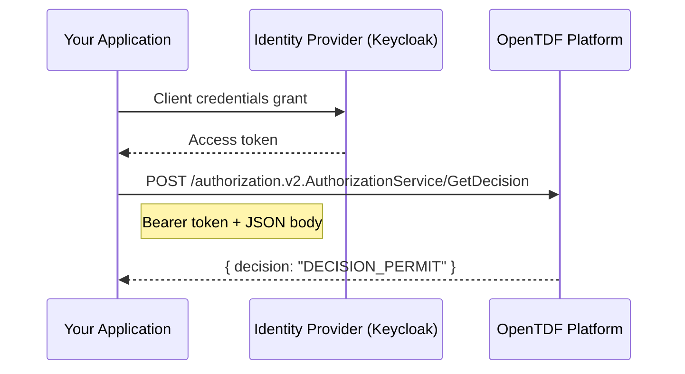

import Tabs from '@theme/Tabs';
import TabItem from '@theme/TabItem';

# Authorization REST API Guide

:::info What you'll learn
How to call the OpenTDF Authorization Service directly over HTTP — without an SDK — for server-side policy decisions in any language.
:::

The OpenTDF SDKs wrap these APIs for Go, Java, and browser-based JavaScript. If you're building a **server-side integration** in Node.js, Python, Ruby, or another language without an SDK, you can call the Authorization Service REST API directly. The platform's gRPC services are exposed over HTTP via [gRPC-Gateway](https://grpc-ecosystem.github.io/grpc-gateway/), so every endpoint accepts standard JSON `POST` requests.

This guide covers the full integration pattern: authentication, health checks, authorization decisions, and production best practices. For detailed type definitions and SDK-based examples, see the [Authorization SDK reference](/sdks/authorization). For request/response schemas, see the [Authorization OpenAPI reference](/OpenAPI-clients/authorization/v2).

## Architecture



Your application authenticates with the IdP once, caches the token, and makes authorization calls as needed. The platform validates the token on each request.

## Authentication {#authentication}

Obtain an access token using the [OAuth2 client credentials grant](https://oauth.net/2/grant-types/client-credentials/). You'll need a client ID and secret registered in your IdP (Keycloak is the reference implementation).

<Tabs>
<TabItem value="curl" label="curl">

```bash
curl -X POST "${OIDC_ENDPOINT}/protocol/openid-connect/token" \
  -H "Content-Type: application/x-www-form-urlencoded" \
  -d "grant_type=client_credentials" \
  -d "client_id=${CLIENT_ID}" \
  -d "client_secret=${CLIENT_SECRET}"
```

</TabItem>
<TabItem value="ts" label="TypeScript (fetch)">

```typescript
async function getClientToken(
  oidcEndpoint: string,
  clientId: string,
  clientSecret: string,
): Promise<{ accessToken: string; expiresAt: number }> {
  const response = await fetch(
    `${oidcEndpoint}/protocol/openid-connect/token`,
    {
      method: 'POST',
      headers: { 'Content-Type': 'application/x-www-form-urlencoded' },
      body: new URLSearchParams({
        grant_type: 'client_credentials',
        client_id: clientId,
        client_secret: clientSecret,
      }),
    },
  );

  if (!response.ok) {
    throw new Error(`Token request failed: ${response.status}`);
  }

  const data = await response.json();
  return {
    accessToken: data.access_token,
    // Refresh 30 seconds before actual expiry
    expiresAt: Date.now() + (data.expires_in - 30) * 1000,
  };
}
```

</TabItem>
<TabItem value="python" label="Python">

```python
import requests
import time

def get_client_token(oidc_endpoint: str, client_id: str, client_secret: str):
    response = requests.post(
        f"{oidc_endpoint}/protocol/openid-connect/token",
        data={
            "grant_type": "client_credentials",
            "client_id": client_id,
            "client_secret": client_secret,
        },
    )
    response.raise_for_status()
    data = response.json()
    return {
        "access_token": data["access_token"],
        # Refresh 30 seconds before actual expiry
        "expires_at": time.time() + data["expires_in"] - 30,
    }
```

</TabItem>
</Tabs>

:::warning Audience configuration
Your client credentials token must include an `audience` claim that matches your OpenTDF platform's URL. If the audience doesn't match, the platform will reject the token. Configure this in your IdP client settings — in Keycloak, set the client's audience mapper to include the platform URL.
:::

**Token caching:** The `expires_in` field tells you how long the token is valid (in seconds). Cache the token and refresh it before expiry — subtracting a 30-second buffer avoids race conditions on expiry boundaries.

See the [Authentication Decision Guide](/guides/authentication-guide) for help choosing the right auth method for your environment.

---

## Health Check {#health-check}

Before making authorization calls, verify the platform is reachable:

```bash
curl "${PLATFORM_URL}/healthz"
```

**Expected response:**

```json
{ "status": "SERVING" }
```

Any other status or a connection failure means the platform is unavailable. See [Best Practices](#best-practices) for how to handle this.

---

## Endpoint Reference {#endpoints}

All authorization endpoints accept `POST` requests with `Content-Type: application/json` and a `Bearer` token in the `Authorization` header.

| Endpoint | API Version | Description | Schema |
|----------|-------------|-------------|--------|
| `/authorization.v2.AuthorizationService/GetDecision` | v2 | Single entity + action + resource decision | [OpenAPI](/OpenAPI-clients/authorization/v2/authorization-v-2-authorization-service-get-decision) |
| `/authorization.v2.AuthorizationService/GetDecisionBulk` | v2 | Batch decisions for multiple entities/resources | [OpenAPI](/OpenAPI-clients/authorization/v2/authorization-v-2-authorization-service-get-decision-bulk) |
| `/authorization.v2.AuthorizationService/GetEntitlements` | v2 | List all attribute values an entity can access | [OpenAPI](/OpenAPI-clients/authorization/v2/authorization-v-2-authorization-service-get-entitlements) |
| `/v1/authorization` | v1 (legacy) | Batch decisions (v1 format) | [OpenAPI](/OpenAPI-clients/authorization/v1/authorization-authorization-service-get-decisions) |

:::tip Use v2 endpoints for new integrations
The v2 API has a cleaner request structure and supports per-resource decisions. The v1 API is still supported but considered legacy.
:::

---

## GetDecision {#get-decision}

Check whether a specific entity can perform an action on a resource. This is the core enforcement point. See the [OpenAPI schema](/OpenAPI-clients/authorization/v2/authorization-v-2-authorization-service-get-decision) for full request/response type definitions.

**Endpoint:** `POST /authorization.v2.AuthorizationService/GetDecision`

<details>
<summary>Example request</summary>

<Tabs>
<TabItem value="curl" label="curl">

```bash
curl -X POST "${PLATFORM_URL}/authorization.v2.AuthorizationService/GetDecision" \
  -H "Content-Type: application/json" \
  -H "Authorization: Bearer ${TOKEN}" \
  -d '{
    "entityIdentifier": {
      "entityChain": {
        "entities": [
          {
            "ephemeralId": "user-check",
            "emailAddress": "alice@example.com"
          }
        ]
      }
    },
    "action": { "name": "read" },
    "resource": {
      "ephemeralId": "room-123",
      "attributeValues": {
        "fqns": [
          "https://example.com/attr/clearance/value/confidential"
        ]
      }
    }
  }'
```

</TabItem>
<TabItem value="ts" label="TypeScript (fetch)">

```typescript
const response = await fetch(
  `${platformUrl}/authorization.v2.AuthorizationService/GetDecision`,
  {
    method: 'POST',
    headers: {
      'Content-Type': 'application/json',
      'Authorization': `Bearer ${token}`,
    },
    body: JSON.stringify({
      entityIdentifier: {
        entityChain: {
          entities: [
            {
              ephemeralId: 'user-check',
              emailAddress: 'alice@example.com',
            },
          ],
        },
      },
      action: { name: 'read' },
      resource: {
        ephemeralId: 'room-123',
        attributeValues: {
          fqns: [
            'https://example.com/attr/clearance/value/confidential',
          ],
        },
      },
    }),
  },
);

const result = await response.json();
const permitted = result.decision?.decision === 'DECISION_PERMIT';
```

</TabItem>
<TabItem value="python" label="Python">

```python
response = requests.post(
    f"{platform_url}/authorization.v2.AuthorizationService/GetDecision",
    headers={
        "Content-Type": "application/json",
        "Authorization": f"Bearer {token}",
    },
    json={
        "entityIdentifier": {
            "entityChain": {
                "entities": [
                    {
                        "ephemeralId": "user-check",
                        "emailAddress": "alice@example.com",
                    }
                ]
            }
        },
        "action": {"name": "read"},
        "resource": {
            "ephemeralId": "room-123",
            "attributeValues": {
                "fqns": [
                    "https://example.com/attr/clearance/value/confidential"
                ]
            },
        },
    },
)

result = response.json()
permitted = result.get("decision", {}).get("decision") == "DECISION_PERMIT"
```

</TabItem>
</Tabs>

</details>

**Response:**

```json
{
  "decision": {
    "ephemeralResourceId": "room-123",
    "decision": "DECISION_PERMIT",
    "requiredObligations": []
  }
}
```

The `decision` field will be one of:

| Value | Meaning |
|-------|---------|
| `DECISION_PERMIT` | Access allowed |
| `DECISION_DENY` | Access denied |
| `DECISION_UNSPECIFIED` | The platform could not evaluate the request — treat as deny |

If `requiredObligations` is non-empty on a permit response, your application must enforce those obligations (e.g., watermarking, audit logging). See [Obligations](/sdks/obligations) for details.

---

## GetDecisionBulk {#get-decision-bulk}

Evaluate multiple entities and resources in a single call. Each request entry can include multiple resources, and the response provides per-resource decisions. See the [OpenAPI schema](/OpenAPI-clients/authorization/v2/authorization-v-2-authorization-service-get-decision-bulk) for full request/response type definitions.

**Endpoint:** `POST /authorization.v2.AuthorizationService/GetDecisionBulk`

<details>
<summary>Example request</summary>

<Tabs>
<TabItem value="curl" label="curl">

```bash
curl -X POST "${PLATFORM_URL}/authorization.v2.AuthorizationService/GetDecisionBulk" \
  -H "Content-Type: application/json" \
  -H "Authorization: Bearer ${TOKEN}" \
  -d '{
    "decisionRequests": [
      {
        "entityIdentifier": {
          "entityChain": {
            "entities": [{ "ephemeralId": "user-1", "emailAddress": "alice@example.com" }]
          }
        },
        "action": { "name": "read" },
        "resources": [
          {
            "ephemeralId": "room-a",
            "attributeValues": {
              "fqns": ["https://example.com/attr/clearance/value/confidential"]
            }
          },
          {
            "ephemeralId": "room-b",
            "attributeValues": {
              "fqns": ["https://example.com/attr/clearance/value/public"]
            }
          }
        ]
      },
      {
        "entityIdentifier": {
          "entityChain": {
            "entities": [{ "ephemeralId": "user-2", "emailAddress": "bob@example.com" }]
          }
        },
        "action": { "name": "read" },
        "resources": [
          {
            "ephemeralId": "room-a",
            "attributeValues": {
              "fqns": ["https://example.com/attr/clearance/value/confidential"]
            }
          }
        ]
      }
    ]
  }'
```

</TabItem>
<TabItem value="ts" label="TypeScript (fetch)">

```typescript
const response = await fetch(
  `${platformUrl}/authorization.v2.AuthorizationService/GetDecisionBulk`,
  {
    method: 'POST',
    headers: {
      'Content-Type': 'application/json',
      'Authorization': `Bearer ${token}`,
    },
    body: JSON.stringify({
      decisionRequests: [
        {
          entityIdentifier: {
            entityChain: {
              entities: [{ ephemeralId: 'user-1', emailAddress: 'alice@example.com' }],
            },
          },
          action: { name: 'read' },
          resources: [
            {
              ephemeralId: 'room-a',
              attributeValues: {
                fqns: ['https://example.com/attr/clearance/value/confidential'],
              },
            },
            {
              ephemeralId: 'room-b',
              attributeValues: {
                fqns: ['https://example.com/attr/clearance/value/public'],
              },
            },
          ],
        },
        {
          entityIdentifier: {
            entityChain: {
              entities: [{ ephemeralId: 'user-2', emailAddress: 'bob@example.com' }],
            },
          },
          action: { name: 'read' },
          resources: [
            {
              ephemeralId: 'room-a',
              attributeValues: {
                fqns: ['https://example.com/attr/clearance/value/confidential'],
              },
            },
          ],
        },
      ],
    }),
  },
);

const result = await response.json();

for (const resp of result.decisionResponses) {
  for (const rd of resp.resourceDecisions) {
    console.log(`${rd.ephemeralResourceId}: ${rd.decision}`);
  }
}
```

</TabItem>
</Tabs>

</details>

**Response:**

```json
{
  "decisionResponses": [
    {
      "allPermitted": true,
      "resourceDecisions": [
        { "ephemeralResourceId": "room-a", "decision": "DECISION_PERMIT", "requiredObligations": [] },
        { "ephemeralResourceId": "room-b", "decision": "DECISION_PERMIT", "requiredObligations": [] }
      ]
    },
    {
      "allPermitted": false,
      "resourceDecisions": [
        { "ephemeralResourceId": "room-a", "decision": "DECISION_DENY", "requiredObligations": [] }
      ]
    }
  ]
}
```

:::caution Response ordering is index-matched
The `decisionResponses` array is **ordered to match the input `decisionRequests`** — the first response corresponds to the first request, and so on. The response does not include entity identifier information, so you must rely on this positional correspondence to associate decisions with entities. Use the `ephemeralResourceId` on each resource decision to match back to specific resources within a request.
:::

### Batching Strategy {#batching}

The platform enforces a **maximum of 200 decision requests per `GetDecisionBulk` call** (each with up to 1,000 resources). For large-scale evaluations (e.g., re-evaluating room membership for all users), split requests into batches:

- **Batch size:** Up to 200 decision requests per call (hard limit)
- **Concurrency:** 2–4 parallel requests
- **Why:** Keeps individual request latency manageable and avoids timeouts

<details>
<summary>Batching example (TypeScript)</summary>

```typescript
import pLimit from 'p-limit';

const BATCH_SIZE = 200;
const limit = pLimit(4);

// Split requests into batches
const batches = [];
for (let i = 0; i < allRequests.length; i += BATCH_SIZE) {
  batches.push(allRequests.slice(i, i + BATCH_SIZE));
}

// Execute batches with concurrency limit
const results = await Promise.all(
  batches.map((batch) =>
    limit(() =>
      fetch(`${platformUrl}/authorization.v2.AuthorizationService/GetDecisionBulk`, {
        method: 'POST',
        headers: {
          'Content-Type': 'application/json',
          'Authorization': `Bearer ${token}`,
        },
        body: JSON.stringify({ decisionRequests: batch }),
      }).then((r) => r.json()),
    ),
  ),
);
```

</details>

---

## GetEntitlements {#get-entitlements}

Returns all attribute values an entity is entitled to access, without checking against a specific resource. Use this for building UIs that show available data or pre-filtering content. See the [OpenAPI schema](/OpenAPI-clients/authorization/v2/authorization-v-2-authorization-service-get-entitlements) for full request/response type definitions.

**Endpoint:** `POST /authorization.v2.AuthorizationService/GetEntitlements`

<details>
<summary>Example request</summary>

<Tabs>
<TabItem value="curl" label="curl">

```bash
curl -X POST "${PLATFORM_URL}/authorization.v2.AuthorizationService/GetEntitlements" \
  -H "Content-Type: application/json" \
  -H "Authorization: Bearer ${TOKEN}" \
  -d '{
    "entityIdentifier": {
      "entityChain": {
        "entities": [
          {
            "ephemeralId": "user-1",
            "emailAddress": "alice@example.com"
          }
        ]
      }
    }
  }'
```

</TabItem>
<TabItem value="ts" label="TypeScript (fetch)">

```typescript
const response = await fetch(
  `${platformUrl}/authorization.v2.AuthorizationService/GetEntitlements`,
  {
    method: 'POST',
    headers: {
      'Content-Type': 'application/json',
      'Authorization': `Bearer ${token}`,
    },
    body: JSON.stringify({
      entityIdentifier: {
        entityChain: {
          entities: [
            {
              ephemeralId: 'user-1',
              emailAddress: 'alice@example.com',
            },
          ],
        },
      },
    }),
  },
);

const result = await response.json();

for (const entitlement of result.entitlements) {
  for (const [fqn, actions] of Object.entries(
    entitlement.actionsPerAttributeValueFqn,
  )) {
    console.log(`${fqn}: ${actions.actions.map((a) => a.name).join(', ')}`);
  }
}
```

</TabItem>
</Tabs>

</details>

**Response:**

```json
{
  "entitlements": [
    {
      "ephemeralId": "user-1",
      "actionsPerAttributeValueFqn": {
        "https://example.com/attr/clearance/value/public": {
          "actions": [{ "name": "read" }, { "name": "decrypt" }]
        },
        "https://example.com/attr/clearance/value/confidential": {
          "actions": [{ "name": "read" }]
        }
      }
    }
  ]
}
```

---

## Building Attribute FQNs {#attribute-fqns}

Attribute value FQNs (Fully Qualified Names) identify specific attribute values in the platform. They follow this pattern:

```
https://{namespace}/attr/{attribute-key}/value/{value}
```

**Examples:**

| Namespace | Attribute | Value | FQN |
|-----------|-----------|-------|-----|
| `example.com` | `clearance` | `confidential` | `https://example.com/attr/clearance/value/confidential` |
| `opentdf.io` | `department` | `finance` | `https://opentdf.io/attr/department/value/finance` |
| `mycompany.com` | `region` | `eu-west` | `https://mycompany.com/attr/region/value/eu-west` |

If your application stores attributes as key-value pairs, build FQNs like this:

```typescript
function buildAttributeFqns(
  namespace: string,
  attributes: { key: string; values: string[] }[],
): string[] {
  return attributes.flatMap((attr) =>
    attr.values.map(
      (value) => `https://${namespace}/attr/${attr.key}/value/${value}`,
    ),
  );
}

// Example:
buildAttributeFqns('example.com', [
  { key: 'clearance', values: ['confidential', 'secret'] },
  { key: 'department', values: ['finance'] },
]);
// [
//   "https://example.com/attr/clearance/value/confidential",
//   "https://example.com/attr/clearance/value/secret",
//   "https://example.com/attr/department/value/finance",
// ]
```

---

## Building Entity Identifiers {#entity-identifiers}

Every authorization call requires an entity identifier — the user or service you're asking about. The `entityIdentifier` field accepts one of the following (mutually exclusive):

### Option 1: Entity Chain

Use `entityChain` when you know the entity's email, client ID, or username. Each entity in the chain has an `ephemeralId` (a correlation ID you assign) and one identifier field:

| Field | Use case |
|-------|----------|
| `emailAddress` | Most common for human users |
| `clientId` | Service accounts / non-person entities |
| `userName` | When username is the primary identifier |

```json
{
  "entityIdentifier": {
    "entityChain": {
      "entities": [
        {
          "ephemeralId": "some-correlation-id",
          "emailAddress": "alice@example.com"
        }
      ]
    }
  }
}
```

To use a different identifier type, swap the identifier field:

```json
{ "ephemeralId": "svc-1", "clientId": "my-service-account" }
```

```json
{ "ephemeralId": "user-1", "userName": "alice" }
```

### Option 2: JWT Token

Use `token` to let the platform resolve the entity from a JWT. This is a **top-level alternative** to `entityChain` — it replaces the entire `entityChain` block:

```json
{
  "entityIdentifier": {
    "token": {
      "ephemeralId": "token-correlation-id",
      "jwt": "eyJhbGciOiJSUzI1NiIs..."
    }
  }
}
```

The `ephemeralId` is a correlation ID you assign — it appears in the response so you can match results to requests.

For full details on all entity identifier options, see [EntityIdentifier](/sdks/authorization#entityidentifier) in the SDK reference.

---

## Best Practices {#best-practices}

### Fail Closed {#fail-closed}

If the platform is unreachable or returns an error, **deny access by default**. Never fall back to "allow" when you can't verify authorization.

```typescript
async function canAccess(
  platformUrl: string,
  token: string,
  request: object,
): Promise<boolean> {
  try {
    const response = await fetch(
      `${platformUrl}/authorization.v2.AuthorizationService/GetDecision`,
      {
        method: 'POST',
        headers: {
          'Content-Type': 'application/json',
          'Authorization': `Bearer ${token}`,
        },
        body: JSON.stringify(request),
      },
    );

    if (!response.ok) {
      return false; // Platform error — deny
    }

    const result = await response.json();
    return result.decision?.decision === 'DECISION_PERMIT';
  } catch {
    return false; // Network error — deny
  }
}
```

### Token Caching {#token-caching}

Don't request a new token for every authorization call. Cache the token and refresh it before it expires:

```typescript
let tokenCache: { accessToken: string; expiresAt: number } | null = null;

async function getToken(): Promise<string> {
  if (tokenCache && Date.now() < tokenCache.expiresAt) {
    return tokenCache.accessToken;
  }
  tokenCache = await getClientToken(oidcEndpoint, clientId, clientSecret);
  return tokenCache.accessToken;
}
```

### Request Timeouts {#timeouts}

Set timeouts on all HTTP calls to avoid hanging requests. A 10-second timeout is a reasonable default for authorization calls:

```typescript
const controller = new AbortController();
const timeout = setTimeout(() => controller.abort(), 10000);

try {
  const response = await fetch(url, {
    ...options,
    signal: controller.signal,
  });
  // handle response
} finally {
  clearTimeout(timeout);
}
```

### Use GetDecisionBulk for Multiple Checks {#prefer-bulk}

If you need to check authorization for multiple users or resources, use [GetDecisionBulk](#get-decision-bulk) instead of calling [GetDecision](#get-decision) in a loop. A single bulk request with 100 entries is significantly faster than 100 individual requests.

### Handle Obligations {#obligations}

When `requiredObligations` is non-empty in a permit response, your application is responsible for enforcing those obligations (e.g., watermarking, audit logging, DRM). A permit with unfulfilled obligations should be treated as a deny. See [Obligations](/sdks/obligations) for details.

---

## Production Checklist {#production-checklist}

- [ ] **TLS everywhere** — all connections to the platform and IdP use HTTPS
- [ ] **Secrets in a vault** — client ID and secret stored securely, not in code
- [ ] **Token caching** — tokens are cached and refreshed before expiry
- [ ] **Fail closed** — access is denied when the platform is unreachable
- [ ] **Request timeouts** — all HTTP calls have explicit timeouts
- [ ] **Health monitoring** — periodic `/healthz` checks with alerting
- [ ] **Batch where possible** — use `GetDecisionBulk` for multi-user/resource checks
- [ ] **Obligation enforcement** — `requiredObligations` are checked and fulfilled
- [ ] **Logging** — authorization decisions are logged for audit
- [ ] **Secret rotation** — client secrets are rotated on a regular schedule
