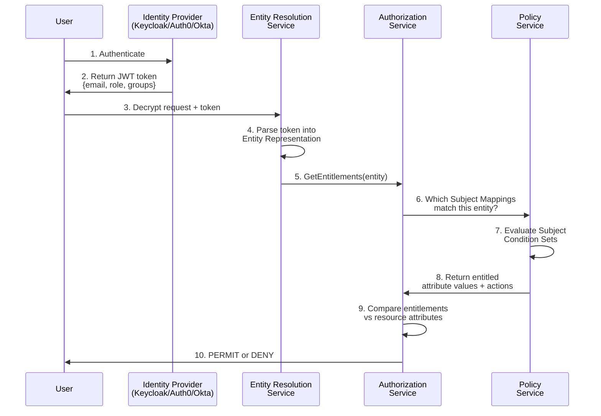
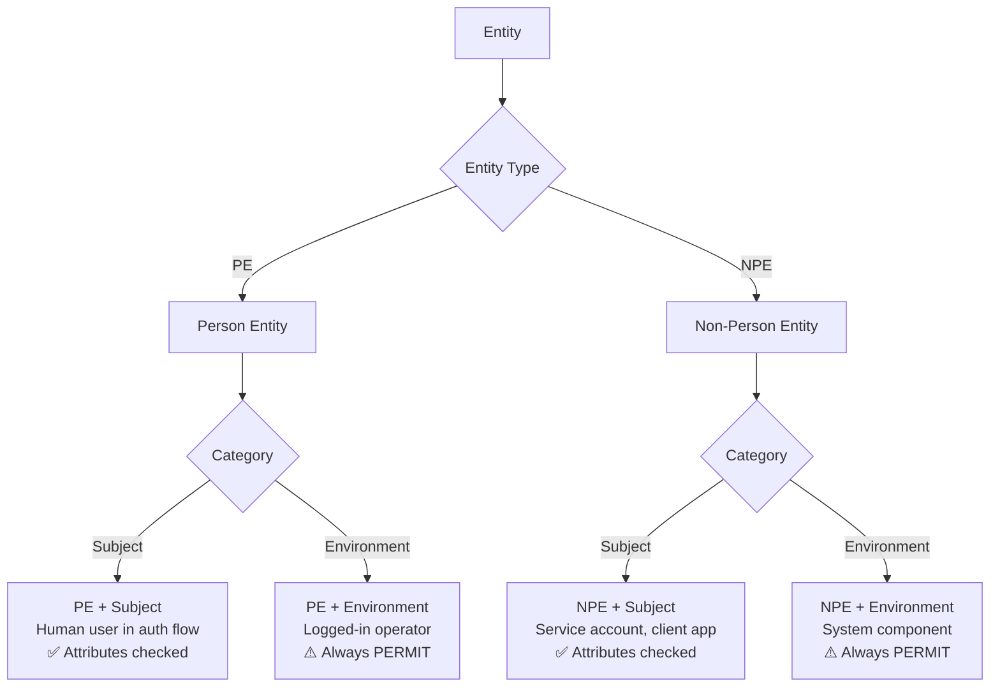

# Subject Mapping: Comprehensive Guide

:::info What You'll Learn
This guide explains how OpenTDF connects user identities from your Identity Provider (IdP) to attribute-based access control. You'll understand:
- **Why** Subject Mappings exist (vs. direct IdP attribute mapping)
- **How** authentication flows through Entity Resolution to authorization decisions
- **When** to use enumerated vs. dynamic attribute values
- **How to troubleshoot** common Subject Mapping errors
:::

## The Core Problem: Why Subject Mappings Exist

### ❌ Common Misconception

Many developers expect this direct flow:

```
IdP User Attribute → OpenTDF Attribute → Access Decision
    (role=admin)        (clearance=top_secret)    (PERMIT/DENY)
```

**This doesn't work.** OpenTDF attributes define **what can be accessed**, not **who can access it**.

### ✅ How It Actually Works

OpenTDF uses a three-layer architecture:

```
1. IdP Attributes       →  User has role=admin, department=finance
                          (Identity Claims)

2. Subject Mappings     →  IF role=admin THEN grant clearance/top_secret
                          (Entitlement Rules)

3. OpenTDF Attributes   →  Document requires clearance/top_secret
                          (Resource Protection)
```

**Subject Mappings** are the bridge: they convert **identity claims** into **access entitlements**.

:::tip Key Insight
- **IdP attributes** describe WHO the user is
- **Subject Mappings** determine WHAT the user can access
- **OpenTDF attributes** define WHAT protects the resource

Subject Mappings answer: "Given this identity, what entitlements should they receive?"
:::

## Architecture: The Complete Flow

### High-Level Data Flow



### Detailed Step-by-Step

#### Step 1-2: User Authentication
```json
// User authenticates with IdP, receives JWT token
{
  "sub": "alice@example.com",
  "email": "alice@example.com",
  "role": "vice_president",
  "department": "finance",
  "groups": ["executives", "finance-team"]
}
```

#### Step 3-4: Entity Resolution
The token is parsed into an **Entity Representation** - a normalized view of the user's identity:

```json
{
  "ephemeral_id": "jwtentity-1",
  "category": "CATEGORY_SUBJECT",
  "claims": {
    "email": "alice@example.com",
    "role": "vice_president",
    "department": "finance",
    "groups": ["executives", "finance-team"]
  }
}
```

:::warning Entity Types Confusion
You may see TWO entities in authorization logs:
- `jwtentity-0`: The **client application** (NPE - Non-Person Entity)
- `jwtentity-1`: The **user** (PE - Person Entity)

**Both need Subject Mappings** if both need attribute access. For SDK decryption, typically the client (`jwtentity-0`) needs mappings based on `.clientId`.
:::

#### Step 5-8: Subject Mapping Evaluation

The Authorization Service queries the Policy Service: "Which Subject Mappings apply to this entity?"

**Subject Mapping Example:**
```json
{
  "id": "sm-001",
  "attribute_value_id": "attr-clearance-executive",
  "actions": ["STANDARD_ACTION_DECRYPT"],
  "subject_condition_set": {
    "subject_sets": [{
      "condition_groups": [{
        "boolean_operator": "AND",
        "conditions": [{
          "subject_external_selector_value": ".role",
          "operator": "IN",
          "subject_external_values": ["vice_president", "ceo", "cfo"]
        }]
      }]
    }]
  }
}
```

**Evaluation Logic:**
1. Extract `.role` from entity representation → `"vice_president"`
2. Check if `"vice_president"` is IN `["vice_president", "ceo", "cfo"]` → ✅ TRUE
3. Grant entitlement: `clearance/executive` with `DECRYPT` action

#### Step 9-10: Authorization Decision

```json
// Entity's Entitlements:
{
  "attribute_values": [
    {
      "attribute": "https://example.com/attr/clearance/value/executive",
      "actions": ["DECRYPT"]
    }
  ]
}

// Resource Requirements:
{
  "attributes": [
    "https://example.com/attr/clearance/value/executive"
  ]
}

// Decision: PERMIT (entitlements satisfy requirements)
```

## Entity Types and Categories

Understanding entity types is critical for Subject Mapping configuration.

### Entity Type vs. Entity Category

| Dimension | Options | Meaning |
|-----------|---------|---------|
| **Entity Type** | PE (Person)<br/>NPE (Non-Person) | WHO the entity is |
| **Entity Category** | Subject<br/>Environment | HOW it's used in decisions |

### The Four Combinations



### Practical Examples

**Person Entity + Subject Category (Most Common)**
```json
{
  "type": "PE",
  "category": "CATEGORY_SUBJECT",
  "claims": {
    "email": "alice@example.com",
    "role": "engineer"
  }
}
```
→ Subject Mapping checks: Does Alice have the right entitlements?

**Non-Person Entity + Subject Category (SDK Clients)**
```json
{
  "type": "NPE",
  "category": "CATEGORY_SUBJECT",
  "claims": {
    "clientId": "data-processing-service",
    "scope": "tdf:decrypt"
  }
}
```
→ Subject Mapping checks: Does this service account have the right entitlements?

**Environment Category (Auto-PERMIT)**
```json
{
  "type": "NPE",
  "category": "CATEGORY_ENVIRONMENT",
  "claims": {
    "systemComponent": "internal-backup-job"
  }
}
```
→ **No attribute checking**. Always returns PERMIT. Use for trusted system components.

:::danger Security Warning
Environment entities **bypass all attribute checks**. Only use for fully trusted system components that should always have access (e.g., backup services, monitoring tools).
:::

## Subject Condition Sets: The Matching Engine

A **Subject Condition Set** is a logical expression that evaluates an entity representation to `true` or `false`.

### Structure Hierarchy

```
SubjectConditionSet
  └─ SubjectSets[]           (OR'd together - ANY set can match)
      └─ ConditionGroups[]   (Combined by boolean operator)
          └─ Conditions[]    (Combined by boolean operator)
              ├─ SubjectExternalSelectorValue  (JMESPath to extract claim)
              ├─ Operator                      (IN, NOT_IN, IN_CONTAINS)
              └─ SubjectExternalValues         (Values to match)
```

### Operators Explained

| Operator | Value | Behavior | Example |
|----------|-------|----------|---------|
| **IN** | `1` | Exact match: value is IN list | `.role` IN `["admin", "editor"]` |
| **NOT_IN** | `2` | Exclusion: value is NOT IN list | `.department` NOT_IN `["sales"]` |
| **IN_CONTAINS** | `3` | Substring match | `.email` IN_CONTAINS `["@example.com"]` |

### Boolean Operators

| Operator | Value | Behavior |
|----------|-------|----------|
| **AND** | `1` | All conditions must be TRUE |
| **OR** | `2` | At least one condition must be TRUE |

### Example 1: Simple Role Match

**Goal:** Grant access to users with role "admin"

```json
{
  "subject_sets": [{
    "condition_groups": [{
      "boolean_operator": 1,
      "conditions": [{
        "subject_external_selector_value": ".role",
        "operator": 1,
        "subject_external_values": ["admin"]
      }]
    }]
  }]
}
```

**Matches:**
- ✅ `{"role": "admin"}`
- ❌ `{"role": "editor"}`

### Example 2: Multiple Roles (OR)

**Goal:** Grant access to admins OR editors

```json
{
  "subject_sets": [{
    "condition_groups": [{
      "boolean_operator": 2,
      "conditions": [
        {
          "subject_external_selector_value": ".role",
          "operator": 1,
          "subject_external_values": ["admin"]
        },
        {
          "subject_external_selector_value": ".role",
          "operator": 1,
          "subject_external_values": ["editor"]
        }
      ]
    }]
  }]
}
```

**Simpler Alternative (Same Logic):**
```json
{
  "subject_sets": [{
    "condition_groups": [{
      "boolean_operator": 1,
      "conditions": [{
        "subject_external_selector_value": ".role",
        "operator": 1,
        "subject_external_values": ["admin", "editor"]
      }]
    }]
  }]
}
```

### Example 3: Multiple Conditions (AND)

**Goal:** Grant access to senior engineers only

```json
{
  "subject_sets": [{
    "condition_groups": [{
      "boolean_operator": 1,
      "conditions": [
        {
          "subject_external_selector_value": ".level",
          "operator": 1,
          "subject_external_values": ["senior", "staff", "principal"]
        },
        {
          "subject_external_selector_value": ".department",
          "operator": 1,
          "subject_external_values": ["engineering"]
        }
      ]
    }]
  }]
}
```

**Matches:**
- ✅ `{"level": "senior", "department": "engineering"}`
- ✅ `{"level": "staff", "department": "engineering"}`
- ❌ `{"level": "senior", "department": "sales"}`
- ❌ `{"level": "junior", "department": "engineering"}`

### Example 4: Domain Email Match (Substring)

**Goal:** Grant access to anyone with company email

```json
{
  "subject_sets": [{
    "condition_groups": [{
      "boolean_operator": 1,
      "conditions": [{
        "subject_external_selector_value": ".email",
        "operator": 3,
        "subject_external_values": ["@example.com"]
      }]
    }]
  }]
}
```

**Matches:**
- ✅ `{"email": "alice@example.com"}`
- ✅ `{"email": "bob@example.com"}`
- ❌ `{"email": "charlie@external.com"}`

### Example 5: Complex Multi-Group Logic

**Goal:** Grant access to:
- Executives (any department), OR
- Senior finance staff

```json
{
  "subject_sets": [
    {
      "condition_groups": [{
        "boolean_operator": 1,
        "conditions": [{
          "subject_external_selector_value": ".role",
          "operator": 1,
          "subject_external_values": ["ceo", "cfo", "cto", "vp"]
        }]
      }]
    },
    {
      "condition_groups": [{
        "boolean_operator": 1,
        "conditions": [
          {
            "subject_external_selector_value": ".level",
            "operator": 1,
            "subject_external_values": ["senior", "staff"]
          },
          {
            "subject_external_selector_value": ".department",
            "operator": 1,
            "subject_external_values": ["finance"]
          }
        ]
      }]
    }
  ]
}
```

**Logic:** `(role IN executives) OR (level IN senior-staff AND department=finance)`

**Matches:**
- ✅ `{"role": "ceo", "department": "engineering"}` (executive)
- ✅ `{"level": "senior", "department": "finance"}` (senior finance)
- ❌ `{"level": "senior", "department": "engineering"}` (not finance)
- ❌ `{"level": "junior", "department": "finance"}` (not senior)

## Enumerated vs. Dynamic Attribute Values

:::info Common Question
**Question:** "Can I use freeform/dynamic values in attributes, or do they have to be pre-enumerated?"

**Answer:** Both are supported, but they work differently.
:::

### Enumerated Attributes (Fixed Values)

**When to use:** Attributes with a known, limited set of values

**Examples:**
- Clearance levels: `public`, `confidential`, `secret`, `top_secret`
- Departments: `engineering`, `finance`, `sales`, `hr`
- Regions: `us-west`, `us-east`, `eu-central`, `ap-south`

**Definition:**
```json
{
  "namespace": "example.com",
  "name": "clearance",
  "rule": "HIERARCHY",
  "values": [
    {"value": "public"},
    {"value": "confidential"},
    {"value": "secret"},
    {"value": "top_secret"}
  ]
}
```

**Subject Mapping:**
```json
{
  "attribute_value_id": "attr-clearance-secret",
  "actions": ["DECRYPT"],
  "subject_condition_set": {
    "subject_sets": [{
      "condition_groups": [{
        "boolean_operator": 1,
        "conditions": [{
          "subject_external_selector_value": ".clearance_level",
          "operator": 1,
          "subject_external_values": ["secret", "top_secret"]
        }]
      }]
    }]
  }
}
```

### Dynamic Attributes (Freeform Values)

**When to use:** Attributes with unbounded, user-specific values

**Examples:**
- Email addresses: `alice@example.com`, `bob@company.org`
- User IDs: `user-12345`, `service-account-xyz`
- Project codes: `proj-2024-Q1-alpha`, `initiative-mars`

**Definition (NO values array):**
```json
{
  "namespace": "example.com",
  "name": "owner_email",
  "rule": "ANY_OF"
  // Note: No "values" array - accepts any string
}
```

**Creating Dynamic Attribute Value:**

When encrypting, you can create attribute values on-the-fly:

```bash
# Create attribute value for specific email
otdfctl policy attributes values create \
  --attribute-id <attribute-id> \
  --value "alice@example.com"

# Encrypt with this specific value
otdfctl encrypt file.txt -o file.tdf \
  --attr https://example.com/attr/owner_email/value/alice@example.com
```

**Subject Mapping for Dynamic Values:**

Here's the key insight: **You create Subject Mappings for the PATTERN, not every individual value.**

**Option 1: Exact Match (One Mapping Per User)**
```json
{
  "attribute_value_id": "attr-owner-alice",  // Points to value="alice@example.com"
  "actions": ["DECRYPT"],
  "subject_condition_set": {
    "subject_sets": [{
      "condition_groups": [{
        "boolean_operator": 1,
        "conditions": [{
          "subject_external_selector_value": ".email",
          "operator": 1,
          "subject_external_values": ["alice@example.com"]
        }]
      }]
    }]
  }
}
```

**Problem:** This requires creating a new Subject Mapping for every user. Not scalable.

**Option 2: Dynamic Self-Service (Recommended)**

Use a **generic Subject Mapping** that matches the token claim to the attribute value:

```json
{
  "attribute_value_id": "attr-owner-{{EMAIL}}",  // Placeholder
  "actions": ["DECRYPT"],
  "subject_condition_set": {
    "subject_sets": [{
      "condition_groups": [{
        "boolean_operator": 1,
        "conditions": [{
          "subject_external_selector_value": ".email",
          "operator": 3,  // IN_CONTAINS for substring match
          "subject_external_values": ["@example.com"]  // Any company email
        }]
      }]
    }]
  }
}
```

:::tip Advanced Pattern: Self-Service Attributes
For true self-service (user can access resources tagged with their own email), use **Entity Resolution** with attribute value creation:

1. Define attribute without enumeration
2. When encrypting, dynamically create attribute value: `owner_email/alice@example.com`
3. Subject Mapping grants access IF token email matches attribute value

This pattern requires custom Entity Resolution logic or attribute value auto-creation. Contact OpenTDF maintainers for implementation guidance.
:::

### Comparison Table

| Aspect | Enumerated Attributes | Dynamic Attributes |
|--------|----------------------|-------------------|
| **Values defined** | Yes (fixed list) | No (any string) |
| **Subject Mapping** | Maps claims to specific values | Maps claims to value pattern |
| **Scalability** | Good for 5-100 values | Required for 1000s+ values |
| **Example** | `clearance/secret` | `owner/alice@example.com` |
| **Use case** | Role-based access | User-specific access |

## IdP Integration Examples

### Keycloak

**Common Keycloak Token Claims:**
```json
{
  "sub": "f4d3c2b1-a098-7654-3210-fedcba098765",
  "email": "alice@example.com",
  "preferred_username": "alice",
  "realm_access": {
    "roles": ["admin", "user"]
  },
  "resource_access": {
    "opentdf-app": {
      "roles": ["tdf-admin"]
    }
  },
  "groups": ["/finance/senior", "/engineering/platform"]
}
```

#### Example 1: Map Keycloak Realm Roles

**IdP Configuration:**
- User "alice" has Keycloak role: `admin`

**Subject Condition Set:**
```json
{
  "subject_sets": [{
    "condition_groups": [{
      "boolean_operator": 1,
      "conditions": [{
        "subject_external_selector_value": ".realm_access.roles",
        "operator": 1,
        "subject_external_values": ["admin"]
      }]
    }]
  }]
}
```

**Result:** Alice gets entitlement for attribute value (e.g., `clearance/top_secret`)

#### Example 2: Map Keycloak Groups

**IdP Configuration:**
- User "bob" is in Keycloak group: `/finance/senior`

**Subject Condition Set:**
```json
{
  "subject_sets": [{
    "condition_groups": [{
      "boolean_operator": 1,
      "conditions": [{
        "subject_external_selector_value": ".groups",
        "operator": 3,
        "subject_external_values": ["/finance/"]
      }]
    }]
  }]
}
```

**Result:** Bob gets entitlement for `department/finance` attribute

#### Example 3: Combine Multiple Keycloak Claims

**Goal:** Grant access to finance admins

**Subject Condition Set:**
```json
{
  "subject_sets": [{
    "condition_groups": [{
      "boolean_operator": 1,
      "conditions": [
        {
          "subject_external_selector_value": ".groups",
          "operator": 3,
          "subject_external_values": ["/finance/"]
        },
        {
          "subject_external_selector_value": ".realm_access.roles",
          "operator": 1,
          "subject_external_values": ["admin"]
        }
      ]
    }]
  }]
}
```

**Logic:** `(group contains "/finance/") AND (role is "admin")`

### Auth0

**Common Auth0 Token Claims:**
```json
{
  "sub": "auth0|507f1f77bcf86cd799439011",
  "email": "alice@example.com",
  "email_verified": true,
  "nickname": "alice",
  "https://example.com/roles": ["editor", "viewer"],
  "https://example.com/department": "engineering",
  "https://example.com/clearance": "secret"
}
```

:::info Auth0 Namespaced Claims
Auth0 requires custom claims to use namespaced keys (e.g., `https://example.com/roles`). Use these in Subject Condition Sets with the full namespace.
:::

#### Example 1: Map Auth0 Custom Roles

**IdP Configuration:**
- User has custom claim: `https://example.com/roles: ["editor"]`

**Subject Condition Set:**
```json
{
  "subject_sets": [{
    "condition_groups": [{
      "boolean_operator": 1,
      "conditions": [{
        "subject_external_selector_value": ".\"https://example.com/roles\"",
        "operator": 1,
        "subject_external_values": ["editor", "admin"]
      }]
    }]
  }]
}
```

:::warning Escaping Special Characters
JMESPath requires escaping keys with special characters. Use `.\""https://example.com/roles\"` for namespaced Auth0 claims.
:::

#### Example 2: Map Auth0 Metadata

**IdP Configuration:**
- User has `app_metadata`: `{"clearance_level": "confidential", "department": "finance"}`

**Auth0 Rule to Add to Token:**
```javascript
function addMetadataToToken(user, context, callback) {
  const namespace = 'https://example.com/';
  context.idToken[namespace + 'clearance'] = user.app_metadata.clearance_level;
  context.idToken[namespace + 'department'] = user.app_metadata.department;
  callback(null, user, context);
}
```

**Subject Condition Set:**
```json
{
  "subject_sets": [{
    "condition_groups": [{
      "boolean_operator": 1,
      "conditions": [{
        "subject_external_selector_value": ".\"https://example.com/clearance\"",
        "operator": 1,
        "subject_external_values": ["confidential", "secret", "top_secret"]
      }]
    }]
  }]
}
```

### Okta

**Common Okta Token Claims:**
```json
{
  "sub": "00u1a2b3c4d5e6f7g8h9",
  "email": "alice@example.com",
  "email_verified": true,
  "groups": ["Engineering", "Senior-Staff"],
  "department": "engineering",
  "title": "Senior Engineer",
  "clearanceLevel": "confidential"
}
```

#### Example 1: Map Okta Groups

**IdP Configuration:**
- User is member of Okta group: "Engineering"

**Subject Condition Set:**
```json
{
  "subject_sets": [{
    "condition_groups": [{
      "boolean_operator": 1,
      "conditions": [{
        "subject_external_selector_value": ".groups",
        "operator": 1,
        "subject_external_values": ["Engineering", "Product"]
      }]
    }]
  }]
}
```

#### Example 2: Map Okta Profile Attributes

**IdP Configuration:**
- User profile has custom attribute: `clearanceLevel: "confidential"`

**Okta Configuration (Claims):**
Add custom claim mapping in Okta:
- Claim name: `clearanceLevel`
- Value: `user.clearanceLevel`

**Subject Condition Set:**
```json
{
  "subject_sets": [{
    "condition_groups": [{
      "boolean_operator": 1,
      "conditions": [{
        "subject_external_selector_value": ".clearanceLevel",
        "operator": 1,
        "subject_external_values": ["confidential", "secret"]
      }]
    }]
  }]
}
```

#### Example 3: Combine Okta Claims

**Goal:** Grant access to senior engineers with confidential clearance

**Subject Condition Set:**
```json
{
  "subject_sets": [{
    "condition_groups": [{
      "boolean_operator": 1,
      "conditions": [
        {
          "subject_external_selector_value": ".department",
          "operator": 1,
          "subject_external_values": ["engineering"]
        },
        {
          "subject_external_selector_value": ".title",
          "operator": 3,
          "subject_external_values": ["Senior", "Staff", "Principal"]
        },
        {
          "subject_external_selector_value": ".clearanceLevel",
          "operator": 1,
          "subject_external_values": ["confidential", "secret", "top_secret"]
        }
      ]
    }]
  }]
}
```

**Logic:** `(department="engineering") AND (title contains "Senior"/"Staff"/"Principal") AND (clearance >= confidential)`

## Creating Subject Mappings: Step-by-Step

### Prerequisites

1. **OpenTDF Platform running** with authentication configured
2. **otdfctl installed and authenticated**
3. **Attributes and values created** (the resources you're protecting)

### Step 1: Create Subject Condition Set

```bash
otdfctl policy subject-condition-sets create \
  --subject-sets '[
    {
      "condition_groups": [{
        "boolean_operator": 1,
        "conditions": [{
          "subject_external_selector_value": ".email",
          "operator": 3,
          "subject_external_values": ["@example.com"]
        }]
      }]
    }
  ]'
```

**Save the ID from output:**
```console
SUCCESS   Created SubjectConditionSet [3c56a6c9-9635-427f-b808-5e8fd395802c]
```

### Step 2: Get Attribute Value ID

```bash
# List attribute values for an attribute
otdfctl policy attributes values list \
  --attribute-id <your-attribute-id>

# Or create a new value
otdfctl policy attributes values create \
  --attribute-id <your-attribute-id> \
  --value "my-value"
```

**Save the attribute value ID:**
```console
4c63e72a-2db9-434c-8ef6-e451473dbfe0  |  clearance/secret
```

### Step 3: Create Subject Mapping

```bash
otdfctl policy subject-mappings create \
  --attribute-value-id 4c63e72a-2db9-434c-8ef6-e451473dbfe0 \
  --action-standard DECRYPT \
  --subject-condition-set-id 3c56a6c9-9635-427f-b808-5e8fd395802c
```

**Success:**
```console
SUCCESS   Created SubjectMapping [sm-789xyz]
```

### Step 4: Verify

```bash
# List all subject mappings
otdfctl policy subject-mappings list

# Get specific mapping details
otdfctl policy subject-mappings get --id sm-789xyz
```

## Troubleshooting

### Error: "resource relation invalid"

**Full Error:**
```
rpc error: code = InvalidArgument desc = resource relation invalid
```

**Causes:**
1. **Invalid Attribute Value ID**: The attribute value doesn't exist
2. **Invalid Subject Condition Set ID**: The condition set doesn't exist
3. **Action mismatch**: Using incompatible action types

**Solutions:**

**Verify attribute value exists:**
```bash
otdfctl policy attributes values list --attribute-id <attribute-id>
```

**Verify subject condition set exists:**
```bash
otdfctl policy subject-condition-sets list
```

**Check action format:**
```bash
# Correct
--action-standard DECRYPT

# Also correct
--action-standard "STANDARD_ACTION_DECRYPT"

# Wrong - don't mix action types
--action-standard DECRYPT --action-custom "custom.action"
```

### Error: Token Claim Not Appearing in Entitlements

**Symptom:** User has claim in JWT, but Subject Mapping doesn't match

**Debug Steps:**

**1. Verify token claims:**
```bash
# Decode your JWT token
echo "<your-jwt>" | base64 -d
```

**2. Check JMESPath selector:**

The selector must match the exact structure of your token. Test with JMESPath:

```javascript
// Token:
{
  "user": {
    "profile": {
      "department": "finance"
    }
  }
}

// Correct selector:
".user.profile.department"

// Wrong:
".department"  // Won't find nested value
```

**3. Check operator type:**

```json
// If claim is an array:
{
  "groups": ["admin", "user"]
}

// Use IN to check array membership:
{
  "subject_external_selector_value": ".groups",
  "operator": 1,
  "subject_external_values": ["admin"]
}
```

**4. Enable debug logging:**

Contact your OpenTDF administrator to enable debug logging for Subject Mapping evaluation.

### Error: User Has Entitlement But Still Gets DENY

**Symptom:** Authorization logs show:
```
jwtentity-1 (user): PERMIT
jwtentity-0 (client): DENY
Overall decision: DENY
```

**Cause:** **Both entities need Subject Mappings** when using SDK clients.

**Solution:**

Create Subject Mapping for the **client entity** based on `.clientId`:

```bash
# Create condition set for client
otdfctl policy subject-condition-sets create \
  --subject-sets '[
    {
      "condition_groups": [{
        "boolean_operator": 1,
        "conditions": [{
          "subject_external_selector_value": ".clientId",
          "operator": 1,
          "subject_external_values": ["my-app-client-id"]
        }]
      }]
    }
  ]'

# Create subject mapping for client
otdfctl policy subject-mappings create \
  --attribute-value-id <same-attribute-value-id> \
  --action-standard DECRYPT \
  --subject-condition-set-id <client-condition-set-id>
```

### Error: Subject Condition Set Not Found

**Symptom:**
```
subject-condition-set not found: <id>
```

**Cause:** The Subject Condition Set was deleted or never created.

**Solution:**

**List existing condition sets:**
```bash
otdfctl policy subject-condition-sets list
```

**If missing, recreate:**
```bash
otdfctl policy subject-condition-sets create \
  --subject-sets '<your-condition-json>'
```

**Update Subject Mapping to use correct ID:**
```bash
otdfctl policy subject-mappings update \
  --id <subject-mapping-id> \
  --subject-condition-set-id <correct-id>
```

### Debugging Checklist

When Subject Mappings aren't working:

- [ ] Verify OpenTDF platform is running and accessible
- [ ] Confirm user is authenticated (valid JWT token)
- [ ] Check token contains expected claims (decode JWT)
- [ ] Verify Subject Condition Set exists (`list` command)
- [ ] Verify Attribute Value exists (`attributes values list`)
- [ ] Verify Subject Mapping exists (`subject-mappings list`)
- [ ] Check JMESPath selector matches token structure
- [ ] Confirm operator type (IN vs IN_CONTAINS)
- [ ] Test with simple condition first (single claim match)
- [ ] For SDK clients: Verify client entity has Subject Mapping
- [ ] Check attribute definition rule (HIERARCHY, ANY_OF, ALL_OF)
- [ ] Verify action matches operation (DECRYPT for decryption)

## Best Practices

### 1. Reusable Condition Sets

Create **generic Subject Condition Sets** that can be shared across multiple Subject Mappings:

**Example: "Engineering Department" Condition Set**
```bash
# Create once
otdfctl policy subject-condition-sets create \
  --subject-sets '[
    {
      "condition_groups": [{
        "boolean_operator": 1,
        "conditions": [{
          "subject_external_selector_value": ".department",
          "operator": 1,
          "subject_external_values": ["engineering"]
        }]
      }]
    }
  ]'

# Reuse for multiple attribute values
otdfctl policy subject-mappings create \
  --attribute-value-id <project-alpha-id> \
  --action-standard DECRYPT \
  --subject-condition-set-id <engineering-condition-set-id>

otdfctl policy subject-mappings create \
  --attribute-value-id <project-beta-id> \
  --action-standard DECRYPT \
  --subject-condition-set-id <engineering-condition-set-id>
```

### 2. Use Hierarchical Attributes

Leverage `HIERARCHY` rule for implicit access:

```json
{
  "name": "clearance",
  "rule": "HIERARCHY",
  "values": [
    {"value": "public", "order": 1},
    {"value": "confidential", "order": 2},
    {"value": "secret", "order": 3},
    {"value": "top_secret", "order": 4}
  ]
}
```

**Subject Mapping for top_secret:**
- User gets entitlement: `clearance/top_secret`
- Can access: `top_secret`, `secret`, `confidential`, `public` (all lower levels)

### 3. Minimize Dynamic Mappings

**Avoid:** Creating one Subject Mapping per user
```bash
# Don't do this for 1000s of users
create-subject-mapping --for-user alice
create-subject-mapping --for-user bob
create-subject-mapping --for-user charlie
```

**Instead:** Use pattern-based conditions
```json
{
  "conditions": [{
    "subject_external_selector_value": ".email",
    "operator": 3,
    "subject_external_values": ["@company.com"]
  }]
}
```

### 4. Separate PE and NPE Mappings

Create distinct Subject Mappings for:
- **Person Entities** (users): Based on `.email`, `.role`, `.groups`
- **Non-Person Entities** (services): Based on `.clientId`, `.scope`

```bash
# For human users
otdfctl policy subject-mappings create \
  --attribute-value-id <attr-id> \
  --action-standard DECRYPT \
  --subject-condition-set-id <user-condition-set>

# For service accounts
otdfctl policy subject-mappings create \
  --attribute-value-id <attr-id> \
  --action-standard DECRYPT \
  --subject-condition-set-id <client-condition-set>
```

### 5. Test in Isolation

When debugging, test Subject Mappings individually:

**1. Create test user with minimal claims:**
```json
{
  "email": "test@example.com",
  "role": "test-role"
}
```

**2. Create simple Subject Mapping:**
```json
{
  "conditions": [{
    "subject_external_selector_value": ".role",
    "operator": 1,
    "subject_external_values": ["test-role"]
  }]
}
```

**3. Test decryption:**
```bash
otdfctl decrypt test.tdf
```

**4. Gradually add complexity** once basic mapping works.

## Next Steps

### Essential Reading

- [Authorization Service](/components/authorization) - Understand GetEntitlements and GetDecision APIs
- [Entity Resolution](/components/entity_resolution) - Learn how tokens become entity representations
- [Policy: Subject Mappings](/components/policy/subject_mappings) - API reference
- [Quickstart: ABAC Scenario](/quickstart#attribute-based-access-control-abac) - Hands-on example

### Common Workflows

**Set up RBAC (Role-Based Access Control):**
1. Define attributes for roles (`role/admin`, `role/editor`, `role/viewer`)
2. Create Subject Condition Sets matching IdP roles
3. Create Subject Mappings granting role-based entitlements

**Set up ABAC (Attribute-Based Access Control):**
1. Define attributes for multiple dimensions (`department`, `clearance`, `region`)
2. Create Subject Condition Sets with multi-condition logic
3. Encrypt resources with multiple attributes (`--attr X --attr Y`)
4. Subject Mappings grant partial entitlements; decision evaluates all attributes

**Set up Dynamic User Attributes:**
1. Define attributes without value enumeration
2. Encrypt with user-specific values (`owner_email/alice@example.com`)
3. Create pattern-based Subject Mappings (substring match on email domain)

## FAQ

**Q: Do I need to add roles in my IdP that match OpenTDF attributes?**

**A:** No. IdP roles/claims describe WHO the user is. Subject Mappings convert those claims into OpenTDF entitlements (WHAT they can access). They are separate concerns.

**Q: Can I use the same Subject Condition Set for multiple Subject Mappings?**

**A:** Yes! This is recommended for reusability. One condition set (e.g., "engineering department") can grant entitlements to multiple attribute values.

**Q: What's the difference between IN and IN_CONTAINS?**

**A:**
- `IN` (operator=1): Exact match. Value must be IN the list.
  - `"admin" IN ["admin", "editor"]` → TRUE
  - `"administrator" IN ["admin", "editor"]` → FALSE
- `IN_CONTAINS` (operator=3): Substring match. Value must CONTAIN substring.
  - `"administrator" IN_CONTAINS ["admin"]` → TRUE
  - `"admin" IN_CONTAINS ["admin"]` → TRUE

**Q: Why do I see both jwtentity-0 and jwtentity-1 in authorization logs?**

**A:** `jwtentity-0` is the client application (NPE), `jwtentity-1` is the user (PE). Both participate in authorization decisions when using SDK clients. Both may need Subject Mappings depending on your access model.

**Q: Can I update a Subject Mapping without recreating it?**

**A:** Yes, use `otdfctl policy subject-mappings update --id <id> --subject-condition-set-id <new-set-id>` to change the condition set or other properties.

**Q: How do I handle users in multiple groups?**

**A:** Create multiple Subject Mappings (one per group) that grant different entitlements. A user can receive entitlements from multiple mappings simultaneously.

**Q: What happens if no Subject Mappings match a user?**

**A:** Authorization returns DENY. The user has no entitlements, so they cannot access any protected resources.
