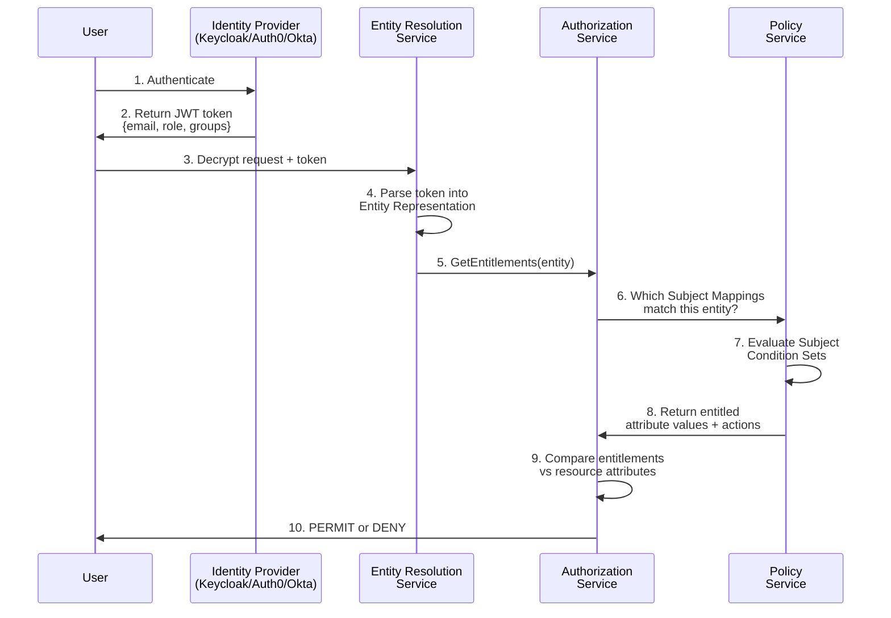

<!-- vale Vale.Terms = NO -->
<!-- vale Vale.Spelling = NO -->

# Subject Mapping: Comprehensive Guide

:::info What You'll Learn
This guide explains how OpenTDF connects user identities from your Identity Provider (IdP) to attribute-based access control. You'll understand:
- **Why** Subject Mappings exist (vs. direct IdP attribute mapping)
- **How** authentication flows through Entity Resolution to authorization decisions
- **How** to scale Subject Mappings from exact-match to pattern-based conditions
- **How to troubleshoot** common Subject Mapping errors
:::

## The Core Problem: Why Subject Mappings Exist

### ❌ Common Misconception

Many developers expect this direct flow:

```
IdP User Attribute → OpenTDF Attribute → Access Decision
    (role=admin)        (clearance=top_secret)    (PERMIT/DENY)
```

**This doesn't work.** OpenTDF attributes define **what can be accessed**, not **who can access it**.

### ✅ How It Actually Works

OpenTDF uses a three-layer architecture:

```
1. IdP Attributes       →  User has role=admin, department=finance
                          (Identity Claims)

2. Subject Mappings     →  IF role=admin THEN grant clearance/top_secret
                          (Entitlement Rules)

3. OpenTDF Attributes   →  Document requires clearance/top_secret
                          (Resource Protection)
```

**Subject Mappings** are the bridge: they convert **identity claims** into **access entitlements**.

:::tip Key Insight
- **IdP attributes** describe WHO the user is
- **Subject Mappings** determine WHAT the user can access
- **OpenTDF attributes** define WHAT protects the resource

Subject Mappings answer: "Given this identity, what entitlements should they receive?"
:::

## Architecture: The Complete Flow

### High-Level Data Flow



### Detailed Step-by-Step

#### Step 1-2: User Authentication
```json
// User authenticates with IdP, receives JWT token
{
  "sub": "alice@example.com",
  "email": "alice@example.com",
  "role": "vice_president",
  "department": "finance",
  "groups": ["executives", "finance-team"]
}
```

#### Step 3-4: Entity Resolution
The token is parsed into an **Entity Representation** - a normalized view of the user's identity:

```json
{
  "ephemeral_id": "jwtentity-1",
  "category": "CATEGORY_SUBJECT",
  "claims": {
    "email": "alice@example.com",
    "role": "vice_president",
    "department": "finance",
    "groups": ["executives", "finance-team"]
  }
}
```

:::warning Entity Types in Authorization Logs
You may see TWO entities in authorization logs. When using the Keycloak ERS, the IDs follow this format:
- `jwtentity-0-clientid-{id}`: The **OIDC client application** — assigned `CATEGORY_ENVIRONMENT`
- `jwtentity-1-username-{name}`: The **authenticated user** — assigned `CATEGORY_SUBJECT`

In `GetDecision` flows, **only `CATEGORY_SUBJECT` entities participate in the access decision**. The environment entity (client) is tracked in audit logs but its entitlements are not evaluated. For standard TDF decrypt flows, only the user (`CATEGORY_SUBJECT`) needs Subject Mappings.

Exception: when using client credentials (service account) flows, the service account is assigned `CATEGORY_SUBJECT` and does need Subject Mappings.
:::

#### Step 5-8: Subject Mapping Evaluation

The Authorization Service queries the Policy Service: "Which Subject Mappings apply to this entity?"

**Subject Mapping Example:**
```json
{
  "id": "sm-001",
  "attribute_value_id": "attr-clearance-executive",
  "actions": ["read"],
  "subject_condition_set": {
    "subject_sets": [{
      "condition_groups": [{
        "boolean_operator": "AND",
        "conditions": [{
          "subject_external_selector_value": ".role",
          "operator": "IN",
          "subject_external_values": ["vice_president", "ceo", "cfo"]
        }]
      }]
    }]
  }
}
```

**Evaluation Logic:**
1. Extract `.role` from entity representation → `"vice_president"`
2. Check if `"vice_president"` is IN `["vice_president", "ceo", "cfo"]` → ✅ TRUE
3. Grant entitlement: `clearance/executive` with `read` action

#### Step 9-10: Authorization Decision

```json
// Entity's Entitlements:
{
  "attribute_values": [
    {
      "attribute": "https://example.com/attr/clearance/value/executive",
      "actions": ["read"]
    }
  ]
}

// Resource Requirements:
{
  "attributes": [
    "https://example.com/attr/clearance/value/executive"
  ]
}

// Decision: PERMIT (entitlements satisfy requirements)
```

## Entity Types and Categories

Understanding entity types is critical for Subject Mapping configuration.

### Entity Type vs. Entity Category

| Dimension | Options | Meaning |
|-----------|---------|---------|
| **Entity Type** | PE (Person)<br/>NPE (Non-Person) | WHO the entity is |
| **Entity Category** | Subject<br/>Environment | HOW it's used in decisions |

### The Four Combinations

```mermaid
graph TD
    A[Entity] --> B{Entity Type}
    B -->|PE| C[Person Entity]
    B -->|NPE| D[Non-Person Entity]

    C --> E{Category}
    D --> F{Category}

    E -->|Subject| G[PE + Subject<br/>Human user in auth flow<br/>✅ Attributes checked in decisions]
    E -->|Environment| H[PE + Environment<br/>Logged-in operator<br/>⚠️ Not evaluated in GetDecision]

    F -->|Subject| I[NPE + Subject<br/>Service account (client credentials flow)<br/>✅ Attributes checked in decisions]
    F -->|Environment| J[NPE + Environment<br/>OIDC client in user-auth flow<br/>⚠️ Not evaluated in GetDecision]
```

### Practical Examples

**Person Entity + Subject Category (Most Common)**
```json
{
  "type": "PE",
  "category": "CATEGORY_SUBJECT",
  "claims": {
    "email": "alice@example.com",
    "role": "engineer"
  }
}
```
→ Subject Mapping checks: Does Alice have the right entitlements?

**Non-Person Entity + Subject Category (SDK Clients)**
```json
{
  "type": "NPE",
  "category": "CATEGORY_SUBJECT",
  "claims": {
    "clientId": "data-processing-service",
    "scope": "tdf:decrypt"
  }
}
```
→ Subject Mapping checks: Does this service account have the right entitlements?

**Environment Category (Excluded from Decision)**
```json
{
  "type": "NPE",
  "category": "CATEGORY_ENVIRONMENT",
  "claims": {
    "clientId": "my-app-client"
  }
}
```
→ Entitlements are tracked in audit logs but **not evaluated** in `GetDecision` flows. This is the standard category for the OIDC client in a user-authenticated request.

:::note Environment vs Subject
In a typical TDF flow with user authentication:
- The OIDC **client** (the app calling the SDK) → `CATEGORY_ENVIRONMENT` → not checked in decisions
- The **user** (who authenticated via the client) → `CATEGORY_SUBJECT` → checked in decisions

Only create Subject Mappings for `CATEGORY_SUBJECT` entities. Environment entities do not need Subject Mappings for TDF decrypt to succeed.
:::

## Subject Condition Sets: The Matching Engine

A **Subject Condition Set** is a logical expression that evaluates an entity representation to `true` or `false`.

### Structure Hierarchy

```
SubjectConditionSet
  └─ SubjectSets[]           (OR'd together - ANY set can match)
      └─ ConditionGroups[]   (Combined by boolean operator)
          └─ Conditions[]    (Combined by boolean operator)
              ├─ SubjectExternalSelectorValue  (flattening-syntax selector to extract claim)
              ├─ Operator                      (IN, NOT_IN, IN_CONTAINS)
              └─ SubjectExternalValues         (Values to match)
```

### Operators Explained

| Operator | Value | Behavior | Example |
|----------|-------|----------|---------|
| **IN** | `1` | Exact match: value is IN list | `.role` IN `["admin", "editor"]` |
| **NOT_IN** | `2` | Exclusion: value is NOT IN list | `.department` NOT_IN `["sales"]` |
| **IN_CONTAINS** | `3` | Substring match | `.email` IN_CONTAINS `["@example.com"]` |

### Boolean Operators

| Operator | Value | Behavior |
|----------|-------|----------|
| **AND** | `1` | All conditions must be TRUE |
| **OR** | `2` | At least one condition must be TRUE |

### Example 1: Simple Role Match

**Goal:** Grant access to users with role "admin"

```json
{
  "subject_sets": [{
    "condition_groups": [{
      "boolean_operator": 1,
      "conditions": [{
        "subject_external_selector_value": ".role",
        "operator": 1,
        "subject_external_values": ["admin"]
      }]
    }]
  }]
}
```

**Matches:**
- ✅ `{"role": "admin"}`
- ❌ `{"role": "editor"}`

### Example 2: Multiple Roles (OR)

**Goal:** Grant access to admins OR editors

```json
{
  "subject_sets": [{
    "condition_groups": [{
      "boolean_operator": 2,
      "conditions": [
        {
          "subject_external_selector_value": ".role",
          "operator": 1,
          "subject_external_values": ["admin"]
        },
        {
          "subject_external_selector_value": ".role",
          "operator": 1,
          "subject_external_values": ["editor"]
        }
      ]
    }]
  }]
}
```

**Simpler Alternative (Same Logic):**
```json
{
  "subject_sets": [{
    "condition_groups": [{
      "boolean_operator": 1,
      "conditions": [{
        "subject_external_selector_value": ".role",
        "operator": 1,
        "subject_external_values": ["admin", "editor"]
      }]
    }]
  }]
}
```

### Example 3: Multiple Conditions (AND)

**Goal:** Grant access to senior engineers only

```json
{
  "subject_sets": [{
    "condition_groups": [{
      "boolean_operator": 1,
      "conditions": [
        {
          "subject_external_selector_value": ".level",
          "operator": 1,
          "subject_external_values": ["senior", "staff", "principal"]
        },
        {
          "subject_external_selector_value": ".department",
          "operator": 1,
          "subject_external_values": ["engineering"]
        }
      ]
    }]
  }]
}
```

**Matches:**
- ✅ `{"level": "senior", "department": "engineering"}`
- ✅ `{"level": "staff", "department": "engineering"}`
- ❌ `{"level": "senior", "department": "sales"}`
- ❌ `{"level": "junior", "department": "engineering"}`

### Example 4: Domain Email Match (Substring)

**Goal:** Grant access to anyone with company email

```json
{
  "subject_sets": [{
    "condition_groups": [{
      "boolean_operator": 1,
      "conditions": [{
        "subject_external_selector_value": ".email",
        "operator": 3,
        "subject_external_values": ["@example.com"]
      }]
    }]
  }]
}
```

**Matches:**
- ✅ `{"email": "alice@example.com"}`
- ✅ `{"email": "bob@example.com"}`
- ❌ `{"email": "charlie@external.com"}`

### Example 5: Complex Multi-Group Logic

**Goal:** Grant access to:
- Executives (any department), OR
- Senior finance staff

```json
{
  "subject_sets": [
    {
      "condition_groups": [{
        "boolean_operator": 1,
        "conditions": [{
          "subject_external_selector_value": ".role",
          "operator": 1,
          "subject_external_values": ["ceo", "cfo", "cto", "vp"]
        }]
      }]
    },
    {
      "condition_groups": [{
        "boolean_operator": 1,
        "conditions": [
          {
            "subject_external_selector_value": ".level",
            "operator": 1,
            "subject_external_values": ["senior", "staff"]
          },
          {
            "subject_external_selector_value": ".department",
            "operator": 1,
            "subject_external_values": ["finance"]
          }
        ]
      }]
    }
  ]
}
```

**Logic:** `(role IN executives) OR (level IN senior-staff AND department=finance)`

**Matches:**
- ✅ `{"role": "ceo", "department": "engineering"}` (executive)
- ✅ `{"level": "senior", "department": "finance"}` (senior finance)
- ❌ `{"level": "senior", "department": "engineering"}` (not finance)
- ❌ `{"level": "junior", "department": "finance"}` (not senior)

## Scaling Subject Mappings: Exact Match vs. Pattern-Based

:::info Common Question
**Question:** "Do I need a separate Subject Mapping for every user, or can one mapping cover many users?"

**Answer:** One Subject Mapping can cover many users by using pattern-based condition operators (`IN_CONTAINS`) rather than exact matches.
:::

All attribute values in OpenTDF must be explicitly created before they can be used — there is no "freeform" or "dynamic" attribute value type. Each `attribute_value_id` in a Subject Mapping must reference an existing, named value. The flexibility comes from how Subject Condition Sets match entity claims.

### Option 1: Exact Match (One Mapping Per User)

```json
{
  "attribute_value_id": "attr-owner-alice",
  "actions": ["read"],
  "subject_condition_set": {
    "subject_sets": [{
      "condition_groups": [{
        "boolean_operator": 1,
        "conditions": [{
          "subject_external_selector_value": ".email",
          "operator": 1,
          "subject_external_values": ["alice@example.com"]
        }]
      }]
    }]
  }
}
```

**Limitation:** Requires creating a new Subject Mapping (and a corresponding attribute value) for every user. Not scalable for large user sets.

### Option 2: Pattern-Based Access (Recommended)

Use `IN_CONTAINS` (operator `3`) to match token claim substrings, covering many users with one Subject Mapping:

```json
{
  "attribute_value_id": "attr-company-employees",
  "actions": ["read"],
  "subject_condition_set": {
    "subject_sets": [{
      "condition_groups": [{
        "boolean_operator": 1,
        "conditions": [{
          "subject_external_selector_value": ".email",
          "operator": 3,
          "subject_external_values": ["@example.com"]
        }]
      }]
    }]
  }
}
```

→ Anyone whose token contains an email with `@example.com` receives entitlement for the `company/employees` attribute value.

**Key:** One Subject Mapping covers all matching users. The condition evaluates the claim value at decision time — no per-user configuration needed.

### Pre-Creating Attribute Values for Specific Identities

For use cases like tagging a resource with an owner's identity, you explicitly create the attribute value before encrypting:

```bash
# Create attribute value for a specific user
otdfctl policy attributes values create \
  --attribute-id <owner-attribute-id> \
  --value "alice-at-example-com"

# Encrypt, binding the resource to that value
otdfctl encrypt file.txt -o file.tdf \
  --attr https://example.com/attr/owner/value/alice-at-example-com
```

Then create a Subject Mapping linking Alice's email claim to that value:

```bash
otdfctl policy subject-mappings create \
  --attribute-value-id <alice-value-id> \
  --action read \
  --subject-condition-set-new '[{"condition_groups":[{"boolean_operator":1,"conditions":[{"subject_external_selector_value":".email","operator":1,"subject_external_values":["alice@example.com"]}]}]}]'
```

:::note Attribute value naming constraint
Attribute values must match `^[a-zA-Z0-9](?:[a-zA-Z0-9_-]*[a-zA-Z0-9])?$` — alphanumeric with hyphens and underscores, no special characters. Email addresses (with `@` and `.`) must be normalized to a valid format (e.g., `alice-at-example-com`).
:::

## IdP Integration Examples

### Keycloak

**Common Keycloak Token Claims:**
```json
{
  "sub": "f4d3c2b1-a098-7654-3210-fedcba098765",
  "email": "alice@example.com",
  "preferred_username": "alice",
  "realm_access": {
    "roles": ["admin", "user"]
  },
  "resource_access": {
    "opentdf-app": {
      "roles": ["tdf-admin"]
    }
  },
  "groups": ["/finance/senior", "/engineering/platform"]
}
```

#### Example 1: Map Keycloak Realm Roles

**IdP Configuration:**
- User "alice" has Keycloak role: `admin`

**Subject Condition Set:**
```json
{
  "subject_sets": [{
    "condition_groups": [{
      "boolean_operator": 1,
      "conditions": [{
        "subject_external_selector_value": ".realm_access.roles",
        "operator": 1,
        "subject_external_values": ["admin"]
      }]
    }]
  }]
}
```

**Result:** Alice gets entitlement for attribute value (e.g., `clearance/top_secret`)

#### Example 2: Map Keycloak Groups

**IdP Configuration:**
- User "bob" is in Keycloak group: `/finance/senior`

**Subject Condition Set:**
```json
{
  "subject_sets": [{
    "condition_groups": [{
      "boolean_operator": 1,
      "conditions": [{
        "subject_external_selector_value": ".groups",
        "operator": 3,
        "subject_external_values": ["/finance/"]
      }]
    }]
  }]
}
```

**Result:** Bob gets entitlement for `department/finance` attribute

#### Example 3: Combine Multiple Keycloak Claims

**Goal:** Grant access to finance admins

**Subject Condition Set:**
```json
{
  "subject_sets": [{
    "condition_groups": [{
      "boolean_operator": 1,
      "conditions": [
        {
          "subject_external_selector_value": ".groups",
          "operator": 3,
          "subject_external_values": ["/finance/"]
        },
        {
          "subject_external_selector_value": ".realm_access.roles",
          "operator": 1,
          "subject_external_values": ["admin"]
        }
      ]
    }]
  }]
}
```

**Logic:** `(group contains "/finance/") AND (role is "admin")`

### Okta

**Common Okta Token Claims:**
```json
{
  "sub": "00u1a2b3c4d5e6f7g8h9",
  "email": "alice@example.com",
  "email_verified": true,
  "groups": ["Engineering", "Senior-Staff"],
  "department": "engineering",
  "title": "Senior Engineer",
  "clearanceLevel": "confidential"
}
```

#### Example 1: Map Okta Groups

**IdP Configuration:**
- User is member of Okta group: "Engineering"

**Subject Condition Set:**
```json
{
  "subject_sets": [{
    "condition_groups": [{
      "boolean_operator": 1,
      "conditions": [{
        "subject_external_selector_value": ".groups",
        "operator": 1,
        "subject_external_values": ["Engineering", "Product"]
      }]
    }]
  }]
}
```

#### Example 2: Map Okta Profile Attributes

**IdP Configuration:**
- User profile has custom attribute: `clearanceLevel: "confidential"`

**Okta Configuration (Claims):**
Add custom claim mapping in Okta:
- Claim name: `clearanceLevel`
- Value: `user.clearanceLevel`

**Subject Condition Set:**
```json
{
  "subject_sets": [{
    "condition_groups": [{
      "boolean_operator": 1,
      "conditions": [{
        "subject_external_selector_value": ".clearanceLevel",
        "operator": 1,
        "subject_external_values": ["confidential", "secret"]
      }]
    }]
  }]
}
```

#### Example 3: Combine Okta Claims

**Goal:** Grant access to senior engineers with confidential clearance

**Subject Condition Set:**
```json
{
  "subject_sets": [{
    "condition_groups": [{
      "boolean_operator": 1,
      "conditions": [
        {
          "subject_external_selector_value": ".department",
          "operator": 1,
          "subject_external_values": ["engineering"]
        },
        {
          "subject_external_selector_value": ".title",
          "operator": 3,
          "subject_external_values": ["Senior", "Staff", "Principal"]
        },
        {
          "subject_external_selector_value": ".clearanceLevel",
          "operator": 1,
          "subject_external_values": ["confidential", "secret", "top_secret"]
        }
      ]
    }]
  }]
}
```

**Logic:** `(department="engineering") AND (title contains "Senior"/"Staff"/"Principal") AND (clearance >= confidential)`

## Creating Subject Mappings: Step-by-Step

### Prerequisites

1. **OpenTDF Platform running** with authentication configured
2. **otdfctl installed and authenticated**
3. **Attributes and values created** (the resources you're protecting)

### Step 1: Create Subject Condition Set

```bash
otdfctl policy subject-condition-sets create \
  --subject-sets '[
    {
      "condition_groups": [{
        "boolean_operator": 1,
        "conditions": [{
          "subject_external_selector_value": ".email",
          "operator": 3,
          "subject_external_values": ["@example.com"]
        }]
      }]
    }
  ]'
```

**Save the ID from output:**
```console
SUCCESS   Created SubjectConditionSet [3c56a6c9-9635-427f-b808-5e8fd395802c]
```

### Step 2: Get Attribute Value ID

```bash
# List attribute values for an attribute
otdfctl policy attributes values list \
  --attribute-id <your-attribute-id>

# Or create a new value
otdfctl policy attributes values create \
  --attribute-id <your-attribute-id> \
  --value "my-value"
```

**Save the attribute value ID:**
```console
4c63e72a-2db9-434c-8ef6-e451473dbfe0  |  clearance/secret
```

### Step 3: Create Subject Mapping

```bash
otdfctl policy subject-mappings create \
  --attribute-value-id 4c63e72a-2db9-434c-8ef6-e451473dbfe0 \
  --action read \
  --subject-condition-set-id 3c56a6c9-9635-427f-b808-5e8fd395802c
```

**Success:**
```console
SUCCESS   Created SubjectMapping [sm-789xyz]
```

### Step 4: Verify

```bash
# List all subject mappings
otdfctl policy subject-mappings list

# Get specific mapping details
otdfctl policy subject-mappings get --id sm-789xyz
```

## Troubleshooting

### Error: "resource relation invalid"

**Full Error:**
```
rpc error: code = InvalidArgument desc = resource relation invalid
```

**Causes:**
1. **Invalid Attribute Value ID**: The attribute value doesn't exist
2. **Invalid Subject Condition Set ID**: The condition set doesn't exist
3. **Action mismatch**: Using incompatible action types

**Solutions:**

**Verify attribute value exists:**
```bash
otdfctl policy attributes values list --attribute-id <attribute-id>
```

**Verify subject condition set exists:**
```bash
otdfctl policy subject-condition-sets list
```

**Check action format:**
```bash
# Correct: use --action with a standard action name
--action read

# Also correct: use action ID (UUID)
--action 891cfe85-b381-4f85-9699-5f7dbfe2a9ab

# Deprecated flags (still accepted but migrate away from these)
# --action-standard DECRYPT  →  use --action read
# --action-custom "download"  →  use --action download
```

### Error: Token Claim Not Appearing in Entitlements

**Symptom:** User has claim in JWT, but Subject Mapping doesn't match

**Debug Steps:**

**1. Verify token claims:**
```bash
# Decode your JWT token
echo "<your-jwt>" | base64 -d
```

**2. Check selector with `otdfctl dev selectors`:**

OpenTDF uses a custom [flattening syntax](https://github.com/opentdf/platform/blob/main/lib/flattening/flatten.go): keys are prefixed with `.`, nested paths use `.key.subkey`, and list items use `[0]` or `[]` for any index.

Use `otdfctl dev selectors generate` to see all valid selectors for a given JSON or JWT:

```bash
# From a JSON object
otdfctl dev selectors generate --subject '{"role":"admin","groups":["engineering","senior-staff"]}'

# From a JWT token
otdfctl dev selectors generate --subject "<your-jwt-token>"
```

Then test a specific selector against your token with `otdfctl dev selectors test`:

```bash
otdfctl dev selectors test \
  --subject '{"role":"admin","groups":["engineering"]}' \
  --selector '.role' \
  --selector '.groups[]'
```

The flattening syntax for nested structures:

```
Token:                         Selector:
{"user":{"profile":            ".user.profile.department"  ✅
    {"department":"finance"}}}
{"department":"finance"}       ".department"              ✅
                               ".user.department"          ❌ (wrong nesting)
```

**3. Check operator type:**

```json
// If claim is an array:
{
  "groups": ["admin", "user"]
}

// Use IN to check array membership:
{
  "subject_external_selector_value": ".groups",
  "operator": 1,
  "subject_external_values": ["admin"]
}
```

**4. Enable debug logging:**

Contact your OpenTDF administrator to enable debug logging for Subject Mapping evaluation.

### Error: User Has Entitlement But Still Gets DENY

In `GetDecision` flows, only **`CATEGORY_SUBJECT`** entities participate in the access decision ([source](https://github.com/opentdf/platform/blob/main/service/authorization/authorization.go)). `CATEGORY_ENVIRONMENT` entities (the OIDC client in a user-auth flow) are tracked in audit logs but do NOT affect the decision outcome.

**If the user (`CATEGORY_SUBJECT`) has the required entitlement and still gets DENY**, check the following:

**Cause 1: Subject Condition Set doesn't match the token**

The selector or operator doesn't match the actual claim structure. Use `otdfctl dev selectors generate` to inspect your token:

```bash
otdfctl dev selectors generate --subject '{"role":"admin","email":"alice@example.com"}'
```

**Cause 2: Service account flow — the client IS the subject**

In **client credentials (service account) flows**, there is no separate user — the client itself is assigned `CATEGORY_SUBJECT` and needs Subject Mappings. This is the case when using NPEs (Non-Person Entities) authenticating directly with client credentials:

```bash
# Create Subject Mapping for a service account client
otdfctl policy subject-condition-sets create \
  --subject-sets '[
    {
      "condition_groups": [{
        "boolean_operator": 1,
        "conditions": [{
          "subject_external_selector_value": ".clientId",
          "operator": 1,
          "subject_external_values": ["my-service-account-client-id"]
        }]
      }]
    }
  ]'

otdfctl policy subject-mappings create \
  --attribute-value-id <attribute-value-id> \
  --action read \
  --subject-condition-set-id <client-condition-set-id>
```

### Error: Subject Condition Set Not Found

**Symptom:**
```
subject-condition-set not found: <id>
```

**Cause:** The Subject Condition Set was deleted or never created.

**Solution:**

**List existing condition sets:**
```bash
otdfctl policy subject-condition-sets list
```

**If missing, recreate:**
```bash
otdfctl policy subject-condition-sets create \
  --subject-sets '<your-condition-json>'
```

**Update Subject Mapping to use correct ID:**
```bash
otdfctl policy subject-mappings update \
  --id <subject-mapping-id> \
  --subject-condition-set-id <correct-id>
```

### Debugging Checklist

When Subject Mappings aren't working:

- [ ] Verify OpenTDF platform is running and accessible
- [ ] Confirm user is authenticated (valid JWT token)
- [ ] Check token contains expected claims (decode JWT)
- [ ] Verify Subject Condition Set exists (`list` command)
- [ ] Verify Attribute Value exists (`attributes values list`)
- [ ] Verify Subject Mapping exists (`subject-mappings list`)
- [ ] Check selector expression matches token structure (use `otdfctl dev selectors generate` to verify)
- [ ] Confirm operator type (IN vs IN_CONTAINS)
- [ ] Test with simple condition first (single claim match)
- [ ] For service account (client credentials) flows: Verify the client has a Subject Mapping (it's `CATEGORY_SUBJECT` in this case)
- [ ] Check attribute definition rule (HIERARCHY, ANY_OF, ALL_OF)
- [ ] Verify action matches operation (`read` for TDF decryption)

## Best Practices

### 1. Reusable Condition Sets

Create **generic Subject Condition Sets** that can be shared across multiple Subject Mappings:

**Example: "Engineering Department" Condition Set**
```bash
# Create once
otdfctl policy subject-condition-sets create \
  --subject-sets '[
    {
      "condition_groups": [{
        "boolean_operator": 1,
        "conditions": [{
          "subject_external_selector_value": ".department",
          "operator": 1,
          "subject_external_values": ["engineering"]
        }]
      }]
    }
  ]'

# Reuse for multiple attribute values
otdfctl policy subject-mappings create \
  --attribute-value-id <project-alpha-id> \
  --action read \
  --subject-condition-set-id <engineering-condition-set-id>

otdfctl policy subject-mappings create \
  --attribute-value-id <project-beta-id> \
  --action read \
  --subject-condition-set-id <engineering-condition-set-id>
```

### 2. Use Hierarchical Attributes

Leverage `HIERARCHY` rule for implicit access:

```json
{
  "name": "clearance",
  "rule": "HIERARCHY",
  "values": [
    {"value": "public"},
    {"value": "confidential"},
    {"value": "secret"},
    {"value": "top_secret"}
  ]
}
```

:::note Hierarchy ordering
For `HIERARCHY` attributes, precedence is determined by the **order values appear in the array** — first element is lowest, last is highest. There is no `order` field; array position is authoritative.
:::

**Subject Mapping for top_secret:**
- User gets entitlement: `clearance/top_secret`
- Can access: `top_secret`, `secret`, `confidential`, `public` (all lower levels)

### 3. Minimize Dynamic Mappings

**Avoid:** Creating one Subject Mapping per user
```bash
# Don't do this for 1000s of users
create-subject-mapping --for-user alice
create-subject-mapping --for-user bob
create-subject-mapping --for-user charlie
```

**Instead:** Use pattern-based conditions
```json
{
  "conditions": [{
    "subject_external_selector_value": ".email",
    "operator": 3,
    "subject_external_values": ["@company.com"]
  }]
}
```

### 4. Subject Mappings for Service Accounts (NPE)

In a standard user-authenticated flow, only the **user** (`CATEGORY_SUBJECT`) needs Subject Mappings. The OIDC client is `CATEGORY_ENVIRONMENT` and is not evaluated in access decisions.

For **client credentials flows** (service accounts authenticating directly, with no human user), the client is assigned `CATEGORY_SUBJECT` and does need Subject Mappings. The selector to use depends on your IdP — for Keycloak, it is typically `.clientId`:

```bash
# For service accounts (client credentials flow, Keycloak ERS)
otdfctl policy subject-mappings create \
  --attribute-value-id <attr-id> \
  --action read \
  --subject-condition-set-id <service-account-condition-set>
```

The exact claim key for the client ID varies by IdP and ERS configuration — use `otdfctl dev selectors generate` with your actual token to find the right selector.

### 5. Test in Isolation

When debugging, test Subject Mappings individually:

**1. Create test user with minimal claims:**
```json
{
  "email": "test@example.com",
  "role": "test-role"
}
```

**2. Create simple Subject Mapping:**
```json
{
  "conditions": [{
    "subject_external_selector_value": ".role",
    "operator": 1,
    "subject_external_values": ["test-role"]
  }]
}
```

**3. Test decryption:**
```bash
otdfctl decrypt test.tdf
```

**4. Gradually add complexity** once basic mapping works.

## Next Steps

### Essential Reading

- [Authorization Service](/components/authorization) - Understand GetEntitlements and GetDecision APIs
- [Entity Resolution](/components/entity_resolution) - Learn how tokens become entity representations
- [Policy: Subject Mappings](/components/policy/subject_mappings) - API reference
- [Quickstart: ABAC Scenario](/quickstart#attribute-based-access-control-abac) - Hands-on example

### Common Workflows

**Set up RBAC (Role-Based Access Control):**
1. Define attributes for roles (`role/admin`, `role/editor`, `role/viewer`)
2. Create Subject Condition Sets matching IdP roles
3. Create Subject Mappings granting role-based entitlements

**Set up ABAC (Attribute-Based Access Control):**
1. Define attributes for multiple dimensions (`department`, `clearance`, `region`)
2. Create Subject Condition Sets with multi-condition logic
3. Encrypt resources with multiple attributes (`--attr X --attr Y`)
4. Subject Mappings grant partial entitlements; decision evaluates all attributes

**Scale Subject Mappings with pattern matching:**
1. Define attribute and its values
2. Encrypt with the relevant attribute value FQN
3. Create pattern-based Subject Mappings using `IN_CONTAINS` (substring match) to cover many users with one condition

## FAQ

**Q: Do I need to add roles in my IdP that match OpenTDF attributes?**

**A:** No. IdP roles/claims describe WHO the user is. Subject Mappings convert those claims into OpenTDF entitlements (WHAT they can access). They are separate concerns.

**Q: Can I use the same Subject Condition Set for multiple Subject Mappings?**

**A:** Yes! This is recommended for reusability. One condition set (e.g., "engineering department") can grant entitlements to multiple attribute values.

**Q: What's the difference between IN and IN_CONTAINS?**

**A:**
- `IN` (operator=1): Exact match. Value must be IN the list.
  - `"admin" IN ["admin", "editor"]` → TRUE
  - `"administrator" IN ["admin", "editor"]` → FALSE
- `IN_CONTAINS` (operator=3): Substring match. Value must CONTAIN substring.
  - `"administrator" IN_CONTAINS ["admin"]` → TRUE
  - `"admin" IN_CONTAINS ["admin"]` → TRUE

**Q: Why do I see both jwtentity-0 and jwtentity-1 in authorization logs?**

**A:** When using the Keycloak ERS, two entities are created from a JWT token: the OIDC client (`jwtentity-0-clientid-{id}`, `CATEGORY_ENVIRONMENT`) and the authenticated user (`jwtentity-1-username-{name}`, `CATEGORY_SUBJECT`). In `GetDecision` flows, only `CATEGORY_SUBJECT` entities are evaluated. The client entity is logged for audit purposes but does not affect the decision. Only the user entity needs Subject Mappings for standard TDF decrypt flows. See [authorization.go](https://github.com/opentdf/platform/blob/main/service/authorization/authorization.go) for the implementation.

**Q: Can I update a Subject Mapping without recreating it?**

**A:** Yes, use `otdfctl policy subject-mappings update --id <id> --subject-condition-set-id <new-set-id>` to change the condition set or other properties.

**Q: How do I handle users in multiple groups?**

**A:** Create multiple Subject Mappings (one per group) that grant different entitlements. A user can receive entitlements from multiple mappings simultaneously.

**Q: What happens if no Subject Mappings match a user?**

**A:** Authorization returns DENY. The user has no entitlements, so they cannot access any protected resources.
