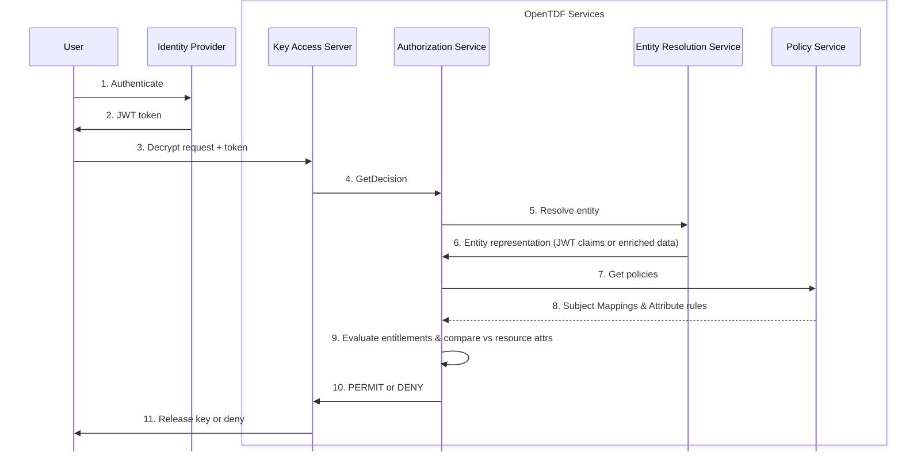

# Subject Mapping Guide

:::info What You'll Learn
This guide explains how OpenTDF connects user identities from your Identity Provider (IdP) to attribute-based access control. You'll understand:
- **Why** Subject Mappings exist (vs. direct IdP attribute mapping)
- **How** authentication flows through to authorization decisions
- **How** to scale Subject Mappings from exact-match to pattern-based conditions
- **How to troubleshoot** common Subject Mapping errors
:::

## The Core Problem: Why Subject Mappings Exist

### How It Actually Works

OpenTDF uses a three-layer architecture:

```
1. IdP Attributes       →  User has role=admin, department=finance
                          (Identity Claims)

2. Subject Mappings     →  IF role=admin THEN grant clearance/top_secret
                          (Entitlement Rules)

3. OpenTDF Attributes   →  Document requires clearance/top_secret
                          (Resource Protection)
```

**Subject Mappings** are the bridge: they convert **identity claims** into **access entitlements**.

## Architecture: The Complete Flow

### High-Level Data Flow


```mermaid
%%{init: {'sequence': {'boxMargin': 20, 'mirrorActors': false}}}%%
sequenceDiagram
    participant User
    participant IdP as Identity Provider
    box OpenTDF Services
        participant KAS as Key Access Server
        participant Auth as Authorization Service
        participant ERS as Entity Resolution Service
        participant Policy as Policy Service
    end

    User->>IdP: 1. Authenticate
    IdP->>User: 2. JWT token

    User->>KAS: 3. Decrypt request + token
    KAS->>Auth: 4. GetDecision

    Auth->>ERS: 5. Resolve entity
    ERS->>Auth: 6. Entity representation (JWT claims or enriched data)

    Auth->>Policy: 7. Get policies
    Policy-->>Auth: 8. Subject Mappings & Attribute rules

    Auth->>Auth: 9. Evaluate entitlements & compare vs resource attrs
    Auth->>KAS: 10. PERMIT or DENY
    KAS->>User: 11. Release key or deny
```

| Service | NIST Role | How to use it |
|---|---|---|
| Key Access Server | Policy Enforcement Point (PEP) | [Send a TDF decrypt request](/sdks/tdf) |
| Entity Resolution Service | Policy Information Point (PIP) | [Configure ERS mode](https://github.com/opentdf/platform/blob/main/docs/Configuring.md?plain=1#L479) |
| Authorization Service | Policy Decision Point (PDP) | [Get authorization decisions](/sdks/authorization) |
| Policy Service | Policy Administration Point (PAP) | [Configure subject mappings](/sdks/policy) |

For a detailed look at how these services fit together, see the [Architecture page](/architecture).

## ERS Mode and What Selectors Target

Selectors are evaluated against the **entity representation** produced by the [Entity Resolution Service (ERS)](/components/entity_resolution) — for example:

```json
{
  "ephemeral_id": "jwtentity-1",
  "category": "CATEGORY_SUBJECT",
  "claims": {
    "email": "alice@example.com",
    "role": "vice_president",
    "department": "finance",
    "groups": ["executives", "finance-team"]
  }
}
```

The platform supports two ERS modes, and the correct selector format depends on [which one is configured](https://github.com/opentdf/platform/blob/main/docs/Configuring.md?plain=1#L479).

### Mode 1: [Keycloak ERS](/components/entity_resolution) (default, `mode: keycloak`)

The ERS calls the Keycloak Admin API to fetch the full user object. Custom Keycloak user attributes are nested under `.attributes.<name>[]` and are **always an array**, regardless of whether the Keycloak attribute is configured as multi-valued:

| Entity data | Selector |
|-------------|---------|
| Custom user attribute `department: ["Finance"]` | `.attributes.department[]` |
| Standard user field `email` | `.email` |

:::warning Common mistake
A selector like `.department` will **never** match a custom Keycloak user attribute in Keycloak ERS mode, even if the JWT contains `"department": "Finance"`. The correct selector is `.attributes.department[]`.

This is a frequent source of confusion because the JWT claim name and the entity representation key are different.
:::

### Mode 2: Claims ERS (`mode: claims`)

The ERS passes JWT private claims through as-is, so selectors match JWT claim names directly. In this mode, the correct selector also depends on the **multi-valued** setting of your Keycloak User Attribute mapper:

| Keycloak mapper setting | JWT claim | Selector |
|------------------------|-----------|---------|
| Multi-valued **OFF** | `"department": "Finance"` (string) | `.department` |
| Multi-valued **ON** | `"department": ["Finance"]` (array) | `.department[]` |

Configure claims mode in your platform config:

```yaml
services:
  entityresolution:
    mode: claims  # default is "keycloak"
```

Trade-off: claims mode can only access what is in the token — it cannot look up Keycloak groups, roles, or other data from the user store that is not included in the JWT.

## Subject Condition Sets: The Matching Engine

A [**Subject Condition Set**](/components/policy/subject_mappings#subject-condition-set) is a logical expression that evaluates an entity representation to `true` or `false`.

### Structure Hierarchy

```
SubjectConditionSet
  └─ SubjectSets[]           (OR'd together - ANY set can match)
      └─ ConditionGroups[]   (Combined by boolean operator)
          └─ Conditions[]    (Combined by boolean operator)
              ├─ SubjectExternalSelectorValue  (flattening-syntax selector to extract claim)
              ├─ Operator                      (IN, NOT_IN, IN_CONTAINS)
              └─ SubjectExternalValues         (Values to match)
```

### Selectors: String vs. Array Claims

The selector syntax depends on whether the token claim is a **string** or an **array**:

| Claim type | Example token | Selector |
|------------|--------------|---------|
| String | `"role": "admin"` | `.role` |
| Array | `"groups": ["admin", "user"]` | `.groups[]` |
| Nested string | `"realm_access": {"roles": [...]}` | `.realm_access.roles[]` |

**Using `.groups` (without `[]`) on an array claim will silently match nothing.** The flattening library ([`lib/flattening/flatten.go`](https://github.com/opentdf/platform/blob/main/lib/flattening/flatten.go)) produces keys like `.groups[0]`, `.groups[1]`, and `.groups[]` for array elements — there is no `.groups` key. Use `otdfctl dev selectors generate` to see exactly what keys your token produces.

### Operators Explained

| Operator | Value | Behavior | Example |
|----------|-------|----------|---------|
| **IN** | `1` | Exact match: value is IN list | `.role` IN `["admin", "editor"]` |
| **NOT_IN** | `2` | Exclusion: value is NOT IN list | `.department` NOT_IN `["sales"]` |
| **IN_CONTAINS** | `3` | Substring match | `.email` IN_CONTAINS `["@example.com"]` |

### Boolean Operators

| Operator | Value | Behavior |
|----------|-------|----------|
| **AND** | `1` | All conditions must be TRUE |
| **OR** | `2` | At least one condition must be TRUE |

### Example 1: Multiple Roles (OR)

**Goal:** Grant access to admins OR editors

```json
{
  "subject_sets": [{
    "condition_groups": [{
      "boolean_operator": 2,
      "conditions": [
        {
          "subject_external_selector_value": ".role",
          "operator": 1,
          "subject_external_values": ["admin"]
        },
        {
          "subject_external_selector_value": ".role",
          "operator": 1,
          "subject_external_values": ["editor"]
        }
      ]
    }]
  }]
}
```

**Simpler Alternative (Same Logic):**
```json
{
  "subject_sets": [{
    "condition_groups": [{
      "boolean_operator": 1,
      "conditions": [{
        "subject_external_selector_value": ".role",
        "operator": 1,
        "subject_external_values": ["admin", "editor"]
      }]
    }]
  }]
}
```

### Example 2: Multiple Conditions (AND)

**Goal:** Grant access to senior engineers only

```json
{
  "subject_sets": [{
    "condition_groups": [{
      "boolean_operator": 1,
      "conditions": [
        {
          "subject_external_selector_value": ".level",
          "operator": 1,
          "subject_external_values": ["senior", "staff", "principal"]
        },
        {
          "subject_external_selector_value": ".department",
          "operator": 1,
          "subject_external_values": ["engineering"]
        }
      ]
    }]
  }]
}
```

**Matches:**
- ✅ `{"level": "senior", "department": "engineering"}`
- ✅ `{"level": "staff", "department": "engineering"}`
- ❌ `{"level": "senior", "department": "sales"}`
- ❌ `{"level": "junior", "department": "engineering"}`

### Example 3: Domain Email Match (Substring)

**Goal:** Grant access to anyone with company email

```json
{
  "subject_sets": [{
    "condition_groups": [{
      "boolean_operator": 1,
      "conditions": [{
        "subject_external_selector_value": ".email",
        "operator": 3,
        "subject_external_values": ["@example.com"]
      }]
    }]
  }]
}
```

**Matches:**
- ✅ `{"email": "alice@example.com"}`
- ✅ `{"email": "bob@example.com"}`
- ❌ `{"email": "charlie@external.com"}`

### Example 4: Complex Multi-Group Logic

**Goal:** Grant access to:
- Executives (any department), OR
- Senior finance staff

```json
{
  "subject_sets": [
    {
      "condition_groups": [{
        "boolean_operator": 1,
        "conditions": [{
          "subject_external_selector_value": ".role",
          "operator": 1,
          "subject_external_values": ["ceo", "cfo", "cto", "vp"]
        }]
      }]
    },
    {
      "condition_groups": [{
        "boolean_operator": 1,
        "conditions": [
          {
            "subject_external_selector_value": ".level",
            "operator": 1,
            "subject_external_values": ["senior", "staff"]
          },
          {
            "subject_external_selector_value": ".department",
            "operator": 1,
            "subject_external_values": ["finance"]
          }
        ]
      }]
    }
  ]
}
```

**Logic:** `(role IN executives) OR (level IN senior-staff AND department=finance)`

**Matches:**
- ✅ `{"role": "ceo", "department": "engineering"}` (executive)
- ✅ `{"level": "senior", "department": "finance"}` (senior finance)
- ❌ `{"level": "senior", "department": "engineering"}` (not finance)
- ❌ `{"level": "junior", "department": "finance"}` (not senior)

### Example 5: AND Across Multiple Attribute Definitions (Multi-Attribute File)

This example covers a different kind of AND: enforcing multiple **attribute definitions** on a single resource, where a user must satisfy **all** of them to decrypt.

:::note How multi-attribute AND works
When a file is tagged with values from two different attribute definitions (e.g., `department/finance` AND `country/us`), the authorization service evaluates each attribute definition independently and requires all of them to pass. This is enforced in [`service/internal/access/pdp.go`](https://github.com/opentdf/platform/blob/main/service/internal/access/pdp.go) — `rollUpDecisions` combines per-definition results with `&&`.

This is different from AND within a single Subject Condition Set (Example 2), which requires multiple claims to match within one subject mapping. Here, the AND comes from tagging the resource with multiple attributes — no special subject mapping configuration is needed.
:::

**Goal:** A file requires both `department/finance` AND `country/us` to decrypt. A user must be entitled to both.

**Step 1: Tag the file with both attribute values at encrypt time:**
```bash
otdfctl encrypt file.txt -o file.tdf \
  --attr https://example.com/attr/department/value/finance \
  --attr https://example.com/attr/country/value/us
```

**Step 2: Create two separate subject mappings — one per attribute value.**

Subject Mapping 1 (linked to `department/value/finance`):
```json
{
  "subject_external_selector_value": ".attributes.department[]",
  "operator": 1,
  "subject_external_values": ["Finance"]
}
```

Subject Mapping 2 (linked to `country/value/us`):
```json
{
  "subject_external_selector_value": ".attributes.country[]",
  "operator": 1,
  "subject_external_values": ["US"]
}
```

**Result:** A user whose token satisfies both condition sets will be entitled to both attribute values and can decrypt the file. A user who satisfies only one will be denied.

- ✅ `{"attributes": {"department": ["Finance"], "country": ["US"]}}` — entitled to both, PERMIT
- ❌ `{"attributes": {"department": ["Finance"], "country": ["UK"]}}` — missing `country/us`, DENY
- ❌ `{"attributes": {"department": ["Engineering"], "country": ["US"]}}` — missing `department/finance`, DENY

## Scaling Subject Mappings: Entitle Kinds of Users, Not Individual Users

:::warning Avoid one Subject Mapping per user
Creating a separate Subject Mapping for every individual user is a **performance anti-pattern** that will cause problems at scale. Subject Mappings implement ABAC — the goal is to entitle *kinds* of users (roles, departments, groups), not individual users.

Instead of thinking "grant Alice access", think "grant anyone in the finance team access."
:::

All attribute values in OpenTDF must be explicitly created before they can be used — there is no "freeform" or "dynamic" attribute value type. Each `attribute_value_id` in a Subject Mapping must reference an existing, named value. The flexibility comes from how Subject Condition Sets match entity claims.

### Anti-Pattern: One Mapping Per User

```json
{
  "attribute_value_id": "attr-owner-alice",
  "actions": [{"name": "read"}],
  "subject_condition_set": {
    "subject_sets": [{
      "condition_groups": [{
        "boolean_operator": 1,
        "conditions": [{
          "subject_external_selector_value": ".email",
          "operator": 1,
          "subject_external_values": ["alice@example.com"]
        }]
      }]
    }]
  }
}
```

**Why this fails at scale:** Requires creating a new Subject Mapping (and a corresponding attribute value) for every user. Performance degrades significantly as the number of mappings grows.

### Recommended: Pattern-Based Access

Use `IN_CONTAINS` (operator `3`) to match token claim substrings, covering many users with one Subject Mapping:

```json
{
  "attribute_value_id": "attr-company-employees",
  "actions": [{"name": "read"}],
  "subject_condition_set": {
    "subject_sets": [{
      "condition_groups": [{
        "boolean_operator": 1,
        "conditions": [{
          "subject_external_selector_value": ".email",
          "operator": 3,
          "subject_external_values": ["@example.com"]
        }]
      }]
    }]
  }
}
```

→ Anyone whose token contains an email with `@example.com` receives entitlement for the `company/employees` attribute value.

**Key:** One Subject Mapping covers all matching users. The condition evaluates the claim value at decision time — no per-user configuration needed.

:::tip Prefer group/role-based conditions
Where possible, use role or group membership claims rather than email patterns. This keeps access control in your IdP (where it belongs) and makes Subject Mappings simpler and more maintainable.
:::

### Pre-Creating Attribute Values for Specific Identities

For use cases like tagging a resource with an owner's identity, you explicitly create the attribute value before encrypting:

```bash
# Create attribute value for a specific user
# attribute FQN: https://example.com/attr/owner
otdfctl policy attributes values create \
  --attribute-id <owner-attribute-id> \
  --value "alice-at-example-com"

# Encrypt, binding the resource to that value
otdfctl encrypt file.txt -o file.tdf \
  --attr https://example.com/attr/owner/value/alice-at-example-com
```

Then create a Subject Mapping linking Alice's email claim to that value:

```bash
# attribute value FQN: https://example.com/attr/owner/value/alice-at-example-com
otdfctl policy subject-mappings create \
  --attribute-value-id <alice-value-id> \
  --action read \
  --subject-condition-set-new '[{"condition_groups":[{"boolean_operator":1,"conditions":[{"subject_external_selector_value":".email","operator":1,"subject_external_values":["alice@example.com"]}]}]}]'
```

:::note Attribute value naming constraint
Attribute values are embedded in a Fully Qualified Name (FQN) — a URL of the form `https://example.com/attr/owner/value/alice-at-example-com`. Because the value becomes part of a URL, special characters like `@` and `.` are not allowed. Values must match `^[a-zA-Z0-9]([a-zA-Z0-9_-]{0,251}[a-zA-Z0-9])?$` — alphanumeric with hyphens and underscores (not at start or end), max 253 characters. Email addresses must be normalized (e.g., `alice@example.com` → `alice-at-example-com`).

This constraint only applies to attribute values stored in the Policy Service. JWT claim values used in subject condition sets (e.g., `subject_external_values: ["alice@example.com"]`) are plain strings with no such restriction.

Source: [`opentdf/platform` — `lib/identifier/policyidentifier.go`](https://github.com/opentdf/platform/blob/main/lib/identifier/policyidentifier.go)
:::

For attribute traversal configuration, see the Policy Service reference.

## IdP Integration Examples

### Keycloak

**Common Keycloak Token Claims:**
```json
{
  "sub": "f4d3c2b1-a098-7654-3210-fedcba098765",
  "email": "alice@example.com",
  "preferred_username": "alice",
  "realm_access": {
    "roles": ["admin", "user"]
  },
  "resource_access": {
    "opentdf-app": {
      "roles": ["tdf-admin"]
    }
  },
  "groups": ["/finance/senior", "/engineering/platform"]
}
```

#### Example 1: Map Keycloak Realm Roles

**IdP Configuration:**
- User "Alice" has Keycloak role: `admin`

**Subject Mapping** (links the condition set to an attribute value):
Attribute value FQN: `https://example.com/attr/clearance/value/confidential`

```json
{
  "attribute_value_id": "<clearance-confidential-value-id>",
  "actions": [{"name": "read"}],
  "subject_condition_set": {
    "subject_sets": [{
      "condition_groups": [{
        "boolean_operator": 1,
        "conditions": [{
          "subject_external_selector_value": ".realm_access.roles[]",
          "operator": 1,
          "subject_external_values": ["admin"]
        }]
      }]
    }]
  }
}
```

#### Example 2: Map Keycloak Groups

**IdP Configuration:**
- User "bob" is in Keycloak group: `/finance/senior`

**Subject Condition Set:**
```json
{
  "subject_sets": [{
    "condition_groups": [{
      "boolean_operator": 1,
      "conditions": [{
        "subject_external_selector_value": ".groups[]",
        "operator": 3,
        "subject_external_values": ["/finance/"]
      }]
    }]
  }]
}
```

:::note Keycloak group path format
When the Keycloak "Group Membership" mapper has **Full Group Path** enabled, group names in the token include a leading slash (e.g., `/finance/senior`). The values in `subject_external_values` must match what is actually in the token. If your Keycloak mapper has Full Group Path disabled, groups appear without slashes (e.g., `finance`).

The trailing slash in `/finance/` makes the `IN_CONTAINS` match more precise — it prevents false matches against groups that share a prefix (e.g., `/finance-external`). However, it also means a user in the `/finance` group exactly (with no sub-group) would **not** match, since `/finance` does not contain the substring `/finance/`. If you need to match both `/finance` and `/finance/senior`, use `/finance` without the trailing slash and accept the risk of prefix collisions, or add a second condition.
:::

**Result:** Bob gets entitlement for `department/finance` attribute

#### Example 3: Combine Multiple Keycloak Claims

**Goal:** Grant access to finance admins

**Subject Condition Set:**
```json
{
  "subject_sets": [{
    "condition_groups": [{
      "boolean_operator": 1,
      "conditions": [
        {
          "subject_external_selector_value": ".groups[]",
          "operator": 3,
          "subject_external_values": ["/finance/"]
        },
        {
          "subject_external_selector_value": ".realm_access.roles[]",
          "operator": 1,
          "subject_external_values": ["admin"]
        }
      ]
    }]
  }]
}
```

**Logic:** `(group contains "/finance/") AND (role is "admin")`

## Creating Subject Mappings: Step-by-Step

This walkthrough assumes basic familiarity with OpenTDF. If you haven't set up OpenTDF yet, complete the [Quickstart](/quickstart) first.

### Prerequisites

1. **[OpenTDF Platform running](/quickstart#step-2-install-opentdf)** with authentication configured
2. **[otdfctl installed and authenticated](/quickstart#step-3-create-profile--authenticate)**
3. **Attributes and values created** (the resources you're protecting)

### Step 1: Create Subject Condition Set

This example matches any user whose `.email` claim contains `@example.com`. The numeric values are enum codes — `boolean_operator: 1` = AND (all conditions must be true), `operator: 3` = IN_CONTAINS (substring match). See [Operators Explained](#operators-explained) for the full list.

`subject_external_selector_value` is a path into the JWT your IdP issues — `.email` selects the top-level `email` claim. If your claim is named differently, use `otdfctl dev selectors generate --subject "<your-jwt>"` to see all available selectors. See [Selectors: String vs. Array Claims](#selectors-string-vs-array-claims) for the full syntax.

`subject_external_values` contains the strings to match against that claim value — in this case, any email address containing `@example.com`.

```bash
otdfctl policy subject-condition-sets create \
  --subject-sets '[
    {
      "condition_groups": [{
        "boolean_operator": 1,
        "conditions": [{
          "subject_external_selector_value": ".email",
          "operator": 3,
          "subject_external_values": ["@example.com"]
        }]
      }]
    }
  ]'
```

For complex condition sets, use `--subject-sets-file-json` with a path to a JSON file instead of inline JSON:

```bash
# scs.json contains the same array as above
otdfctl policy subject-condition-sets create --subject-sets-file-json scs.json
```

**Save the ID from output:**
```console
SUCCESS   Created SubjectConditionSet [3c56a6c9-9635-427f-b808-5e8fd395802c]
```

### Step 2: Get Attribute Value ID

```bash
# First, find your attribute ID (a UUID in the output's id column)
otdfctl policy attributes list

# Then list its values
otdfctl policy attributes values list \
  --attribute-id <your-attribute-id>

# Or create a new value
otdfctl policy attributes values create \
  --attribute-id <your-attribute-id> \
  --value "my-value"
```

**Save the attribute value ID** — the UUID on the left. The `attribute-name/value-name` on the right is just a display label:
```console
4c63e72a-2db9-434c-8ef6-e451473dbfe0  |  clearance/secret
```

### Step 3: Create Subject Mapping

Replace the IDs below with your own from Steps 1 and 2.

```bash
otdfctl policy subject-mappings create \
  --attribute-value-id 4c63e72a-2db9-434c-8ef6-e451473dbfe0 \
  --action read \
  --subject-condition-set-id 3c56a6c9-9635-427f-b808-5e8fd395802c
```

`--action read` is the standard action for TDF data access (decrypt).

This mapping means: any user whose `.email` claim contains `@example.com` will be entitled to `read` access on data tagged with the `clearance/secret` attribute value.

**Success:**
```console
SUCCESS   Created SubjectMapping [b7e2f1a4-3c8d-4e9b-a5f2-1d6c8b3e7f9a]
```

### Step 4: Verify

```bash
# List all subject mappings
otdfctl policy subject-mappings list

# Get specific mapping details (replace with your subject mapping ID from Step 3)
otdfctl policy subject-mappings get --id b7e2f1a4-3c8d-4e9b-a5f2-1d6c8b3e7f9a
```

A correctly configured mapping will show the attribute value ID, action, and a non-empty `subject_condition_set` with your conditions. If `subject_condition_set` is `null` or missing, the condition set ID was not found — double-check the ID from Step 1.

### Next Steps

Your subject mapping is live. To use it:

- **Encrypt and tag data** with the attribute value you mapped — see [TDF SDK](/sdks/tdf)
- **Test access** by decrypting as a user whose token matches your condition set
- **Troubleshoot unexpected DENY** — see [Troubleshooting](#troubleshooting) below

## Troubleshooting

### Error: "resource relation invalid"

**Full Error:**
```
rpc error: code = InvalidArgument desc = resource relation invalid
```

**Causes:**
1. **Invalid Attribute Value ID**: The attribute value doesn't exist
2. **Invalid Subject Condition Set ID**: The condition set doesn't exist
3. **Action mismatch**: Using incompatible action types

**Solutions:**

**Verify attribute value exists:**
```bash
otdfctl policy attributes values list --attribute-id <attribute-id>
```

**Verify subject condition set exists:**
```bash
otdfctl policy subject-condition-sets list
```

**Check action format:**
```bash
# Use --action with a named action
--action read

# Or use action ID (UUID)
--action 891cfe85-b381-4f85-9699-5f7dbfe2a9ab
```

See the [actions reference](https://github.com/opentdf/otdfctl/blob/main/docs/man/policy/actions/_index.md) for more details.

### Error: Token Claim Not Appearing in Entitlements

**Symptom:** User has claim in JWT, but Subject Mapping doesn't match

**Debug Steps:**

**1. Verify token claims:**
```bash
# Inspect all valid selectors for your JWT
otdfctl dev selectors generate --subject "<your-jwt>"
```

**2. Check selector with `otdfctl dev selectors`:**

Use `otdfctl dev selectors generate` to see all valid selectors for a given JSON or JWT:

```bash
# From a JSON object
otdfctl dev selectors generate --subject '{"role":"admin","groups":["engineering","senior-staff"]}'

# From a JWT token
otdfctl dev selectors generate --subject "<your-jwt-token>"
```

Then test a specific selector against your token with `otdfctl dev selectors test`:

```bash
otdfctl dev selectors test \
  --subject '{"role":"admin","groups":["engineering"]}' \
  --selector '.role' \
  --selector '.groups[]'
```

See [Selectors: String vs. Array Claims](#selectors-string-vs-array-claims) for the full selector syntax.

**3. Check operator type:**

If the claim is an array:

```json
{
  "groups": ["admin", "user"]
}
```

Use `.groups[]` (not `.groups`) to match each element:

```json
{
  "subject_external_selector_value": ".groups[]",
  "operator": 1,
  "subject_external_values": ["admin"]
}
```

`.groups` (without `[]`) matches NOTHING for an array — it only works for string claims.

**4. Enable debug logging:**

Contact your OpenTDF administrator to enable debug logging for Subject Mapping evaluation.

### Error: User Has Entitlement But Still Gets DENY

In `GetDecision` flows, only **`CATEGORY_SUBJECT`** entities participate in the access decision ([source](https://github.com/opentdf/platform/blob/main/service/authorization/authorization.go)). `CATEGORY_ENVIRONMENT` entities (the OIDC client in a user-auth flow) are tracked in audit logs but do NOT affect the decision outcome. This is intentional design — see [ADR: Add typed Entities (#1181)](https://github.com/opentdf/platform/issues/1181) for the rationale.

**If the user (`CATEGORY_SUBJECT`) has the required entitlement and still gets DENY**, check the following:

**Cause 1: Subject Condition Set doesn't match the token**

The selector or operator doesn't match the actual claim structure. Use `otdfctl dev selectors generate` to inspect your token:

```bash
otdfctl dev selectors generate --subject '{"role":"admin","email":"alice@example.com"}'
```

**Cause 2: Service account flow — the client IS the subject**

In **client credentials (service account) flows**, there is no separate user — the client itself is assigned `CATEGORY_SUBJECT` and needs Subject Mappings. This is the case when using NPEs (Non-Person Entities) authenticating directly with client credentials:

```bash
# Create Subject Mapping for a service account client
# Note: ".clientId" is the Keycloak-specific claim for client ID.
# The exact claim key varies by IdP — use `otdfctl dev selectors generate` with your token to confirm.
otdfctl policy subject-condition-sets create \
  --subject-sets '[
    {
      "condition_groups": [{
        "boolean_operator": 1,
        "conditions": [{
          "subject_external_selector_value": ".clientId",
          "operator": 1,
          "subject_external_values": ["my-service-account-client-id"]
        }]
      }]
    }
  ]'

otdfctl policy subject-mappings create \
  --attribute-value-id <attribute-value-id> \
  --action read \
  --subject-condition-set-id <client-condition-set-id>
```

### Error: Subject Condition Set Not Found

**Symptom:**
```
subject-condition-set not found: <id>
```

**Cause:** The Subject Condition Set was deleted or never created.

**Solution:**

**List existing condition sets:**
```bash
otdfctl policy subject-condition-sets list
```

**If missing, recreate:**
```bash
otdfctl policy subject-condition-sets create \
  --subject-sets '<your-condition-json>'
```

**Update Subject Mapping to use correct ID:**
```bash
otdfctl policy subject-mappings update \
  --id <subject-mapping-id> \
  --subject-condition-set-id <correct-id>
```

### Debugging Checklist

When Subject Mappings aren't working:

- [ ] Verify OpenTDF platform is running and accessible
- [ ] Confirm user is authenticated (valid JWT token)
- [ ] Check token contains expected claims (decode JWT)
- [ ] Verify Subject Condition Set exists (`list` command)
- [ ] Verify Attribute Value exists (`attributes values list`)
- [ ] Verify Subject Mapping exists (`subject-mappings list`)
- [ ] Check selector expression matches token structure (use `otdfctl dev selectors generate` to verify)
- [ ] Confirm operator type (IN vs IN_CONTAINS)
- [ ] Test with simple condition first (single claim match)
- [ ] For service account (client credentials) flows: Verify the client has a Subject Mapping (it's `CATEGORY_SUBJECT` in this case)
- [ ] Check attribute definition rule (HIERARCHY, ANY_OF, ALL_OF)
- [ ] Verify action matches operation (`read` for TDF decryption)

## Best Practices

### 1. Reusable Condition Sets

Create **generic Subject Condition Sets** that can be shared across multiple Subject Mappings:

**Example: "Engineering Department" Condition Set**
```bash
# Create once
otdfctl policy subject-condition-sets create \
  --subject-sets '[
    {
      "condition_groups": [{
        "boolean_operator": 1,
        "conditions": [{
          "subject_external_selector_value": ".department",
          "operator": 1,
          "subject_external_values": ["engineering"]
        }]
      }]
    }
  ]'

# Reuse for multiple attribute values
# attribute value FQN: https://example.com/attr/project/value/alpha
otdfctl policy subject-mappings create \
  --attribute-value-id <project-alpha-id> \
  --action read \
  --subject-condition-set-id <engineering-condition-set-id>

# attribute value FQN: https://example.com/attr/project/value/beta
otdfctl policy subject-mappings create \
  --attribute-value-id <project-beta-id> \
  --action read \
  --subject-condition-set-id <engineering-condition-set-id>
```

### 2. Use Hierarchical Attributes

Leverage `HIERARCHY` rule for implicit access:

```json
{
  "name": "clearance",
  "rule": "HIERARCHY",
  "values": [
    {"value": "public"},
    {"value": "confidential"},
    {"value": "secret"},
    {"value": "top_secret"}
  ]
}
```

:::note Hierarchy ordering
For `HIERARCHY` attributes, precedence is determined by the **order values appear in the array** — first element is lowest, last is highest. There is no `order` field; array position is authoritative.
:::

**Subject Mapping for top_secret:**
- User gets entitlement: `clearance/top_secret`
- Can access: `top_secret`, `secret`, `confidential`, `public` (all lower levels)

### 3. Subject Mappings for Service Accounts (NPE)

In a standard user-authenticated flow, only the **user** (`CATEGORY_SUBJECT`) needs Subject Mappings. The OIDC client is `CATEGORY_ENVIRONMENT` and is not evaluated in access decisions.

For **client credentials flows** (service accounts authenticating directly, with no human user), the client is assigned `CATEGORY_SUBJECT` and does need Subject Mappings. The selector to use depends on your IdP — for Keycloak, it is typically `.clientId`:

```bash
# For service accounts (client credentials flow, Keycloak ERS)
otdfctl policy subject-mappings create \
  --attribute-value-id <attr-id> \
  --action read \
  --subject-condition-set-id <service-account-condition-set>
```

The exact claim key for the client ID varies by IdP and ERS configuration — use `otdfctl dev selectors generate` with your actual token to find the right selector.

## Next Steps

### Essential Reading

- [Authorization Service](/components/authorization) - Understand GetEntitlements and GetDecision APIs
- [Entity Resolution](/components/entity_resolution) - Learn how tokens become entity representations
- [Policy: Subject Mappings](/components/policy/subject_mappings) - API reference
- [Quickstart: ABAC Scenario](/quickstart#attribute-based-access-control-abac) - Hands-on example

### Common Workflows

**Set up RBAC (Role-Based Access Control):**
1. Define attributes for roles (`role/admin`, `role/editor`, `role/viewer`)
2. Create Subject Condition Sets matching IdP roles
3. Create Subject Mappings granting role-based entitlements

**Set up ABAC (Attribute-Based Access Control):**
1. Define attributes for multiple dimensions (`department`, `clearance`, `region`)
2. Create Subject Condition Sets with multi-condition logic
3. Encrypt resources with multiple attributes (`--attr X --attr Y`)
4. Create one Subject Mapping per attribute value — the authorization service requires all attribute definitions on the resource to be satisfied (AND enforcement)

**Scale Subject Mappings with pattern matching:**
1. Define attribute and its values
2. Encrypt with the relevant attribute value FQN
3. Create pattern-based Subject Mappings using `IN_CONTAINS` (substring match) to cover many users with one condition

## FAQ

**Q: Do I need to add roles in my IdP that match OpenTDF attributes?**

**A:** No. IdP roles/claims describe WHO the user is. Subject Mappings convert those claims into OpenTDF entitlements (WHAT they can access). They are separate concerns.

**Q: What's the difference between IN and IN_CONTAINS?**

**A:**
- `IN` (operator=1): Exact match. Value must be IN the list.
  - `"admin" IN ["admin", "editor"]` → TRUE
  - `"administrator" IN ["admin", "editor"]` → FALSE
- `IN_CONTAINS` (operator=3): Substring match. Value must CONTAIN substring.
  - `"administrator" IN_CONTAINS ["admin"]` → TRUE
  - `"admin" IN_CONTAINS ["admin"]` → TRUE

**Q: Can I update a Subject Mapping without recreating it?**

**A:** Yes, use `otdfctl policy subject-mappings update --id <id> --subject-condition-set-id <new-set-id>` to change the condition set or other properties.

**Q: How do I handle users in multiple groups?**

**A:** Create multiple Subject Mappings (one per group) that grant different entitlements. A user can receive entitlements from multiple mappings simultaneously.

**Q: What happens if no Subject Mappings match a user?**

**A:** Authorization returns DENY. The user has no entitlements, so they cannot access any protected resources.
