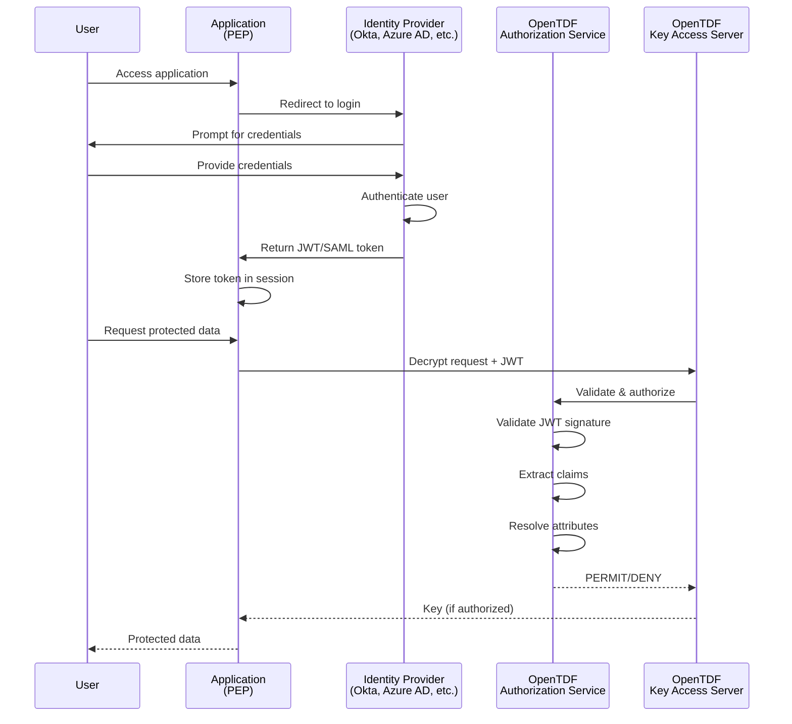

# How to Integrate with Identity Providers

## Overview

This guide shows you how to configure OpenTDF to authenticate users via external identity providers (IdPs) using OpenID Connect (OIDC), SAML 2.0, or OAuth 2.0. Integration with IdPs enables single sign-on (SSO) and provides user identity claims for attribute-based access control.

## Why Integrate with an IdP?

Identity provider integration enables:

- **Single Sign-On (SSO)**: Users authenticate once across multiple applications
- **Centralized Identity Management**: Manage users in your existing directory
- **User Attributes**: Leverage existing user attributes (department, role, etc.) for ABAC
- **Security**: Leverage IdP security features (MFA, conditional access, etc.)
- **Compliance**: Meet requirements for enterprise authentication

---

## Supported Protocols

OpenTDF supports industry-standard authentication protocols:

| Protocol | Recommended For | Status |
|----------|----------------|--------|
| **OpenID Connect (OIDC)** | Modern applications, cloud services | ✅ Recommended |
| **OAuth 2.0** | API access, machine-to-machine | ✅ Supported |
| **SAML 2.0** | Enterprise SSO, legacy systems | ✅ Supported |

**Recommendation**: Use OIDC whenever possible. It's modern, well-supported, and easier to implement than SAML.

---

## Architecture Overview



---

## OIDC Integration (Recommended)

OpenID Connect is the recommended authentication protocol for modern applications.

### Prerequisites

- ✅ Identity provider that supports OIDC (Okta, Auth0, Keycloak, Azure AD, Google, etc.)
- ✅ Administrative access to configure OIDC application
- ✅ OpenTDF Authorization Service running

### Step 1: Register Application in IdP

Create a new OIDC application in your identity provider.

#### Generic OIDC Configuration

**Application Type**: Web application (for server-side apps) or Single Page Application (for client-side apps)

**Redirect URIs**: Configure allowed redirect URLs after authentication

```
https://your-app.example.com/auth/callback
https://opentdf.example.com/auth/callback
```

**Logout URIs**: Configure post-logout redirect URLs

```
https://your-app.example.com/logout
```

**Scopes**: Request these standard OIDC scopes

```
openid
profile
email
```

**Grant Types**: Select appropriate grant types

- Authorization Code Flow (recommended for web apps)
- Client Credentials Flow (for machine-to-machine)

**Collect Configuration**:
- Client ID: `your-client-id`
- Client Secret: `your-client-secret`
- Issuer URL: `https://your-idp.example.com` (also called "discovery endpoint" or "well-known URL")

### Step 2: Configure OpenTDF Authorization Service

Configure the Authorization Service to validate JWT tokens from your IdP.

#### Configuration File (opentdf.yaml)

```yaml
services:
  authorization:
    oidc:
      enabled: true
      issuer: https://your-idp.example.com
      audience: your-client-id
      jwks_uri: https://your-idp.example.com/.well-known/jwks.json  # Usually auto-discovered

      # Token validation
      validation:
        clockskew: 60s  # Allow 60s clock skew
        algorithms:
          - RS256
          - ES256

      # Claim extraction
      claims:
        subject: sub            # Claim containing user ID
        email: email            # Claim containing user email
        name: name              # Claim containing user name
        groups: groups          # Claim containing group membership

      # Attribute mapping (map claims to OpenTDF attributes)
      attribute_mappings:
        - claim: department
          namespace: example.com/attr/department
          value_claim: department
        - claim: role
          namespace: example.com/attr/role
          value_claim: role
```

### Step 3: Configure Your Application (PEP)

Integrate OIDC authentication in your application.

#### Example: Spring Boot (Java)

**1. Add Dependencies**:

```xml
<dependency>
    <groupId>org.springframework.boot</groupId>
    <artifactId>spring-boot-starter-oauth2-client</artifactId>
</dependency>
<dependency>
    <groupId>org.springframework.boot</groupId>
    <artifactId>spring-boot-starter-oauth2-resource-server</artifactId>
</dependency>
```

**2. Configure application.yml**:

```yaml
spring:
  security:
    oauth2:
      client:
        registration:
          opentdf:
            client-id: your-client-id
            client-secret: ${OIDC_CLIENT_SECRET}
            scope:
              - openid
              - profile
              - email
            authorization-grant-type: authorization_code
            redirect-uri: "{baseUrl}/login/oauth2/code/{registrationId}"

        provider:
          opentdf:
            issuer-uri: https://your-idp.example.com
            user-name-attribute: email

      resourceserver:
        jwt:
          issuer-uri: https://your-idp.example.com
```

**3. Security Configuration**:

```java
@Configuration
@EnableWebSecurity
public class SecurityConfig {

    @Bean
    public SecurityFilterChain filterChain(HttpSecurity http) throws Exception {
        http
            .authorizeHttpRequests(authz -> authz
                .requestMatchers("/public/**").permitAll()
                .anyRequest().authenticated()
            )
            .oauth2Login(oauth2 -> oauth2
                .defaultSuccessUrl("/dashboard", true)
            )
            .oauth2ResourceServer(oauth2 -> oauth2
                .jwt(jwt -> jwt.jwtAuthenticationConverter(jwtAuthConverter()))
            );

        return http.build();
    }

    private JwtAuthenticationConverter jwtAuthConverter() {
        JwtAuthenticationConverter converter = new JwtAuthenticationConverter();
        // Extract authorities/roles from JWT claims
        JwtGrantedAuthoritiesConverter authoritiesConverter = new JwtGrantedAuthoritiesConverter();
        authoritiesConverter.setAuthoritiesClaimName("groups");
        authoritiesConverter.setAuthorityPrefix("ROLE_");
        converter.setJwtGrantedAuthoritiesConverter(authoritiesConverter);
        return converter;
    }
}
```

#### Example: Express (Node.js)

**1. Install Passport.js**:

```bash
npm install passport passport-openidconnect express-session
```

**2. Configure Passport**:

```javascript
const passport = require('passport');
const OpenIDConnectStrategy = require('passport-openidconnect').Strategy;

passport.use('oidc', new OpenIDConnectStrategy({
    issuer: 'https://your-idp.example.com',
    clientID: process.env.OIDC_CLIENT_ID,
    clientSecret: process.env.OIDC_CLIENT_SECRET,
    authorizationURL: 'https://your-idp.example.com/oauth2/authorize',
    tokenURL: 'https://your-idp.example.com/oauth2/token',
    userInfoURL: 'https://your-idp.example.com/oauth2/userinfo',
    callbackURL: 'https://your-app.example.com/auth/callback',
    scope: ['openid', 'profile', 'email']
  },
  (issuer, profile, done) => {
    return done(null, profile);
  }
));

// Routes
app.get('/login', passport.authenticate('oidc'));

app.get('/auth/callback',
  passport.authenticate('oidc', { failureRedirect: '/login' }),
  (req, res) => {
    res.redirect('/dashboard');
  }
);
```

#### Example: FastAPI (Python)

**1. Install Authlib**:

```bash
pip install authlib
```

**2. Configure OAuth**:

```python
from authlib.integrations.starlette_client import OAuth
from starlette.middleware.sessions import SessionMiddleware

app.add_middleware(SessionMiddleware, secret_key="your-secret-key")

oauth = OAuth()
oauth.register(
    name='oidc',
    client_id=os.getenv('OIDC_CLIENT_ID'),
    client_secret=os.getenv('OIDC_CLIENT_SECRET'),
    server_metadata_url='https://your-idp.example.com/.well-known/openid-configuration',
    client_kwargs={'scope': 'openid profile email'}
)

@app.get('/login')
async def login(request: Request):
    redirect_uri = request.url_for('auth_callback')
    return await oauth.oidc.authorize_redirect(request, redirect_uri)

@app.get('/auth/callback')
async def auth_callback(request: Request):
    token = await oauth.oidc.authorize_access_token(request)
    user = token['userinfo']
    request.session['user'] = dict(user)
    return RedirectResponse(url='/dashboard')
```

### Step 4: Map Claims to Attributes

Map OIDC claims to OpenTDF attributes for policy evaluation.

#### In OpenTDF Configuration

```yaml
services:
  authorization:
    oidc:
      attribute_mappings:
        # Map 'department' claim to department attribute
        - claim: department
          namespace: example.com/attr/department
          value_claim: department

        # Map 'groups' claim to multiple group attributes
        - claim: groups
          namespace: example.com/attr/group
          value_claim: groups
          multi_value: true  # Groups is an array

        # Map 'security_level' claim to clearance attribute
        - claim: security_level
          namespace: example.com/attr/clearance
          value_claim: security_level
```

#### In Policy Service Subject Mappings

Alternatively, use Subject Mappings to map claims to attributes:

```bash
otdfctl policy subject-mappings create \
  --attribute-value example.com/attr/department/value/engineering \
  --subject-condition '{"claim": "department", "operator": "EQUALS", "value": "engineering"}'
```

### Step 5: Test Authentication Flow

**1. Test Login**:

Navigate to your application's login URL (e.g., `https://your-app.example.com/login`)

- Should redirect to IdP login page
- Enter credentials
- Should redirect back to application
- Check that user is authenticated

**2. Verify JWT Token**:

```bash
# Decode JWT to inspect claims
echo "your-jwt-token" | base64 -d | jq .
```

Verify required claims are present:
- `iss` (issuer)
- `sub` (subject)
- `email`
- Custom claims (department, groups, etc.)

**3. Test Authorization**:

```bash
# Decrypt TDF with user's JWT token
curl -X POST https://opentdf.example.com/kas/v2/rewrap \
  -H "Authorization: Bearer $JWT_TOKEN" \
  -H "Content-Type: application/json" \
  -d @tdf-request.json
```

Should succeed if user has required attributes; fail otherwise.

---

## Provider-Specific Guides

### Keycloak

Keycloak is a popular open-source identity and access management solution.

#### Step 1: Create Realm and Client

1. **Create Realm** (or use existing):
   - Navigate to **Realm Settings**
   - Note the realm name (e.g., `opentdf`)

2. **Create Client**:
   - Navigate to **Clients → Create**
   - **Client ID**: `opentdf-client`
   - **Client Protocol**: `openid-connect`
   - **Access Type**: `confidential`
   - **Valid Redirect URIs**: `https://your-app.example.com/auth/callback`
   - **Save**

3. **Get Client Secret**:
   - Navigate to **Credentials** tab
   - Copy **Secret**

#### Step 2: Configure User Attributes

1. Navigate to **Users → Select User → Attributes**
2. Add custom attributes:
   - `department`: `engineering`
   - `clearance`: `confidential`

#### Step 3: Create Protocol Mappers

Map user attributes to JWT claims:

1. Navigate to **Clients → opentdf-client → Mappers → Create**

**Department Mapper**:
- **Name**: Department
- **Mapper Type**: User Attribute
- **User Attribute**: `department`
- **Token Claim Name**: `department`
- **Claim JSON Type**: String
- **Add to ID token**: ON
- **Add to access token**: ON
- **Add to userinfo**: ON

**Groups Mapper**:
- **Name**: Groups
- **Mapper Type**: Group Membership
- **Token Claim Name**: `groups`
- **Full group path**: OFF

#### Step 4: OpenTDF Configuration

```yaml
services:
  authorization:
    oidc:
      enabled: true
      issuer: https://keycloak.example.com/realms/opentdf
      audience: opentdf-client
      claims:
        subject: sub
        email: email
        groups: groups
      attribute_mappings:
        - claim: department
          namespace: example.com/attr/department
        - claim: clearance
          namespace: example.com/attr/clearance
        - claim: groups
          namespace: example.com/attr/group
          multi_value: true
```

---

### Okta

#### Step 1: Create Application

1. Log in to Okta Admin Console
2. Navigate to **Applications → Create App Integration**
3. **Sign-in method**: OIDC
4. **Application type**: Web Application
5. **App integration name**: OpenTDF
6. **Grant type**: Authorization Code
7. **Sign-in redirect URIs**: `https://your-app.example.com/auth/callback`
8. **Assignments**: Select users/groups with access

#### Step 2: Configure Custom Claims

1. Navigate to **Security → API → Authorization Servers → default**
2. Go to **Claims** tab
3. **Add Claim**:
   - **Name**: `department`
   - **Include in token type**: Access Token, ID Token
   - **Value type**: Expression
   - **Value**: `user.department`

Repeat for other custom attributes (clearance, etc.)

#### Step 3: OpenTDF Configuration

```yaml
services:
  authorization:
    oidc:
      enabled: true
      issuer: https://your-org.okta.com/oauth2/default
      audience: your-okta-client-id
      attribute_mappings:
        - claim: department
          namespace: example.com/attr/department
        - claim: groups
          namespace: example.com/attr/group
          multi_value: true
```

---

### Azure AD / Microsoft Entra ID

#### Step 1: Register Application

1. Log in to Azure Portal
2. Navigate to **Azure Active Directory → App registrations → New registration**
3. **Name**: OpenTDF
4. **Supported account types**: Accounts in this organizational directory only
5. **Redirect URI**: Web - `https://your-app.example.com/auth/callback`
6. **Register**

#### Step 2: Create Client Secret

1. Navigate to **Certificates & secrets**
2. **New client secret**
3. Copy the secret value

#### Step 3: Configure API Permissions

1. Navigate to **API permissions → Add a permission**
2. Select **Microsoft Graph**
3. Select **Delegated permissions**:
   - `User.Read`
   - `openid`
   - `profile`
   - `email`
4. **Grant admin consent**

#### Step 4: Configure Optional Claims

1. Navigate to **Token configuration → Add optional claim**
2. **Token type**: ID, Access
3. Select claims:
   - `email`
   - `family_name`
   - `given_name`
   - `upn`

For custom claims, use **App Roles** or **Enterprise Applications → Properties → Assign users and groups**.

#### Step 5: OpenTDF Configuration

```yaml
services:
  authorization:
    oidc:
      enabled: true
      issuer: https://login.microsoftonline.com/{tenant-id}/v2.0
      audience: your-application-id
      claims:
        subject: oid  # Azure AD uses 'oid' as subject identifier
        email: email
        groups: groups  # Requires group claims configuration
      attribute_mappings:
        - claim: department
          namespace: example.com/attr/department
```

**Note**: For group claims, configure **Token configuration → Add groups claim**.

---

### Google Workspace

#### Step 1: Create OAuth 2.0 Client

1. Go to [Google Cloud Console](https://console.cloud.google.com/)
2. Navigate to **APIs & Services → Credentials**
3. **Create Credentials → OAuth client ID**
4. **Application type**: Web application
5. **Authorized redirect URIs**: `https://your-app.example.com/auth/callback`
6. Copy **Client ID** and **Client Secret**

#### Step 2: Configure OAuth Consent Screen

1. Navigate to **OAuth consent screen**
2. Add scopes:
   - `openid`
   - `email`
   - `profile`

#### Step 3: OpenTDF Configuration

```yaml
services:
  authorization:
    oidc:
      enabled: true
      issuer: https://accounts.google.com
      audience: your-google-client-id.apps.googleusercontent.com
      claims:
        subject: sub
        email: email
        name: name
```

**Note**: Google Workspace does not include custom attributes in JWT. Use [Entity Resolution](./entity-service-integration.mdx) to query Google Directory API for user attributes.

---

### AWS Cognito

#### Step 1: Create User Pool

1. Log in to AWS Console
2. Navigate to **Cognito → User Pools → Create user pool**
3. Configure sign-in options (email, username)
4. Configure MFA and password policies
5. **Create pool**

#### Step 2: Create App Client

1. Navigate to **App integration → App clients → Create app client**
2. **App client name**: OpenTDF
3. **Generate client secret**: Yes
4. **Authentication flows**: Authorization code grant
5. **Callback URLs**: `https://your-app.example.com/auth/callback`

#### Step 3: Configure Custom Attributes

1. Navigate to **User pool → Sign-up experience → Attributes**
2. Add custom attributes:
   - `custom:department`
   - `custom:clearance`

#### Step 4: Configure Hosted UI (optional)

1. Navigate to **App integration → Domain**
2. Create Cognito domain or custom domain

#### Step 5: OpenTDF Configuration

```yaml
services:
  authorization:
    oidc:
      enabled: true
      issuer: https://cognito-idp.{region}.amazonaws.com/{user-pool-id}
      audience: your-cognito-client-id
      claims:
        subject: sub
        email: email
        groups: cognito:groups
      attribute_mappings:
        - claim: custom:department
          namespace: example.com/attr/department
```

---

## SAML 2.0 Integration

SAML is commonly used in enterprise environments for SSO.

### Prerequisites

- Identity provider that supports SAML 2.0 (Azure AD, Okta, OneLogin, etc.)
- X.509 certificate for signing SAML assertions

### Step 1: Configure SAML in IdP

**Service Provider (SP) Configuration**:

- **Entity ID**: `https://opentdf.example.com/saml/metadata`
- **ACS URL** (Assertion Consumer Service): `https://opentdf.example.com/saml/acs`
- **Single Logout URL**: `https://opentdf.example.com/saml/slo`
- **Name ID Format**: Email or Persistent

**Attribute Statements** (map IdP attributes to SAML attributes):

| IdP Attribute | SAML Attribute Name |
|---------------|---------------------|
| email | `email` |
| firstName | `firstName` |
| lastName | `lastName` |
| department | `department` |
| groups | `groups` |

### Step 2: Configure OpenTDF for SAML

```yaml
services:
  authorization:
    saml:
      enabled: true
      entity_id: https://opentdf.example.com/saml/metadata
      acs_url: https://opentdf.example.com/saml/acs
      slo_url: https://opentdf.example.com/saml/slo

      # IdP metadata (either URL or file path)
      idp_metadata_url: https://your-idp.example.com/saml/metadata
      # OR
      # idp_metadata_path: /etc/opentdf/idp-metadata.xml

      # Certificate for signing SAML requests
      sp_certificate: /etc/opentdf/saml-cert.pem
      sp_private_key: /etc/opentdf/saml-key.pem

      # Attribute mapping
      attribute_mappings:
        - saml_attribute: department
          namespace: example.com/attr/department
        - saml_attribute: groups
          namespace: example.com/attr/group
          multi_value: true
```

### Step 3: Test SAML Flow

1. Navigate to SP-initiated SSO URL: `https://opentdf.example.com/saml/login`
2. Should redirect to IdP
3. Authenticate at IdP
4. Should redirect back to OpenTDF with SAML response
5. Verify user is authenticated and attributes are present

---

## Advanced Topics

### Multi-Tenancy

Support multiple identity providers for different tenants.

```yaml
services:
  authorization:
    oidc:
      enabled: true
      tenants:
        - name: tenant1
          issuer: https://tenant1-idp.example.com
          audience: tenant1-client-id
          client_secret: ${TENANT1_SECRET}

        - name: tenant2
          issuer: https://tenant2-idp.example.com
          audience: tenant2-client-id
          client_secret: ${TENANT2_SECRET}

      tenant_resolver:
        # Determine tenant from request (domain, header, etc.)
        type: domain  # Options: domain, header, path
        claim: tenant_id  # Claim in JWT identifying tenant
```

### Federation

Federate multiple identity providers (e.g., allow users from Okta, Azure AD, Google).

```yaml
services:
  authorization:
    oidc:
      enabled: true
      federation:
        - name: okta
          issuer: https://your-org.okta.com
          audience: okta-client-id

        - name: azure
          issuer: https://login.microsoftonline.com/{tenant}/v2.0
          audience: azure-client-id

        - name: google
          issuer: https://accounts.google.com
          audience: google-client-id.apps.googleusercontent.com
```

Users can choose which IdP to authenticate with at login.

### Just-in-Time (JIT) Provisioning

Automatically create user records when they first authenticate.

```yaml
services:
  authorization:
    oidc:
      jit_provisioning:
        enabled: true
        default_attributes:
          - example.com/attr/access/value/basic  # Grant basic access by default
        sync_attributes:
          - department
          - role
```

### Group/Role Synchronization

Sync groups from IdP to OpenTDF attributes on each login.

```yaml
services:
  authorization:
    oidc:
      group_sync:
        enabled: true
        claim: groups
        mapping:
          - idp_group: engineering
            attributes:
              - example.com/attr/department/value/engineering
          - idp_group: admins
            attributes:
              - example.com/attr/role/value/admin
```

---

## Security Best Practices

### Token Validation

Always validate JWT tokens:

```yaml
services:
  authorization:
    oidc:
      validation:
        verify_signature: true
        verify_issuer: true
        verify_audience: true
        verify_expiration: true
        clockskew: 60s  # Allow 60s clock skew
```

### Token Storage

**Never store tokens in**:
- ❌ Local storage (vulnerable to XSS)
- ❌ URL parameters
- ❌ Unencrypted cookies

**Preferred storage**:
- ✅ HTTP-only, Secure cookies (for web apps)
- ✅ Secure backend session store
- ✅ Mobile secure storage (Keychain/KeyStore)

### Refresh Token Handling

Implement refresh token rotation:

```yaml
services:
  authorization:
    oidc:
      refresh_tokens:
        enabled: true
        rotation: true  # Issue new refresh token on each refresh
        reuse_interval: 5s  # Allow brief reuse window
        revoke_on_use: true  # Revoke old token when used
```

### Session Management

Configure appropriate session timeouts:

```yaml
services:
  authorization:
    session:
      idle_timeout: 30m  # Logout after 30 minutes idle
      absolute_timeout: 8h  # Force re-authentication after 8 hours
      sliding_expiration: true  # Extend session on activity
```

### Logout Flows

Implement proper logout:

```python
@app.get('/logout')
async def logout(request: Request):
    # Clear local session
    request.session.clear()

    # Build IdP logout URL
    idp_logout_url = f"{OIDC_ISSUER}/logout?post_logout_redirect_uri={APP_URL}"

    return RedirectResponse(url=idp_logout_url)
```

---

## Troubleshooting

### Common OIDC Errors

#### Invalid Redirect URI

**Error**: `redirect_uri_mismatch`

**Solution**: Ensure redirect URI in app config exactly matches registered URI in IdP (including protocol, domain, path).

#### Invalid Token

**Error**: `invalid_token` or `signature verification failed`

**Solution**:
- Verify issuer URL is correct
- Check JWKS endpoint is accessible
- Ensure system clock is synchronized (NTP)
- Verify token hasn't expired

#### Missing Claims

**Error**: Required claim not present in token

**Solution**:
- Check scope includes necessary scopes (e.g., `profile`, `email`)
- Configure custom claims/mappers in IdP
- Verify claim is included in token type (ID token vs access token)

### Common SAML Errors

#### Signature Verification Failed

**Solution**:
- Verify IdP metadata is up-to-date
- Check certificate validity (not expired)
- Ensure clock synchronization

#### Attribute Not Found

**Solution**:
- Verify attribute statements are configured in IdP
- Check attribute name casing (case-sensitive)
- Enable SAML response logging to inspect raw assertions

### Debugging Tips

**Enable Debug Logging**:

```yaml
logging:
  level:
    authorization: debug
    oidc: debug
    saml: debug
```

**Inspect JWT Tokens**:

```bash
# Decode JWT
echo "your-jwt-token" | cut -d. -f2 | base64 -d | jq .
```

**Test OIDC Discovery**:

```bash
# Fetch OIDC configuration
curl https://your-idp.example.com/.well-known/openid-configuration | jq .
```

**Validate SAML Assertions**:

Use tools like [SAML Tracer](https://addons.mozilla.org/en-US/firefox/addon/saml-tracer/) browser extension to inspect SAML requests/responses.

---

## Related Guides

- **[Entity Service Integration](./entity-service-integration.mdx)**: Resolve user attributes from directories
- **[Implementing a PEP](./implementing-a-pep.mdx)**: Enforce policies in applications
- **[ABAC and Policy](../../explanation/abac-and-policy/index.md)**: Understanding attributes

## Reference

- **[Authorization Service API](../../reference/OpenAPI-clients/authorization/v2/authorization-v-2/)**: API documentation
- **[Platform Architecture](../../explanation/platform-architecture/index.md)**: Service interactions

---

## Need Help?

- [GitHub Discussions](https://github.com/opentdf/community/discussions)
- [Slack Community](https://opentdf.io/slack)
