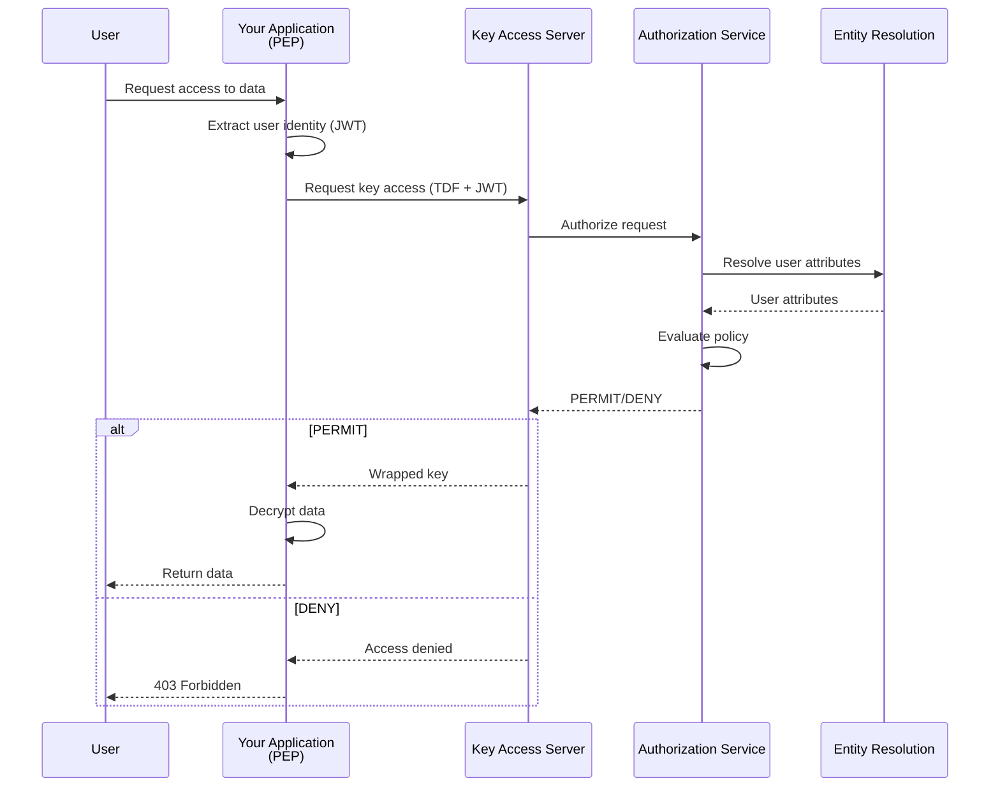

# How to Implement a Policy Enforcement Point (PEP)

## Overview

A Policy Enforcement Point (PEP) is the component in your application that enforces OpenTDF access policies by encrypting and decrypting data. This guide walks you through implementing a PEP using OpenTDF SDKs.

## What is a PEP?

In the OpenTDF architecture, the PEP is responsible for:

1. **Encrypting data** with attribute-based policies when data is created or stored
2. **Intercepting access requests** when users try to access protected data
3. **Calling the Key Access Server (KAS)** to obtain authorization
4. **Decrypting data** if authorization is granted
5. **Enforcing denial** if authorization is denied

The PEP acts as the gatekeeper between users and protected data.

## Architecture Overview



## Prerequisites

Before implementing a PEP, ensure you have:

- ✅ OpenTDF platform running (services: KAS, Policy, Authorization, Entity Resolution)
- ✅ Understanding of [ABAC concepts](../../explanation/abac-and-policy)
- ✅ SDK installed for your language (Java, Go, Python, or JavaScript)
- ✅ Authentication system (OIDC/JWT) for user identity
- ✅ Attributes and policies defined in Policy Service

## PEP Responsibilities

### 1. Intercept Access Requests

Your PEP must intercept requests to access protected data. This could be:

- HTTP API endpoint requests
- File system access operations
- Database query results
- Message queue consumers
- Any data access point in your application

### 2. Extract Subject Context

Extract the user's identity and context from the request:

- **JWT tokens** from Authorization header
- **OIDC tokens** from authenticated session
- **User claims** (email, groups, roles)
- **Request metadata** (IP address, timestamp, device info)

### 3. Call Key Access Server

Use the OpenTDF SDK to request key access from KAS:

- Send the TDF (encrypted data object)
- Include the user's authentication token
- Receive authorization decision and key material

### 4. Enforce Authorization Decisions

Based on the KAS response:

- **If authorized**: Decrypt the data and return to user
- **If denied**: Return 403 Forbidden error
- **If error**: Handle gracefully (retry, fallback, alert)

### 5. Handle Rewrap Requests

For multi-user scenarios, handle key rewrapping:

- User A encrypts data with attributes
- User B requests access
- KAS rewraps key for User B (if authorized)
- User B decrypts with their rewrapped key

---

## Implementation Steps

### Step 1: Install SDK

Choose your language and install the OpenTDF SDK.

#### Java

```xml
<!-- Maven pom.xml -->
<dependency>
    <groupId>io.opentdf</groupId>
    <artifactId>sdk</artifactId>
    <version>0.5.0</version>
</dependency>
```

```gradle
// Gradle build.gradle
implementation 'io.opentdf:sdk:0.5.0'
```

#### Go

```bash
go get github.com/opentdf/platform/sdk
```

#### Python

```bash
pip install opentdf-client
```

#### JavaScript/TypeScript

```bash
npm install @opentdf/client
```

---

### Step 2: Configure SDK Client

Initialize the OpenTDF client with your platform endpoints.

#### Java

```java
import io.opentdf.platform.sdk.Config;
import io.opentdf.platform.sdk.SDK;

public class PEPExample {
    private SDK sdk;

    public void initialize() {
        Config config = Config.newBuilder()
            .platformEndpoint("https://opentdf.example.com")
            .clientId("your-client-id")
            .clientSecret("your-client-secret")
            .build();

        sdk = new SDK(config);
    }
}
```

#### Go

```go
package main

import (
    "github.com/opentdf/platform/sdk"
)

func main() {
    client, err := sdk.New(
        sdk.WithPlatformEndpoint("https://opentdf.example.com"),
        sdk.WithClientCredentials("your-client-id", "your-client-secret"),
    )
    if err != nil {
        panic(err)
    }
    defer client.Close()
}
```

#### Python

```python
from opentdf import TDFClient

client = TDFClient(
    platform_endpoint="https://opentdf.example.com",
    client_id="your-client-id",
    client_secret="your-client-secret"
)
```

#### JavaScript

```javascript
import { Client } from '@opentdf/client';

const client = new Client({
  platformEndpoint: 'https://opentdf.example.com',
  clientId: 'your-client-id',
  clientSecret: 'your-client-secret',
});
```

---

### Step 3: Extract Subject Context

Extract user identity from the incoming request.

#### Java (Spring Boot example)

```java
import org.springframework.security.core.Authentication;
import org.springframework.security.oauth2.jwt.Jwt;
import org.springframework.web.bind.annotation.*;

@RestController
@RequestMapping("/api/documents")
public class DocumentController {

    @GetMapping("/{id}")
    public ResponseEntity<byte[]> getDocument(
            @PathVariable String id,
            Authentication authentication) {

        // Extract JWT from authenticated user
        Jwt jwt = (Jwt) authentication.getPrincipal();
        String userEmail = jwt.getClaimAsString("email");
        List<String> groups = jwt.getClaimAsStringList("groups");

        // Create subject context
        SubjectContext subject = SubjectContext.builder()
            .email(userEmail)
            .groups(groups)
            .jwt(jwt.getTokenValue())
            .build();

        // Proceed to decrypt...
    }
}
```

#### Go (Gin framework example)

```go
func getDocument(c *gin.Context) {
    // Extract JWT from Authorization header
    authHeader := c.GetHeader("Authorization")
    token := strings.TrimPrefix(authHeader, "Bearer ")

    // Parse JWT claims (use jwt library)
    claims, err := parseJWT(token)
    if err != nil {
        c.JSON(401, gin.H{"error": "Invalid token"})
        return
    }

    email := claims["email"].(string)
    groups := claims["groups"].([]interface{})

    // Proceed to decrypt...
}
```

#### Python (FastAPI example)

```python
from fastapi import FastAPI, Depends, HTTPException
from fastapi.security import HTTPBearer, HTTPAuthorizationCredentials

app = FastAPI()
security = HTTPBearer()

@app.get("/api/documents/{document_id}")
async def get_document(
    document_id: str,
    credentials: HTTPAuthorizationCredentials = Depends(security)
):
    # Extract JWT token
    token = credentials.credentials

    # Parse JWT claims
    claims = parse_jwt(token)
    user_email = claims.get("email")
    user_groups = claims.get("groups", [])

    # Proceed to decrypt...
```

---

### Step 4: Handle Encryption Requests

When creating or storing new data, encrypt it with appropriate attributes.

#### Java

```java
public String encryptDocument(byte[] data, List<String> attributeValues, Authentication auth) {
    try {
        // Extract JWT for authorization
        Jwt jwt = (Jwt) auth.getPrincipal();

        // Create TDF with attributes
        TDFConfig tdfConfig = TDFConfig.builder()
            .attributes(attributeValues)  // e.g., ["example.com/attr/department/value/engineering"]
            .build();

        // Encrypt data
        TDF tdf = sdk.createTDF(data, tdfConfig, jwt.getTokenValue());

        // Store TDF (returns TDF file path or bytes)
        String tdfId = storeTDF(tdf);

        return tdfId;
    } catch (UnauthorizedException e) {
        throw new ForbiddenException("Not authorized to encrypt with these attributes");
    } catch (Exception e) {
        throw new InternalServerErrorException("Encryption failed", e);
    }
}
```

#### Go

```go
func encryptDocument(data []byte, attributes []string, token string) (string, error) {
    // Create TDF with attributes
    tdf, err := client.CreateTDF(
        sdk.WithData(data),
        sdk.WithAttributes(attributes),
        sdk.WithAuthorization(token),
    )
    if err != nil {
        return "", fmt.Errorf("encryption failed: %w", err)
    }

    // Store TDF
    tdfID, err := storeTDF(tdf)
    if err != nil {
        return "", fmt.Errorf("storage failed: %w", err)
    }

    return tdfID, nil
}
```

#### Python

```python
def encrypt_document(data: bytes, attributes: list[str], token: str) -> str:
    try:
        # Create TDF with attributes
        tdf = client.encrypt(
            plaintext=data,
            attributes=attributes,
            authorization=token
        )

        # Store TDF
        tdf_id = store_tdf(tdf)

        return tdf_id
    except UnauthorizedException:
        raise HTTPException(status_code=403, detail="Not authorized to encrypt with these attributes")
    except Exception as e:
        raise HTTPException(status_code=500, detail=f"Encryption failed: {str(e)}")
```

---

### Step 5: Handle Decrypt/Access Requests

When a user requests access to protected data, decrypt it if authorized.

#### Java

```java
public byte[] decryptDocument(String tdfId, Authentication auth) {
    try {
        // Retrieve TDF from storage
        TDF tdf = retrieveTDF(tdfId);

        // Extract JWT
        Jwt jwt = (Jwt) auth.getPrincipal();

        // Decrypt TDF (SDK handles KAS authorization internally)
        byte[] plaintext = sdk.decrypt(tdf, jwt.getTokenValue());

        return plaintext;
    } catch (UnauthorizedException e) {
        throw new ForbiddenException("Access denied: insufficient attributes");
    } catch (NotFoundException e) {
        throw new NotFoundException("Document not found");
    } catch (Exception e) {
        throw new InternalServerErrorException("Decryption failed", e);
    }
}
```

#### Go

```go
func decryptDocument(tdfID string, token string) ([]byte, error) {
    // Retrieve TDF from storage
    tdf, err := retrieveTDF(tdfID)
    if err != nil {
        return nil, fmt.Errorf("TDF not found: %w", err)
    }

    // Decrypt TDF (SDK calls KAS internally)
    plaintext, err := client.Decrypt(tdf, sdk.WithAuthorization(token))
    if err != nil {
        if errors.Is(err, sdk.ErrUnauthorized) {
            return nil, fmt.Errorf("access denied: %w", err)
        }
        return nil, fmt.Errorf("decryption failed: %w", err)
    }

    return plaintext, nil
}
```

#### Python

```python
def decrypt_document(tdf_id: str, token: str) -> bytes:
    try:
        # Retrieve TDF from storage
        tdf = retrieve_tdf(tdf_id)

        # Decrypt TDF
        plaintext = client.decrypt(tdf, authorization=token)

        return plaintext
    except UnauthorizedException:
        raise HTTPException(status_code=403, detail="Access denied: insufficient attributes")
    except NotFoundException:
        raise HTTPException(status_code=404, detail="Document not found")
    except Exception as e:
        raise HTTPException(status_code=500, detail=f"Decryption failed: {str(e)}")
```

---

### Step 6: Error Handling

Handle various error scenarios gracefully.

#### Common Error Types

| Error | HTTP Status | Meaning | Action |
|-------|-------------|---------|--------|
| `UnauthorizedException` | 403 Forbidden | User lacks required attributes | Deny access, log event |
| `AuthenticationException` | 401 Unauthorized | Invalid or expired token | Prompt re-authentication |
| `NotFoundException` | 404 Not Found | TDF does not exist | Return not found error |
| `NetworkException` | 503 Service Unavailable | KAS unreachable | Retry with backoff, alert ops |
| `DecryptionException` | 500 Internal Server Error | Crypto failure | Log error, alert ops |

#### Java Error Handling

```java
public byte[] decryptDocument(String tdfId, Authentication auth) {
    try {
        TDF tdf = retrieveTDF(tdfId);
        Jwt jwt = (Jwt) auth.getPrincipal();
        return sdk.decrypt(tdf, jwt.getTokenValue());

    } catch (UnauthorizedException e) {
        logger.warn("Access denied for user {} to TDF {}: {}",
            auth.getName(), tdfId, e.getMessage());
        throw new ForbiddenException("Access denied: " + e.getMessage());

    } catch (AuthenticationException e) {
        logger.warn("Authentication failed for user {}: {}", auth.getName(), e.getMessage());
        throw new UnauthorizedException("Invalid or expired token");

    } catch (NetworkException e) {
        logger.error("Failed to reach KAS: {}", e.getMessage());
        throw new ServiceUnavailableException("Authorization service unavailable, please try again");

    } catch (Exception e) {
        logger.error("Decryption failed for TDF {}: {}", tdfId, e.getMessage(), e);
        throw new InternalServerErrorException("Decryption failed");
    }
}
```

#### Go Error Handling

```go
func decryptDocument(tdfID string, token string) ([]byte, error) {
    tdf, err := retrieveTDF(tdfID)
    if err != nil {
        return nil, &NotFoundError{Message: "Document not found"}
    }

    plaintext, err := client.Decrypt(tdf, sdk.WithAuthorization(token))
    if err != nil {
        switch {
        case errors.Is(err, sdk.ErrUnauthorized):
            log.Warnf("Access denied to TDF %s: %v", tdfID, err)
            return nil, &ForbiddenError{Message: "Access denied"}

        case errors.Is(err, sdk.ErrAuthentication):
            log.Warnf("Authentication failed: %v", err)
            return nil, &UnauthorizedError{Message: "Invalid or expired token"}

        case errors.Is(err, sdk.ErrNetwork):
            log.Errorf("KAS unreachable: %v", err)
            return nil, &ServiceUnavailableError{Message: "Authorization service unavailable"}

        default:
            log.Errorf("Decryption failed for TDF %s: %v", tdfID, err)
            return nil, &InternalError{Message: "Decryption failed"}
        }
    }

    return plaintext, nil
}
```

---

### Step 7: Performance Optimization

#### Caching Strategies

**1. Token Caching**: Cache JWT parsing results

```java
// Cache parsed JWTs to avoid repeated parsing
@Cacheable("jwtCache")
public SubjectContext parseJWT(String token) {
    // Parse JWT claims
    return subjectContext;
}
```

**2. TDF Metadata Caching**: Cache TDF metadata (attributes, policies) separately from content

```java
// Cache TDF metadata
@Cacheable(value = "tdfMetadataCache", key = "#tdfId")
public TDFMetadata getTDFMetadata(String tdfId) {
    TDF tdf = retrieveTDF(tdfId);
    return tdf.getMetadata();
}
```

**3. Attribute Resolution Caching**: Entity resolution results may be cached by ER service

No action needed in PEP; configure caching in Entity Resolution service.

#### Connection Pooling

Reuse SDK client instances; do not create new clients per request.

```java
// Good: Single SDK instance (e.g., Spring Bean)
@Bean
public SDK opentdfSDK() {
    return new SDK(config);
}

// Bad: New SDK per request
public byte[] decrypt(String tdfId) {
    SDK sdk = new SDK(config);  // ❌ Don't do this!
    return sdk.decrypt(...);
}
```

#### Async Operations

For high-throughput scenarios, use async/non-blocking operations.

```java
// Java with CompletableFuture
public CompletableFuture<byte[]> decryptAsync(String tdfId, String token) {
    return CompletableFuture.supplyAsync(() -> {
        TDF tdf = retrieveTDF(tdfId);
        return sdk.decrypt(tdf, token);
    });
}
```

```go
// Go with goroutines
func decryptAsync(tdfID string, token string) <-chan Result {
    resultChan := make(chan Result)
    go func() {
        plaintext, err := decryptDocument(tdfID, token)
        resultChan <- Result{Data: plaintext, Error: err}
    }()
    return resultChan
}
```

---

## Complete Working Example

Here's a complete PEP implementation in a REST API.

### Java (Spring Boot)

```java
package com.example.pep;

import io.opentdf.platform.sdk.*;
import org.springframework.beans.factory.annotation.Autowired;
import org.springframework.http.*;
import org.springframework.security.core.Authentication;
import org.springframework.security.oauth2.jwt.Jwt;
import org.springframework.web.bind.annotation.*;

import java.util.List;

@RestController
@RequestMapping("/api/documents")
public class DocumentController {

    @Autowired
    private SDK sdk;

    @Autowired
    private DocumentStorage storage;

    /**
     * Encrypt and store a new document
     */
    @PostMapping
    public ResponseEntity<DocumentResponse> createDocument(
            @RequestBody CreateDocumentRequest request,
            Authentication auth) {

        Jwt jwt = (Jwt) auth.getPrincipal();

        try {
            // Encrypt with attributes
            TDFConfig config = TDFConfig.builder()
                .attributes(request.getAttributes())
                .build();

            TDF tdf = sdk.createTDF(
                request.getData().getBytes(),
                config,
                jwt.getTokenValue()
            );

            // Store TDF
            String documentId = storage.save(tdf);

            return ResponseEntity.ok(new DocumentResponse(documentId));

        } catch (UnauthorizedException e) {
            return ResponseEntity.status(HttpStatus.FORBIDDEN).build();
        } catch (Exception e) {
            return ResponseEntity.status(HttpStatus.INTERNAL_SERVER_ERROR).build();
        }
    }

    /**
     * Decrypt and retrieve a document
     */
    @GetMapping("/{id}")
    public ResponseEntity<byte[]> getDocument(
            @PathVariable String id,
            Authentication auth) {

        Jwt jwt = (Jwt) auth.getPrincipal();

        try {
            // Retrieve TDF
            TDF tdf = storage.retrieve(id);

            // Decrypt (authorization happens here)
            byte[] plaintext = sdk.decrypt(tdf, jwt.getTokenValue());

            HttpHeaders headers = new HttpHeaders();
            headers.setContentType(MediaType.APPLICATION_OCTET_STREAM);

            return ResponseEntity.ok()
                .headers(headers)
                .body(plaintext);

        } catch (UnauthorizedException e) {
            return ResponseEntity.status(HttpStatus.FORBIDDEN).build();
        } catch (NotFoundException e) {
            return ResponseEntity.status(HttpStatus.NOT_FOUND).build();
        } catch (Exception e) {
            return ResponseEntity.status(HttpStatus.INTERNAL_SERVER_ERROR).build();
        }
    }
}

// Request/Response DTOs
record CreateDocumentRequest(String data, List<String> attributes) {}
record DocumentResponse(String id) {}
```

---

## Testing Your PEP

### Unit Testing

Test PEP logic in isolation by mocking SDK calls.

```java
@Test
public void testDecryptAuthorized() {
    // Mock SDK
    SDK mockSDK = mock(SDK.class);
    when(mockSDK.decrypt(any(), any())).thenReturn("plaintext".getBytes());

    // Test decrypt
    byte[] result = controller.decryptDocument("tdf-123", mockAuth);

    assertNotNull(result);
    assertEquals("plaintext", new String(result));
}

@Test
public void testDecryptUnauthorized() {
    SDK mockSDK = mock(SDK.class);
    when(mockSDK.decrypt(any(), any())).thenThrow(new UnauthorizedException());

    assertThrows(ForbiddenException.class, () -> {
        controller.decryptDocument("tdf-123", mockAuth);
    });
}
```

### Integration Testing

Test end-to-end with real OpenTDF services.

```java
@SpringBootTest
@AutoConfigureMockMvc
public class PEPIntegrationTest {

    @Autowired
    private MockMvc mockMvc;

    @Test
    public void testCreateAndRetrieveDocument() throws Exception {
        // Create document
        String createRequest = """
            {
                "data": "Sensitive document",
                "attributes": ["example.com/attr/department/value/engineering"]
            }
            """;

        String documentId = mockMvc.perform(post("/api/documents")
                .contentType(MediaType.APPLICATION_JSON)
                .content(createRequest)
                .header("Authorization", "Bearer " + getEngineeringUserToken()))
            .andExpect(status().isOk())
            .andReturn()
            .getResponse()
            .getContentAsString();

        // Retrieve as authorized user
        mockMvc.perform(get("/api/documents/" + documentId)
                .header("Authorization", "Bearer " + getEngineeringUserToken()))
            .andExpect(status().isOk())
            .andExpect(content().bytes("Sensitive document".getBytes()));

        // Retrieve as unauthorized user
        mockMvc.perform(get("/api/documents/" + documentId)
                .header("Authorization", "Bearer " + getSalesUserToken()))
            .andExpect(status().isForbidden());
    }
}
```

### Load Testing

Test PEP performance under load using tools like JMeter, Gatling, or k6.

```javascript
// k6 load test script
import http from 'k6/http';
import { check } from 'k6';

export let options = {
  stages: [
    { duration: '1m', target: 50 },  // Ramp up to 50 users
    { duration: '3m', target: 50 },  // Stay at 50 users
    { duration: '1m', target: 0 },   // Ramp down
  ],
};

export default function() {
  let response = http.get('https://api.example.com/api/documents/test-doc', {
    headers: { 'Authorization': `Bearer ${__ENV.TOKEN}` },
  });

  check(response, {
    'status is 200': (r) => r.status === 200,
    'response time < 500ms': (r) => r.timings.duration < 500,
  });
}
```

---

## Production Considerations

### Monitoring and Logging

**Log Key Events**:
- Authorization denials (for security monitoring)
- Decryption failures (for operational alerts)
- KAS connectivity issues

**Metrics to Track**:
- Request latency (encrypt/decrypt operations)
- Authorization denial rate
- Error rates by type
- TDF size distribution

```java
// Example logging
logger.info("TDF created: tdfId={}, attributes={}, user={}",
    tdfId, attributes, user);

logger.warn("Access denied: tdfId={}, user={}, reason={}",
    tdfId, user, reason);

logger.error("KAS unavailable: endpoint={}, error={}",
    kasEndpoint, error);
```

### High Availability

**SDK Resilience**:
- Configure retry policies for transient KAS failures
- Set appropriate timeouts
- Implement circuit breakers for cascading failure protection

```java
Config config = Config.newBuilder()
    .platformEndpoint("https://opentdf.example.com")
    .retryPolicy(RetryPolicy.exponentialBackoff(3, 1000))  // 3 retries, 1s initial delay
    .timeout(Duration.ofSeconds(10))
    .build();
```

**Multi-Region KAS**:
- Deploy KAS in multiple regions
- Use load balancers or DNS-based failover
- Consider geographic proximity for performance

### Security Hardening

**1. Protect JWT Tokens**:
- Use HTTPS for all communications
- Validate JWT signatures
- Check token expiration
- Implement token refresh flows

**2. Secure TDF Storage**:
- Even though TDFs are encrypted, protect storage from unauthorized deletion/modification
- Use access controls on storage backend
- Enable versioning and backup

**3. Audit Logging**:
- Log all access attempts (granted and denied)
- Forward logs to SIEM for security monitoring
- Retain logs per compliance requirements

**4. Rate Limiting**:
- Protect against denial-of-service
- Implement per-user rate limits
- Throttle excessive authorization failures

---

## Related Guides

- **[Entity Service Integration](./entity-service-integration.mdx)**: Connect attribute sources
- **[Identity Provider Integration](./identity-provider-integration.mdx)**: Set up authentication
- **[ABAC and Policy](../../explanation/abac-and-policy)**: Understand policy model

## Reference Documentation

- **[Key Access Server API](../../reference/OpenAPI-clients/kas/kas)**: KAS endpoints
- **[SDK Recipes](../sdk-recipes)**: Common patterns and SDK examples
- **[Platform Architecture](../../explanation/platform-architecture)**: Service interactions

---

## Need Help?

- [GitHub Discussions](https://github.com/opentdf/community/discussions): Ask implementation questions
- [Code Samples](../../reference/code-samples/index.mdx): More example implementations
- [Slack Community](https://opentdf.io/slack): Real-time help from maintainers
