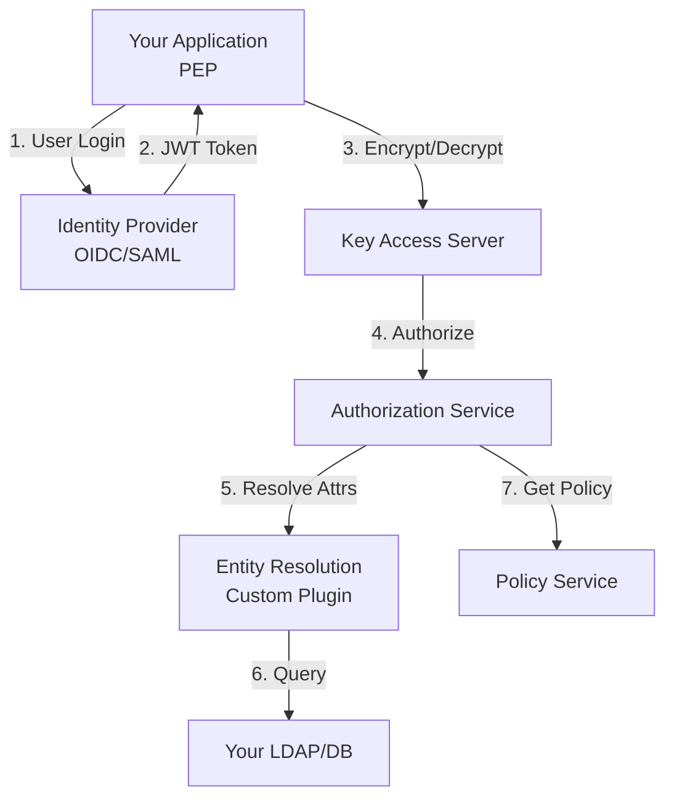

# Integration Patterns

Learn how to integrate OpenTDF into your applications and infrastructure with these practical guides.

## Overview

OpenTDF is designed to integrate seamlessly with your existing systems. Whether you're building a custom application, connecting identity providers, or implementing policy enforcement points, these guides will help you get started.

## Available Integration Guides

### Policy Enforcement

#### [Implementing a Policy Enforcement Point (PEP)](./implementing-a-pep.mdx)

Build a custom PEP that enforces OpenTDF policies in your application. Learn how to intercept access requests, call the Key Access Server, and handle authorization decisions.

**What you'll learn**:
- PEP architecture and responsibilities
- SDK integration patterns
- Handling encrypt and decrypt operations
- Error handling and performance optimization

**Best for**: Application developers integrating OpenTDF into custom software

### Identity and Attributes

#### [Entity Service Integration](./entity-service-integration.mdx)

Connect your existing identity and directory services to OpenTDF for attribute resolution. Support LDAP, SCIM, OIDC claims, and custom sources.

**What you'll learn**:
- Entity resolution patterns
- Custom resolver implementation
- Attribute mapping and transformation
- Caching and performance optimization

**Best for**: Platform engineers connecting OpenTDF to existing identity infrastructure

#### [Identity Provider Integration](./identity-provider-integration.mdx)

Configure OpenTDF to authenticate users via external identity providers using OIDC, SAML, or OAuth 2.0.

**What you'll learn**:
- OIDC integration (recommended)
- SAML 2.0 integration
- Claim mapping to attributes
- Provider-specific guides (Keycloak, Okta, Azure AD, etc.)

**Best for**: Security engineers setting up authentication and SSO

## Integration Architecture

OpenTDF's architecture is designed for flexibility:

### Integration Points

1. **Application Layer** (PEP): Your application integrates OpenTDF SDKs to encrypt and decrypt data
2. **Authentication Layer** (IdP): Users authenticate through your identity provider
3. **Authorization Layer** (Entity Resolution): User attributes are resolved from your directory services
4. **Policy Layer** (Policy Service): Administrators manage policies through OpenTDF Policy Service

## Common Integration Scenarios

### Scenario 1: Enterprise SaaS Application

**Goal**: Protect customer data in a multi-tenant SaaS platform

**Integration Points**:
- PEP: Integrate SDK into application backend
- IdP: Connect to customer identity providers (OIDC federation)
- Entity Resolution: Map customer directory attributes to OpenTDF attributes
- Policy: Allow customers to define their own access policies

**Guides to Follow**:
1. [Identity Provider Integration](./identity-provider-integration.mdx)
2. [Implementing a PEP](./implementing-a-pep.mdx)
3. [Entity Service Integration](./entity-service-integration.mdx)

---

### Scenario 2: Government/Defense System

**Goal**: Protect classified information with clearance-based access control

**Integration Points**:
- PEP: Custom enforcement points in document management system
- IdP: CAC/PIV authentication via SAML
- Entity Resolution: Query security database for clearance levels
- Policy: Hierarchical classification attributes (Unclassified → Secret → Top Secret)

**Guides to Follow**:
1. [Identity Provider Integration](./identity-provider-integration.mdx) (SAML section)
2. [Entity Service Integration](./entity-service-integration.mdx) (Custom DB resolver)
3. [Implementing a PEP](./implementing-a-pep.mdx)

---

### Scenario 3: Healthcare Data Exchange

**Goal**: Share patient records while enforcing consent and HIPAA compliance

**Integration Points**:
- PEP: Integrate into EHR system or health information exchange
- IdP: Provider authentication (OIDC)
- Entity Resolution: Map provider credentials and patient consent
- Policy: Patient consent attributes + provider credentials

**Guides to Follow**:
1. [Identity Provider Integration](./identity-provider-integration.mdx)
2. [Entity Service Integration](./entity-service-integration.mdx)
3. [Implementing a PEP](./implementing-a-pep.mdx)

---

### Scenario 4: Enterprise File Sharing

**Goal**: Protect sensitive documents shared internally and with partners

**Integration Points**:
- PEP: Integrate into file storage backend or sync client
- IdP: Corporate SSO (Azure AD, Okta, Google Workspace)
- Entity Resolution: Sync user attributes from corporate directory
- Policy: Department and project-based access control

**Guides to Follow**:
1. [Identity Provider Integration](./identity-provider-integration.mdx) (provider-specific guides)
2. [Entity Service Integration](./entity-service-integration.mdx)
3. [Implementing a PEP](./implementing-a-pep.mdx)

---

## SDK Language Support

OpenTDF provides SDKs in multiple languages for PEP implementation:

| Language | SDK | Status | Best For |
|----------|-----|--------|----------|
| **Java** | [opentdf/java-sdk](https://github.com/opentdf/java-sdk) | ✅ Stable | Enterprise applications, Android |
| **Go** | [opentdf/platform/sdk](https://github.com/opentdf/platform/tree/main/sdk) | ✅ Stable | Cloud services, microservices |
| **Python** | [opentdf/client-python](https://github.com/opentdf/client-python) | ✅ Stable | Data science, ML pipelines, scripting |
| **JavaScript/TypeScript** | [opentdf/client-web](https://github.com/opentdf/client-web) | ✅ Stable | Web applications, Node.js services |
| **C++** | Coming soon | 🚧 Planned | High-performance applications |
| **.NET/C#** | Coming soon | 🚧 Planned | Windows applications, Azure services |

Choose your SDK based on your application stack and follow the [Implementing a PEP](./implementing-a-pep.mdx) guide for language-specific examples.

---

## Additional Resources

### Architecture Documentation

- [Platform Architecture](../../explanation/platform-architecture): How OpenTDF services work together
- [ABAC and Policy](../../explanation/abac-and-policy): Understanding attribute-based access control

### API References

- [Key Access Server API](../../reference/OpenAPI-clients/kas/kas): KAS endpoint documentation
- [Policy Service API](../../reference/OpenAPI-clients/policy/policy): Policy management API
- [Authorization Service API](../../reference/OpenAPI-clients/authorization/v2/authorization-v-2): Authorization endpoint documentation

### Tutorials

- [Your First TDF](../../tutorials/your-first-tdf/index.mdx): Hands-on tutorial to get started

### Code Samples

- [Code Samples Reference](../../reference/code-samples/index.mdx): Example implementations

---

## Need Help?

If you're unsure which integration pattern fits your use case, or need help with implementation:

- [Community Forum](https://github.com/opentdf/community/discussions): Ask questions
- [GitHub Issues](https://github.com/opentdf/platform/issues): Report bugs or request features
- [Slack Community](https://join.slack.com/t/opentdf/shared_invite/...): Real-time chat with maintainers

We're here to help you successfully integrate OpenTDF!
