# Learning Paths

Choose a learning path based on your role and goals with OpenTDF.

## Overview

OpenTDF serves different audiences with different needs. These curated learning paths guide you through documentation tailored to your role and objectives.

```mermaid
graph TD
    Start[New to OpenTDF?]
    Beginner[🚀 Beginner Path<br/>1-2 hours]
    Dev[👨‍💻 Developer Path<br/>3-5 hours]
    Arch[🏛️ Architect Path<br/>4-6 hours]
    Ops[⚙️ Operator Path<br/>3-4 hours]
    Sec[🔐 Security Path<br/>2-3 hours]

    Start -->|Start here| Beginner
    Beginner -->|Build apps| Dev
    Beginner -->|Design systems| Arch
    Beginner -->|Deploy & manage| Ops
    Beginner -->|Secure systems| Sec

    Dev --> DevGoals[Goals:<br/>• Implement PEP<br/>• Connect IdP<br/>• Integrate attributes]
    Arch --> ArchGoals[Goals:<br/>• Design policies<br/>• Plan integrations<br/>• Choose formats]
    Ops --> OpsGoals[Goals:<br/>• Deploy services<br/>• Configure systems<br/>• Monitor operations]
    Sec --> SecGoals[Goals:<br/>• Harden deployment<br/>• Audit compliance<br/>• Security best practices]

    style Start fill:#e1f5ff
    style Beginner fill:#90EE90
    style Dev fill:#FFD700
    style Arch fill:#FFA500
    style Ops fill:#87CEEB
    style Sec fill:#FF6B6B
```

---

## 🚀 Beginner Path: New to OpenTDF

**Goal**: Understand what OpenTDF is and create your first protected data object.

**Time**: 1-2 hours

**Prerequisites**: Basic understanding of encryption and access control concepts

### Learning Journey

#### Step 1: Understand OpenTDF (15 minutes)

Start by understanding the fundamentals:

- **[What is OpenTDF?](./explanation/index.mdx)**: Project overview, TDF format, and foundational services
- **[Platform Architecture](./explanation/platform-architecture/index.md)**: How OpenTDF services work together

**Key Takeaways**:
- OpenTDF cryptographically binds access policies to data
- Split key architecture separates encryption from policy enforcement
- Four core services: Policy, Authorization, Entity Resolution, Key Access

---

#### Step 2: Core Concepts (20 minutes)

Learn about attribute-based access control:

- **[ABAC and Policy](./explanation/abac-and-policy/index.md)**: Understand attributes, subject mappings, and policy structure
- **[Trusted Data Format](./explanation/trusted-data-format/index.md)**: How policies are embedded in TDFs

**Key Takeaways**:
- ABAC enables fine-grained, dynamic access control
- Policies define which attribute combinations grant access
- Attributes can represent roles, clearances, projects, etc.

---

#### Step 3: Hands-On Tutorial (30-45 minutes)

Get hands-on experience:

- **[Your First TDF](./tutorials/your-first-tdf/index.mdx)**: Set up OpenTDF, create policies, encrypt and decrypt data

**What You'll Build**:
- Local OpenTDF environment with Docker
- Sample namespace and attributes
- Encrypted TDF with attribute-based policy
- Working encrypt/decrypt flow

---

#### Step 4: Explore Further (Optional)

Dive deeper into specific topics:

- **[TDF History and Standards](./explanation/trusted-data-format/history-and-standards.md)**: Evolution of TDF formats
- **[Code Samples](./reference/code-samples/index.mdx)**: Browse working examples

**Next Steps**: Choose a role-specific path below based on how you'll use OpenTDF.

---

## 👨‍💻 Developer Path: Integrating OpenTDF

**Goal**: Integrate OpenTDF into your application to protect sensitive data.

**Time**: 3-5 hours

**Prerequisites**:
- Completed Beginner Path (or equivalent knowledge)
- Programming experience in Java, Go, Python, or JavaScript
- Basic understanding of REST APIs and JWT tokens

### Learning Journey

#### Step 1: Review Core Concepts (15 minutes)

Refresh fundamentals if needed:

- **[ABAC and Policy](./explanation/abac-and-policy/index.md)**: Policy structure and evaluation
- **[Platform Architecture](./explanation/platform-architecture/index.md)**: Service interactions

---

#### Step 2: Implement a Policy Enforcement Point (60-90 minutes)

Learn to enforce policies in your application:

- **[Implementing a PEP](./how-to/integration-patterns/implementing-a-pep.mdx)**: Complete guide with code examples

**What You'll Learn**:
- SDK setup and configuration
- Encrypting data with attributes
- Decrypting data with authorization
- Error handling and performance optimization

**Hands-On**: Build a simple REST API that encrypts/decrypts documents with attribute-based policies.

---

#### Step 3: Authentication Integration (45-60 minutes)

Connect your identity provider:

- **[Identity Provider Integration](./how-to/integration-patterns/identity-provider-integration.mdx)**: OIDC, SAML, OAuth 2.0

**What You'll Learn**:
- Configure OIDC with Keycloak, Okta, Azure AD, etc.
- Map identity claims to OpenTDF attributes
- Handle authentication flows

**Hands-On**: Set up OIDC authentication for your test application.

---

#### Step 4: Attribute Resolution (45-60 minutes)

Connect your user directory:

- **[Entity Service Integration](./how-to/integration-patterns/entity-service-integration.mdx)**: LDAP, SCIM, custom sources

**What You'll Learn**:
- Implement custom attribute resolver
- Query LDAP/databases for user attributes
- Configure caching and performance optimization

**Hands-On**: Build a custom entity resolver that queries your user directory.

---

#### Step 5: Code Samples and Recipes (30 minutes)

Explore practical examples:

- **[Code Samples](./reference/code-samples/index.mdx)**: Working examples in multiple languages
- **[SDK Recipes](./how-to/sdk-recipes)**: Common patterns and solutions

---

#### Step 6: Testing and Deployment

- Test your integration end-to-end
- Review security best practices
- Deploy to staging/production

**Next Steps**:
- Explore [Advanced Patterns](./how-to/)
- Review [API References](./reference/OpenAPI-clients/)

---

## 🏛️ Architect Path: Designing OpenTDF Systems

**Goal**: Design secure, scalable systems using OpenTDF.

**Time**: 4-6 hours

**Prerequisites**:
- Understanding of distributed systems
- Security architecture experience
- Familiarity with ABAC concepts

### Learning Journey

#### Step 1: Foundational Understanding (30 minutes)

Understand OpenTDF architecture:

- **[Platform Architecture](./explanation/platform-architecture/index.md)**: Service architecture and interactions
- **[ABAC and Policy](./explanation/abac-and-policy/index.md)**: Policy model deep dive

---

#### Step 2: TDF Standards and Formats (45 minutes)

Understand TDF ecosystem:

- **[TDF History and Standards](./explanation/trusted-data-format/history-and-standards.md)**: BASE-TDF, IC-TDF, ZTDF, OpenTDF
- **[TDF Specification](./reference/trusted-data-format/specifications/)**: Technical specification

**Key Decisions**:
- Which TDF format fits your requirements?
- Interoperability needs?
- Cryptographic requirements?

---

#### Step 3: Policy Design (60-90 minutes)

Design effective policy models:

- **[ABAC and Policy - Policy Design Best Practices](./explanation/abac-and-policy/index.md#policy-design-best-practices)**: Granularity, performance, security

**Design Exercises**:
- Map your organization's access control requirements to attributes
- Design namespace hierarchies
- Plan subject mapping strategy
- Consider performance implications

---

#### Step 4: Integration Architecture (60-90 minutes)

Plan integrations with existing systems:

- **[Integration Patterns](./how-to/integration-patterns/index.mdx)**: Overview of integration points
- **[PEP Implementation](./how-to/integration-patterns/implementing-a-pep.mdx)**: Application-level enforcement
- **[Entity Resolution](./how-to/integration-patterns/entity-service-integration.mdx)**: Directory integration
- **[Identity Provider](./how-to/integration-patterns/identity-provider-integration.mdx)**: Authentication integration

**Architecture Decisions**:
- Where to enforce policies (PEPs)?
- How to resolve attributes?
- Single-tenant vs multi-tenant?
- On-premise vs cloud deployment?

---

#### Step 5: Scalability and High Availability (30-45 minutes)

Design for production scale:

- **[Configuration Reference](./reference/OpenAPI-clients/)**: Service configuration options
- Review load balancing strategies
- Plan for redundancy and failover
- Consider caching strategies

---

#### Step 6: Security Architecture (45 minutes)

Harden your deployment:

- Review security best practices across all guides
- Plan key management strategy
- Design audit and compliance logging
- Consider zero trust architecture alignment

---

#### Step 7: Case Studies

Learn from example architectures:

- **[Integration Patterns - Common Scenarios](./how-to/integration-patterns/index.mdx#common-integration-scenarios)**: Enterprise SaaS, Government, Healthcare, File Sharing

**Next Steps**:
- Review [API References](./reference/OpenAPI-clients/)
- Plan proof-of-concept deployment

---

## ⚙️ Operator Path: Deploying and Managing OpenTDF

**Goal**: Deploy, configure, and maintain OpenTDF in production.

**Time**: 3-4 hours

**Prerequisites**:
- Experience with container orchestration (Docker, Kubernetes)
- Understanding of infrastructure and DevOps
- Basic understanding of OpenTDF concepts

### Learning Journey

#### Step 1: Quick Start (30 minutes)

Get OpenTDF running:

- **[Quick Start Tutorial](./tutorials/your-first-tdf/index.mdx)**: Deploy with Docker Compose
- **[Platform Architecture](./explanation/platform-architecture/index.md)**: Understand service dependencies

---

#### Step 2: Configuration (60-90 minutes)

Learn service configuration:

- **[Policy Service Configuration](./reference/OpenAPI-clients/policy/policy/)**: Policy service setup
- **[Authorization Service Configuration](./reference/OpenAPI-clients/authorization/v2/authorization-v-2/)**: Authorization setup
- **[Entity Resolution Configuration](./reference/OpenAPI-clients/entityresolution/v2/entityresolution-v-2/)**: ER setup
- **[Key Access Server Configuration](./reference/OpenAPI-clients/kas/kas/)**: KAS setup

**Key Configuration Areas**:
- Database connections
- TLS/mTLS certificates
- Authentication backends
- Logging and monitoring

---

#### Step 3: Integration Setup (60-90 minutes)

Connect external systems:

- **[Identity Provider Integration](./how-to/integration-patterns/identity-provider-integration.mdx)**: OIDC/SAML setup
- **[Entity Resolution Integration](./how-to/integration-patterns/entity-service-integration.mdx)**: LDAP/directory setup

---

#### Step 4: Production Deployment (45-60 minutes)

Deploy to production environment:

- Review high availability configurations
- Set up load balancers
- Configure database replication
- Plan backup and disaster recovery

**Deployment Options**:
- Docker Compose (development)
- Kubernetes (production)
- Cloud-managed services

---

#### Step 5: Monitoring and Operations (30-45 minutes)

Operational monitoring:

- Configure health checks
- Set up metrics collection (Prometheus, etc.)
- Configure log aggregation
- Set up alerting

**Key Metrics**:
- Authorization request latency
- Policy evaluation errors
- Entity resolution cache hit rate
- KAS key access success/failure rate

---

#### Step 6: Troubleshooting

Learn common operational issues:

- Review troubleshooting sections in integration guides
- Debug authorization failures
- Investigate performance issues
- Handle certificate expiration

**Next Steps**:
- Set up staging environment
- Plan production rollout
- Document runbooks

---

## 🔐 Security Engineer Path: Securing OpenTDF

**Goal**: Understand and implement security best practices for OpenTDF.

**Time**: 2-3 hours

**Prerequisites**:
- Security engineering experience
- Understanding of cryptography and PKI
- Familiarity with identity and access management

### Learning Journey

#### Step 1: Understand Security Model (30 minutes)

Learn OpenTDF's security architecture:

- **[Platform Architecture](./explanation/platform-architecture/index.md)**: Trust boundaries and service interactions
- **[Trusted Data Format](./explanation/trusted-data-format/index.md)**: Cryptographic binding
- **[TDF Specification](./reference/trusted-data-format/specifications/)**: Cryptographic details

**Key Security Principles**:
- Split key architecture
- Zero trust data protection
- Cryptographic policy binding

---

#### Step 2: Authentication and Authorization (45 minutes)

Secure identity and access:

- **[Identity Provider Integration](./how-to/integration-patterns/identity-provider-integration.mdx)**: OIDC/SAML security
- **[Entity Resolution](./how-to/integration-patterns/entity-service-integration.mdx)**: Attribute security

**Security Checklist**:
- ✅ JWT signature validation
- ✅ Token storage best practices
- ✅ MFA enforcement
- ✅ Session management
- ✅ Credential management

---

#### Step 3: Policy Security (30 minutes)

Design secure policies:

- **[ABAC and Policy](./explanation/abac-and-policy/index.md)**: Policy model and best practices

**Security Considerations**:
- Principle of least privilege
- Separation of duties
- Policy audit trails
- Attribute tampering prevention

---

#### Step 4: Operational Security (45 minutes)

Secure deployments:

- Review security sections in all integration guides
- TLS/mTLS configuration
- Secrets management
- Network segmentation
- Audit logging

**Hardening Checklist**:
- ✅ All communications over TLS
- ✅ Secrets stored securely (Vault, etc.)
- ✅ Network policies (firewalls, security groups)
- ✅ Audit logs sent to SIEM
- ✅ Regular security updates
- ✅ Vulnerability scanning

---

#### Step 5: Compliance and Auditing (30 minutes)

Enable compliance:

- Configure comprehensive audit logging
- Plan compliance reporting
- Review data residency requirements

**Compliance Frameworks**:
- NIST ABAC (SP 800-162)
- GDPR (data protection)
- HIPAA (healthcare)
- FedRAMP (government)

**Next Steps**:
- Conduct security assessment
- Develop security runbooks
- Plan penetration testing

---

## 📚 Quick Reference by Topic

Can't find what you need in the learning paths? Browse by topic:

### Core Concepts

- [Platform Architecture](./explanation/platform-architecture/index.md)
- [ABAC and Policy](./explanation/abac-and-policy/index.md)
- [Trusted Data Format](./explanation/trusted-data-format/index.md)
- [TDF History and Standards](./explanation/trusted-data-format/history-and-standards.md)

### Integration Guides

- [Implementing a PEP](./how-to/integration-patterns/implementing-a-pep.mdx)
- [Entity Service Integration](./how-to/integration-patterns/entity-service-integration.mdx)
- [Identity Provider Integration](./how-to/integration-patterns/identity-provider-integration.mdx)

### Tutorials

- [Your First TDF](./tutorials/your-first-tdf/index.mdx)

### Reference

- [Code Samples](./reference/code-samples/index.mdx)
- [API Documentation](./reference/OpenAPI-clients/)
- [SDK Recipes](./how-to/sdk-recipes)
- [TDF Specification](./reference/trusted-data-format/specifications/)

---

## Need Help?

Still have questions? We're here to help:

- **[Community Forum](https://github.com/opentdf/community/discussions)**: Ask questions, share experiences
- **[GitHub Issues](https://github.com/opentdf/platform/issues)**: Report bugs or request features
- **[Slack Community](https://opentdf.io/slack)**: Real-time chat with maintainers and users

## Contribute to Documentation

Help improve these learning paths:

- **[Documentation Repository](https://github.com/opentdf/docs)**: Submit improvements
- **Share Feedback**: Let us know what works and what doesn't
- **Add Examples**: Contribute code samples or tutorials

---

**Ready to get started?** Choose a path above and begin your OpenTDF journey!
