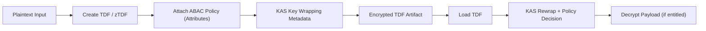

import EncryptionTDF from '../../code_samples/tdf/encryption_ztdf.mdx'

# TDF Encryption and Decryption

This guide explains how to work with Trusted Data Format (TDF) objects using the OpenTDF SDKs, and when to choose `zTDF` versus the full OpenTDF container format.

It is intended for developers who need to encrypt data with ABAC policy, decrypt data with entitlement checks, and debug common integration failures.

## What TDF Gives You

TDF combines encrypted payload data with policy metadata so access control can travel with the data itself.

When you create a TDF, you are packaging:

1. Encrypted payload bytes.
2. Policy metadata (for example attribute value FQNs).
3. Key access metadata used by the KAS to enforce decryption authorization.

At read time, decryption succeeds only if the caller identity is entitled for the policy encoded in the TDF.

## Choose the Right Format

In OpenTDF documentation and code you may see both `zTDF` and TDF terminology.

| Format | Typical SDK API | When to Use |
| --- | --- | --- |
| Full OpenTDF container (`.tdf`, zip + manifest) | `CreateTDF` / `LoadTDF` | General purpose file/data encryption, richer manifest metadata, cross-system interchange. |
| `zTDF` profile | `createZTDF` (JavaScript naming) and CLI `otdfctl encrypt/decrypt` zTDF flow | Streamlined profile used in many current workflows and examples. |

If your team says "TDF3", in practice this typically maps to the full OpenTDF container workflow (`CreateTDF`/`LoadTDF`) in the current SDKs.

## Encryption and Decryption Flow

## End-to-End Example (Go, Java, TypeScript)

The sample below includes encrypt + decrypt flows for all three SDK ecosystems:

<EncryptionTDF />

## Adding ABAC Attributes at Encryption Time

Policy is enforced at decrypt time, so getting attribute values right at encryption time is critical.

Recommended pattern:

1. Validate attribute values before encryption using [`ValidateAttributes`](/sdks/discovery#validateattributes).
2. Encrypt with those validated FQNs.
3. Ensure a subject mapping exists for identities that should decrypt.

Related guides:

- Attribute validation and discovery: [/sdks/discovery](/sdks/discovery)
- Subject mappings and actions: [/sdks/policy](/sdks/policy)
- Permission failure diagnosis: [/sdks/troubleshooting#permission-denied--insufficient-entitlements](/sdks/troubleshooting#permission-denied--insufficient-entitlements)

## Decryption Patterns

### In-memory data

Use in-memory readers/writers when payloads are small and request-scoped.

### File-based workflow

Use file streams/channels for larger payloads or asynchronous pipelines (encrypt now, decrypt later in another process).

### Offline handoff

You can persist `.tdf` artifacts and decrypt later, as long as the decrypting identity can still reach required platform services (for example KAS and authorization dependencies) and has valid entitlements.

## Encryption Options You Should Decide Explicitly

For production use, avoid relying on implicit defaults.

1. KAS endpoint configuration.
2. Attribute value set (policy scope).
3. Wrapping/encapsulation algorithm choice where supported.
4. Data handling model: in-memory vs stream/file.
5. Expected interoperability target (`zTDF` profile vs full container exchange).

You can see concrete option usage in the SDK quickstarts and the multi-language end-to-end example above.

## Error Handling Patterns

Treat these as first-class integration paths, not edge cases:

| Failure Class | Typical Symptom | What to Do |
| --- | --- | --- |
| Authentication | `Unauthenticated`, `401` | Verify credentials and OIDC/client setup. |
| TLS trust | cert validation failures | Trust local CA correctly; avoid disabling verification in production. |
| Missing entitlements | split-key/rewrap failures, `PermissionDenied` | Create/verify subject mappings for required attribute values. |
| Missing attributes | `not_found` during policy resolution | Validate attributes before encryption and create absent values. |

For concrete SDK-specific error text and commands, use [/sdks/troubleshooting](/sdks/troubleshooting).

## Best Practices

1. Validate attribute FQNs before every encryption boundary where user input can influence policy.
2. Keep subject mapping creation idempotent in automation.
3. Store encrypted artifacts separately from entitlement management logic.
4. Log policy FQNs and key access identifiers (not plaintext) for observability.
5. Deactivate attributes instead of deleting them when historical TDF decryptability matters.
6. Add integration tests that perform both encrypt and decrypt with expected allow/deny identities.

## Related Documentation

- SDK quickstarts: [/sdks/quickstart](/sdks/quickstart)
- Discovery APIs: [/sdks/discovery](/sdks/discovery)
- Authorization APIs: [/sdks/authorization](/sdks/authorization)
- OpenTDF spec structure: [/spec/schema/opentdf](/spec/schema/opentdf)
